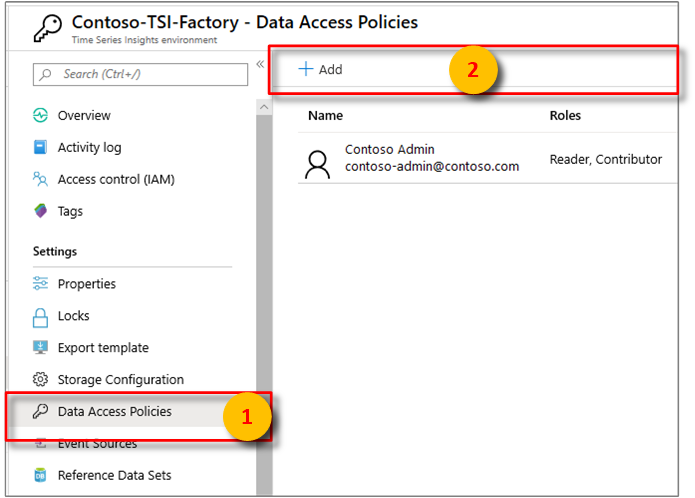
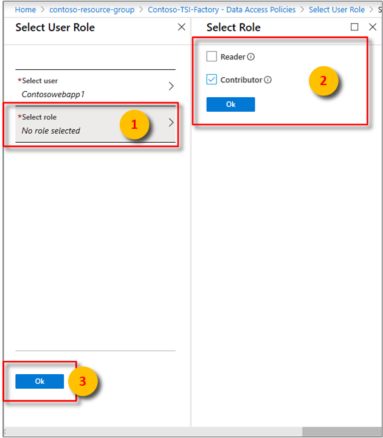

# Authentication and authorization for Azure Time Series Insights API

This document describes how to register an app in Azure Active Directory using the new Azure Active Directory blade. Apps registered in Azure Active Directory enable users to authenticate to and be authorized to use the Azure Time Series Insight API associated with a Azure Time Series Insights environment.

## Service principal

The following sections describe how to configure an application to access the Azure Time Series Insights API on behalf of an app. The application may then query or publish reference data in the Azure Time Series Insights environment using its own application credentials through Azure Active Directory.

## Summary and best practices

The Azure Active Directory app registration flow involves three main steps.

1. [Register an application](#azure-active-directory-app-registration) in Azure Active Directory.
1. Authorize the application to have [data access to the Azure Time Series Insights environment](#granting-data-access).
1. Use the **Application ID** and **Client Secret** to acquire a token from `https://api.timeseries.azure.com/` in your [client app](#client-app-initialization). The token can then be used to call the Azure Time Series Insights API.

Per **step 3**, separating your application's and your user credentials allows you to:

* Assign permissions to the app identity that are distinct from your own permissions. Typically, these permissions are restricted to only what the app requires. For example, you can allow the app to read data only from a particular Azure Time Series Insights environment.
* Isolate the app's security from the creating user's authentication credentials by using a **Client Secret** or security certificate. As a result, the application's credentials are not dependent on a specific user's credentials. If the user's role changes, the application does not necessarily require new credentials or further configuration. If the user changes their password, all access to the application doesn't require new credentials or keys.
* Run an unattended script using a **Client Secret** or security certificate rather than a specific user's credentials (requiring them to be present).
* Use a security certificate rather than a password to secure access to your Azure Time Series Insights API.

> [!IMPORTANT]
> Follow the principle of **Separation of Concerns** (described for this scenario above) when configuring your Azure Time Series Insights security policy.

> [!NOTE]

> * The article focuses on a single-tenant application where the application is intended to run in only one organization.
> * You'll typically use single-tenant applications for line-of-business applications that run in your organization.

## Detailed setup

### Azure Active Directory app registration

[!INCLUDE [Azure Active Directory app registration](../../includes/time-series-insights-aad-registration.md)]

### Granting data access

1. For the Azure Time Series Insights environment, select **Data Access Policies** and select **Add**.

   

1. In the **Select User** dialog box, paste either the **Application Name** or the **Application ID** from the Azure Active Directory app registration section.

   

1. Select the role. Select **Reader** to query data or **Contributor** to query data and change reference data. Select **OK**.

   

1. Save the policy by selecting **OK**.

   > [!TIP]
   > For advanced data access options, read [granting data access](./time-series-insights-data-access.md).

### Client app initialization

* Developers may use the [Microsoft Authentication Library (MSAL) to authenticate with Azure Time Series Insights.

* To authenticate using MSAL:

   1. Use the **Application ID** and **Client Secret** (Application Key) from the Azure Active Directory app registration section to acquire the token on behalf of the application.

   1. In C#, the following code can acquire the token on behalf of the application. For a complete sample on how to query data from a Gen1 environment, read [Query data using C#](time-series-insights-query-data-csharp.md).

        [!code-csharp[csharpquery-example](~/samples-tsi/gen1-sample/csharp-tsi-gen1-sample/Program.cs)]

   1. The token can then be passed in the `Authorization` header when the application calls the Azure Time Series Insights API.

> [!IMPORTANT]
> If you are using [Azure Active Directory Authentication Library (ADAL)](https://docs.microsoft.com/azure/active-directory/azuread-dev/active-directory-authentication-libraries) read about [migrating to MSAL](https://docs.microsoft.com/azure/active-directory/develop/msal-net-migration).

## Common headers and parameters

This section describes common HTTP request headers and parameters used to make queries against the Azure Time Series Insights Gen1 and Gen2 APIs. API-specific requirements are covered in greater detail in the [Azure Time Series Insights REST API reference documentation](https://docs.microsoft.com/rest/api/time-series-insights/).

> [!TIP]
> Read the [Azure REST API Reference](https://docs.microsoft.com/rest/api/azure/) to learn more about how to consume REST APIs, make HTTP requests, and handle HTTP responses.

### Authentication

To perform authenticated queries against the [Azure Time Series Insights REST APIs](https://docs.microsoft.com/rest/api/time-series-insights/), a valid OAuth 2.0 bearer token must be passed in the [Authorization header](/rest/api/apimanagement/2019-12-01/authorizationserver/createorupdate) using a REST client of your choice (Postman, JavaScript, C#).

> [!TIP]
> Read the hosted Azure Time Series Insights [client SDK sample visualization](https://tsiclientsample.azurewebsites.net/) to learn how to authenticate with the Azure Time Series Insights APIs programmatically using the [JavaScript Client SDK](https://github.com/microsoft/tsiclient/blob/master/docs/API.md) along with charts and graphs.

### HTTP headers

Required request headers are described below.

| Required request header | Description |
| --- | --- |
| Authorization | To authenticate with Azure Time Series Insights, a valid OAuth 2.0 Bearer token must be passed in the **Authorization** header. |

> [!IMPORTANT]
> The token must be issued exactly to the `https://api.timeseries.azure.com/` resource (also known as the "audience" of the token).

> * Your [Postman](https://www.getpostman.com/) **AuthURL** will therefore be: `https://login.microsoftonline.com/microsoft.onmicrosoft.com/oauth2/authorize?scope=https://api.timeseries.azure.com/.default`
> * `https://api.timeseries.azure.com/` is valid but `https://api.timeseries.azure.com` is not.

Optional request headers are described below.

| Optional request header | Description |
| --- | --- |
| Content-type | only `application/json` is supported. |
| x-ms-client-request-id | A client request ID. The service records this value. Allows the service to trace operation across services. |
| x-ms-client-session-id | A client session ID. The service records this value. Allows the service to trace a group of related operations across services. |
| x-ms-client-application-name | Name of the application that generated this request. The service records this value. |

Optional but recommended response headers are described below.

| Response header | Description |
| --- | --- |
| Content-type | Only `application/json` is supported. |
| x-ms-request-id | Server-generated request ID. Can be used to contact Microsoft to investigate a request. |
| x-ms-property-not-found-behavior | GA API optional response header. Possible values are `ThrowError` (default) or `UseNull`. |

### HTTP parameters

> [!TIP]
> Find more information about required and optional query information in the [reference documentation](https://docs.microsoft.com/rest/api/time-series-insights/).

Required URL query string parameters depend on API version.

| Release | Possible API version values |
| --- |  --- |
| Gen1 | `api-version=2016-12-12`|
| Gen2 | `api-version=2020-07-31` and `api-version=2018-11-01-preview`|

> [!IMPORTANT]
>
> The `api-version=2018-11-01-preview` version will be deprecated soon. We recommend users to switch onto the newer version.

Optional URL query string parameters include setting a timeout for HTTP request execution times.

| Optional query parameter | Description | Version |
| --- |  --- | --- |
| `timeout=<timeout>` | Server-side timeout for HTTP request execution. Applicable only to the [Get Environment Events](https://docs.microsoft.com/rest/api/time-series-insights/ga-query-api#get-environment-events-api) and [Get Environment Aggregates](https://docs.microsoft.com/rest/api/time-series-insights/gen1-query-api#get-environment-aggregates-api) APIs. Timeout value should be in ISO 8601 duration format, for example `"PT20S"` and should be in the range `1-30 s`. Default value is `30 s`. | Gen1 |
| `storeType=<storeType>` | For Gen2 environments with warm store enabled, the query can be executed either on the `WarmStore` or `ColdStore`. This parameter in the query defines which store the query should be executed on. If not defined, the query will be executed on the cold store. To query the warm store, **storeType** needs to be set to `WarmStore`. If not defined, the query will be executed against the cold store. | Gen2 |

## Next steps

* For sample code that calls the Gen1 Azure Time Series Insights API, read [Query Gen1 data using C#](./time-series-insights-query-data-csharp.md).

* For sample code that calls the Gen2 Azure Time Series Insights API code samples, read [Query Gen2 data using C#](./time-series-insights-update-query-data-csharp.md).

* For API reference information, read the [Query API reference](https://docs.microsoft.com/rest/api/time-series-insights/gen1-query-api) documentation.

* Learn how to [create a service principal](../active-directory/develop/howto-create-service-principal-portal.md).
