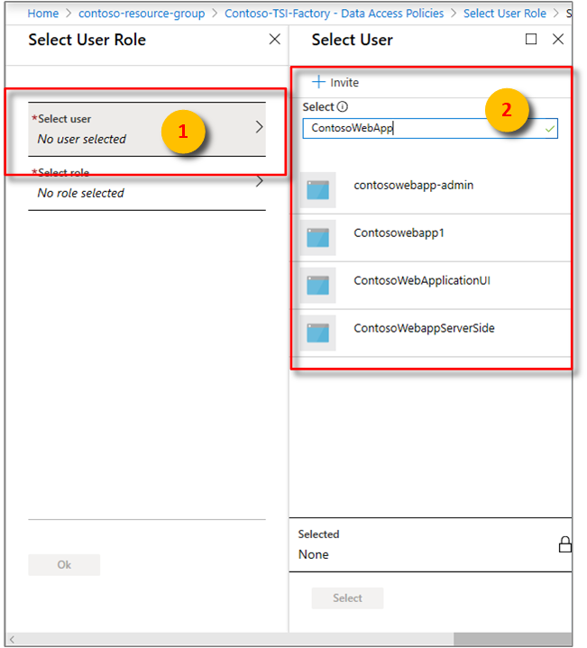

# Authentication and authorization for Azure Time Series Insights API

This article explains how to configure the authentication and authorization used in a custom application that calls the Azure Time Series Insights API.

> [!TIP]
> Read about [granting data access](./time-series-insights-data-access.md) to your Time Series Insights environment in Azure Active Directory.

## Service principal

This and following sections describe how to configure an application to access the Time Series Insights API on behalf of the application. The application can then query or publish reference data in the Time Series Insights environment with application credentials rather than user credentials.

## Best Practices

When you have an application that must access Time Series Insights:

1. Set up an Azure Active Directory app.
1. [Assign data access policies](./time-series-insights-data-access.md) in the Time Series Insights environment.

Using application rather than your user creditionals is desireable since:

* You can assign permissions to the app identity that are distinct from your own permissions. Typically, these permissions are restricted to only what the app requires. For example, you can allow the app to only read data in a particular Time Series Insights environment.
* You don't have to change the app's credentials, if your responsibilities change.
* You can use a certificate or an application key to automate authentication when you're running an unattended script.

The following sections demonstrate how to perform those steps through the Azure portal. The article focuses on a single-tenant application where the application is intended to run in only one organization. You'll typically use single-tenant applications for line-of-business applications that run in your organization.

## Set up summary

The setup flow consists of three steps:

1. Create an application in Azure Active Directory.
1. Authorize this application to access the Time Series Insights environment.
1. Use the application ID and key to acquire a token from `https://api.timeseries.azure.com/`. The token can then be used to call the Time Series Insights API.

## Detailed setup

1. In the Azure portal, select **Azure Active Directory** > **App registrations** > **New application registration**.

   [](media/authentication-and-authorization/active-directory-new-application-registration.png#lightbox)

1. Give the application a name, select the type to be **Web app / API**, select any valid URI for **Sign-on URL**, and click **Create**.

   [](media/authentication-and-authorization/active-directory-create-web-api-application.png#lightbox)

1. Select your newly created application and copy its application ID to your favorite text editor.

   [](media/authentication-and-authorization/active-directory-copy-application-id.png#lightbox)

1. Select **Keys**, enter the key name, select the expiration, and click **Save**.

   [](media/authentication-and-authorization/active-directory-application-keys.png#lightbox)

   [](media/authentication-and-authorization/active-directory-application-keys-save.png#lightbox)

1. Copy the key to your favorite text editor.

   [](media/authentication-and-authorization/active-directory-copy-application-key.png#lightbox)

1. For the Time Series Insights environment, select **Data Access Policies** and click **Add**.

   [](media/authentication-and-authorization/time-series-insights-data-access-policies-add.png#lightbox)

1. In the **Select User** dialog box, paste the application name (from **step 2**) or application ID (from **step 3**).

   [](media/authentication-and-authorization/time-series-insights-data-access-policies-select-user.png#lightbox)

1. Select the role (**Reader** for querying data, **Contributor** for querying data and changing reference data) and click **OK**.

   [](media/authentication-and-authorization/time-series-insights-data-access-policies-select-role.png#lightbox)

1. Save the policy by clicking **OK**.

1. Use the application ID (from **step 3**) and application key (from **step 5**) to acquire the token on behalf of the application. The token can then be passed in the `Authorization` header when the application calls the Time Series Insights API.

    If you're using C#, you can use the following code to acquire the token on behalf of the application. For a complete sample, see [Query data using C#](time-series-insights-query-data-csharp.md).

    ```csharp
    // Enter your Active Directory tenant domain name
    var tenant = "YOUR_AD_TENANT.onmicrosoft.com";
    var authenticationContext = new AuthenticationContext(
        $"https://login.microsoftonline.com/{tenant}",
        TokenCache.DefaultShared);

    AuthenticationResult token = await authenticationContext.AcquireTokenAsync(
        // Set the resource URI to the Azure Time Series Insights API
        resource: "https://api.timeseries.azure.com/", 
        clientCredential: new ClientCredential(
            // Application ID of application registered in Azure Active Directory
            clientId: "1bc3af48-7e2f-4845-880a-c7649a6470b8", 
            // Application key of the application that's registered in Azure Active Directory
            clientSecret: "aBcdEffs4XYxoAXzLB1n3R2meNCYdGpIGBc2YC5D6L2="));

    string accessToken = token.AccessToken;
    ```

Use the **Application ID** and **Key** in your application to authenticate with Azure Time Series Insight.

## Next steps

- For sample code that calls the Time Series Insights API, see [Query data using C#](time-series-insights-query-data-csharp.md).

- For API reference information, see [Query API reference](/rest/api/time-series-insights/ga-query-api).

- Learn how to [create a service principal](../active-directory/develop/howto-create-service-principal-portal.md).
