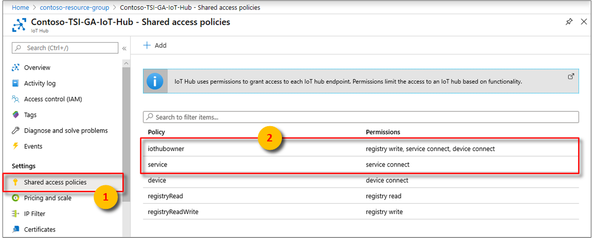
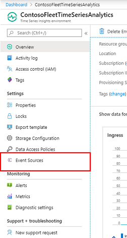
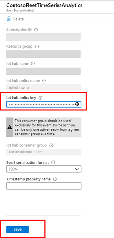

# Diagnose and solve issues in your Time Series Insights environment

This article describes issues that you might encounter in your Azure Time Series Insights environment. The article offers potential causes and solutions for resolution.

## Video

### Learn about common Time Series Insights customer challenges and mitigations 

> [!VIDEO https://www.youtube.com/embed/7U0SwxAVSKw]

## Problem: No data is shown

If no data is appearing in the [Azure Time Series Insights explorer](https://insights.timeseries.azure.com), consider these common causes:

### Cause A: Event source data isn't in JSON format

Azure Time Series Insights supports only JSON data. For JSON samples, see [Supported JSON shapes](./how-to-shape-query-json.md).

### Cause B: The event source key is missing a required permission

* For an IoT hub in Azure IoT Hub, you need to provide the key that has service connect permissions. Select either the **iothubowner** or **service** policy. Both have service connect permissions.

   

* For an event hub in Azure Event Hubs, you need to provide the key that has listen permissions. The **read** and **manage** policies will both work because they both have listen permissions.

   

### Cause C: The provided consumer group isn't exclusive to Time Series Insights

When you register an IoT hub or an event hub, it's important to set the consumer group that you want to use to read the data. This consumer group *can't be shared*. If the consumer group is shared, the underlying IoT hub or event hub automatically and randomly disconnects one of the readers. Provide a unique consumer group for Time Series Insights to read from.

### Cause D: The environment has just been provisioned

Data will appear in your Time Series Insights explorer within a few minutes after the environment and its data are first created.

## Problem: Some data is shown, but data is missing

When data appears only partially and the data seems to be lagging, consider these possible issues:

### Cause A: Your environment is being throttled

[Throttling](time-series-insights-environment-mitigate-latency.md) is a common issue when environments are provisioned after you create an event source that has data. Azure IoT Hub and Azure Events Hubs store data for up to seven days. Time Series Insights always starts with the oldest event in the event source (first-in, first-out, or *FIFO*).

For example, if you have 5 million events in an event source when you connect to an S1, single-unit Time Series Insights environment, Time Series Insights reads approximately 1 million events per day. It might look like Time Series Insights is experiencing five days of latency. But what's happening is that the environment is being throttled.

If you have old events in your event source, you can approach throttling in one of two ways:

- Change your event source's retention limits to help remove old events that you don't want to show up in Time Series Insights.
- Provision a larger environment size (number of units) to increase the throughput of old events. In the preceding example, if you increase the same S1 environment to five units for one day, the environment should catch up within a day. If your steady-state event production is 1 million or fewer events per day, you can reduce the event capacity to one unit after Time Series Insights catches up.

The enforced throttling limit is based on the environment's SKU type and capacity. All event sources in the environment share this capacity. If the event source for your IoT hub or event hub pushes data beyond the enforced limits, you'll experience throttling and a lag.

The following figure shows a Time Series Insights environment that has an SKU of S1 and a capacity of 3. It can ingress 3 million events per day.

Imagine an environment that ingests messages from an event hub. It has a daily ingress rate of about 67,000 messages. This rate translates to approximately 46 messages every minute.

* If each event hub message is flattened to a single Time Series Insights event, throttling doesn't occur.
* If each event hub message is flattened to 100 Time Series Insights events, 4,600 events should be ingested every minute.

An S1 SKU environment that has a capacity of 3 can ingress only 2,100 events every minute (1 million events per day = 700 events per minute at three units = 2,100 events per minute).

To get a high-level understanding of how flattening logic works, see [Supported JSON shapes](./how-to-shape-query-json.md).

#### Recommended resolutions for excessive throttling

To fix the lag, increase the SKU capacity of your environment. For more information, read [Scale your Time Series Insights environment](time-series-insights-how-to-scale-your-environment.md).

### Cause B: initial ingestion of historical data slows ingress

If you connect an existing event source, it's likely that your IoT hub or event hub already contains data. The environment starts pulling data from the beginning of the event source's message retention period. This default processing can't be overridden. You can engage throttling. Throttling might take a while to catch up as it ingests historical data.

#### Recommended resolutions for large initial ingestion

To fix the lag:

1. Increase the SKU capacity to the maximum allowed value (10, in this case). After you increase capacity, the ingress process starts to catch up much more quickly. You're charged for the increased capacity. To visualize how quickly you're catching up, you can view the availability chart in the [Time Series Insights explorer](https://insights.timeseries.azure.com).

2. When the lag is caught up, decrease the SKU capacity to your normal ingress rate.

## Problem: Data was showing previously but is no longer showing

If Time Series Insights is no longer ingesting data, but events are still streaming into Iot Hub or Event Hub, consider this potential cause:

### Cause A: Your hub access key was regenerated and your environment needs to be updated

This problem occurs when the key provided when you created your event source is no longer valid. You would see telemetry in your hub but no Ingress Received Messages in Time Series Insights. If you aren't sure whether the key was regenerated, you can search your event hub's activity log for "Create or Update Namespace Authorization Rules." For an IoT hub, search for "Create or update IotHub Resource."

To update your Time Series Insights environment with the new key, open your hub resource in the Azure portal and copy the new key. Go to your Time Series Insights resource and select **Event Sources**:

   

Select the event source or sources from which ingestion has stopped, paste in the new key, and then select **Save**:

   

## Problem: The event source's timestamp property name setting doesn't work

Ensure that the timestamp property value that comes from your event source as a JSON string is in the format _yyyy-MM-ddTHH:mm:ss.FFFFFFFK_. Here's an example: **2008-04-12T12:53Z**.

Keep in mind that the timestamp property name is case-sensitive.

The easiest way to ensure that your timestamp property name is captured and working properly is to use the Time Series Insights explorer. In the Time Series Insights explorer, using the chart, select a period of time after you entered the timestamp property name. Right-click the selection, and then select **Explore events**.

The first column header should be your timestamp property name. Next to the word **Timestamp**, **($ts)** will be displayed.

The following values won't be displayed:

- *(abc)*: Indicates that Time Series Insights is reading the data values as strings.
- *Calendar icon*: Indicates that Time Series Insights is reading the data value as *datetime*.
- *#*: Indicates that Time Series Insights is reading the data values as an integer.

## Next steps

- Read about [How to mitigate latency in Azure Time Series Insights](time-series-insights-environment-mitigate-latency.md).

- Learn [how to scale your Time Series Insights environment](time-series-insights-how-to-scale-your-environment.md).