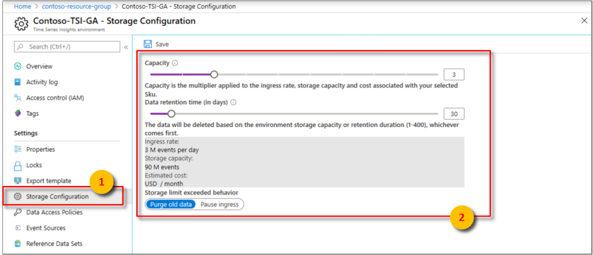

# Diagnose and solve problems in your Time Series Insights environment

## I don't see my data
Here are some reasons why you might not see your data in your environment in the [Azure Time Series Insights Explorer](https://insights.timeseries.azure.com).

### Your event source doesn't have data in JSON format
Azure Time Series Insights supports only JSON data. For JSON samples, see [Supported JSON shapes](time-series-insights-send-events.md#supported-json-shapes).

### When you registered your event source, you didn't provide the key that has the required permission
* For an IoT hub, you need to provide the key that has **service connect** permission.

   

   As shown in the preceding image, either of the policies **iothubowner** and **service** would work, because both have **service connect** permission.
* For an event hub, you need to provide the key that has **Listen** permission.

   

   As shown in the preceding image, either of the policies **read** and **manage** would work, because both have **Listen** permission.

### The provided consumer group is not exclusive to Time Series Insights
For an IoT hub or an event hub, during registration we require you to specify the consumer group that should be used for reading your data. This consumer group must not be shared. If it's shared, the underlying event hub automatically disconnects one of the readers randomly.

## I see my data, but there's a lag
Here are reasons why you might see partial data in your environment in the [Time Series Insights explorer](https://insights.timeseries.azure.com).

### Your environment is getting throttled
The throttling limit is enforced based on the environment's SKU type and capacity. All event sources in the environment share this capacity. If the event source for your IoT hub or event hub is pushing data beyond the enforced limits, you see throttling and a lag.

The following diagram shows a Time Series Insights environment that has a SKU of S1 and a capacity of 3. It can ingress 3 million events per day.

Assume that this environment is ingesting messages from an event hub with the ingress rate shown in the following diagram:

As shown in the diagram, the daily ingress rate is ~67,000 messages. This rate translates roughly to 46 messages every minute. If each event hub message is flattened to a single Time Series Insights event, this environment sees no throttling. If each event hub message is flattened to 100 Time Series Insights events, then 4,600 events should be ingested every minute. An S1 SKU environment that has a capacity of 3 can ingress only 2,100 events every minute (1 million events per day = 700 events per minute at 3 units = 2,100 events per minute). Therefore you see a lag due to throttling. 

For a high-level understanding of how flattening logic works, see [Supported JSON shapes](time-series-insights-send-events.md#supported-json-shapes).

#### Recommended steps
To fix the lag, increase the SKU capacity of your environment. For more information, see [How to scale your Time Series Insights environment](time-series-insights-how-to-scale-your-environment.md).

### You're pushing historical data and causing slow ingress
If you are connecting an existing event source, it's likely that your IoT hub or event hub already has data in it. So the environment starts pulling data from the beginning of the event source's message retention period. 

This behavior is the default behavior and cannot be overridden. You can engage throttling, and it may take a while to catch up on ingesting historical data.

#### Recommended steps
To fix the lag, take the following steps:
1. Increase the SKU capacity to the maximum allowed value (10 in this case). After the capacity is increased, the ingress process starts catching up much faster. You can visualize how quickly you're catching up through the availability chart in the [Time Series Insights explorer](https://insights.timeseries.azure.com). You are charged for the increased capacity.
2. After the lag is caught up, decrease the SKU capacity back to your normal ingress rate.

## My event source's *timestamp property name* setting doesn't work
Ensure that the name and value conform to the following rules:
* The timestamp property name is _case-sensitive_.
* The timestamp property value that's coming from your event source, as a JSON string, should have the format _yyyy-MM-ddTHH:mm:ss.FFFFFFFK_. An example of such a string is “2008-04-12T12:53Z”.
