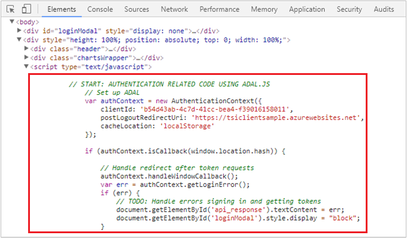
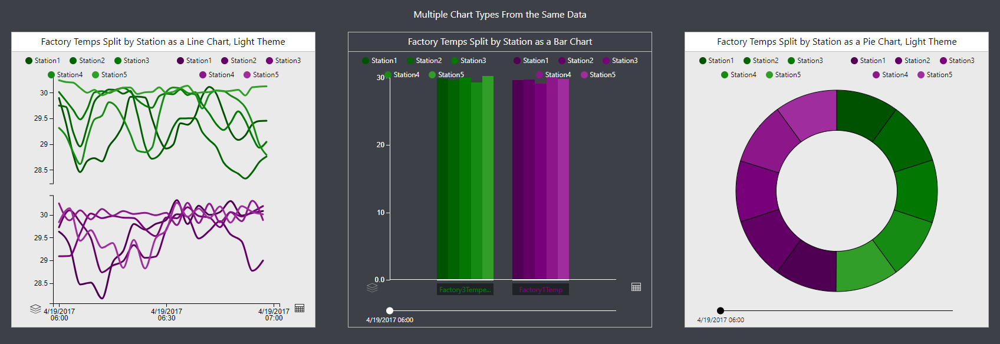
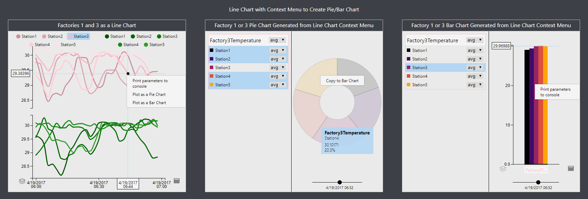

---
title: Explore the Time Series Insights JavaScript client library
description: Learn about the Time Series Insights JavaScript client library and related programming model.
documentationcenter: ''
services: time-series-insights
author: BryanLa
manager: timlt
editor: ''
tags: 

ms.assetid: 
ms.service: time-series-insights
ms.workload: na
ms.tgt_pltfrm: 
ms.devlang: na
ms.topic: tutorial
ms.date: 05/08/2018
ms.author: bryanla
# Customer intent: As a developer, I want learn about the TSI JavaScript client library, so I can use the APIs in my own applications.
---

# Tutorial: Explore the Time Series Insights JavaScript client library

To help developers query and visualize data stored in Time Series Insights (TSI), we’ve developed a JavaScript D3-based control library that makes this work easy. Using a sample web application, this tutorial will guide you through an exploration of the TSI JavaScript client library, and the related programming model. 

The topics discussed provide you with opportunities to experiment, gain a deeper understanding of how to access TSI data, and use chart controls to render and visualize data. The goal is to provide you with enough details, that you can use the library in your own web application.

In this tutorial, you learn about:

> [!div class="checklist"]
> * The TSI Sample application 
> * The TSI JavaScript client library
> * How the sample application uses the library to visualize TSI data

## Prerequisites

This tutorial uses the "Developer Tools" feature (also known as DevTools or F12), found in most modern web browsers such as [Edge](/microsoft-edge/devtools-guide), [Chrome](https://developers.google.com/web/tools/chrome-devtools/), [FireFox](https://developer.mozilla.org/en-US/docs/Learn/Common_questions/What_are_browser_developer_tools), [Safari](https://developer.apple.com/safari/tools/), and others. If you're not already familiar, you may want to explore this feature in your browser before continuing. 

## The Time Series Insights Sample Application

Throughout this tutorial, the Time Series Insights Sample Application is used to explore the source code behind the application, including usage of the TSI JavaScript client library. The application is a Single-Page web Application (SPA), showcasing the use of the library for querying and visualizing data from a sample TSI environment. 

1. Navigate to the [Time Series Insights sample application](https://insights.timeseries.azure.com/clientsample). You see a page similar to the following, prompting you for sign-in:
   

2. Click the "Log in" button and enter or select your credentials. You can use either an enterprise/organization account (Azure Active Directory) or a personal account (Microsoft Account, or MSA). 

   

3. After successful sign-in, you will see a page similar to the following, containing several styles of example charts, populated with TSI data. Also note your user account and the "log out" link in the upper right:
   

### Page source and structure

First let's view the HTML and JavaScript source code behind the page that rendered in your browser. We don't walk through all of the elements, but you learn about the major sections giving you a sense of how the page works:

1. Open "Developer Tools" in your browser, and inspect the HTML elements that make up the current page, also known as the HTML or DOM tree.

2. Expand the `<head>` and `<body>` elements and notice the following sections:
   - Under `<head>`, you find elements that pull in additional files to assist in the functioning of the page:
     - a `<script>` element for referencing the Azure Active Directory Authentication Library (adal.min.js) - also known as ADAL, this is a JavaScript library that provides OAuth 2.0 authentication (sign-in) and token acquisition for accessing APIs:

       >[!NOTE]
       > The source code for the ADAL JavaScript library is available from the [azure-activedirectory-library-for-js repository](https://github.com/AzureAD/azure-activedirectory-library-for-js).

     - `<link>` elements for style sheets (sampleStyles.css, tsiclient.css) - also known as CSS, they're used to control visual page styling details, such as colors, fonts, spacing, etc. 
     - a `<script>` element for referencing the TSI Client library (tsiclient.js) - a JavaScript library used by the page to call TSI service APIs and render chart controls on the page.

   - Under `<body>`, you find `<div>` elements, which act as containers to define the layout of items on the page, and another `<script>` element:
     - the first `<div>` specifies the "Log In" dialog (`id="loginModal"`).
     - the second `<div>` acts as a parent for:
       - a header `<div>`, used for status messages and sign-in information near the top of the page (`class="header"`).
       - a `<div>` for the remainder of the page body elements, including all of the charts (`class="chartsWrapper"`).
       - a `<script>` section, which contains all of the JavaScript used to control the page.

   [](media/tut-explore-js-client-lib/tcs-devtools-callouts-head-body.png#lightbox)

3. Expand the `<div class="chartsWrapper">` element, and you find more child `<div>` elements, used to position each chart control example. Notice there are several pairs of `<div>` elements, one for each chart example:
   - The first (`class="rowOfCardsTitle"`) contains a descriptive title to summarize what the chart(s) illustrate. For example: "Static Line Charts With Full-Size Legends"
   - The second (`class="rowOfCards"`) is a parent, containing additional child `<div>` elements that position the actual chart control(s) within a row. 

  

4. Now expand the `<script type="text/javascript">` element, directly below the `<div class="chartsWrapper">` element. You see the beginning of the page-level JavaScript section, used to handle all of the page logic for things such as authentication, calling TSI service APIs, rendering of the chart controls, and more:

  

## TSI Client JavaScript library concepts

Although we don't review it in detail, fundamentally the TSI Client library (tsclient.js) provides an abstraction for two important categories:

- **Wrapper methods for calling the TSI Query APIs** - REST APIs that allow you to query for TSI data using aggregate expressions, and are organized under the `TsiClient.Server` namespace of the library. 
- **Methods for creating and populating several types of charting controls** - Used for rendering the TSI aggregate data in a web page, and are organized under the `TsiClient.UX` namespace of the library. 

The following concepts are universal and applicable to the TSI Client library APIs in general. 

### Authentication

As mentioned earlier, this sample is a Single-Page Application and it uses the OAuth 2.0 support in ADAL for user authentication. Here are some points of interest in this section of the script:

1. Using ADAL for authentication requires the client application to register itself in the Azure Active Directory (Azure AD) application registry. As an SPA, this application is registered to use the "implicit" OAuth 2.0 authorization grant flow. Correspondingly, the application specifies some of the registration properties at runtime, such as the client ID GUID (`clientId`) and redirect URI (`postLogoutRedirectUri`), to participate in the flow.

2. Later, the application requests an "access token" from Azure AD. The access token is issued for a finite set of permissions, for a specific service/API identifier (https://insights.timeseries.azure.com), also known as the token "audience." The token permissions are issued on behalf of the signed-in user. The identifier for the service/API is yet another property contained in the application's Azure AD registration. Once ADAL returns the access token to the application, it is passed as a "bearer token" when accessing the TSI service APIs. 

   [!code-javascript[head-sample](/azure/sample-javascript/pages/index.html?range=140-199&highlight=4-9,36-39)]

### Control identification

As discussed earlier, the `<div>` elements within the `<body>` provide the layout for all of the chart controls demonstrated on the page. Each of them specify properties for the placement and visual attributes of the chart control, including an `id` property. The `id` property provides a unique identifier, which is used in the JavaScript code to identify and bind to each control for rendering and updating. 

### Aggregate expressions

The TSI Client library APIs make heavy use of aggregate expressions. An aggregate expression provides the ability to construct one or more "search terms." The APIs are similar to the way the [Time Series Insights explorer](https://insights.timeseries.azure.com/demo) uses search span, where predicate, measures, and split-by value. Most library APIs take an array of aggregate expressions, which are used by the service to build a TSI data query.

### Call pattern

Populating and rendering of chart controls follows a general pattern. You find this pattern used throughout the page JavaScript, that instantiates and loads the TSI Sample Application controls:

1. Declare an array of to hold one or more TSI aggregate expressions.  

   ```javascript
   var aes =  [];
   ```

2. Build 1 to n aggregate expression objects, and add them to the aggregate expression array.  

   ```javascript
   var ae = new tsiClient.ux.aggregateExpression(predicateObject, measureObject, measureTypes, searchSpan, splitByObject, color, alias, contextMenuActions);
   aes.push(ae);
   ```
   **aggregateExpression parameters**

   | Parameter | Description | Example |
   | --------- | ----------- | ------- |
   | predicateObject | The data Filtering expression. |`{predicateString: "Factory = 'Factory3'"}` |
   | measureObject   | The property name of the measure being used. | `{property: 'Temperature', type: "Double"}` |
   | measureTypes    | Desired aggregations of the measure property. | `['avg', 'min']` |
   | searchSpan      | The duration and interval size of the aggregate expression. | `{from: startDate, to: endDate, bucketSize: '2m'}` |
   | splitByObject   | The string property you wish to split by (optional – can be null). | `{property: 'Station', type: 'String'}` |
   | color           | The color of the objects you wish to render. | `'pink'` |
   | alias           | A friendly name for the aggregate expression. | `'Factory3Temperature'` |
   | contextMenuActions | An array of actions to be bound to the time series objects in a visualization (optional). | See [Pop-up context menus in the Advanced features section.](#popup-context-menus) |

3. Call a TSI Query using `TsiClient.Server` APIs to request the aggregate data.  

   ```javascript
   tsiClient.server.getAggregates(token, envFQDN, aeTsxArray);
   ```
   **getAggregates parameters**

   | Parameter | Description | Example |
   | --------- | ----------- | ------- |
   | token     | Access token for the TSI API |	`authContext.getTsiToken()` See [authentication section.](#authentication) |
   | envFQDN	 | Fully Qualified Domain Name for the TSI environment | From the Azure portal, for example `10000000-0000-0000-0000-100000000108.env.timeseries.azure.com` |
   | aeTsxArray | Array of TSI query expressions | Use the `aes` variable as described previously: `aes.map(function(ae){return ae.toTsx()}` |

4. Transform the compressed result returned from the TSI Query, into JSON for visualization.

   ```javascript
   var transformedResult = tsiClient.ux.transformAggregatesForVisualization(result, aes);
   ```

5. Create a chart control using `TsiClient.UX` APIs, and bind it to one of the `<div>` elements on the page.

   ```javascript
   var lineChart = new tsiClient.ux.BarChart(document.getElementById('chart3'));
   ```

6. Populate the chart control with the transformed JSON data object(s) and render it on the page.

   ```javascript
   lineChart.render(transformedResult, {grid: true, legend: 'compact', theme: 'light'}, aes);
   ```

## Rendering controls

The library currently exposes eight unique analytics controls. They include a line chart, pie chart, bar chart, heatmap, hierarchy controls, an accessible grid, discrete event timelines, and state transition timelines.   

### Line, bar, pie chart examples 

First let's look at the code behind some standard chart controls demonstrated in the application, and the programming model/patterns for creating them. Specifically, you examine the section of HTML under the `// Example 3/4/5` comment, which renders controls with ID values `chart3`, `chart4`, and `chart5`. 

Recall from step #3 in the [Page source and structure section](#page-source-and-structure), chart controls are arranged in rows on the page, each of which has a descriptive title row. In this example, the three charts being populated are all under the "Multiple Chart Types From the Same Data" title `<div>`, bound to the three `<div>` elements beneath it:

[!code-javascript[code-sample1-line-bar-pie](source/index.html?range=60-74&highlight=1,5,9,13)]

The following section of JavaScript code uses the pattern outlined earlier, to build TSI aggregate expressions, use them to query for TSI data, and render the three charts. Note the three types used from the `tsiClient.ux` namespace, `LineChart`, `BarChart`, `PieChart`, to create and render the respective charts. Also note that all three charts are able to use the same aggregate expression data, `transformedResult`:

[!code-javascript[code-sample2-line-bar-pie](source/index.html?range=236-257&highlight=13-14,16-17,19-20)]

The three charts appear as follows when rendered:

[](media/tut-explore-js-client-lib/tcs-multiple-chart-types-from-the-same-data.png#lightbox)

## Advanced features

The library also exposes some optional advanced features that you may want to take advantage of.  

### States and events

One example of the advanced functionality provided is the ability to add state transitions and discrete events to charts. This feature is useful for highlighting incidents, alerting, and state switches like on/off. 

Here you look at the code behind the section of HTML under the `// Example 10` comment. The code renders a line control under the "Line Charts with Multiple Series Types" title, binding it to the `<div>` with ID value `chart10`:

1. First a structure named `events4` is defined, to hold the state-change elements to be tracked. It contains:
   - A string key named `"Component States"` 
   - An array of value objects that represent the states, each of which includes:
     - A string key containing a JavaScript ISO timestamp
     - An array containing characteristics of the state
       - a color
       - a description

2. Then the `events5` structure is defined for `"Incidents"`, which holds an array of the event elements to be tracked. The array structure is the same shape as the one outlined for `events4`. 

3. Finally the line chart is rendered, passing the two structures in with the chart options parameters: `events:` and `states:`. Note the other option parameters, for specifying a `tooltip:`, `theme:` or `grid:`. 

[!code-javascript[code-sample-states-events](source/index.html?range=332-384&highlight=5,26,51)]

Visually, the diamond markers/popups are used to indicate incidents, and the colored bars/popups along the time scale indicate state changes:

[](media/tut-explore-js-client-lib/tcs-line-charts-with-multiple-series-types.png#lightbox)

### Popup context menus

Another example of advanced functionality are custom context menus (right-click popup menus), which are useful to enable actions and logical next steps within the scope of your application.

Here we look at the code behind the HTML under `// Example 13/14/15`. This code initially renders a line chart under the "Line Chart with Context Menu to Create Pie/Bar Chart" title, bound to the `<div>` element with ID value `chart13`. Using context menus, the line chart provides the capability to dynamically create a pie and bar chart, bound to `<div>` elements with IDs `chart14` and `chart15`. In addition, both the pie and bar charts also use context menus to enable their own features: the ability to copy data from the pie to bar chart, and print the bar chart data to the browser console window, respectively.

1. First a series of custom actions are defined. Each contains an array with one or more elements, where each element defines a single context menu item: 
   - `barChartActions`: defines the context menu for the pie chart, which contains one element to define a single item:
     - `name`: the text used for the menu item: "Print parameters to console"
     - `action`: the action associated with the menu item, which is always an anonymous function that takes three arguments based on the aggregate expression used to create the chart. In this case, they are written to the browser console window:
       - `ae`: the aggregate expression array
       - `splitBy`: the splitBy value
       - `timestamp`: the timestamp
   - `pieChartActions`: defines the context menu for the bar chart, which contains one element to define a single item. The shape and schema is the same as the previous `barChartActions`, but notice the `action` function is dramatically different, as it instantiates and renders the bar chart. Also note that it uses the `ae` argument to specify the aggregate expression array, passed at runtime during popup of the menu item. The function also sets the `ae.contextMenu` property with the `barChartActions` context menu.
   - `contextMenuActions`: defines the context menu for the line chart, which contains three elements to define three menu items. The shape and schema for each element is the same as the previous ones. Just like `barChartActions`, the first item writes the three function arguments to the browser console window. Similar to `pieChartActions`, the second two items instantiate and render the pie and bar charts, respectively. The second two items also set their `ae.contextMenu` properties with the `pieChartActions` and `barChartActions` context menus, respectively.

2. Then two aggregate expressions are pushed onto the `aes` aggregate expression array, specifying the `contextMenuActions` array for each. These are used with the line chart control.

3. Finally, only the line chart is initially rendered, from which both the pie and bar chart can be rendered at runtime.

[!code-javascript[code-sample-context-menus](source/index.html?range=456-535&highlight=7,16,29,61-64,78)]

The screen shot shows the charts, with their respective pop-up context menus. The pie and bar charts were created dynamically, using the line chart context menu options:

[](media/tut-explore-js-client-lib/tcs-line-chart-with-context-menu-to-create-pie-bar-chart.png#lightbox)

### Brushes

Brushes can be used to scope a time range to define actions like zoom and explore. 

The code used to illustrate brushes is also shown in the previous "Line Chart with Context Menu to Create Pie/Bar Chart" example, covering [Popup context menus](#popup-context-menus-section). 

1. Brush actions are very similar to a context menu, defining a series of custom actions for the brush. Each contains an array with one or more elements, where each element defines a single context menu item:
   - `name`: the text used for the menu item: "Print parameters to console"
   - `action`: the action associated with the menu item, which is always an anonymous function that takes two arguments. In this case, they are written to the browser console window:
      - `fromTime`: the "from" timestamp of the brush selection
      - `toTime`:  the "to" timestamp of the brush selection

2. Brush actions are added as another chart option property. Note the `brushContextMenuActions: brushActions` property being passed to the `linechart.Render` call.

[!code-javascript[code-sample-brushes](source/index.html?range=521-535&highlight=1,13)]


## Next steps

In this tutorial, you learned how to:

> [!div class="checklist"]
> * Sign in and explore the TSI Sample application and its source
> * Use APIs in the TSI JavaScript client library
> * Use JavaScript to create and populate chart controls with TSI data

As discussed, the TSI Sample application uses a demo data set. To learn more about how you can create your own TSI environment and data set, advance to the following article:

> [!div class="nextstepaction"]
> [Plan your Azure Time Series Insights environment](time-series-insights-environment-planning.md)


