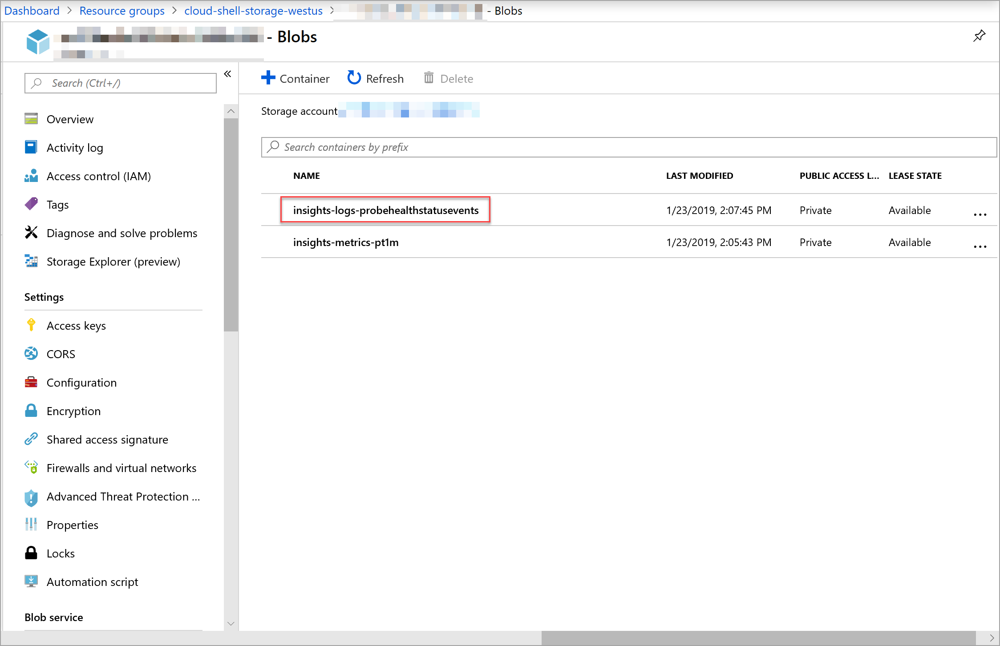

# Enable Traffic Manager metrics logging in Azure

This article describes how to enable metrics logging and access log data for a Traffic Manager profile.

Azure Traffic Manager logging metrics can provide insight into the behavior of the Traffic Manager profile resource. For example, you can use a Traffic Manager profile's log data to determine why individual probes have timed out against an endpoint.

This article requires the Azure PowerShell module version 6.13.1 or later. You can run `Get-Module -ListAvailable AzureRM` to find the installed version. If you need to install or upgrade, see [Install Azure PowerShell module](/powershell/azure/azurerm/install-azurerm-ps). 

## Log in to Azure

Log in to your Azure subscription with the `Connect-AzureRmAccount` command and follow the on-screen directions.

```powershell
Connect-AzureRmAccount
```
## Enable metrics logging for Traffic Manager profile
 Enable metrics logging using [Set-AzureRmDiagnosticSetting](https://docs.microsoft.com/en-us/powershell/module/azurerm.insights/set-azurermdiagnosticsetting?view=latest). The following command stores verbose logs and metrics a Traffic Manager profile to the specified storage account. 

     ```azurepowershell-interactive
    Set-AzureRmDiagnosticSetting -ResourceId <TrafficManagerprofileResourceId> -StorageAccountId <storageAccountId> -Enabled $true
     ``` 
## Verify diagnostic settings for Traffic Manager profile
Verify diagnostic settings for the Traffic Manager profile using [Get-AzureRmDiagnosticSetting](https://docs.microsoft.com/en-us/powershell/module/azurerm.insights/get-azurermdiagnosticsetting?view=latest). The following command displays the categories that are logged for a resource.

     ```azurepowershell-interactive
    Get-AzureRmDiagnosticSetting -ResourceId <TrafficManagerprofileResourceId>
     ```  
Ensure that all log categories associated with the Traffic Manager profile resource display as enabled. Also, verify that the storage account is correctly set.

## Access log files for a Traffic Manager profile using the Azure portal
1. Navigate to your Azure Storage account in the portal.
2. On the **Overview** page of your Azure storage account, under **Services** select **Blobs**.
3. For **Containers**, select **insights-logs-probehealthstatusevents**, and navigate down to the PT1H.json file and click **Download** to download and save a copy of this log file.

    


## Traffic Manager log schema

All diagnostic logs available through Azure Monitor share a common top-level schema, with flexibility for each service to emit unique properties for their own events. For top-level diagnostic logs schema, see [Supported services, schemas, and categories for Azure Diagnostic Logs](../azure-monitor/platform/tutorial-dashboards.md).
The following table includes logs schema specific to the Azure Traffic Manager profile resource.


|||||
|----|----|---|---|
|Field Name|Field Type|Definition|Example|
|EndpointName|String|The resource name of the endpoint the health status is being recorded for.|"myPrimaryEndpoint"|
|Status|String|The health status of the endpoint that was probed. Can either be "Up" or "Down"|"Up"|
|||||

## Next steps

* Learn more about [Traffic Manager Monitoring](traffic-manager-monitoring.md)

