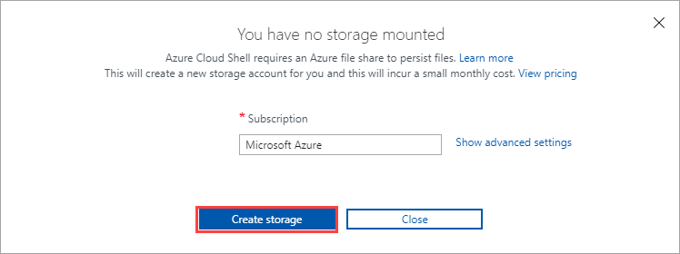
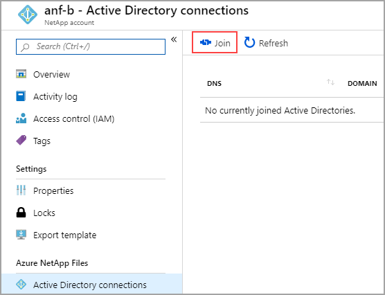
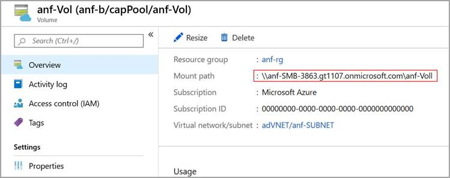

# Create an FSLogix profile container for a host pool using Azure NetApp Files

We recommend using FSLogix profile containers as a user profile solution for the [Windows Virtual Desktop service](overview.md). FSLogix profile containers store a complete user profile in a single container and are designed to roam profiles in non-persistent remote computing environments like Windows Virtual Desktop. When you sign in, the container dynamically attaches to the computing environment using a locally supported virtual hard disk (VHD) and Hyper-V virtual hard disk (VHDX). These advanced filter-driver technologies allow the user profile to be immediately available and appear in the system exactly like a local user profile. To learn more about FSLogix profile containers, see [FSLogix profile containers and Azure files](fslogix-containers-azure-files.md).

You can create FSLogix profile containers using [Azure NetApp Files](https://azure.microsoft.com/services/netapp/), an easy-to-use Azure native platform service that helps customers quickly and reliably provision enterprise-grade SMB volumes for their Windows Virtual Desktop environments. To learn more about Azure NetApp Files, see [What is Azure NetApp Files?](../azure-netapp-files/azure-netapp-files-introduction.md)

This guide will show you how to set up an Azure NetApp Files account and create FSLogix profile containers in Windows Virtual Desktop.

This article assumes you already have [host pools](create-host-pools-azure-marketplace.md) set up and grouped into one or more tenants in your Windows Virtual Desktop environment. To learn how to set up tenants, see [Create a tenant in Windows Virtual Desktop](./virtual-desktop-fall-2019/tenant-setup-azure-active-directory.md) and [our Tech Community blog post](https://techcommunity.microsoft.com/t5/Windows-IT-Pro-Blog/Getting-started-with-Windows-Virtual-Desktop/ba-p/391054).

The instructions in this guide are specifically for Windows Virtual Desktop users. If you're looking for more general guidance for how to set up Azure NetApp Files and create FSLogix profile containers outside of Windows Virtual Desktop, see the [Set up Azure NetApp Files and create an NFS volume quickstart](../azure-netapp-files/azure-netapp-files-quickstart-set-up-account-create-volumes.md).

>[!NOTE]
>This article doesn't cover best practices for securing access to the Azure NetApp Files share.

>[!NOTE]
>If you're looking for comparison material about the different FSLogix Profile Container storage options on Azure, see [Storage options for FSLogix profile containers](store-fslogix-profile.md).

## Prerequisites

Before you can create an FSLogix profile container for a host pool, you must:

- Set up and configure Windows Virtual Desktop
- Provision a Windows Virtual Desktop host pool
- [Enable your Azure NetApp Files subscription](../azure-netapp-files/azure-netapp-files-register.md)

## Set up your Azure NetApp Files account

To get started, you need to set up an Azure NetApp Files account.

1. Sign in to the [Azure portal](https://portal.azure.com). Make sure your account has contributor or administrator permissions.

2. Select the **Azure Cloud Shell icon** to the right of the search bar to open Azure Cloud Shell.

3. Once Azure Cloud Shell is open, select **PowerShell**.

4. If this is your first time using Azure Cloud Shell, create a storage account in the same subscription you keep your Azure NetApp Files and Windows Virtual Desktop.

   

5. Once Azure Cloud Shell loads, run the following two cmdlets.

   ```azurecli
   az account set --subscription <subscriptionID>
   ```

   ```azurecli
   az provider register --namespace Microsoft.NetApp --wait
   ```

6. In the left side of the window, select **All services**. Enter **Azure NetApp Files** into the search box that appears at the top of the menu.

   


7. Select **Azure NetApp Files** in the search results, then select **Create**.

8. Select the **Add** button.
9. When the **New NetApp account** tab opens, enter the following values:

    - For **Name**, enter your NetApp account name.
    - For **Subscription**, select the subscription for the storage account you set up in step 4 from the drop-down menu.
    - For **Resource group**, either select an existing resource group from the drop-down menu or create a new one by selecting **Create new**.
    - For **Location**, select the region for your NetApp account from the drop-down menu. This region must be the same region as your session host VMs.

   >[!NOTE]
   >Azure NetApp Files currently doesn't support mounting of a volume across regions.

10. When you're finished, select **Create** to create your NetApp account.

## Create a capacity pool

Next, create a new capacity pool: 

1. Go to the Azure NetApp Files menu and select your new account.
2. In your account menu, select **Capacity pools** under Storage service.
3. Select **Add pool**.
4. When the **New capacity pool** tab opens, enter the following values:

    - For **Name**, enter a name for the new capacity pool.
    - For **Service level**, select your desired value from the drop-down menu. We recommend **Premium** for most environments.
       >[!NOTE]
       >The Premium setting provides the minimum throughput available for a Premium Service level, which is 256 MBps. You may need to adjust this throughput for a production environment. Final throughput is based on the relationship described in [Throughput limits](../azure-netapp-files/azure-netapp-files-service-levels.md).
    - For **Size (TiB)**, enter the capacity pool size that best fits your needs. The minimum size is 4 TiB.

5. When you're finished, select **OK**.

## Join an Active Directory connection

After that, you need to join an Active Directory connection.

1. Select **Active Directory connections** in the menu on the left side of the page, then select the **Join** button to open the **Join Active Directory** page.

   

2. Enter the following values in the **Join Active Directory** page to join a connection:

    - For **Primary DNS**, enter the IP address of the DNS server in your environment that can resolve the domain name.
    - For **Domain**, enter your fully qualified domain name (FQDN).
    - For **SMB Server (Computer Account) Prefix**, enter the string you want to append to the computer account name.
    - For **Username**, enter the name of the account with permissions to perform domain join.
    - For **Password**, enter the account's password.

## Create a new volume

Next, you'll need to create a new volume.

1. Select **Volumes**, then select **Add volume**.

2. When the **Create a volume** tab opens, enter the following values:

    - For **Volume name**, enter a name for the new volume.
    - For **Capacity pool**, select the capacity pool you just created from the drop-down menu.
    - For **Quota (GiB)**, enter the volume size appropriate for your environment.
    - For **Virtual network**, select an existing virtual network that has connectivity to the domain controller from the drop-down menu.
    - Under **Subnet**, select **Create new**. Keep in mind that this subnet will be delegated to Azure NetApp Files.

3.  Select **Next: Protocol \>\>** to open the Protocol tab and configure your volume access parameters.

## Configure volume access parameters

After you create the volume, configure the volume access parameters.

1.  Select **SMB** as the protocol type.
2.  Under Configuration in the **Active Directory** drop-down menu, select the same directory that you originally connected in [Join an Active Directory connection](create-fslogix-profile-container.md#join-an-active-directory-connection). Keep in mind that there's a limit of one Active Directory per subscription.
3.  In the **Share name** text box, enter the name of the share used by the session host pool and its users.

4.  Select **Review + create** at the bottom of the page. This opens the validation page. After your volume is validated successfully, select **Create**.

5.  At this point, the new volume will start to deploy. Once deployment is complete, you can use the Azure NetApp Files share.

6.  To see the mount path, select **Go to resource** and look for it in the Overview tab.

    

## Configure FSLogix on session host virtual machines (VMs)

This section is based on [Create a profile container for a host pool using a file share](create-host-pools-user-profile.md).

1. [Download the FSLogix agent .zip file](https://go.microsoft.com/fwlink/?linkid=2084562&clcid=0x409) while you're still remoted in the session host VM.

2. Unzip the downloaded file.

3. In the file, go to **x64** > **Releases** and run **FSLogixAppsSetup.exe**. The installation menu will open.

4.  If you have a product key, enter it in the Product Key text box.

5. Select the check box next to **I agree to the license terms and conditions**.

6. Select **Install**.

7. Navigate to **C:\\Program Files\\FSLogix\\Apps** to confirm the agent installed.

8. From the Start menu, run **RegEdit** as administrator.

9. Navigate to **Computer\\HKEY_LOCAL_MACHINE\\software\\FSLogix**.

10. Create a key named **Profiles**.

11.  Create a value named **Enabled** with a **REG_DWORD** type set to a data value of **1**.

12. Create a value named **VHDLocations** with a **Multi-String** type and set its data value to the URI for the Azure NetApp Files share.

13. Create a value named **DeleteLocalProfileWhenVHDShouldApply** with a DWORD value of 1 to avoid problems with existing local profiles before you sign in.

     >[!WARNING]
     >Be careful when creating the DeleteLocalProfileWhenVHDShouldApply value. When the FSLogix Profiles system determines a user should have an FSLogix profile, but a local profile already exists, Profile Container will permanently delete the local profile. The user will then be signed in with the new FSLogix profile.

## Assign users to session host

1. Open **PowerShell ISE** as administrator and sign in to Windows Virtual Desktop.

2. Run the following cmdlets:

   ```powershell
   Import-Module Microsoft.RdInfra.RdPowershell
   # (Optional) Install-Module Microsoft.RdInfra.RdPowershell
   $brokerurl = "https://rdbroker.wvd.microsoft.com"
   Add-RdsAccount -DeploymentUrl $brokerurl
   ```

3. When prompted for credentials, enter the credentials for the user with the Tenant Creator or RDS Owner/RDS Contributor roles on the Windows Virtual Desktop tenant.

4. Run the following cmdlets to assign a user to a Remote Desktop group:

   ```powershell
   $wvdTenant = "<your-wvd-tenant>"
   $hostPool = "<wvd-pool>"
   $appGroup = "Desktop Application Group"
   $user = "<user-principal>"
   Add-RdsAppGroupUser $wvdTenant $hostPool $appGroup $user
   ```

## Make sure users can access the Azure NetApp File share

1. Open your internet browser and go to <https://rdweb.wvd.microsoft.com/webclient/index.html>.

2. Sign in with the credentials of a user assigned to the Remote Desktop group.

3. Once you've established the user session, sign in to the Azure portal with an administrative account.

4. Open **Azure NetApp Files**, select your Azure NetApp Files account, and then select **Volumes**. Once the Volumes menu opens, select the corresponding volume.

   

5. Go to the **Overview** tab and confirm that the FSLogix profile container is using space.

6. Connect directly to any VM part of the host pool using Remote Desktop and open the **File Explorer.** Then navigate to the **Mount path**
(in the following example, the mount path is \\\\anf-SMB-3863.gt1107.onmicrosoft.com\\anf-VOL).

   Within this folder, there should be a profile VHD (or VHDX) like the one in the following example.

   

## Next steps

You can use FSLogix profile containers to set up a user profile share. To learn how to create user profile shares with your new containers, see [Create a profile container for a host pool using a file share](create-host-pools-user-profile.md).
