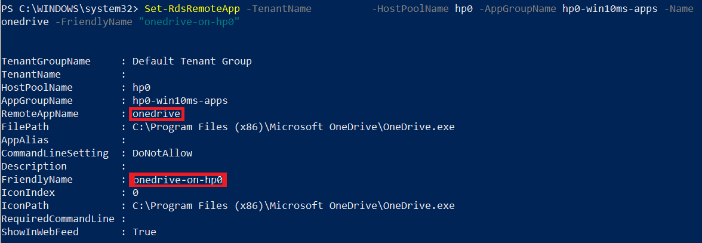

# Customize Feed for Windows Virtual Desktop Users

First, [download and import the Windows Virtual Desktop PowerShell module](https://docs.microsoft.com/powershell/windows-virtual-desktop/overview) to use in your PowerShell session if you haven't already.

## Configure a RemoteApp

The default FriendlyName for a RemoteApp is same as the Name. Configuring this change would allow Users to easily identify a specific application.

To retrieve the RemoteApp, run the following PowerShell cmdlet:

```powershell
Get-RdsRemoteApp -TenantName <tenantname> -HostPoolName <hostpoolname> -AppGroupName <appgroupname>
```
        

To assign a friendly name to a RemoteApp, run the following PowerShell cmdlet:

```powershell
Set-RdsRemoteApp -TenantName <tenantname> -HostPoolName <hostpoolname> -AppGroupName <appgroupname> -Name <existingappname> -FriendlyName <newfriendlyname>
```
        

## Configure a RemoteDesktop

The default FriendlyName for a RemoteDesktop is same as the Name. Configuring this change would allow Users to easily identify a specific desktop.

To retrieve the RemoteDesktop, run the following PowerShell cmdlet:

```powershell
Get-RdsRemoteDesktop -TenantName <tenantname> -HostPoolName <hostpoolname> -AppGroupName <appgroupname>
```
        

To assign a friendly name to a RemoteDesktop, run the following PowerShell cmdlet:

```powershell
Set-RdsRemoteDesktop -TenantName <tenantname> -HostPoolName <hostpoolname> -AppGroupName <appgroupname> -FriendlyName <newfriendlyname>
```
        