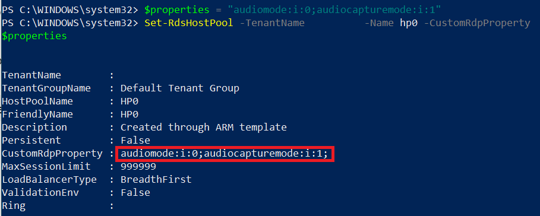

# Customize RDP Properties for Windows Virtual Desktop

Customizing Client Redirection RDP properties such as Audio Redirection, Printer Redirection etc., allows you to deliver an optimal experience for your Users based on their needs. This can be accomplished in Windows Virtual Desktop using the **-customRdpProperty** parameter in the **Set-RdsHostPool** cmdlet.

Refer [Remote Desktop RDP file settings](https://docs.microsoft.com/en-us/windows-server/remote/remote-desktop-services/clients/rdp-files) for a full list of supported values.

First, [download and import the Windows Virtual Desktop PowerShell module](https://docs.microsoft.com/powershell/windows-virtual-desktop/overview) to use in your PowerShell session if you haven't already.

## Customize single RDP Property

To customize a single RDP property, run the following PowerShell cmdlet:

```powershell
Set-RdsHostPool -TenantName <tenantname> -Name <hostpoolname> -CustomRdpProperty "<property>"
```
        

## Customize multiple RDP Properties

To customize multiple RDP Properties at once, run the following PowerShell script:

```powershell
$properties="<property1>","<property2>",..,"<propertyn>"
ForEach($property in $properties){
    Set-RdsHostPool -TenantName <tenantname> -Name <hostpoolname> -CustomRdpProperty $property
}
```
        