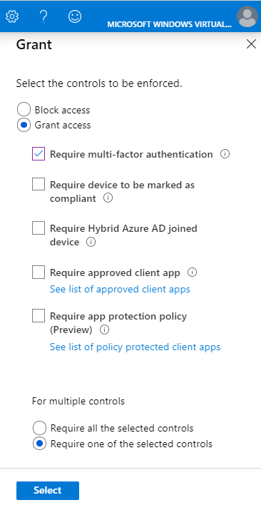
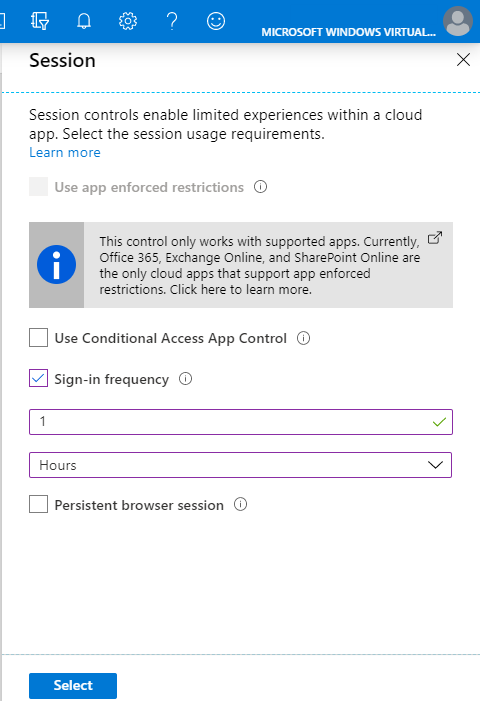

# Set up Azure Multi-Factor Authentication

The Windows client for Windows Virtual Desktop is an excellent option for integrating Windows Virtual Desktop with your local machine. However, when you configure your Windows Virtual Desktop account into the Windows Client, there are certain measures you'll need to take to keep yourself and your users safe.

When you first sign in, the client asks for your username, password, and Azure MFA. After that, the next time you sign in, the client will remember your token from your Azure Active Directory (AD) Enterprise Application. When you select **Remember me**, your users can sign in after restarting the client without needing to reenter their credentials.

While remembering credentials is convenient, it can also make deployments on Enterprise scenarios or personal devices less secure. To protect your users, you'll need to make sure the client keeps asking for Azure Multi-Factor Authentication (MFA) credentials. This article will show you how to configure the Conditional Access policy for Windows Virtual Desktop to enable this setting.

## Prerequisites

Here's what you'll need to get started:

- Assign all your users one of the following licenses:
  - Microsoft 365 E3 or E5
  - Azure Active Directory Premium P1 or P2
  - Enterprise Mobility + Security E3 or E5
- An Azure Active Directory group with your users assigned as group members
- Enable Azure MFA for all your users

>[!NOTE]
>The following setting also applies to the [Windows Virtual Desktop web client](https://rdweb.wvd.microsoft.com/webclient/index.html).

## Opt in to the Conditional Access policy

1. Open **Azure Active Directory**.

2. Go to the **All applications** tab. In the "Application type" drop-down menu, select **Enterprise Applications**, then search for **Windows Virtual Desktop Client**.

    

3. Select **Conditional Access**.

    

4. Select **+ New policy**.

   

5. Enter a name for the rule, then select the name of the group you created in the prerequisites.

6. Select **Select**, then select **Done**.

7. Next, open **Cloud Apps or actions**.

8. On the **Select** panel, select both the **Windows Virtual Desktop** and **Windows Virtual Desktop Client** Enterprise applications.

    >[!NOTE]
    >Make sure you add both Windows Virtual Desktop Enterprise applications. If you only add the client app, the instructions won't work.

9. Select **Select**, then select **Done**.

10. Next, select **Cloud apps or actions** 

11. Select **Require multi-factor authentication**, then select at least one of the **selected controls**.

12. Select **Select**, then select **Done**.

13. Select **Grant**.

14. Select **Require multi-factor authentication**.
   
    

    >[!NOTE]
    >If you have MDM-enrolled devices in your organization and don't want them to show the MFA prompt, you can also select **Require device to be marked as compliant**.

15. Select **Session**.

16. Set the **Sign-in frequency** to **Active**, then change its value to **1 Hours**.

    
   
    >[!NOTE]
    >Active sessions in your Windows Virtual Desktop environment will continue to work as you change the policy. However, if you disconnect or sign off, you'll need to provide your credentials again after 60 minutes. As you change the settings, you can extend the timeout period as much as you want (as long as it aligns with your organization's security policy).
    >
    >The default setting is a rolling window of 90 days, which means the client will ask users to sign in again when they try to access a resource after being inactive on their machine for 90 days or longer.

17. Enable the policy.

18. Select **Create** to confirm the policy.

You're all done! Feel free to test the policy to make sure your allow list works as intended.
