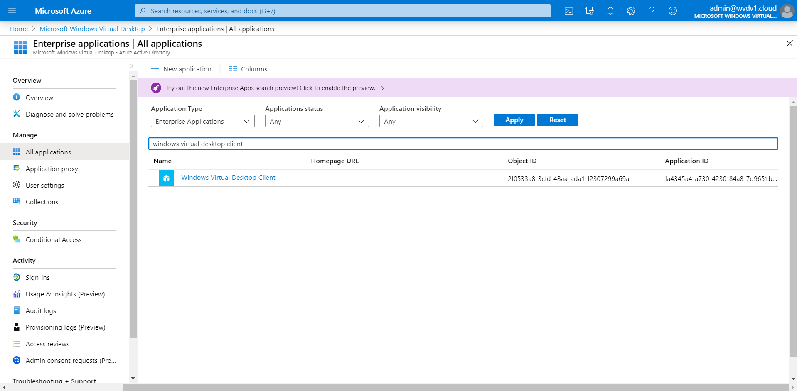
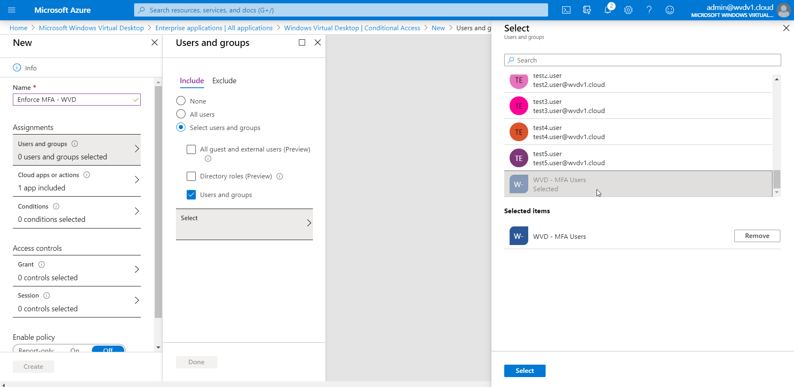
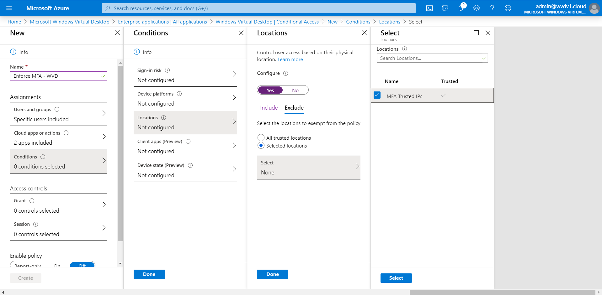
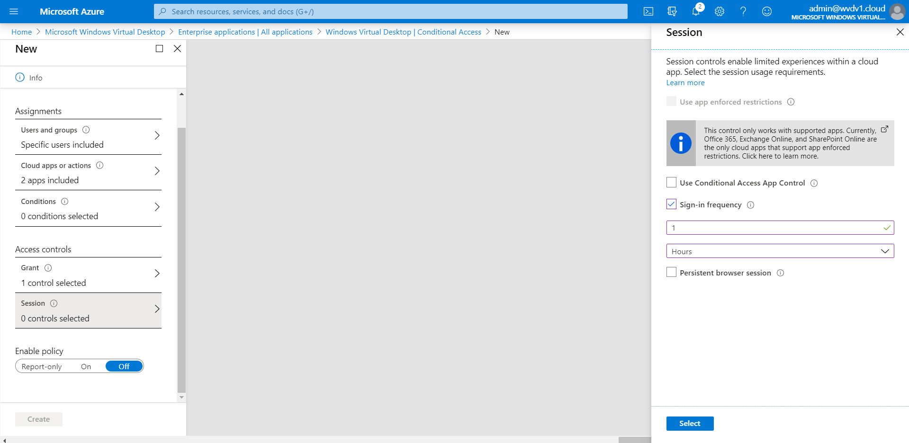
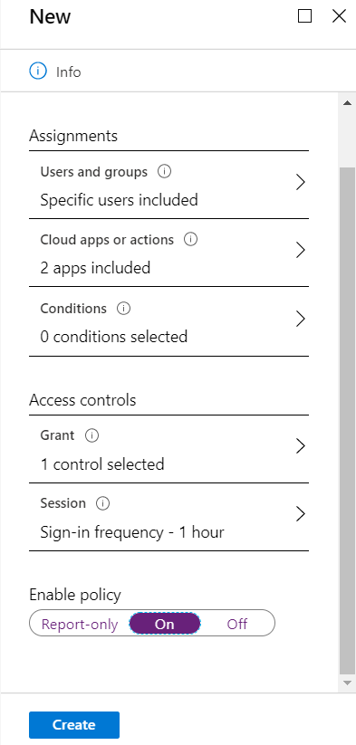

# Set up and enforce Azure multi-factor authentication

The Windows client for Windows Virtual Desktop is an excellent option for integrating Windows Virtual Desktop with your local machine. However, when you configure your Windows Virtual Desktop account into the Windows Client. When you first sign in, the client asks for your username, password, and Azure MFA. After that, the next time you sign in, the client will remember your token from your Azure AD Enterprise Application. When you select **Remember me**, your users can sign in after restarting the client without needing to reenter their credentials.

While this is great for some scenarios, in Enterprise scenarios or personal devices, this could make your deployment less secure. To protect your users, you'll need to make sure the client keeps asking for Azure multi-factor authentication credentials. This article will show you how to enable this feature by opting in to the Conditional Access policy for Windows Virtual Desktop.

## Prerequisites

Before you start, make sure you have these things:

- One of the following licenses:
  - Enterprise Mobility and Security E5
  - Azure Active Directory Premium P2
- Create Azure Active Directory group and make your users group members

## Opt in to the Conditional Access policy

1. Open **Azure Active Directory**.

2. Go to **Enterprise Applications** > **Windows Virtual Desktop Client**.

3. Select **Conditional Access**.

4. Select **+ New policy**.

5. Enter a name for the rule, then select the name of the group you created in the prerequisites. In the following example, the group's name is "WVD - MFA Users."

6. Select **Select**, then select **Done**.

7. Next, open **Cloud Apps or actions**.

8. On the **Select** panel, select both the **Windows Virtual Desktop** and **Windows Virtual Desktop Client** Enterprise applications.

9. Finally, select **Select**, then select **Done**.

## Whitelist users with a filter for trusted locations

After you set up your Selective Access policy, you have the option to create a filter for policy enforcement based on your company's public IP address. With this filter, users working in trusted locations can access your Windows Virtual Desktop environment without multi-factor authentication. However, when they switch to a network outside of a trusted location, they'll get the multi-factor authentication prompt again.

>[!NOTE]
>The following setting also applies to the [Windows Virtual Desktop web client](https://rdweb.wvd.microsoft.com/webclient/index.html).

To set up a filter:

1. Enter the public IP addresses that you want to whitelist from Azure MFA enforcement – in the - **trusted ips** - section.

2. Go back to the Selective Access rule page.

3. Select **MFA Trusted IPs**.

**Select** (at least) – Require multi-factor authentication – and – **require one** of the **selected controls**.

Click on **Select** and **Done**

Click on **Grant**

**Active** the **Require multi-factor authentication** setting

>[!NOTE]
>If some of your users in your organization run the Windows Client from a Azure AD Domain Joined (AADJ) compliant computer account (Intune managed) and don't want to enforce MFA for those users – please activate then as well the – Require device to be marked as compliant – to avoid this for AADJ compliant devices.

Click on **Session**

**Activate** the **Sign-in frequency** setting – set it on - **1 Hours.**

>[!NOTE]
>Active sessions to your Windows Virtual Desktop environment will continue to work. However, if you disconnect or logoff – you will need to provide MFA again after 60 minutes. You can set it to 1 day to extent this time-out. It's what you prefer – and what aligns with your security policy!*

*The default setting is a rolling window of 90 days, i.e. users will be asked to re-authenticate on the first attempt to access a resource after being inactive on their machine for 90 days or longer.*

**Enable** the Policy

**Confirm** the settings – click on **Create**

The **Conditional Access** rule **is created** – let's test the rule!

