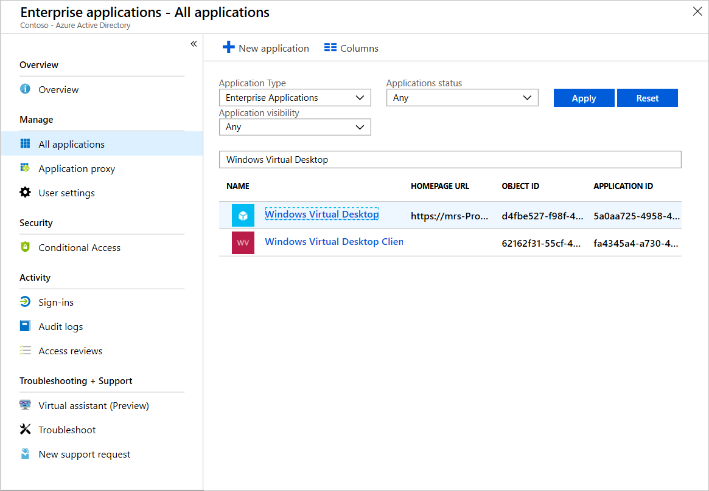
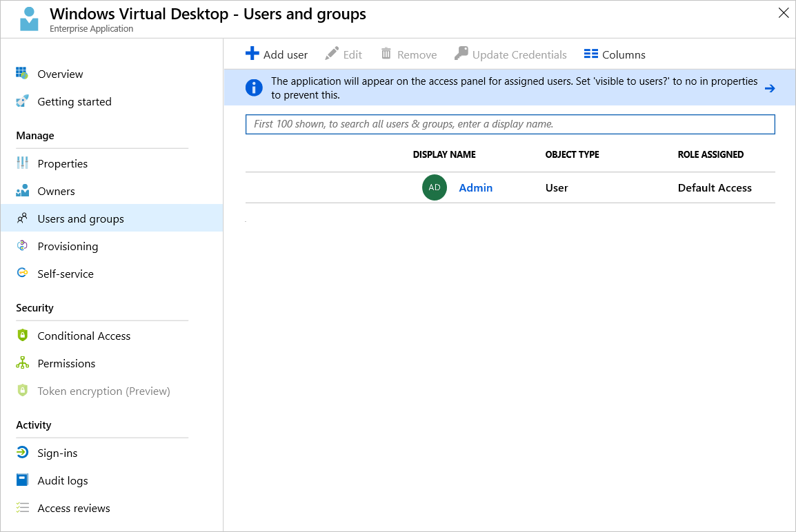
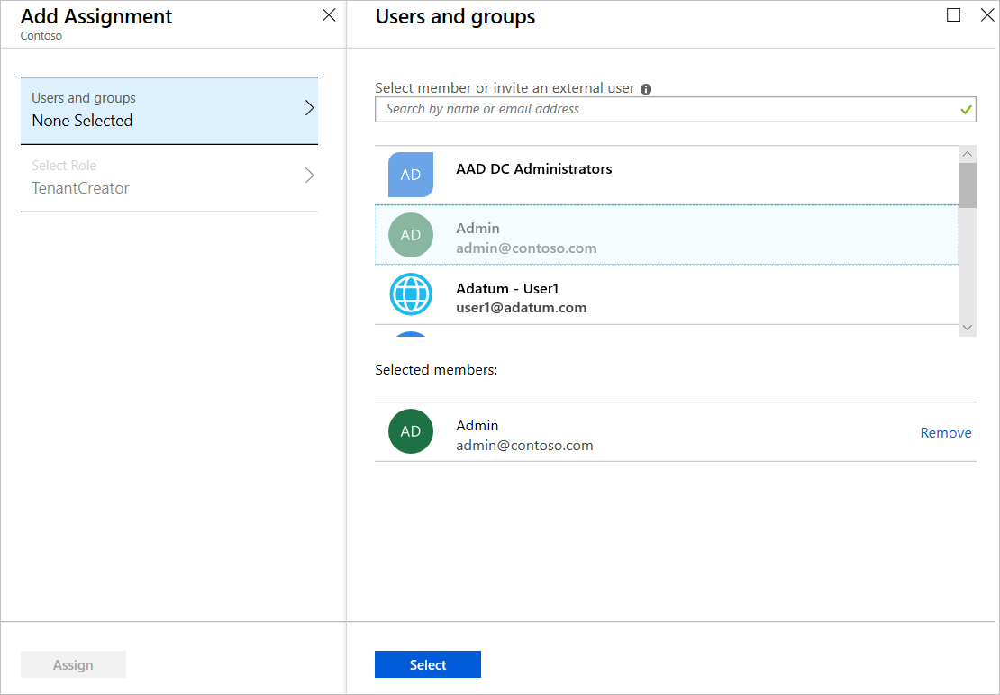
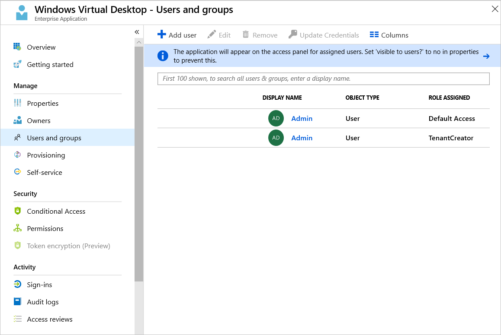

# Tutorial: Create a tenant in Windows Virtual Desktop Preview

Creating a tenant in Windows Virtual Desktop Preview is the first step towards building out your desktop virtualization solution. A tenant is a group of one or more host pools. Each host pool consists of multiple session hosts, running as virtual machines in Azure and registered to the Windows Virtual Desktop service. Each host pool also consists of one or more app groups that are used to publish remote desktop and remote application resources to users. With a tenant, you can build out host pools, create app groups, assign users, and make connections through the service.

In this tutorial, learn how to:

> [!div class="checklist"]
> * Grant Azure Active Directory permissions to the Windows Virtual Desktop service.
> * Assign the TenantCreator application role to a user in your Azure Active Directory tenant.
> * Create a Windows Virtual Desktop tenant.

Here's what you need to set up your Windows Virtual Desktop tenant:

* The [Azure Active Directory](https://azure.microsoft.com/services/active-directory/) tenant ID for Windows Virtual Desktop users.
* A global administrator account within the Azure Active Directory tenant.
   * This also applies to Cloud Solution Provider (CSP) organizations creating a Windows Virtual Desktop tenant for their customers. If you are a CSP organization, you must be able to sign in as global administrator of the customer's Azure Active Directory.
* An Azure subscription ID

## Grant Azure Active Directory permissions to the Windows Virtual Desktop Preview service

If you have already granted permissions to Windows Virtual Desktop for this Azure Active Directory, skip this section.

Granting permissions to the Windows Virtual Desktop service lets it query your Azure Active Directory for administrative and end-user tasks.

To grant the service permissions:

1. Open a browser and connect to the [Windows Virtual Desktop consent page](https://rdweb.wvd.microsoft.com).
2. For **Consent Option** > **Server App**, enter the Azure Active Directory tenant name or Directory ID, then select **Submit**.
        For Cloud Solution Provider customers, the ID is the customer's Microsoft ID from the Partner Portal. For Enterprise customers, the ID is located under **Azure Active Directory** > **Properties** > **Directory ID**.
3. Sign in to the Windows Virtual Desktop consent page with a global administrator account. For example, if you were with the Contoso organization, your account might be admin@contoso.com or admin@contoso.onmicrosoft.com.  
4. Select **Accept**.
5. Wait for one minute.
6. Navigate back to the [Windows Virtual Desktop consent page](https://rdweb.wvd.microsoft.com).
7. Go to **Consent Option** > **Client App**, enter the same Azure Active Directory tenant name or Directory ID, then select **Submit**.
8. Sign in to the Windows Virtual Desktop consent page as global administrator like you did back in step 3.
9. Select **Accept**.

## Assign the TenantCreator application role to a user in your Azure Active Directory tenant

Assigning an Azure Active Directory user the TenantCreator application role allows that user to create a Windows Virtual Desktop tenant associated with the Azure Active Directory. You'll need to use your global administrator account to assign the TenantCreator role.

To assign the TenantCreator application role with your global administrator account:

1. Open a browser and connect to the [Azure Active Directory portal](https://aad.portal.azure.com) with your global administrator account.
   - If you're working with multiple Azure Active Directory tenants, it's best practice to open a private browser session and copy and paste URLs into the address.
2. Select **Enterprise applications**, search for **Windows Virtual Desktop**. You'll see the two applications you provided consent for in the previous section. Of these two apps, select **Windows Virtual Desktop**.
        
3. Select **Users and groups**. You may see that the administrator who granted consent to the application is already listed with the **Default Access** role assigned. This is not enough to create a Windows Virtual Desktop tenant. Continue following these instructions to add the **TenantCreator** role to a user.
        
4. Select **Add user**, then **Users and groups** in the **Add Assignment** blade.
5. Search for a user account that will create your Windows Virtual Desktop tenant.
   - For simplicity, this can be the global administrator account.
        
        
        >[!NOTE]
        > You must select a user (or a group containing a user) that is sourced from this Azure Active Directory. You cannot choose a guest (B2B) user or a service principal.

6. Select the user account, click the **Select** button, and then select **Assign**.
7. On the **Windows Virtual Desktop - Users and groups** page, verify that you see a new entry with the **TenantCreator** role assigned to the user who will create the Windows Virtual Desktop tenant.
        

## Create a Windows Virtual Desktop Preview tenant

Now that you've granted the Windows Virtual Desktop service permissions to query the Azure Active Directory and assigned the TenantCreator role to a user account, you can create a Windows Virtual Desktop tenant.

First, [download and import the Windows Virtual Desktop module](https://docs.microsoft.com/powershell/windows-virtual-desktop/overview) to use in your PowerShell session if you haven't already.

Sign in to Windows Virtual Desktop using the TenantCreator user account with this cmdlet:

```powershell
Add-RdsAccount -DeploymentUrl “https://rdbroker.wvd.microsoft.com”
```

After that, create a new Windows Virtual Desktop tenant associated with the Azure Active Directory tenant:

```powershell
New-RdsTenant -Name <TenantName> -AadTenantId <DirectoryID> -AzureSubscriptionId <SubscriptionID>
```

The bracketed values should be replaced with values relevant to your organization and tenant. For example, let's say you're the Windows Virtual Desktop TenantCreator for the Contoso organization. The cmdlet you'd run would look like this:

```powershell
New-RdsTenant -Name Contoso -AadTenantId 00000000-1111-2222-3333-444444444444 -AzureSubscriptionId 55555555-6666-7777-8888-999999999999
```

## Next steps

Once you've created your tenant, you'll need to create a service principal in Azure Active Directory and assign it a role within Windows Virtual Desktop. The service principal will allow you to successfully deploy the Windows Virtual Desktop Azure Marketplace offering to create a host pool. To create  more about host pools, continue to the tutorial for creating a host pool in Windows Virtual Desktop.

> [!div class="nextstepaction"]
> [Create service principals and role assignments with PowerShell](./create-service-principal-role-powershell.md)
