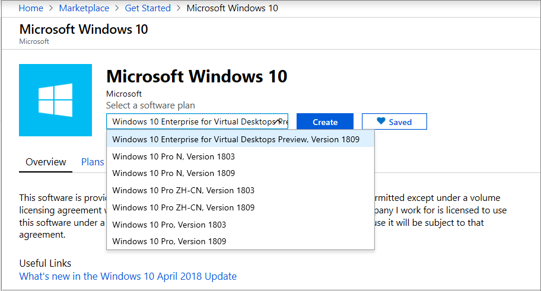
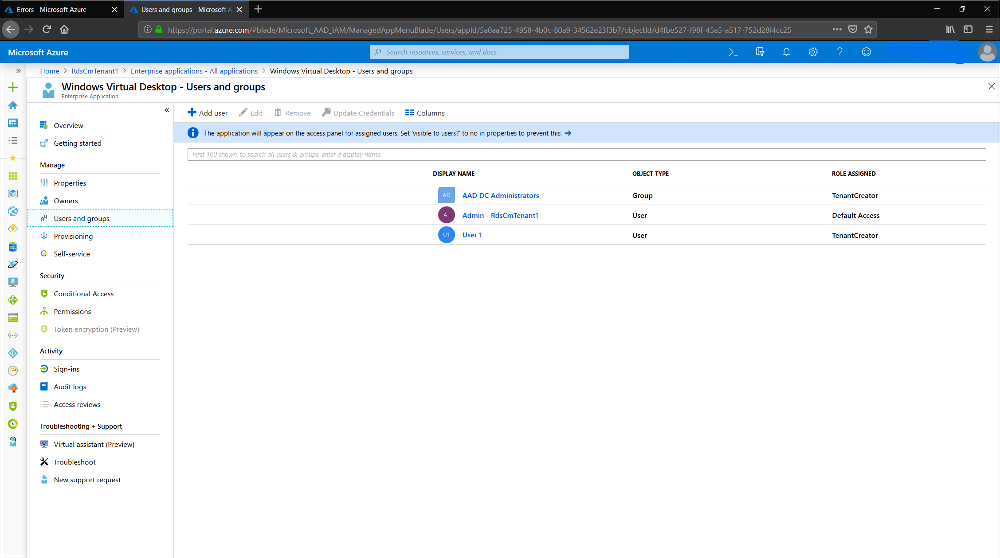
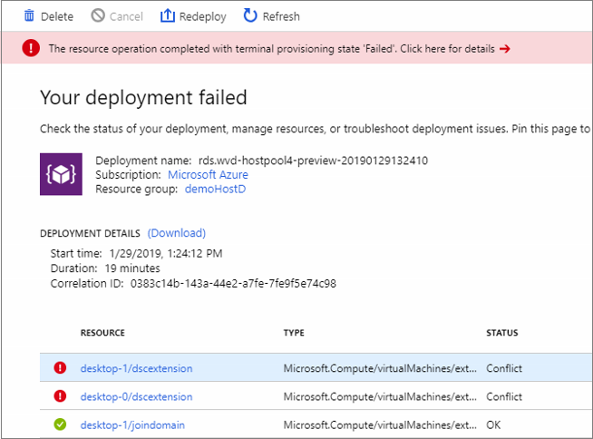
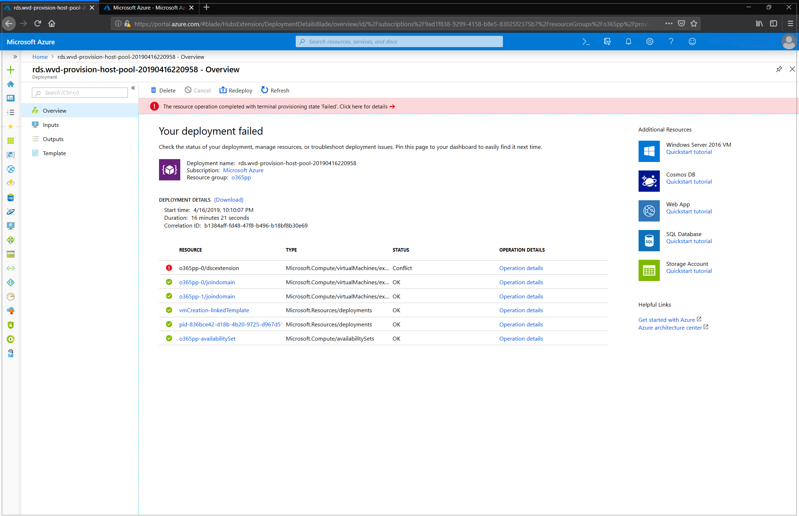
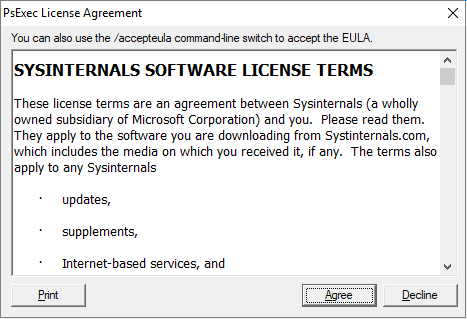
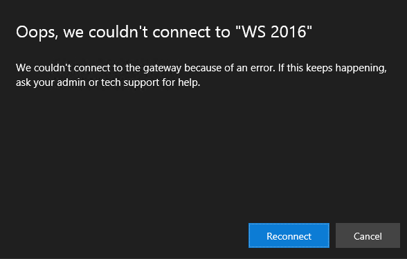

# Windows Virtual Desktop Troubleshooting Guide

This article describes common issues you come across when setting up Windows Virtual Desktop and provides ways to troubleshoot the issues.

## Escalation tracks

Use the following table to identify and resolve issues you may encounter when setting up a tenant environment using Remote Desktop client.

| **Issue**                                                            | **Suggested Solution**  |
|----------------------------------------------------------------------|-------------------------------------------------|
| Creating a Tenant                                                    | If there's an Azure outage, contact [Azure Support](https://azure.microsoft.com/support/options/); otherwise contact **Remote Desktop Services/Windows Virtual Desktop support**.|
| Accessing Marketplace templates in Azure portal       | If there's an Azure outage, contact [Azure Support](https://azure.microsoft.com/support/options/). <br> <br> Azure Marketplace Windows Virtual Desktop templates are freely available.|
| Accessing Azure Resource Manager templates from GitHub                                  | If the issue isn't covered in [Creating Windows Virtual Desktop session host VMs](#creating-windows-virtual-desktop-session-host-vms), contact the [GitHub support team](https://github.com/contact). <br> <br> If the error occurs after accessing the template in GitHub, contact [Azure Support](https://azure.microsoft.com/support/options/).|
| Session host pool Azure Virtual Network (VNET) and Express Route settings               | Contact **Azure Support (Networking)**. |
| Session host pool Virtual Machine (VM) creation when Azure Resource Manager templates provided with Windows Virtual Desktop aren't being used | Contact **Azure Support (Compute)**. <br> <br> For issues with the Azure Resource Manager templates that are provided with Windows Virtual Desktop, see [Creating Windows Virtual Desktop tenant](#creating-windows-virtual-desktop-tenant). |
| Managing Windows Virtual Desktop session host environment from the Azure management portal    | Contact **Azure Support**. <br> <br> For management issues when using Remote Desktop Services/Windows Virtual Desktop PowerShell, troubleshoot using [Management with PowerShell](#management-with-powershell) or contact the **Remote Desktop Services/Windows Virtual Desktop support team**. |
| Managing Windows Virtual Desktop configuration tied to host pools and application groups (appgroups)      | Troubleshoot using [Management with PowerShell](#management-with-powershell), or contact the **Remote Desktop Services/Windows Virtual Desktop support team**. <br> <br> If issues are tied to the sample graphical user interface (GUI), reach out to the Yammer community.|
| Remote desktop clients malfunction on start                                                 | Troubleshoot using [Client connection issues](#client-connection-issues) and if it doesn't resolve the issue, contact **Remote Desktop Services/Windows Virtual Desktop support team**.  <br> <br> If it's a network issue, your users need to contact their network administrator. |
| Connected but no feed                                                                 | Troubleshoot using [User connects but nothing is displayed (no feed)](#user-connects-but-nothing-is-displayed-no-feed). <br> <br> If your users have been assigned to an appgroup, escalate to the **Remote Desktop Services/Windows Virtual Desktop support team**. |
| Feed discovery problems due to the network                                            | Your users need to contact their network administrator. |
| Connecting clients                                                                    | Troubleshoot using [Session host VM configuration](#session-host-vm-configuration) and [Client connection issues](#client-connection-issues). |
| Responsiveness of remote applications or desktop                                      | If issues are tied to a specific application or product, contact the team responsible for that product. |
| Licensing messages or errors                                                          | If issues are tied to a specific application or product, contact the team responsible for that product. |

## Setup issues

This section covers potential issues during the initial setup of the Windows Virtual Desktop tenant and the related session host pool infrastructure.

### Acquiring the Windows 10 Enterprise multi-session image

To use the Windows 10 Enterprise multi-session image, go to the Azure Marketplace, select **Get Started** > **Microsoft Windows** 10 > and [Windows 10 Enterprise for Virtual Desktops Preview, Version 1809](https://azuremarketplace.microsoft.com/marketplace/apps/microsoftwindowsdesktop.windows-10?tab=PlansAndPrice).



### Creating Windows Virtual Desktop tenant

This section covers potential issues when creating the Windows Virtual Desktop tenant.

**Error:** The user isn't authorized to query the management service.


Example of raw error:

```Error
New-RdsTenant : User isn't authorized to query the management service.
ActivityId: ad604c3a-85c6-4b41-9b81-5138162e5559
Powershell commands to diagnose the failure:
Get-RdsDiagnosticActivities -ActivityId ad604c3a-85c6-4b41-9b81-5138162e5559
At line:1 char:1
+ New-RdsTenant -Name "testDesktopTenant" -AadTenantId "01234567-89ab-c ...
+ ~~~~~~~~~~~~~~~~~~~~~~~~~~~~~~~~~~~~~~~~~~~~~~~~~~~~~~~~~~~~~~~~~~~~~
    + CategoryInfo          : FromStdErr: (Microsoft.RDInf...nt.NewRdsTenant:NewRdsTenant) [New-RdsTenant], RdsPowerSh
   ellException
    + FullyQualifiedErrorId : UnauthorizedAccess,Microsoft.RDInfra.RDPowershell.Tenant.NewRdsTenant
```

**Cause:** The user who's signed in hasn't been assigned the TenantCreator role in their Azure Active Directory.

**Fix:** Follow the instructions in [Assign the TenantCreator application role to a user in your Azure Active Directory tenant](https://docs.microsoft.com/en-us/azure/virtual-desktop/tenant-setup-azure-active-directory#assign-the-tenantcreator-application-role-to-a-user-in-your-azure-active-directory-tenant). After completing the steps, you'll have a user assigned to the TenantCreator role.



### Creating Windows Virtual Desktop session host VMs

Session host VMs can be created in several ways, but Remote Desktop Services/Windows Virtual Desktop teams only support VM provisioning issues related to the Azure Resource Manager template. The Azure Resource Manager template is available in [Azure Marketplace](https://azuremarketplace.microsoft.com/) and [GitHub](https://github.com/).

### Issues using Windows Virtual Desktop – Provision a host pool Azure Marketplace offering

The Windows Virtual Desktop – Provision a host pool template is available from the Azure Marketplace.

**Error:** When using the link from GitHub, the message “Create a free account" appears.


**Cause 1:** There aren't active subscriptions in the account used to sign in to Azure or the account used doesn't have permissions to view the subscriptions.

**Fix 1:** Sign in with an account that has contributor access (at a minimum) to the subscription where session host VMs are going to be deployed.

**Cause 2:** The subscription being used is part of a Microsoft Cloud Service Provider (CSP) tenant.

**Fix 2:** Go to the GitHub location for **Create and provision new Windows Virtual Desktop host pool** and follow these instructions:

1. Right-click on **Deploy to Azure** and select **Copy link address**.
2. Open **Notepad** and paste the link.
3. Before the \# character, insert the CSP end customer tenant name.
4. Open the new link in a browser and the Azure portal will load the template.

```
    Example: https://portal.azure.com/\<CSP end customer tenant name\>
     \#create/Microsoft.Template/uri/https%3A%2F%2Fraw.githubusercontent.com%2FAzure%
     2FRDS-Templates%2Fmaster%2Fwvd-templates%2FCreate%20and%20provision%20WVD%20host%20pool%2FmainTemplate.json
```

### Azure Resource Manager template and PowerShell Desired State Configuration (DSC) errors

Follow these instructions to troubleshoot unsuccessful deployments of Azure Resource Manager templates and PowerShell DSC.

1. Review errors in the deployment using [View deployment operations with Azure Resource Manager](https://docs.microsoft.com/azure/azure-resource-manager/resource-manager-deployment-operations).
2. If there are no errors in the deployment, review errors in the activity log using [View activity logs to audit actions on resources](https://docs.microsoft.com/azure/azure-resource-manager/resource-group-audit).
3. Once the error is identified, use the error message and the resources in [Troubleshoot common Azure deployment errors with Azure Resource Manager](https://docs.microsoft.com/azure/azure-resource-manager/resource-manager-common-deployment-errors) to address the issue.
4. Delete any resources created during the previous deployment and retry deploying the template again.

**Error:** Your deployment failed….\<hostname\>/joindomain


Example of raw error:

```Error
 {"code":"DeploymentFailed","message":"At least one resource deployment operation failed. Please list deployment operations for details. 
 Please see https://aka.ms/arm-debug for usage details.","details":[{"code":"Conflict","message":"{\r\n \"status\": \"Failed\",\r\n \"error\":
 {\r\n \"code\": \"ResourceDeploymentFailure\",\r\n \"message\": \"The resource operation completed with terminal provisioning state 'Failed'.
 \",\r\n \"details\": [\r\n {\r\n \"code\": \"VMExtensionProvisioningError\",\r\n \"message\": \"VM has reported a failure when processing
 extension 'joindomain'. Error message: \\\"Exception(s) occurred while joining Domain 'diamondsg.onmicrosoft.com'\\\".\"\r\n }\r\n ]\r\n }\r\n}"}]}
```

**Cause 1:** Credentials provided for joining VMs to the domain are incorrect.

**Fix 1:** See the "Incorrect credentials" error in [VMs are not joined to the domain](#vms-are-not-joined-to-the-domain).

**Cause 2:** Domain name doesn't resolve.

**Fix 2:** See the "Domain name doesn't resolve" error in [VMs are not joined to the domain](#vms-are-not-joined-to-the-domain).

**Error:** VMExtensionProvisioningError


**Cause 1:** Transient error with the Windows Virtual Desktop environment.

**Cause 2:** Transient error with connection.

**Fix:** Confirm Windows Virtual Desktop environment is healthy by signing in using PowerShell. Complete the manual VM registration instructions in [Create a host pool with PowerShell](https://docs.microsoft.com/en-us/azure/virtual-desktop/create-host-pools-powershell).

**Error:** The Admin Username specified isn't allowed.


Example of raw error:

```Error
 { "id": "/subscriptions/d2cd2b8a-6d8f-4e4b-85ec-ef98cb93cc76/resourceGroups/demoHostDesktop/providers/Microsoft.
  Resources/deployments/vmCreation-linkedTemplate/operations/76487E2A822284AB", "operationId": "76487E2A822284AB", "properties": { "provisioningOperation":
 "Create", "provisioningState": "Failed", "timestamp": "2019-01-29T20:53:18.904917Z", "duration": "PT3.0574505S", "trackingId":
 "1f460af8-34dd-4c03-9359-9ab249a1a005", "statusCode": "BadRequest", "statusMessage": { "error": { "code": "InvalidParameter", "message":
 "The Admin Username specified is not allowed.", "target": "adminUsername" } }, "targetResource": { "id": "/subscriptions/d2cd2b8a-6d8f-4e4b-85ec-ef98cb93cc76
 /resourceGroups/demoHostDesktop/providers/Microsoft.Compute/virtualMachines/demoHostv2-1", "resourceType": "Microsoft.Compute/virtualMachines", "resourceName": "demoHostv2-1" } }}
```

**Cause:** Password provided contains forbidden substrings (admin, administrator, root).

**Fix:** Update username or use different users.

**Error:** VM has reported a failure when processing extension



Example of raw error:

```Error
{ "id": "/subscriptions/d2cd2b8a-6d8f-4e4b-85ec-ef98cb93cc76/resourceGroups/demoHostD/providers/Microsoft.Resources/deployments/
 rds.wvd-hostpool4-preview-20190129132410/operations/5A0757AC9E7205D2", "operationId": "5A0757AC9E7205D2", "properties":
 { "provisioningOperation": "Create", "provisioningState": "Failed", "timestamp": "2019-01-29T21:43:05.1416423Z",
 "duration": "PT7M56.8150879S", "trackingId": "43c4f71f-557c-4abd-80c3-01f545375455", "statusCode": "Conflict",
 "statusMessage": { "status": "Failed", "error": { "code": "ResourceDeploymentFailure", "message":
 "The resource operation completed with terminal provisioning state 'Failed'.", "details": [ { "code":
 "VMExtensionProvisioningError", "message": "VM has reported a failure when processing extension 'dscextension'. 
 Error message: \"DSC Configuration 'SessionHost' completed with error(s). Following are the first few: 
 PowerShell DSC resource MSFT_ScriptResource failed to execute Set-TargetResource functionality with error message: 
 One or more errors occurred. The SendConfigurationApply function did not succeed.\"." } ] } }, "targetResource": 
 { "id": "/subscriptions/d2cd2b8a-6d8f-4e4b-85ec-ef98cb93cc76/resourceGroups/demoHostD/providers/Microsoft. 
 Compute/virtualMachines/desktop-1/extensions/dscextension",
 "resourceType": "Microsoft.Compute/virtualMachines/extensions", "resourceName": "desktop-1/dscextension" } }}
```

**Cause:** PowerShell DSC extension was not able to get admin access on the VM.

**Fix:** Confirm username and password have administrative access on the virtual machine and run the Azure Resource Manager template again.

**Error:** DeploymentFailed – PowerShell DSC Configuration ‘FirstSessionHost’ completed with Error(s).


Example of raw error:

```Error
{
    "code": "DeploymentFailed",
   "message": "At least one resource deployment operation failed. Please list 
 deployment operations for details. 4 Please see https://aka.ms/arm-debug for usage details.",
 "details": [
         { "code": "Conflict",  
         "message": "{\r\n \"status\": \"Failed\",\r\n \"error\": {\r\n \"code\":
         \"ResourceDeploymentFailure\",\r\n \"message\": \"The resource
         operation completed with terminal provisioning state 'Failed'.\",\r\n
         \"details\": [\r\n {\r\n \"code\":
        \"VMExtensionProvisioningError\",\r\n \"message\": \"VM has
              reported a failure when processing extension 'dscextension'.
              Error message: \\\"DSC Configuration 'FirstSessionHost'
              completed with error(s). Following are the first few:
              PowerShell DSC resource MSFT ScriptResource failed to
              execute Set-TargetResource functionality with error message:
              One or more errors occurred. The SendConfigurationApply
              function did not succeed.\\\".\"\r\n }\r\n ]\r\n }\r\n}"  }

```

**Cause:** PowerShell DSC extension was not able to get admin access on the VM.

**Fix:** Confirm username and password provided have administrative access on the virtual machine and run the Azure Resource Manager template again.

**Error:** DeploymentFailed – InvalidResourceReference.

Example of raw error:

```Error
{"code":"DeploymentFailed","message":"At least one resource deployment operation
failed. Please list deployment operations for details. Please see https://aka.ms/arm-
debug for usage details.","details":[{"code":"Conflict","message":"{\r\n \"status\":
\"Failed\",\r\n \"error\": {\r\n \"code\": \"ResourceDeploymentFailure\",\r\n
\"message\": \"The resource operation completed with terminal provisioning state
'Failed'.\",\r\n \"details\": [\r\n {\r\n \"code\": \"DeploymentFailed\",\r\n
\"message\": \"At least one resource deployment operation failed. Please list
deployment operations for details. Please see https://aka.ms/arm-debug for usage
details.\",\r\n \"details\": [\r\n {\r\n \"code\": \"BadRequest\",\r\n \"message\":
\"{\\r\\n \\\"error\\\": {\\r\\n \\\"code\\\": \\\"InvalidResourceReference\\\",\\r\\n
\\\"message\\\": \\\"Resource /subscriptions/4b46ada1-921a-40e0-a964-
50a4c19530a9/resourceGroups/ernani-wvd-
demo/providers/Microsoft.Network/virtualNetworks/wvd-vnet/subnets/default
referenced by resource /subscriptions/4b46ada1-921a-40e0-a964-
50a4c19530a9/resourceGroups/ernani-wvd-
demo/providers/Microsoft.Network/networkInterfaces/erd. Please make sure that
the referenced resource exists, and that both resources are in the same
region.\\\",\\r\\n\\\"details\\\": []\\r\\n }\\r\\n}\"\r\n }\r\n ]\r\n }\r\n ]\r\n }\r\n}"}]}
```

**Cause:** Part of the resource group name is used for certain resources being created by the template. Due to the name matching existing resources, the template may select an existing resource from a different group.

**Fix:** When running the Azure Resource Manager template to deploy session host VMs, make the first two characters unique for your subscription resource group name.

**Error:** DeploymentFailed – InvalidResourceReference

Example of raw error:

```Error
{"code":"DeploymentFailed","message":"At least one resource deployment operation
failed. Please list deployment operations for details. Please see https://aka.ms/arm-
debug for usage details.","details":[{"code":"Conflict","message":"{\r\n \"status\":
\"Failed\",\r\n \"error\": {\r\n \"code\": \"ResourceDeploymentFailure\",\r\n
\"message\": \"The resource operation completed with terminal provisioning state
'Failed'.\",\r\n \"details\": [\r\n {\r\n \"code\": \"DeploymentFailed\",\r\n
\"message\": \"At least one resource deployment operation failed. Please list
deployment operations for details. Please see https://aka.ms/arm-debug for usage
details.\",\r\n \"details\": [\r\n {\r\n \"code\": \"BadRequest\",\r\n \"message\":
\"{\\r\\n \\\"error\\\": {\\r\\n \\\"code\\\": \\\"InvalidResourceReference\\\",\\r\\n
\\\"message\\\": \\\"Resource /subscriptions/4b46ada1-921a-40e0-a964-
50a4c19530a9/resourceGroups/ernani-wvd-
demo/providers/Microsoft.Network/virtualNetworks/wvd-vnet/subnets/default
referenced by resource /subscriptions/4b46ada1-921a-40e0-a964-
50a4c19530a9/resourceGroups/ernani-wvd-
demo/providers/Microsoft.Network/networkInterfaces/ernani-wvd-demo-0-nic was
not found. Please make sure that the referenced resource exists, and that both
resources are in the same region.\\\",\\r\\n \\\"details\\\": []\\r\\n }\\r\\n}\"\r\n
}\r\n ]\r\n }\r\n ]\r\n }\r\n\
```

**Cause:** This error is because the NIC created with the Azure Resource Manager template has the same name as another NIC already in the VNET.

**Fix:** Use different host prefix.

**Error:** DeploymentFailed – Error downloading.

Example of raw error:

```Error
\\\"The DSC Extension failed to execute: Error downloading
https://catalogartifact.azureedge.net/publicartifacts/rds.wvd-hostpool-3-preview-
2dec7a4d-006c-4cc0-965a-02bbe438d6ff-private-preview-
1/Artifacts/DSC/Configuration.zip after 29 attempts: The remote name could not be
resolved: 'catalogartifact.azureedge.net'.\\nMore information about the failure can
be found in the logs located under
'C:\\\\WindowsAzure\\\\Logs\\\\Plugins\\\\Microsoft.Powershell.DSC\\\\2.77.0.0' on
the VM.\\\"
```

**Cause:** This error is due to a static route, firewall rule, or NSG blocking the download of the zip file tied to the Azure Resource Manager template.

**Fix:** Remove blocking static route, firewall rule, or NSG. Optionally, open the Azure Resource Manager template json file in a text editor, take the link to zip file, and download the resource to an allowed location.

**Error:** The user isn't authorized to query the management service

Example of raw error:

```Error
"response": { "content": { "startTime": "2019-04-01T17:45:33.3454563+00:00", "endTime": "2019-04-01T17:48:52.4392099+00:00", 
"status": "Failed", "error": { "code": "VMExtensionProvisioningError", "message": "VM has reported a failure when processing 
extension 'dscextension'. Error message: \"DSC Configuration 'FirstSessionHost' completed with error(s). 
Following are the first few: PowerShell DSC resource MSFT_ScriptResource failed to execute Set-TargetResource
 functionality with error message: User is not authorized to query the management service.
\nActivityId: 1b4f2b37-59e9-411e-9d95-4f7ccd481233\nPowershell commands to diagnose the failure:
\nGet-RdsDiagnosticActivities -ActivityId 1b4f2b37-59e9-411e-9d95-4f7ccd481233\n 
The SendConfigurationApply function did not succeed.\"." }, "name": "2c3272ec-d25b-47e5-8d70-a7493e9dc473" } } }}
```

**Cause:** The specified Windows Virtual Desktop tenant admin doesn't have a valid role assignment.

**Fix:** The user who created the Windows Virtual Desktop tenant needs to sign in to Windows Virtual Desktop PowerShell and assign the attempted user a role assignment. If you're running the GitHub Azure Resource Manager template parameters, follow these instructions using PowerShell commands:

```PowerShell
Add-RdsAccount -DeploymentUrl “https://rdbroker.wvd.microsoft.com”
Set-RdsContext -Name <Windows Virtual Desktop tenant group name>
New-RdsRoleAssignment -TenantName <Windows Virtual Desktop tenant name> -RoleDefinitionName “RDS Contributor” -SignInName <UPN>
```

**Error:** User requires Azure Multi-Factor Authentication (MFA).



Example of raw error:

```Error
"message": "{\r\n  \"status\": \"Failed\",\r\n  \"error\": {\r\n    \"code\": \"ResourceDeploymentFailure\",\r\n    \"message\": \"The resource operation completed with terminal provisioning state 'Failed'.\",\r\n    \"details\": [\r\n      {\r\n        \"code\": \"VMExtensionProvisioningError\",\r\n        \"message\": \"VM has reported a failure when processing extension 'dscextension'. Error message: \\\"DSC Configuration 'FirstSessionHost' completed with error(s). Following are the first few: PowerShell DSC resource MSFT_ScriptResource  failed to execute Set-TargetResource functionality with error message: One or more errors occurred.  The SendConfigurationApply function did not succeed.\\\".\"\r\n      }\r\n    ]\r\n  }\r\n}"
```

**Cause:** The specified Windows Virtual Desktop tenant admin requires Azure Multi-Factor Authentication (MFA) to sign in.

**Fix:** Create a service principal and assign it a role for your Windows Virtual Desktop tenant by following the steps in [Tutorial: Create service principals and role assignments with PowerShell](https://docs.microsoft.com/azure/virtual-desktop/create-service-principal-role-powershell). After verifying that you can sign in to Windows Virtual Desktop with the service principal, rerun the Azure Marketplace offering or the GitHub Azure Resource Manager template, depending on which method you're using. Follow the instructions below to enter the correct parameters for your method.

If you're running the Azure Marketplace offering, provide values for the following parameters to properly authenticate to Windows Virtual Desktop:

- Windows Virtual Desktop tenant RDS Owner: Service principal
- Application ID: The application identification of the new service principal you created
- Password/Confirm Password: The password secret you generated for the service principal
- Azure AD Tenant ID: The Azure AD Tenant ID of the service principal you created

If you're running the GitHub Azure Resource Manager template, provide values for the following parameters to properly authenticate to Windows Virtual Desktop:

- Tenant Admin user principal name (UPN) or Application ID: The application identification of the new service principal you created
- Tenant Admin Password: The password secret you generated for the service principal
- IsServicePrincipal: **true**
- AadTenantId: The Azure AD Tenant ID of the service principal you created

## Session host VM configuration

Use this section to troubleshoot issues when configuring the session host VMs.

### VMs are not joined to the domain

Follow these instructions if you're having issues joining VMs to the domain.

- Join the VM manually using the process in [Join a Windows Server virtual machine to a managed domain](https://docs.microsoft.com/en-us/azure/active-directory-domain-services/Active-directory-ds-admin-guide-join-windows-vm-portal) or using the [domain join template](https://azure.microsoft.com/en-us/resources/templates/201-vm-domain-join-existing/).
- Try pinging the domain name from command line on VM.
- Review the list of domain join error messages in [Troubleshooting Domain Join Error Messages](https://social.technet.microsoft.com/wiki/contents/articles/1935.troubleshooting-domain-join-error-messages.aspx).

**Error:** Incorrect credentials

**Cause:** There was a typo made when the credentials were entered in the Azure Resource Manager template interface fixes.

**Fix:** Follow these instructions to correct the credentials.

1. Manually add the VMs to a domain.
2. Redeploy once credentials have been confirmed. See [Create a host pool with PowerShell](https://docs.microsoft.com/en-us/azure/virtual-desktop/create-host-pools-powershell).
3. Join VMs to a domain using a template with [Joins an existing Windows VM to AD Domain](https://azure.microsoft.com/en-us/resources/templates/201-vm-domain-join-existing/).

**Error:** Timeout waiting for user input.

**Cause:** The account used to complete the domain join may have multi-factor authentication (MFA).

**Fix:** Follow these instructions to complete the domain join.

1. Temporarily remove MFA for the account.
2. Use a service account.

**Error:** Account used during provisioning not having permissions to complete the operation.

**Cause:** The account being used doesn't have permissions to join VMs to the domain due to compliance and regulations.

**Fix:** Follow these instructions.

1. Use an account that is a member of the Administrator group.
2. Grant the necessary permissions to the account being used.

**Error:** Domain name doesn't resolve

**Cause 1:** VMs are in a resource group that's not associated with the virtual network (VNET) where the domain is located.

**Fix 1:** Create VNET peering between the VNET where VMs were provisioned and the VNET where the domain controller (DC) is running. See [Create a virtual network peering - Resource Manager, different subscriptions](https://docs.microsoft.com/en-us/azure/virtual-network/create-peering-different-subscriptions).

**Cause 2:** When using AadService (AADS), DNS entries have not been set.

**Fix 2:** To set domain services, see [Enable Azure Active Directory Domain Services](https://docs.microsoft.com/en-us/azure/active-directory-domain-services/active-directory-ds-getting-started-dns).

### Windows Virtual Desktop Agent and Windows Virtual Desktop Boot Loader are not installed

The recommended way to provision VMs is using the Azure Resource Manager **Create and provision Windows Virtual Desktop host pool** template. The template automatically installs the Windows Virtual Desktop Agent and Windows Virtual Desktop Agent Boot Loader.

Follow these instructions to confirm the components are installed and to check for error messages.

1. Confirm that the two components are installed by checking in **Control Panel** \>**Programs** \>**Programs and Features**. If **Windows Virtual Desktop Agent** and **Windows Virtual Desktop Agent Boot Loader** are not visible, they aren't installed on the VM.
2. Open **File Explorer** and navigate to **C:\\Windows\\Temp\\scriptlogs.log**. If the file is missing, it indicates that the PowerShell DSC that installed the two components was not able to run in the security context provided.
3. If the file **C:\\Windows\\Temp\\scriptlogs.log** is present, open it and check for error messages.

**Error:** Windows Virtual Desktop Agent and Windows Virtual Desktop Agent Boot Loader are missing. C:\\Windows\\Temp\\scriptlogs.log is also missing.

**Cause 1:** Credentials provided during input for the Azure Resource Manager template were incorrect or permissions were insufficient.

**Fix 1:** Manually add the missing components to the VMs using [Create a host pool with PowerShell](https://docs.microsoft.com/en-us/azure/virtual-desktop/create-host-pools-powershell).

**Cause 2:** PowerShell DSC was able to start and execute but failed to complete as it's not able to sign in to Windows Virtual Desktop and obtain needed information.

**Fix 2:** Confirm the items in the following list.

- Make sure the account doesn't have MFA.
- Confirm that the tenant name is accurate and the tenant exists in Windows Virtual Desktop.
- Confirm the account has at least RDS Contributor permissions.

**Error:** Authentication failed, error in C:\\Windows\\Temp\\scriptlogs.log

**Cause:** PowerShell DSC was able to execute but couldn't connect to Windows Virtual Desktop.

**Fix:** Confirm the items in the following list.

- Manually register the VMs with the Windows Virtual Desktop service.
- Confirm account used for connecting to Windows Virtual Desktop has permissions on the tenant to create host pools.
- Confirm account doesn't have MFA.

### Windows Virtual Desktop Agent is not registering with the Windows Virtual Desktop service

When the Windows Virtual Desktop Agent is first installed on session host VMs (either manually or through the Azure Resource Manager template and PowerShell DSC), it provides a registration token. The following section covers common troubleshooting issues applicable to the Windows Virtual Desktop Agent and the token.

**Error:** The status filed in Get-RdsSessionHost cmdlet shows status as Unavailable.


**Cause:** The agent isn't able to update itself to a new version.

**Fix:** Follow these instructions to manually update the agent.

1. Download a new version of the agent on the session host VM.
2. Launch Task Manager and, in the Service Tab, stop the RDAgentBootLoader service.
3. Run the installer for the new version of the Windows Virtual Desktop Agent.
4. When prompted for the registration token, remove the entry INVALID_TOKEN and press next (a new token isn't required).
5. Complete the installation Wizard.
6. Open Task Manager and start the RDAgentBootLoader service.

**Error:**  Windows Virtual Desktop Agent registry entry IsRegistered shows a value of 0.

**Cause:** Registration token has expired or has been generated with expiration value of 999999.

**Fix:** Follow these instructions to fix the agent registry error.

1. If there's already a registration token, remove it with Remove-RDSRegistrationInfo.
2. Generate new token with Rds-NewRegistrationInfo.
3. Confirm that the -ExpriationHours parameter is set to 72 (max value is 99999).

**Error:** Windows Virtual Desktop agent isn't reporting a heartbeat when running Get-RdsSessionHost

**Cause 1:** RDAgentBootLoader service has been stopped.

**Fix 1:** Launch Task Manager and, if the Service Tab reports a stopped status for RDAgentBootLoader service, start the service.

**Cause 2:** Port 443 may be closed.

**Fix 2:** Follow these instructions to open port 443.

1. Confirm port 443 is open by downloading the PSPing tool from [Sysinternal tools](https://docs.microsoft.com/en-us/sysinternals/downloads/psping).
2. Install PSPing on the session host VM where the agent is running.
3. Open the command prompt as an administrator and issue the command below:

```cmd
psping rdbroker.wvdselfhost.microsoft.com:443
```

4. Confirm that PSPing received information back from the RDBroker:

```
PsPing v2.10 - PsPing - ping, latency, bandwidth measurement utility
Copyright (C) 2012-2016 Mark Russinovich
Sysinternals - www.sysinternals.com
TCP connect to 13.77.160.237:443:
5 iterations (warmup 1) ping test:
Connecting to 13.77.160.237:443 (warmup): from 172.20.17.140:60649: 2.00ms
Connecting to 13.77.160.237:443: from 172.20.17.140:60650: 3.83ms
Connecting to 13.77.160.237:443: from 172.20.17.140:60652: 2.21ms
Connecting to 13.77.160.237:443: from 172.20.17.140:60653: 2.14ms
Connecting to 13.77.160.237:443: from 172.20.17.140:60654: 2.12ms
TCP connect statistics for 13.77.160.237:443:
Sent = 4, Received = 4, Lost = 0 (0% loss),
Minimum = 2.12ms, Maximum = 3.83ms, Average = 2.58ms
```

### Troubleshooting issues with the Windows Virtual Desktop side-by-side stack

The Windows Virtual Desktop side-by-side stack is automatically installed with Windows Server 2019. Use Microsoft Installer (MSI) to install the side-by-side stack on Microsoft Windows Server 2016 or Windows Server 2012 R2. For Microsoft Windows 10, the Windows Virtual Desktop side-by-side stack is enabled with **enablesxstackrs.ps1**.

There are three main ways the side-by-side stack gets installed or enabled on session host pool VMs:

- With the Azure Resource Manager **Create and provision new Windows Virtual Desktop hostpool** template
- By being included and enabled on the master image
- Installed or enabled manually on each VM (or with extensions/PowerShell)

If you're having issues with the Windows Virtual Desktop side-by-side stack, type the **qwinsta** command from the command prompt to confirm that the side-by-side stack is installed or enabled.

The output of **qwinsta** will list **rdp-sxs** in the output if the side-by-side stack is installed and enabled.


Examine the registry entries listed below and confirm that their values match. If registry keys are missing or values are mismatched, follow the instructions in [Create a host pool with PowerShell](https://docs.microsoft.com/en-us/azure/virtual-desktop/create-host-pools-powershell) on how to reinstall the side-by-side stack.

```registry
    HKEY_LOCAL_MACHINE\\SYSTEM\\CurrentControlSet\\Control\\Terminal
    Server\\WinStations\\rds-sxs\\"fEnableWinstation":DWORD=1

    HKEY_LOCAL_MACHINE\\SYSTEM\\CurrentControlSet\\Control\\Terminal
    Server\\ClusterSettings\\"SessionDirectoryListener":rdp-sxs
```

**Error:** O_REVERSE_CONNECT_STACK_FAILURE


**Cause:** The side-by-side stack isn't installed on the session host VM.

**Fix:** Follow these instructions to install the side-by-side stack on the session host VM.

1. Use Remote Desktop Protocol (RDP) to get directly into the session host VM as local administrator.
2. Download and import [the Windows Virtual Desktop PowerShell module](https://docs.microsoft.com/powershell/windows-virtual-desktop/overview) to use in your PowerShell session if you haven't already.
3. Install the side-by-side stack using [Create a host pool with PowerShell](https://docs.microsoft.com/en-us/azure/virtual-desktop/create-host-pools-powershell).

### How to fix a Windows Virtual Desktop side-by-side stack that malfunctions

There are known circumstances that can cause the side-by-side stack to malfunction:

- Not following the correct order of the steps to enable the side-by-side stack
- Auto update to Windows 10 Enhanced Versatile Disc (EVD)
- Missing the Remote Desktop Session Host (RDSH) role
- Running enablesxsstackrc.ps1 multiple times
- Running enablesxsstackrc.ps1 in an account that doesn't have local admin privileges

The instructions in this section can help you uninstall the Windows Virtual Desktop side-by-side stack. Once you uninstall the side-by-side stack, go to “Register the VM with the Windows Virtual Desktop host pool” in [Create a host pool with PowerShell](https://docs.microsoft.com/en-us/azure/virtual-desktop/create-host-pools-powershell) to reinstall the side-by-side stack.

The VM used to run remediation must be on the same subnet and domain as the VM with the malfunctioning side-by-side stack.

Follow these instructions to run remediation from the same subnet and domain:

1. Connect with standard Remote Desktop Protocol (RDP) to the VM from where fix will be applied.
2. Download PsExec from https://docs.microsoft.com/en-us/sysinternals/downloads/psexec.
3. Unzip the downloaded file.
4. Start command prompt as local administrator.
5. Navigate to folder where PsExec was unzipped.
6. From command prompt, use the following command:

```cmd
        psexec.exe \\<VMname> cmd
```
>[!Note]
>VMname is the machine name of the VM with the malfunctioning side-by-side stack.

7. Accept the PsExec License Agreement by clicking Agree.



>[!Note]
>This dialog will show up only the first time PsExec is run.

8. After the command prompt session opens on the VM with the malfunctioning side-by-side stack, run qwinsta and confirm that an entry named rdp-sxs is available. If not, a side-by-side stack isn't present on the VM so the issue isn't tied to the side-by-side stack.


9. Run the following command, which will list Microsoft components installed on the VM with the malfunctioning side-by-side stack.

```cmd
    wmic product get name
```

10. Run the command below with product names from step above.

```cmd
    wmic product where name="<Remote Desktop Services Infrastructure Agent>" call uninstall
```

11. Uninstall all products that start with “Remote Desktop.”

12. After all Windows Virtual Desktop components have been uninstalled, follow the instructions for your operating system:

- If your operating system is Windows Server, restart the VM that had the malfunctioning side-by-side stack (either with Azure portal or from the PsExec tool).
- If your operating system is Microsoft Windows 10, continue with these instructions:

1. From the VM running PsExec, open File Explorer and copy disablesxsstackrc.ps1 to the system drive of the VM with the malfunctioned side-by-side stack.

```
        \\<VMname>\c$\
```

>[!NOTE]
>VMname is the machine name of the VM with the malfunctioning side-by-side stack.

2. The recommended process: from the PsExec tool, start PowerShell and navigate to the folder from the previous step and run disablesxsstackrc.ps1. Alternatively, you can run the following cmdlets:

```PowerShell
        Remove-ItemProperty -Path "HKLM:\SYSTEM\CurrentControlSet\Control\Terminal Server\ClusterSettings" -Name "SessionDirectoryListener" -Force
        Remove-Item -Path "HKLM:\SYSTEM\CurrentControlSet\Control\Terminal Server\WinStations\rdp-sxs" -Recurse -Force
        Remove-ItemProperty -Path "HKLM:\SYSTEM\CurrentControlSet\Control\Terminal Server\WinStations" -Name "ReverseConnectionListener" -Force
```

3. When the cmdlets are done running, restart the VM with the malfunctioning side-by-side stack.

## Client connection issues

If you are having client connection issues, use the following troubleshooting information.

### Can't open web client

Confirm there is internet connectivity by opening another web site; for example, [www.Bing.com](https://www.bing.com).

Use **nslookup** to confirm DNS can resolve the FQDN:

```cmd
nslookup rdweb.wvd.microsoft.com
```

Try connecting with another client, like Remote Desktop client for Windows 7 or Windows 10.

**Error:** Opening other site fails.

**Cause:** Network issues and/or outages.

**Fix:** Contact network support.

**Error:** Nslookup cannot resolve the name.

**Cause:** Network issues and/or outages.

**Fix:** Contact network support

**Error:** Other clients can connect.

**Cause:** The browser isn't behaving as expected and stopped working.

**Fix:** Follow these instructions to troubleshoot the browser.

1. Restart browser.
2. Clear browser cookies. See [How to delete cookie files in Internet Explorer](https://support.microsoft.com/en-us/help/278835/how-to-delete-cookie-files-in-internet-explorer).
3. Clear browser cache. See [clear browser cache for your browser](https://binged.it/2RKyfdU).
4. Open browser in Private mode.

### Web client stops responding or disconnects

Try connecting using another browser or client.

**Error:** Other browsers and clients also malfunction or fail to open.

**Cause:** Network and/or operation system issues or outages.

**Fix:** Contact support teams.

### Web client keeps prompting for credentials

If the Web client keeps prompting for credentials, follow these instructions.

1. Confirm web client URL is correct.
2. Confirm that credentials are for the Windows Virtual Desktop environment tied to the URL.
3. Clear browser cookies. See [How to delete cookie files in Internet Explorer](https://support.microsoft.com/en-us/help/278835/how-to-delete-cookie-files-in-internet-explorer).
4. Clear browser cache. See [Clear browser cache for your browser](https://binged.it/2RKyfdU).
5. Open browser in Private mode.

### Remote Desktop client for Windows 7 or Windows 10 stops responding or cannot be opened

Use the following PowerShell cmdlets to clean up OOB client registries.

```PowerShell
Remove-ItemProperty 'HKCU:\Software\Microsoft\Terminal Server Client\Default' - Name FeedURLs

#Remove RdClientRadc registry key
Remove-Item 'HKCU:\Software\Microsoft\RdClientRadc' -Recurse

#Remove all files under %appdata%\RdClientRadc
Remove-Item C:\Users\pavithir\AppData\Roaming\RdClientRadc\* -Recurse
```

Navigate to **%AppData%\\RdClientRadc\\** and delete all content.

Uninstall and reinstall Remote Desktop client for Windows 7 and Windows 10.

### Troubleshooting end-user connectivity

Sometiems users can access their feed and local resources, but still have configuration, availability, or performance issues that prevent them from accessing remote resources. The user gets messages similar to these:




Follow these general troubleshooting instructions for common error codes.

1. Confirm user name and time when issue was experienced.
2. Open **PowerShell** and establish connection to the Windows Virtual Desktop tenant where the issue was reported.
3. Confirm connection to the correct tenant with **Get-RdsTenant.**
4. If needed, set the tenant group context with **Set-RdsContext –TenantGroupt\<TenantGroup\>**.
5. Using **Get-RdsHostPool** and **Get-RdsSessionHost** cmdlets, confirm that troubleshooting is being done on the correct host pool.
6. Execute the command below to get a list of all failed activities of type connection for the specified time window:

```cmd
 Get-RdsDiagnosticActivities -TenantName <TenantName> -username <UPN> -StartTime
 "11/21/2018 1:07:03 PM" -EndTime "11/21/2018 1:27:03 PM" -Outcome Failure -ActivityType Connection
```

7. Using the **ActivityId** from the previous cmdlet output, run the command below:

```
(Get-RdsDiagnosticActivities -TenantName $tenant -ActivityId <ActivityId> -Detailed).Errors
```

8. The command produces output of the type show below. Use **ErrorCodeSymbolic** and **ErrorMessage** to troubleshoot the root cause.

```
ErrorSource       : <Source>
ErrorOperation    : <Operation>
ErrorCode         : <Error code>
ErrorCodeSymbolic : <Error code string>
ErrorMessage      : <Error code message>
ErrorInternal     : <Internal for the OS>
ReportedBy        : <Reported by component>
Time              : <Timestampt>
```

**Error:** O_ADD_USER_TO_GROUP_FAILED / Failed to add user = ≤username≥ to group = Remote Desktop Users. Reason: Win32.ERROR_NO_SUCH_MEMBER

**Cause:** VM has not been joined to the domain where user object is.

**Fix:** Add VM to the correct domain. See [Join a Windows Server virtual machine to a managed domain](https://docs.microsoft.com/en-us/azure/active-directory-domain-services/active-directory-ds-admin-guide-join-windows-vm-portal).

**Error:** Nslookup cannot resolve the name

**Cause:** Network issues or outages.

**Fix:** Contact network support

**Error:** ConnectionFailedClientProtocolError

**Cause:** VMs that user is attempting to connect to are not domain joined.

**Fix:** Join all VMs that are part of a host pool to the domain controller.

### User connects but nothing is displayed (no feed)

A User can start Remote Desktop clients and is able to authenticate, however the user doesn't see any icons in the web discovery feed.

Confirm that the user reporting the issues has been assigned to application groups by using this command line:

```cmd
Get-RdsAppGroupUser \<tenantname\> \<hostpoolname\> \<appgroupname\>
```

Confirm that the user is logging in with the correct credentials.

If the web client is being used, confirm that there are no cached credentials issue.

## Management with PowerShell

This section covers common errors and issues reported when using PowerShell. For more information on Remote Desktop Services PowerShell, see [Windows Virtual Desktop Powershell](https://docs.microsoft.com/en-us/powershell/module/windowsvirtualdesktop/).

### Add-RdsAppGroupUser

Below are typical errors when using Powershell commands.

```cmd
Add-RdsAppGroupUser -TenantName <TenantName> -HostPoolName <HostPoolName> -AppGroupName 'Desktop Application Group' -UserPrincipalName <UserName>
```

**Error:** The specified UserPrincipalName is already assigned to a RemoteApp AppGroup in the specified HostPool.

**Cause:** The username used has been already assigned to an AppGroup of a different type. Users can’t be assigned to both a remote desktop and remote app group under the same session host pool.

**Fix:** If user needs both remote apps and remote desktop, create different host pools or grant user access to the remote desktop, which will permit the use of any application on the session host VM.

```cmd
Add-RdsAppGroupUser -TenantName <TenantName> -HostPoolName <HostPoolName> -AppGroupName “Desktop Application Group” -UserPrincipalName <UserPrincipalName>
```

**Error:** The specified UserPrincipalName doesn't exist in the Azure Active Directory associated with the Remote Desktop tenant.

**Cause:** The user specified by the -UserPrincipalName cannot be found in the Azure Active Directory tied to the Windows Virtual Desktop tenant.

**Fix:** Confirm the items in the following list.

- The user is synched to Azure Active Directory.
- The user isn't tied to business to consumer (B2C) or business-to-business (B2B) commerce.
- The Windows Virtual Desktop tenant is tied to correct Azure Active Directory.

### Get-RdsDiagnosticActivities

```cmd
Get-RdsDiagnosticActivities -ActivityId \<ActivityId\>
```

**Error:** Get-RdsDiagnosticActivities: User isn't authorized to query the management service.

**Cause:** -TenantName switch isn't specified. Issuing Get-RdsDiagnosticActivities without -TenantName \<TenantName\> will query the entire Windows Virtual Desktop service, which isn't allowed.

**Fix:** Issue Get-RdsDiagnosticActivities with -TenantName \<TenantName\>.

```cmd
Get-RdsDiagnosticActivities -Deployment -username \<username\>
```

**Error:** Get-RdsDiagnosticActivities -- the user isn't authorized to query the management service.

**Cause:** Using -Deployment switch.

**Fix:** -Deployment switch can be used by deployment administrators only. These administrators are usually members of the Remote Desktop Services/Windows Virtual Desktop team. Replace -Deployment with -TenantName \<TenantName\>

### New-RdsRoleAssignment

New-RdsRoleAssignment cannot give permissions to a user that doesn't exist in the Azure Active Directory (AD).

**Error:** New-RdsRoleAssignment -- the user isn't authorized to query the management service.

**Cause:** The account being used doesn't have Remote Desktop Services Owner permissions on the tenant.

**Fix:** A user with Remote Desktop Services owner permissions needs to execute the role assignment.

**Error:** New-RdsRoleAssignment -- the user isn't authorized to query the management service.

**Cause:** The account being used has Remote Desktop Services owner permissions but isn't part of AD or doesn't have permissions to query AD where the user is located.

**Fix:** A user with AD permissions needs to execute the role assignment.