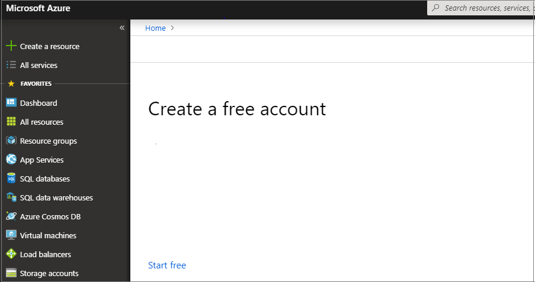
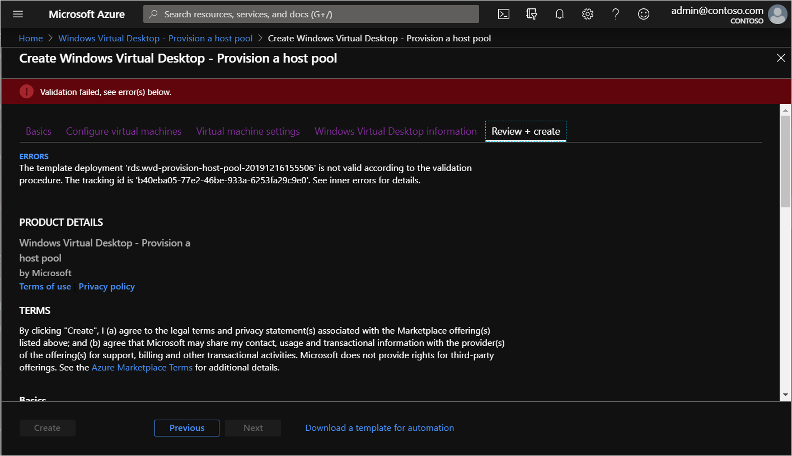
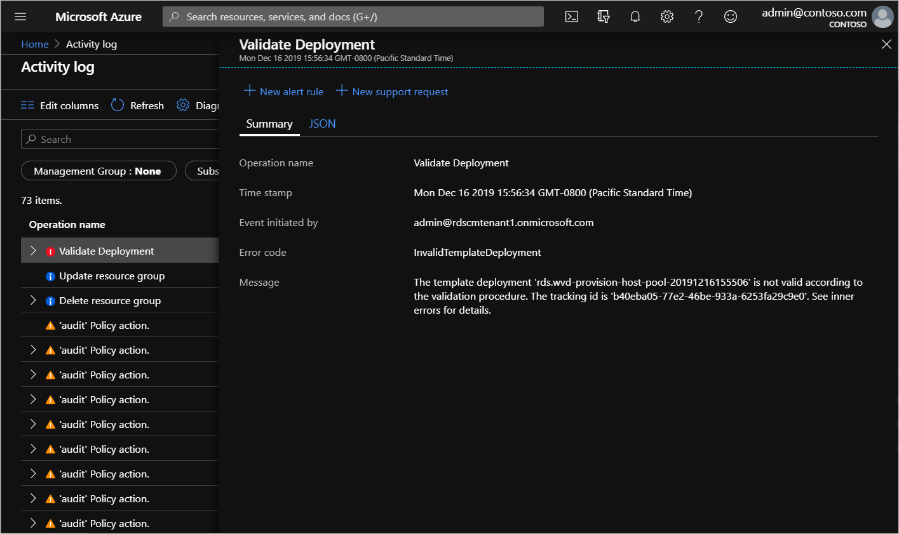
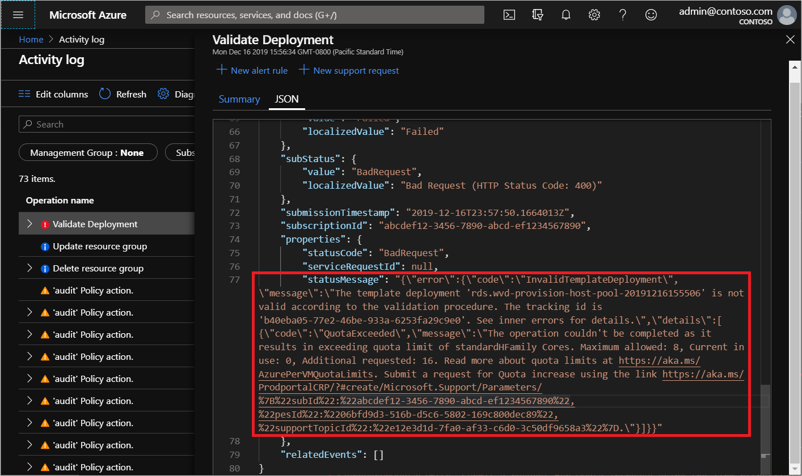
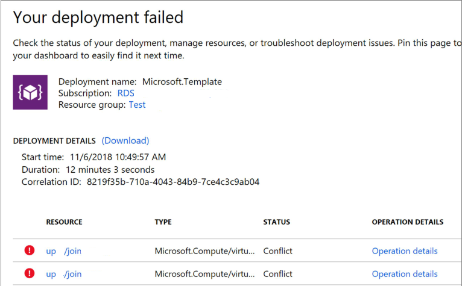
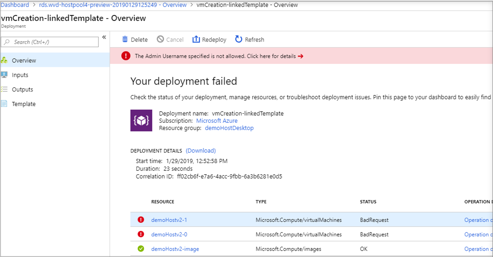

# Tenant and host pool creation

>[!IMPORTANT]
>This content applies to Windows Virtual Desktop (Classic), which doesn't support Azure Resource Manager Windows Virtual Desktop objects. If you're trying to manage Azure Resource Manager Windows Virtual Desktop objects, see [this article](../troubleshoot-set-up-issues.md).

This article covers issues during the initial setup of the Windows Virtual Desktop tenant and the related session host pool infrastructure.

## Provide feedback

Visit the [Windows Virtual Desktop Tech Community](https://techcommunity.microsoft.com/t5/Windows-Virtual-Desktop/bd-p/WindowsVirtualDesktop) to discuss the Windows Virtual Desktop service with the product team and active community members.

## Acquiring the Windows 10 Enterprise multi-session image

To use the Windows 10 Enterprise multi-session image, go to the Azure Marketplace, select **Get Started** > **Microsoft Windows 10** > and [Windows 10 Enterprise for Virtual Desktops, Version 1809](https://azuremarketplace.microsoft.com/marketplace/apps/microsoftwindowsdesktop.windows-10?tab=PlansAndPrice).

> [!div class="mx-imgBorder"]
> 

## Creating Windows Virtual Desktop tenant

This section covers potential issues when creating the Windows Virtual Desktop tenant.

### Error: AADSTS650052 The app needs access to a service.

Example of raw error:

```Error
AADSTS650052 Message The app needs access to a service(\"{name}\") that your organization
\"{organization}\" has not subscribed to or enabled. Contact your IT Admin to review the 
configuration of your service subscriptions.650052 Message The app needs access to a service
(\"{name}\") that your organization \"{organization}\" has not subscribed to or enabled. 
Contact your IT Admin to review the configuration of your service subscriptions.
```

**Cause:** Consent not granted to Windows Virtual Desktop in the Azure Active directory instance.

**Fix:** [Follow this guide](https://docs.microsoft.com/azure/virtual-desktop/virtual-desktop-fall-2019/tenant-setup-azure-active-directory#grant-permissions-to-windows-virtual-desktop) to grant consent.

### Error: The user isn't authorized to query the management service

> [!div class="mx-imgBorder"]
> 

Example of raw error:

```Error
   New-RdsTenant : User isn't authorized to query the management service.
   ActivityId: ad604c3a-85c6-4b41-9b81-5138162e5559
   Powershell commands to diagnose the failure:
   Get-RdsDiagnosticActivities -ActivityId ad604c3a-85c6-4b41-9b81-5138162e5559
   At line:1 char:1
   + New-RdsTenant -Name "testDesktopTenant" -AadTenantId "01234567-89ab-c ...
   + ~~~~~~~~~~~~~~~~~~~~~~~~~~~~~~~~~~~~~~~~~~~~~~~~~~~~~~~~~~~~~~~~~~~~~
       + CategoryInfo          : FromStdErr: (Microsoft.RDInf...nt.NewRdsTenant:NewRdsTenant) [New-RdsTenant], RdsPowerSh
      ellException
       + FullyQualifiedErrorId : UnauthorizedAccess,Microsoft.RDInfra.RDPowershell.Tenant.NewRdsTenant
```

**Cause:** The user who's signed in hasn't been assigned the TenantCreator role in their Azure Active Directory.

**Fix:** Follow the instructions in [Assign the TenantCreator application role to a user in your Azure Active Directory tenant](tenant-setup-azure-active-directory.md#assign-the-tenantcreator-application-role). After following the instructions, you'll have a user assigned to the TenantCreator role.

> [!div class="mx-imgBorder"]
> 

## Creating Windows Virtual Desktop session host VMs

Session host VMs can be created in several ways, but the Windows Virtual Desktop team only supports VM provisioning issues related to the [Azure Marketplace](https://azuremarketplace.microsoft.com/) offering. For more information, see [Issues using Windows Virtual Desktop - Provision a host pool Azure Marketplace offering](#issues-using-windows-virtual-desktop--provision-a-host-pool-azure-marketplace-offering).

## Issues using Windows Virtual Desktop – Provision a host pool Azure Marketplace offering

The Windows Virtual Desktop – Provision a host pool template is available from the Azure Marketplace.

### Error: When using the link from GitHub, the message "Create a free account" appears

> [!div class="mx-imgBorder"]
> 

**Cause 1:** There aren't active subscriptions in the account used to sign in to Azure or the account used doesn't have permissions to view the subscriptions.

**Fix 1:** Sign in with an account that has contributor access (at a minimum) to the subscription where session host VMs are going to be deployed.

**Cause 2:** The subscription being used is part of a Microsoft Cloud Service Provider (CSP) tenant.

**Fix 2:** Go to the GitHub location for **Create and provision new Windows Virtual Desktop host pool** and follow these instructions:

1. Right-click on **Deploy to Azure** and select **Copy link address**.
2. Open **Notepad** and paste the link.
3. Before the # character, insert the CSP end customer tenant name.
4. Open the new link in a browser and the Azure portal will load the template.

    ```Example
    Example: https://portal.azure.com/<CSP end customer tenant name>
    #create/Microsoft.Template/uri/https%3A%2F%2Fraw.githubusercontent.com%2FAzure%
    2FRDS-Templates%2Fmaster%2Fwvd-templates%2FCreate%20and%20provision%20WVD%20host%20pool%2FmainTemplate.json
    ```

### Error: You receive "template deployment is not valid" error

> [!div class="mx-imgBorder"]
> 

Before taking specific action, you'll need to check the activity log to see the detailed error for the failed deployment validation.

To view the error in the activity log:

1. Exit the current Azure Marketplace deployment offering.
2. In the top search bar, search for and select **Activity Log**.
3. Find an activity named **Validate Deployment** that has a status of **Failed** and select the activity.
   
   > [!div class="mx-imgBorder"]
   > 

4. Select JSON, then scroll down to the bottom of the screen until you see the "statusMessage" field.
   
   > [!div class="mx-imgBorder"]
   > 

If your operation template goes over the quota limit, you can do one of the following things to fix it:

 - Run the Azure Marketplace with the parameters you used the first time, but this time use fewer VMs and VM cores.
 - Open the link you see in the **statusMessage** field in a browser to submit a request to increase the quota for your Azure subscription for the specified VM SKU.

## Azure Resource Manager template and PowerShell Desired State Configuration (DSC) errors

Follow these instructions to troubleshoot unsuccessful deployments of Azure Resource Manager templates and PowerShell DSC.

1. Review errors in the deployment using [View deployment operations with Azure Resource Manager](../../azure-resource-manager/resource-manager-deployment-operations.md).
2. If there are no errors in the deployment, review errors in the activity log using [View activity logs to audit actions on resources](../../azure-resource-manager/resource-group-audit.md).
3. Once the error is identified, use the error message and the resources in [Troubleshoot common Azure deployment errors with Azure Resource Manager](../../azure-resource-manager/resource-manager-common-deployment-errors.md) to address the issue.
4. Delete any resources created during the previous deployment and retry deploying the template again.

### Error: Your deployment failed….\<hostname>/joindomain

> [!div class="mx-imgBorder"]
> 

Example of raw error:

```Error
 {"code":"DeploymentFailed","message":"At least one resource deployment operation failed. Please list deployment operations for details.
 Please see https://aka.ms/arm-debug for usage details.","details":[{"code":"Conflict","message":"{\r\n \"status\": \"Failed\",\r\n \"error\":
 {\r\n \"code\": \"ResourceDeploymentFailure\",\r\n \"message\": \"The resource operation completed with terminal provisioning state 'Failed'.
 \",\r\n \"details\": [\r\n {\r\n \"code\": \"VMExtensionProvisioningError\",\r\n \"message\": \"VM has reported a failure when processing
 extension 'joindomain'. Error message: \\\"Exception(s) occurred while joining Domain 'diamondsg.onmicrosoft.com'\\\".\"\r\n }\r\n ]\r\n }\r\n}"}]}
```

**Cause 1:** Credentials provided for joining VMs to the domain are incorrect.

**Fix 1:** See the "Incorrect credentials" error for VMs are not joined to the domain in [Session host VM configuration](troubleshoot-vm-configuration-2019.md).

**Cause 2:** Domain name doesn't resolve.

**Fix 2:** See [Error: Domain name doesn't resolve](troubleshoot-vm-configuration-2019.md#error-domain-name-doesnt-resolve) in [Session host VM configuration](troubleshoot-vm-configuration-2019.md).

**Cause 3:** Your virtual network (VNET) DNS configuration is set to **Default**.

To fix this, do the following things:

1. Open the Azure Portal and go to the **Virtual networks** tab.
2. Find your VNET, then select **DNS servers**.
3. The DNS servers menu should appear on the right side of your screen. On that menu, select **Custom**.
4. Make sure the DNS servers listed under Custom match your domain controller or Active Directory domain. If you don't see your DNS server, you can add it by entering its value into the **Add DNS server** field.

### Error: Your deployment failed...\Unauthorized

```Error
{"code":"DeploymentFailed","message":"At least one resource deployment operation failed. Please list deployment operations for details. Please see https://aka.ms/arm-debug for usage details.","details":[{"code":"Unauthorized","message":"{\r\n \"Code\": \"Unauthorized\",\r\n \"Message\": \"The scale operation is not allowed for this subscription in this region. Try selecting different region or scale option.\",\r\n \"Target\": null,\r\n \"Details\": [\r\n {\r\n \"Message\": \"The scale operation is not allowed for this subscription in this region. Try selecting different region or scale option.\"\r\n },\r\n {\r\n \"Code\": \"Unauthorized\"\r\n },\r\n {\r\n \"ErrorEntity\": {\r\n \"ExtendedCode\": \"52020\",\r\n \"MessageTemplate\": \"The scale operation is not allowed for this subscription in this region. Try selecting different region or scale option.\",\r\n \"Parameters\": [\r\n \"default\"\r\n ],\r\n \"Code\": \"Unauthorized\",\r\n \"Message\": \"The scale operation is not allowed for this subscription in this region. Try selecting different region or scale option.\"\r\n }\r\n }\r\n ],\r\n \"Innererror\": null\r\n}"}]}
```

**Cause:** The subscription you're using is a type that can't access required features in the region where the customer is trying to deploy. For example, MSDN, Free, or Education subscriptions can show this error.

**Fix:** Change your subscription type or region to one that can access the required features.

### Error: VMExtensionProvisioningError

> [!div class="mx-imgBorder"]
> 

**Cause 1:** Transient error with the Windows Virtual Desktop environment.

**Cause 2:** Transient error with connection.

**Fix:** Confirm Windows Virtual Desktop environment is healthy by signing in using PowerShell. Finish the VM registration manually in [Create a host pool with PowerShell](create-host-pools-powershell-2019.md).

### Error: The Admin Username specified isn't allowed

> [!div class="mx-imgBorder"]
> 

Example of raw error:

```Error
 { "id": "/subscriptions/EXAMPLE/resourceGroups/demoHostDesktop/providers/Microsoft.
  Resources/deployments/vmCreation-linkedTemplate/operations/EXAMPLE", "operationId": "EXAMPLE", "properties": { "provisioningOperation":
 "Create", "provisioningState": "Failed", "timestamp": "2019-01-29T20:53:18.904917Z", "duration": "PT3.0574505S", "trackingId":
 "1f460af8-34dd-4c03-9359-9ab249a1a005", "statusCode": "BadRequest", "statusMessage": { "error": { "code": "InvalidParameter", "message":
 "The Admin Username specified is not allowed.", "target": "adminUsername" } }, "targetResource": { "id": "/subscriptions/EXAMPLE
 /resourceGroups/demoHostDesktop/providers/Microsoft.Compute/virtualMachines/demo", "resourceType": "Microsoft.Compute/virtualMachines", "resourceName": "demo" } }}
```

**Cause:** Password provided contains forbidden substrings (admin, administrator, root).

**Fix:** Update username or use different users.

### Error: VM has reported a failure when processing extension

> [!div class="mx-imgBorder"]
> 

Example of raw error:

```Error
{ "id": "/subscriptions/EXAMPLE/resourceGroups/demoHostD/providers/Microsoft.Resources/deployments/
 rds.wvd-provision-host-pool-20190129132410/operations/5A0757AC9E7205D2", "operationId": "5A0757AC9E7205D2", "properties":
 { "provisioningOperation": "Create", "provisioningState": "Failed", "timestamp": "2019-01-29T21:43:05.1416423Z",
 "duration": "PT7M56.8150879S", "trackingId": "43c4f71f-557c-4abd-80c3-01f545375455", "statusCode": "Conflict",
 "statusMessage": { "status": "Failed", "error": { "code": "ResourceDeploymentFailure", "message":
 "The resource operation completed with terminal provisioning state 'Failed'.", "details": [ { "code":
 "VMExtensionProvisioningError", "message": "VM has reported a failure when processing extension 'dscextension'.
 Error message: \"DSC Configuration 'SessionHost' completed with error(s). Following are the first few:
 PowerShell DSC resource MSFT_ScriptResource failed to execute Set-TargetResource functionality with error message:
 One or more errors occurred. The SendConfigurationApply function did not succeed.\"." } ] } }, "targetResource":
 { "id": "/subscriptions/EXAMPLE/resourceGroups/demoHostD/providers/Microsoft.
 Compute/virtualMachines/desktop-1/extensions/dscextension",
 "resourceType": "Microsoft.Compute/virtualMachines/extensions", "resourceName": "desktop-1/dscextension" } }}
```

**Cause:** PowerShell DSC extension was not able to get admin access on the VM.

**Fix:** Confirm username and password have administrative access on the virtual machine and run the Azure Resource Manager template again.

### Error: DeploymentFailed – PowerShell DSC Configuration 'FirstSessionHost' completed with Error(s)

> [!div class="mx-imgBorder"]
> 

Example of raw error:

```Error
{
    "code": "DeploymentFailed",
   "message": "At least one resource deployment operation failed. Please list
 deployment operations for details. 4 Please see https://aka.ms/arm-debug for usage details.",
 "details": [
         { "code": "Conflict",  
         "message": "{\r\n \"status\": \"Failed\",\r\n \"error\": {\r\n \"code\":
         \"ResourceDeploymentFailure\",\r\n \"message\": \"The resource
         operation completed with terminal provisioning state 'Failed'.\",\r\n
         \"details\": [\r\n {\r\n \"code\":
        \"VMExtensionProvisioningError\",\r\n \"message\": \"VM has
              reported a failure when processing extension 'dscextension'.
              Error message: \\\"DSC Configuration 'FirstSessionHost'
              completed with error(s). Following are the first few:
              PowerShell DSC resource MSFT ScriptResource failed to
              execute Set-TargetResource functionality with error message:
              One or more errors occurred. The SendConfigurationApply
              function did not succeed.\\\".\"\r\n }\r\n ]\r\n }\r\n}"  }

```

**Cause:** PowerShell DSC extension was not able to get admin access on the VM.

**Fix:** Confirm username and password provided have administrative access on the virtual machine and run the Azure Resource Manager template again.

### Error: DeploymentFailed – InvalidResourceReference

Example of raw error:

```Error
{"code":"DeploymentFailed","message":"At least one resource deployment operation
failed. Please list deployment operations for details. Please see https://aka.ms/arm-
debug for usage details.","details":[{"code":"Conflict","message":"{\r\n \"status\":
\"Failed\",\r\n \"error\": {\r\n \"code\": \"ResourceDeploymentFailure\",\r\n
\"message\": \"The resource operation completed with terminal provisioning state
'Failed'.\",\r\n \"details\": [\r\n {\r\n \"code\": \"DeploymentFailed\",\r\n
\"message\": \"At least one resource deployment operation failed. Please list
deployment operations for details. Please see https://aka.ms/arm-debug for usage
details.\",\r\n \"details\": [\r\n {\r\n \"code\": \"BadRequest\",\r\n \"message\":
\"{\\r\\n \\\"error\\\": {\\r\\n \\\"code\\\": \\\"InvalidResourceReference\\\",\\r\\n
\\\"message\\\": \\\"Resource /subscriptions/EXAMPLE/resourceGroups/ernani-wvd-
demo/providers/Microsoft.Network/virtualNetworks/wvd-vnet/subnets/default
referenced by resource /subscriptions/EXAMPLE/resourceGroups/ernani-wvd-
demo/providers/Microsoft.Network/networkInterfaces/erd. Please make sure that
the referenced resource exists, and that both resources are in the same
region.\\\",\\r\\n\\\"details\\\": []\\r\\n }\\r\\n}\"\r\n }\r\n ]\r\n }\r\n ]\r\n }\r\n}"}]}
```

**Cause:** Part of the resource group name is used for certain resources being created by the template. Due to the name matching existing resources, the template may select an existing resource from a different group.

**Fix:** When running the Azure Resource Manager template to deploy session host VMs, make the first two characters unique for your subscription resource group name.

### Error: DeploymentFailed – InvalidResourceReference

Example of raw error:

```Error
{"code":"DeploymentFailed","message":"At least one resource deployment operation
failed. Please list deployment operations for details. Please see https://aka.ms/arm-
debug for usage details.","details":[{"code":"Conflict","message":"{\r\n \"status\":
\"Failed\",\r\n \"error\": {\r\n \"code\": \"ResourceDeploymentFailure\",\r\n
\"message\": \"The resource operation completed with terminal provisioning state
'Failed'.\",\r\n \"details\": [\r\n {\r\n \"code\": \"DeploymentFailed\",\r\n
\"message\": \"At least one resource deployment operation failed. Please list
deployment operations for details. Please see https://aka.ms/arm-debug for usage
details.\",\r\n \"details\": [\r\n {\r\n \"code\": \"BadRequest\",\r\n \"message\":
\"{\\r\\n \\\"error\\\": {\\r\\n \\\"code\\\": \\\"InvalidResourceReference\\\",\\r\\n
\\\"message\\\": \\\"Resource /subscriptions/EXAMPLE/resourceGroups/ernani-wvd-
demo/providers/Microsoft.Network/virtualNetworks/wvd-vnet/subnets/default
referenced by resource /subscriptions/EXAMPLE/resourceGroups/DEMO/providers/Microsoft.Network/networkInterfaces
/EXAMPLE was not found. Please make sure that the referenced resource exists, and that both
resources are in the same region.\\\",\\r\\n \\\"details\\\": []\\r\\n }\\r\\n}\"\r\n
}\r\n ]\r\n }\r\n ]\r\n }\r\n\
```

**Cause:** This error is because the NIC created with the Azure Resource Manager template has the same name as another NIC already in the VNET.

**Fix:** Use a different host prefix.

### Error: DeploymentFailed – Error downloading

Example of raw error:

```Error
\\\"The DSC Extension failed to execute: Error downloading
https://catalogartifact.azureedge.net/publicartifacts/rds.wvd-provision-host-pool-
2dec7a4d-006c-4cc0-965a-02bbe438d6ff-prod
/Artifacts/DSC/Configuration.zip after 29 attempts: The remote name could not be
resolved: 'catalogartifact.azureedge.net'.\\nMore information about the failure can
be found in the logs located under
'C:\\\\WindowsAzure\\\\Logs\\\\Plugins\\\\Microsoft.Powershell.DSC\\\\2.77.0.0' on
the VM.\\\"
```

**Cause:** This error is due to a static route, firewall rule, or NSG blocking the download of the zip file tied to the Azure Resource Manager template.

**Fix:** Remove blocking static route, firewall rule, or NSG. Optionally, open the Azure Resource Manager template json file in a text editor, take the link to zip file, and download the resource to an allowed location.

### Error: The user isn't authorized to query the management service

Example of raw error:

```Error
"response": { "content": { "startTime": "2019-04-01T17:45:33.3454563+00:00", "endTime": "2019-04-01T17:48:52.4392099+00:00",
"status": "Failed", "error": { "code": "VMExtensionProvisioningError", "message": "VM has reported a failure when processing
extension 'dscextension'. Error message: \"DSC Configuration 'FirstSessionHost' completed with error(s).
Following are the first few: PowerShell DSC resource MSFT_ScriptResource failed to execute Set-TargetResource
 functionality with error message: User is not authorized to query the management service.
\nActivityId: 1b4f2b37-59e9-411e-9d95-4f7ccd481233\nPowershell commands to diagnose the failure:
\nGet-RdsDiagnosticActivities -ActivityId 1b4f2b37-59e9-411e-9d95-4f7ccd481233\n
The SendConfigurationApply function did not succeed.\"." }, "name": "2c3272ec-d25b-47e5-8d70-a7493e9dc473" } } }}
```

**Cause:** The specified Windows Virtual Desktop tenant admin doesn't have a valid role assignment.

**Fix:** The user who created the Windows Virtual Desktop tenant needs to sign in to Windows Virtual Desktop PowerShell and assign the attempted user a role assignment. If you're running the GitHub Azure Resource Manager template parameters, follow these instructions using PowerShell commands:

```PowerShell
Add-RdsAccount -DeploymentUrl "https://rdbroker.wvd.microsoft.com"
New-RdsRoleAssignment -TenantName <Windows Virtual Desktop tenant name> -RoleDefinitionName "RDS Contributor" -SignInName <UPN>
```

### Error: User requires Azure Multi-Factor Authentication (MFA)

> [!div class="mx-imgBorder"]
> 

Example of raw error:

```Error
"message": "{\r\n  \"status\": \"Failed\",\r\n  \"error\": {\r\n    \"code\": \"ResourceDeploymentFailure\",\r\n    \"message\": \"The resource operation completed with terminal provisioning state 'Failed'.\",\r\n    \"details\": [\r\n      {\r\n        \"code\": \"VMExtensionProvisioningError\",\r\n        \"message\": \"VM has reported a failure when processing extension 'dscextension'. Error message: \\\"DSC Configuration 'FirstSessionHost' completed with error(s). Following are the first few: PowerShell DSC resource MSFT_ScriptResource  failed to execute Set-TargetResource functionality with error message: One or more errors occurred.  The SendConfigurationApply function did not succeed.\\\".\"\r\n      }\r\n    ]\r\n  }\r\n}"
```

**Cause:** The specified Windows Virtual Desktop tenant admin requires Azure Multi-Factor Authentication (MFA) to sign in.

**Fix:** Create a service principal and assign it a role for your Windows Virtual Desktop tenant by following the steps in [Tutorial: Create service principals and role assignments with PowerShell](create-service-principal-role-powershell.md). After verifying that you can sign in to Windows Virtual Desktop with the service principal, rerun the Azure Marketplace offering or the GitHub Azure Resource Manager template, depending on which method you're using. Follow the instructions below to enter the correct parameters for your method.

If you're running the Azure Marketplace offering, provide values for the following parameters to properly authenticate to Windows Virtual Desktop:

- Windows Virtual Desktop tenant RDS Owner: Service principal
- Application ID: The application identification of the new service principal you created
- Password/Confirm Password: The password secret you generated for the service principal
- Azure AD Tenant ID: The Azure AD Tenant ID of the service principal you created

If you're running the GitHub Azure Resource Manager template, provide values for the following parameters to properly authenticate to Windows Virtual Desktop:

- Tenant Admin user principal name (UPN) or Application ID: The application identification of the new service principal you created
- Tenant Admin Password: The password secret you generated for the service principal
- IsServicePrincipal: **true**
- AadTenantId: The Azure AD Tenant ID of the service principal you created

## Next steps

- For an overview on troubleshooting Windows Virtual Desktop and the escalation tracks, see [Troubleshooting overview, feedback, and support](troubleshoot-set-up-overview-2019.md).
- To troubleshoot issues while configuring a virtual machine (VM) in Windows Virtual Desktop, see [Session host virtual machine configuration](troubleshoot-vm-configuration-2019.md).
- To troubleshoot issues with Windows Virtual Desktop client connections, see [Windows Virtual Desktop service connections](troubleshoot-service-connection-2019.md).
- To troubleshoot issues with Remote Desktop clients, see [Troubleshoot the Remote Desktop client](../troubleshoot-client.md)
- To troubleshoot issues when using PowerShell with Windows Virtual Desktop, see [Windows Virtual Desktop PowerShell](troubleshoot-powershell-2019.md).
- To learn more about the service, see [Windows Virtual Desktop environment](environment-setup-2019.md).
- To go through a troubleshoot tutorial, see [Tutorial: Troubleshoot Resource Manager template deployments](../../azure-resource-manager/templates/template-tutorial-troubleshoot.md).
- To learn about auditing actions, see [Audit operations with Resource Manager](../../azure-resource-manager/management/view-activity-logs.md).
- To learn about actions to determine the errors during deployment, see [View deployment operations](../../azure-resource-manager/templates/deployment-history.md).
