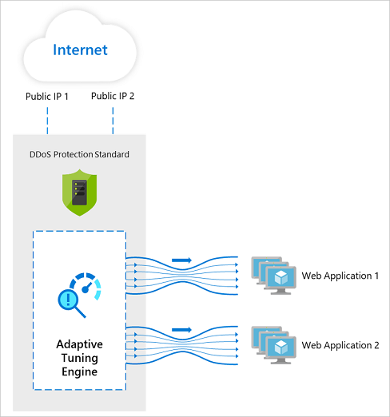

# Partnering with Azure DDoS Protection Standard
This article describes partnering opportunities enabled by the Azure DDoS Protection Standard. This article is designed to help product managers and business development roles understand the investment paths and provide insight into partnering value propositions.

## Background
Distributed denial of service (DDoS) attacks are one of the top availability and security concerns voiced by customers moving their applications to the cloud. With extortion and hacktivism being the common motivations behind DDoS attacks, they have been consistently increasing in type, scale, and frequency of occurrence as they are relatively easy and cheap to launch.

Azure DDoS Protection provides countermeasures against the most sophisticated DDoS threats, leveraging the global scale. The service provides enhanced DDoS mitigation capabilities for applications and resources deployed in virtual networks.

Technology partners can protect their customer’s resources natively with Azure DDoS Protection Standard to address the availability and reliability concerns due to DDoS attacks.

## Introduction to Azure DDoS Protection Standard
Azure DDoS Protection Standard provides enhanced DDoS mitigation capabilities against Layer 3 and Layer 4 DDoS attacks. Following are the key features of DDoS Protection Standard service.

### Adaptive real time tuning
For every protected application, Azure DDoS Protection Standard automatically tunes the DDoS mitigation policy thresholds based on application’s traffic profile patterns. The service accomplishes this customization by using two insights:

- Automatic learning of per-customer (per-IP) traffic patterns for Layer 3 and 4.
- Minimizing false positives, considering that the scale of Azure allows it to absorb a significant amount of traffic.

### Attack analytics, telemetry, monitoring and alerting
Azure DDoS Protection identifies and mitigates DDoS attacks without any user intervention.

- If the protected resource is in the subscription covered under Azure Security Center, DDoS Protection Standard automatically sends an alert to Security Center whenever a DDoS attack is detected and mitigated against the protected application.
- Alternatively, to get notified when there’s an active mitigation for a protected public IP, you can [configure an alert](manage-ddos-protection.md#configure-alerts-for-ddos-protection-metrics) on the metric Under DDoS attack or not.
- You can additionally choose to create alerts for the other DDoS metrics and [configure attack analytics](manage-ddos-protection.md#configure-ddos-attack-analytics) to understand the scale of the attack, traffic being dropped, attack vectors, top contributors, and other details.

### DDoS rapid response (DRR)
DDoS Protection Standard customers now have access to [Rapid Response team](https://azure.microsoft.com/blog/ddos-protection-attack-analytics-rapid-response/) during an active attack. DRR can help with attack investigation, custom mitigations during an attack, and post-attack analysis.

### SLA guarantee and cost protection
DDoS Protection Standard service is covered by 99.99% SLA, and cost protection provides resource credits for scale out during a documented attack. For more information, see [SLA for Azure DDoS Protection](https://azure.microsoft.com/support/legal/sla/ddos-protection/v1_0/).

## Featured partner scenarios
The following are three key benefits you can derive by integrating with the Azure DDoS Protection Standard:

- Partner’s offered service (load balancer, web application firewall, firewall, etc.) to their customers are automatically protected (white labeled) by Azure DDoS Protection Standard in the backend.
- Partners have access to Azure DDoS Protection Standard attack analytics and telemetry that they can integrate with their own products, offering a unified customer experience.  
- Partners have access to DDoS rapid response support even in absence of Azure rapid response, for DDoS related issues.
- Partner’s protected application is backed by DDoS SLA guarantee and cost protection in an event of DDoS attacks.

## Technical integration overview
Azure DDoS Protection Standard partnering opportunities are made available via Azure portal, APIs, CLI/PS.

### How to integrate with DDoS Protection Standard
Following steps are required for partners to configure integration with Azure DDoS Protection Standard:
1. Create a DDoS Protection Plan in your desired (partner) subscription. For step-by-step instructions, see [Create a DDoS Standard Protection plan](manage-ddos-protection.md#create-a-ddos-protection-plan).
   > [!NOTE]
   > Only 1 DDoS Protection Plan needs to be created for a given tenant. 
2. Deploy a service with public endpoint in your required (partner) subscriptions such as - load balancer, firewalls, web application firewall. 
3. Enable Azure DDoS Protection Standard on the virtual network of the service that has public endpoints using DDoS Protection Plan created in the first step. For stpe-by-step instructions, see [Enable DDoS Standard Protection plan](manage-ddos-protection.md#enable-ddos-for-an-existing-virtual-network)
   > [!IMPORTANT] 
   > Once Azure DDoS Protection Standard is enabled on a virtual network, all public IPs within that virtual network are automatically protected. The origin of these public IPs can either be within Azure (client subscription), or, outside of Azure. 
4. Optionally, integrate Azure DDoS Protection Standard telemetry and attack analytics in your application specific customer facing. For more information about using telemetry, see [Use DDoS Protection telemetry](manage-ddos-protection.md#use-ddos-protection-telemetry). For more information about configuring attack analytics, see [Configure DDoS attack analytics](manage-ddos-protection.md#configure-ddos-attack-analytics)

### Onboarding guides and technical documentation

- [Azure DDoS Protection product page](https://azure.microsoft.com/services/ddos-protection/)
- [Azure DDoS Protection documentation](ddos-protection-overview.md)
- [Azure DDoS Protection API reference](https://docs.microsoft.com/rest/api/virtualnetwork/ddosprotectionplans)
- [Azure virtual network API reference](https://docs.microsoft.com/rest/api/virtualnetwork/virtualnetworks)

### Getting help

- If you have questions on application, service, or product integrations with Azure DDoS Protection Standard, reach out to the [Azure security community](https://techcommunity.microsoft.com/t5/security-identity/bd-p/Azure-Security).
- Follow discussions on [Stack Overflow](https://stackoverflow.com/tags/azure-ddos/).

### Getting to market

- The primary program for partnering with Microsoft is the [Microsoft Partner Network](https://partner.microsoft.com/) – Microsoft Graph Security integrations fall into the [MPN Independent Software Vendor (ISV)](https://partner.microsoft.com/saas-solution-guide) track.
- [Microsoft Intelligent Security Association](https://www.microsoft.com/security/business/intelligent-security-association?rtc=1) is the program specifically for Microsoft Security Partners to help enrich your security products and improve customer discoverability of your integrations to Microsoft Security products.

## Next steps
View existing partner integrations:

- [Barracuda WAF-as-a-service](https://www.barracuda.com/waf-as-a-service)
- [Azure Cloud WAF from Radware](https://www.radware.com/resources/microsoft-azure/)
