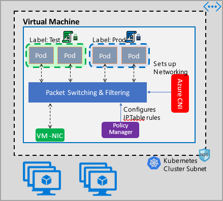

# Azure Kubernetes network policies overview

Network Policies provide micro-segmentation for pods just like Network Security Groups (NSGs) provide micro-segmentation for VMs. The Azure Network Policy implementation supports the standard Kubernetes Network Policy specification. You can use labels to select a group of pods and define a list of ingress and egress rules that specify the kind of traffic that is allowed to and from these pods. Learn more about the Kubernetes network policies in the [Kubernetes documentation](https://kubernetes.io/docs/concepts/services-networking/network-policies/).



## Planning security for your Kubernetes cluster
When implementing security for your cluster, use network security groups (NSGs) to filter North-South traffic, that is, traffic entering and leaving your cluster subnet, and use Kubernetes network policies for East-West traffic, that is. traffic between pods in your cluster.

## Using Azure Kubernetes network policies
Azure Network Policies can be used in the following ways to provide micro-segmentation for pods.

### ACS-engine
ACS-Engine is a tool that generates an Azure Resource Manager template for the deployment of a Kubernetes cluster in Azure. The cluster configuration is specified in a JSON file that is passed to the tool when generating the template. To learn more about the entire list of supported cluster settings and their descriptions, see Microsoft Azure Container Service Engine - Cluster Definition.

To enable policies on clusters deployed using acs-engine, specify the value of the networkPolicy setting in the cluster definition file to be "azure".

#### Example configuration

The below JSON example configuration creates a new virtual network and subnet, and deploys a Kubernetes cluster in it with Azure CNI. We recommend that you use “Notepad” to edit the JSON file. 
```json
{
  "apiVersion": "vlabs",
  "properties": {
    "orchestratorProfile": {
      "orchestratorType": "Kubernetes",
      “kubernetesConfig”: {
         "networkPolicy": "azure"
       }
    },
    "masterProfile": {
      "count": 1,
      "dnsPrefix": "<specify a cluster name>",
      "vmSize": "Standard_D2s_v3"
    },
    "agentPoolProfiles": [
      {
        "name": "agentpool",
        "count": 2,
        "vmSize": "Standard_D2s_v3",
        "availabilityProfile": "AvailabilitySet"
      }
    ],
   "linuxProfile": {
      "adminUsername": "<specify admin username>",
      "ssh": {
        "publicKeys": [
          {
            "keyData": "<cut and paste your ssh key here>"
          }
        ]
      }
    },
    "servicePrincipalProfile": {
      "clientId": "<put the client ID of your service principal here >",
      "secret": "<put the passwd of your service principal here>"
    }
  }
}

```
### Creating your own Kubernetes cluster in Azure
The implementation can be used to provide Network Policies for Pods in Kubernetes clusters that you deploy yourself, without relying on tools like the ACS-Engine. In this case, you first install the CNI plug-in and enable it on every virtual machine in a cluster. For detailed instructions, see [Deploy the plug-in for a Kubernetes cluster that you deploy yourself](deploy-container-networking.md#deploy-plug-in-for-a-kubernetes-cluster).

Once the cluster is deployed run the following `kubectl` command to download and apply the Azure network policy **daemonset** to the cluster

kubectl apply -f https://raw.githubusercontent.com/Azure/acs-engine/master/parts/k8s/addons/kubernetesmasteraddons-azure-npm-daemonset.yaml

The solution is also open source and the code is available on the [Azure Container Networking repository](https://github.com/Azure/azure-container-networking/tree/master/npm).
AKS


## Next steps
- Learn about [Azure Kubernetes Service](../aks/intro-kubernetes.md).
-  Learn about [container networking](container-networking-overview.md).
- [Deploy the plug-in](deploy-container-networking.md) for Kubernetes clusters or Docker containers.