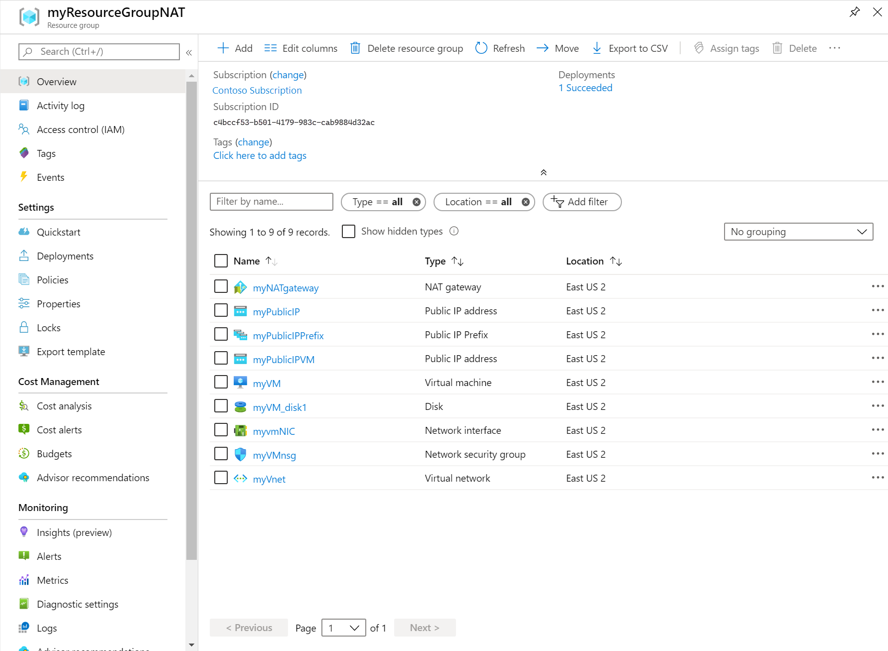

# Quickstart: Create a NAT gateway - Resource Manager Template

Get started with Virtual Network NAT by using an Azure Resource Manager Template.  This template deploys a virtual network, a NAT gateway, and Ubuntu virtual machine. The Ubuntu virtual machine is deployed to a subnet that is associated with the NAT gateway.

>[!NOTE] 
>Azure Virtual Network NAT is available as public preview at this time and available in a limited set of [regions](https://azure.microsoft.com/global-infrastructure/regions/). This preview is provided without a service level agreement and isn't recommended for production workloads. Certain features may not be supported or may have constrained capabilities. See the [Supplemental Terms of Use for Microsoft Azure Previews](https://azure.microsoft.com/support/legal/preview-supplemental-terms) for details.

[!INCLUDE [About Azure Resource Manager](../../includes/resource-manager-quickstart-introduction.md)]

If you don't have an Azure subscription, create a [free account](https://azure.microsoft.com/free/?WT.mc_id=A261C142F) before you begin.

## Create a NAT gateway resource, virtual network, and Ubuntu virtual machine

This template is configured to create a 

* Virtual network 
* NAT gateway resource
* Ubuntu virtual machine

The Ubuntu VM is deployed to a subnet that is associated with the NAT gateway resource.

### Review the template

The template used in this quickstart is from [Azure Quickstart templates](https://raw.githubusercontent.com/Azure/azure-quickstart-templates/master/101-nat-gateway-1-vm/azuredeploy.json)

:::code language="json" source="~/quickstart-templates/101-nat-gateway-1-vm/azuredeploy.json" range="1-335" highlight="256-282":::

Nine Azure resources are defined in the template:

**Microsoft.Network**

* **[Microsoft.Network/natGateways](https://docs.microsoft.com/azure/templates/microsoft.network/natgateways)**: Creates a NAT gateway resource.

* **[Microsoft.Network/networkSecurityGroups](https://docs.microsoft.com/azure/templates/microsoft.network/networksecuritygroups)**: Create a network security group.

    * **[Microsoft.Network/networkSecurityGroups/securityRules](https://docs.microsoft.com/azure/templates/microsoft.network/networksecuritygroups/securityrules)**: Creates a security rule.

* **[Microsoft.Network/publicIPAddresses](https://docs.microsoft.com/azure/templates/microsoft.network/publicipaddresses)**: Creates a public IP address.

* **[Microsoft.Network/publicIPPrefixes](https://docs.microsoft.com/azure/templates/microsoft.network/publicipprefixes)**: Creates a public IP prefix.

* **[Microsoft.Network/virtualNetworks](https://docs.microsoft.com/azure/templates/microsoft.network/virtualnetworks)**: Creates a virtual network.

    * **[Microsoft.Network/virtualNetworks/subnets](https://docs.microsoft.com/azure/templates/microsoft.network/virtualnetworks/subnets)**: Creates a virtual network subnet.

* **[Microsoft.Network/networkinterfaces](https://docs.microsoft.com/azure/templates/microsoft.network/networkinterfaces)**: Creates a network interface.

**Microsoft.Compute**

* **[Microsoft.Compute/virtualMachines](https://docs.microsoft.com/azure/templates/Microsoft.Compute/virtualMachines)**: Creates a virtual machine.

### Deploy the template

**Azure CLI**

```azurecli-interactive
resourceGroupName="myResourceGroupNAT" &&
templateUri="https://raw.githubusercontent.com/Azure/azure-quickstart-templates/master/101-nat-gateway-1-vm/azuredeploy.json" &&
location="eastus2"

az group create \
--name $resourceGroupName \
--location $location

az group deployment create \
--resource-group $resourceGroupName \
--template-uri  $templateUri
```

**Azure PowerShell**

```azurepowershell-interactive
$location = Read-Host -Prompt "Enter the location (i.e. centralus)"
$templateUri = "https://raw.githubusercontent.com/Azure/azure-quickstart-templates/master/101-nat-gateway-1-vm/azuredeploy.json"

$resourceGroupName = "myResourceGroupNAT"

New-AzResourceGroup -Name $resourceGroupName -Location $location
New-AzResourceGroupDeployment -ResourceGroupName $resourceGroupName -TemplateUri $templateUri
```

**Azure Portal**

[](https://portal.azure.com/#create/Microsoft.Template/uri/https%3A%2F%2Fraw.githubusercontent.com%2FAzure%2Fazure-quickstart-templates%2Fmaster%2F101-nat-gateway-1-vm%2Fazuredeploy.json)

## Review deployed resources

1. Sign in to the [Azure portal](https://portal.azure.com).

2. Select **Resource groups** from the left pane.

3. Select the resource group that you created in the previous section. The default resource group name is **myResourceGroupNAT**

4. Verify the following resources were created in the resource group:

    

## Clean up resources

**Azure CLI**

When no longer needed, you can use the [az group delete](/cli/azure/group#az-group-delete) command to remove the resource group and all resources contained within.

```azurecli-interactive 
  az group delete \
    --name myResourceGroupNAT
```

**Azure PowerShell**

When no longer needed, you can use the [Remove-AzResourceGroup](https://docs.microsoft.com/powershell/module/az.resources/remove-azresourcegroup?view=latest) command to remove the resource group and all resources contained within.

```azurepowershell-interactive 
Remove-AzResourceGroup -Name myResourceGroupNAT
```

**Azure Portal**

When no longer needed, delete the resource group, NAT gateway, and all related resources. Select the resource group **myResourceGroupNAT** that contains the NAT gateway, and then select **Delete**.

## Next Steps

In this quickstart, you created a:

* NAT gateway resource
* Virtual network
* Ubuntu virtual machine

The virtual machine is deployed to a virtual network subnet associated with the NAT gateway. 

To learn more about Virtual Network NAT and Azure Resource Manager, continue to the articles below.

* Read an [Overview of Virtual Network NAT](nat-overview.md)
* Read about the [NAT Gateway resource](nat-gateway-resource.md)
* Learn more about [Azure Resource Manager](../azure-resource-manager/management/overview.md)
