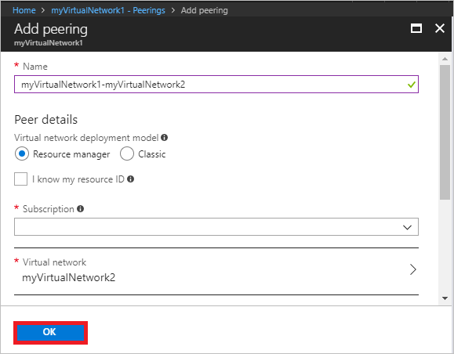
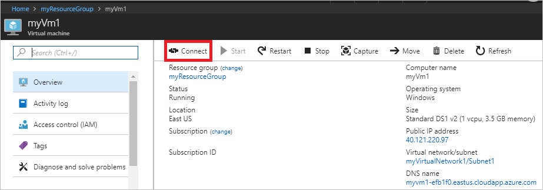

# Connect virtual networks with virtual network peering using the Azure portal

You can connect virtual networks to each other with virtual network peering. Once virtual networks are peered, resources in both virtual networks are able to communicate with each other, with the same latency and bandwidth as if the resources were in the same virtual network. In this article, you learn how to:

> [!div class="checklist"]
> * Create two virtual networks
> * Connect two virtual network with a virtual network peering
> * Deploy a virtual machine (VM) into each virtual network and communicate between VMs

If you don't have an Azure subscription, create a [free account](https://azure.microsoft.com/free/?WT.mc_id=A261C142F) before you begin.

## Log in to Azure 

Log in to the Azure portal at https://portal.azure.com.

## Create virtual networks

1. Select **+ Create a resource** on the upper, left corner of the Azure portal.
2. Select **Networking**, and then select **Virtual network**.
3. Enter, or select, the following information, accept the defaults for the remaining settings, and then select **Create**:

    |Setting|Value|
    |---|---|
    |Name|myVirtualNetwork1|
    |Address space|10.0.0.0/16|
    |Subscription| Select your subscription.|
    |Resource group| Select **Create new** and enter *myResourceGroup*.|
    |Location| Select **East US**.|
    |Subnet Name|Subnet1|
    |Subnet Address range|10.0.0.0/24|

      

4. Complete steps 1-3 again, with the following changes:

    |Setting|Value|
    |---|---|
    |Name|myVirtualNetwork2|
    |Address space|10.1.0.0/16|
    |Resource group| Select **Use existing** and then select **myResourceGroup**.|
    |Subnet Address range|10.1.0.0/24|

## Peer virtual networks

1. In the Search box at the top of the Azure portal, begin typing *MyVirtualNetwork1*. When **myVirtualNetwork1** appears in the search results, select it.
2. Select **Peerings**, under **SETTINGS**, and then select **+ Add**, as shown in the following picture:

    

3. Enter, or select, the following information, accept the defaults for the remaining settings, and then select **OK**.

    |Setting|Value|
    |---|---|
    |Name|myVirtualNetwork1-myVirtualNetwork2|
    |Subscription| Select your subscription.|
    |Virtual network|myVirtualNetwork2 - To select the *myVirtualNetwork2* virtual network, select **Virtual network**, then select **myVirtualNetwork2**.|

    

    The **PEERING STATUS** is *Initiated*, as shown in the following picture:

    

    If you don't see the status, refresh your browser.

4. In the Search box at the top of the Azure portal, begin typing *MyVirtualNetwork2*. When **myVirtualNetwork2** appears in the search results, select it.
5. Complete steps 2-3 again, with the following changes, and then select **OK**:

    |Setting|Value|
    |---|---|
    |Name|myVirtualNetwork2-myVirtualNetwork1|
    |Virtual network|myVirtualNetwork1|

    The **PEERING STATUS** is *Connected*. Azure also changed the peering status for the *myVirtualNetwork2-myVirtualNetwork1* peering from *Initiated* to *Connected.* Virtual network peering is not fully established until the peering status for both virtual networks is *Connected.* 

## Create virtual machines

Create a virtual machine in each virtual network so that you can communicate between them in a later step.

### Create the first VM

1. Select **+ Create a resource** on the upper, left corner of the Azure portal.
2. Select **Compute**, and then select **Windows Server 2016 Datacenter**. You can select a different operating system, but the remaining steps assume you selected **Windows Server 2016 Datacenter**. 
3. Enter, or select, the following information for **Basics**, accept the defaults for the remaining settings, and then select **Create**:

    |Setting|Value|
    |---|---|
    |Name|myVm1|
    |User name| Enter a user name of your choosing.|
    |Password| Enter a password of your choosing. The password must be at least 12 characters long and meet the [defined complexity requirements](../virtual-machines/windows/faq.md?toc=%2fazure%2fvirtual-network%2ftoc.json#what-are-the-password-requirements-when-creating-a-vm).|
    |Resource group| Select **Use existing** and then select **myResourceGroup**.|
    |Location| Select **East US**.|
4. Select a VM size under **Choose a size**.
5. Select the following values for **Settings**, then select **OK**:
    |Setting|Value|
    |---|---|
    |Virtual network| myVirtualNetwork1 - If it's not already selected, select **Virtual network** and then select **myVirtualNetwork1** under **Choose virtual network**.|
    |Subnet| Subnet1 - If it's not already selected, select **Subnet** and then select **Subnet1** under **Choose subnet**.|
    
    
 
6. Under **Create** in the **Summary**, select **Create** to start the virtual machine deployment.

### Create the second VM

Complete steps 1-6 again, with the following changes:

|Setting|Value|
|---|---|
|Name | myVm2|
|Virtual network | myVirtualNetwork2|

The virtual machines take a few minutes to create. Do not continue with the remaining steps until both virtual machines are created.

## Communicate between VMs

1. In the *Search* box at the top of the portal, begin typing *myVm1*. When **myVm1** appears in the search results, select it.
2. Create a remote desktop connection to the *myVm1* virtual machine by selecting **Connect**, as shown in the following picture:

      

3. To connect to the VM, open the downloaded RDP file. If prompted, select **Connect**.
4. Enter the user name and password you specified when creating the virtual machine (you may need to select **More choices**, then **Use a different account**, to specify the credentials you entered when you created the virtual machine), then select **OK**.
5. You may receive a certificate warning during the sign-in process. Select **Yes** to proceed with the connection.
6. In a later step, ping is used to communicate with the *myVm2* virtual machine from the *myVm1* virtual machine. Ping uses ICMP, which is denied through the Windows Firewall, by default. Enable ICMP through the Windows firewall by entering the following command from PowerShell:


    ```powershell
    New-NetFirewallRule –DisplayName “Allow ICMPv4-In” –Protocol ICMPv4
    ```

    Though ping is used to communicate between virtual machines in this article, allowing ICMP through the Windows Firewall for production deployments is not recommended.

7. To connect to the *myVm2* virtual machine, enter the following command from a command prompt on the *myVm1* virtual machine:

    ```
    mstsc /v:10.1.0.4
    ```
    
8. Since you enabled ping on *myVm1*, you can now ping it by IP address:

    ```
    ping 10.0.0.4
    ```
    
9. Disconnect your RDP sessions to both *myVm1* and *myVm2*.

## Clean up resources

When no longer needed, delete the resource group and all resources it contains: 

1. Enter *myResourceGroup* in the **Search** box at the top of the portal. When you see **myResourceGroup** in the search results, select it.
2. Select **Delete resource group**.
3. Enter *myResourceGroup* for **TYPE THE RESOURCE GROUP NAME:** and select **Delete**.

**<a name="register"></a>Register for the global virtual network peering preview**

Peering virtual networks in the same region is generally available. Peering virtual networks in different regions is currently in preview. See [Virtual network updates](https://azure.microsoft.com/updates/?product=virtual-network) for available regions. To peer virtual networks across regions, you must first register for the preview. You can't register using the portal, but you can register using [PowerShell](tutorial-connect-virtual-networks-powershell.md#register) or the [Azure CLI](tutorial-connect-virtual-networks-cli.md#register). If you attempt to peer virtual networks in different regions before registering for the capability, peering fails.

## Next steps

In this article, you learned how to connect two networks, in the same Azure location, with virtual network peering. You can also peer virtual networks in [different regions](#register), in [different Azure subscriptions](create-peering-different-subscriptions.md#portal) and you can create [hub and spoke network designs](/azure/architecture/reference-architectures/hybrid-networking/hub-spoke?toc=%2fazure%2fvirtual-network%2ftoc.json#vnet-peering) with peering. Before peering production virtual networks, it's recommended that you thoroughly familiarize yourself with the [peering overview](virtual-network-peering-overview.md), [manage peering](virtual-network-manage-peering.md), and [virtual network limits](../azure-subscription-service-limits.md?toc=%2fazure%2fvirtual-network%2ftoc.json#azure-resource-manager-virtual-networking-limits). 

Continue to connect your own computer to a virtual network through a VPN, and interact with resources in a virtual network, or in peered virtual networks.

> [!div class="nextstepaction"]
> [Connect your computer to a virtual network](../vpn-gateway/vpn-gateway-howto-point-to-site-resource-manager-portal.md?toc=%2fazure%2fvirtual-network%2ftoc.json)
