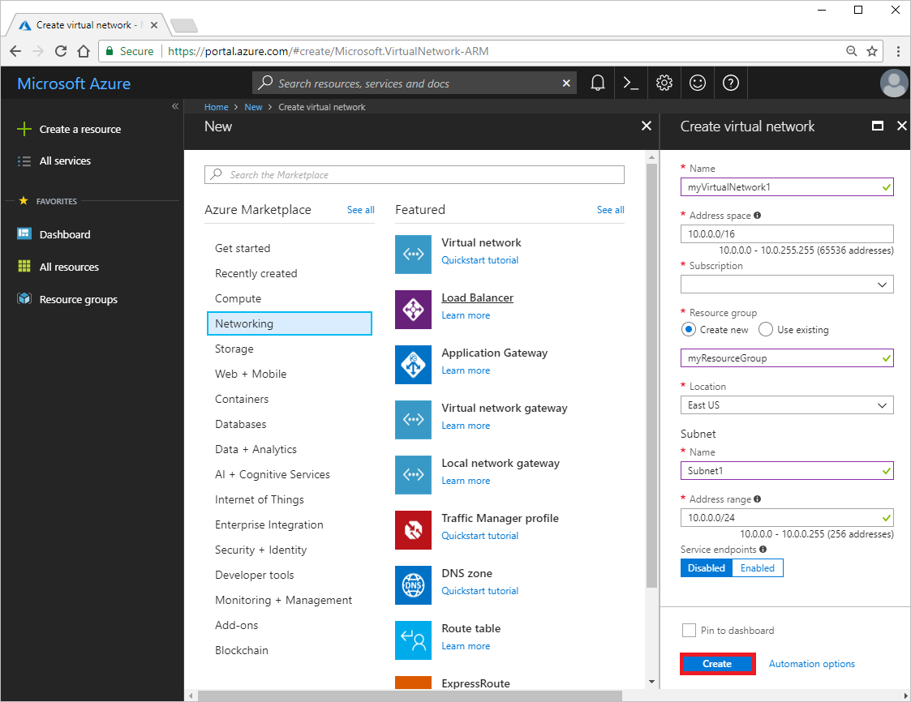
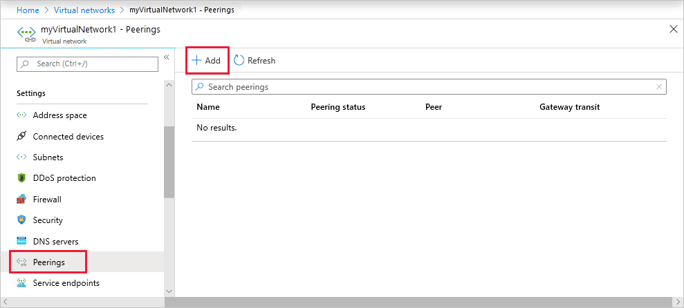
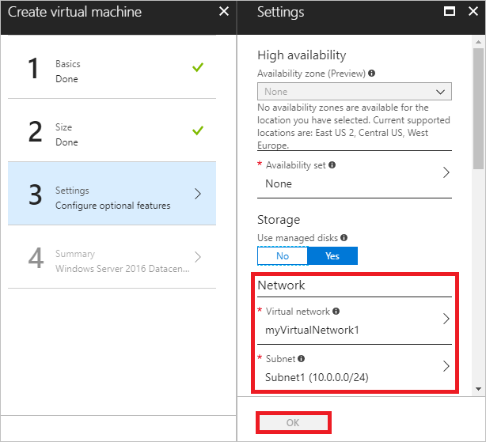

# Connect virtual networks with virtual network peering using the Azure portal

You can connect virtual networks to each other with virtual network peering. Once virtual networks are peered, resources in both virtual networks are able to communicate with each other, with the same latency and bandwidth as if the resources were in the same virtual network. This article covers creation and peering of two virtual networks. You learn how to:

> [!div class="checklist"]
> * Create two virtual networks
> * Create a peering between virtual networks
> * Test peering

If you don't have an Azure subscription, create a [free account](https://azure.microsoft.com/free/?WT.mc_id=A261C142F) before you begin.

## Log in to Azure 

Log in to the Azure portal at http://portal.azure.com.

## Create virtual networks

1. Select **+ Create a resource** on the upper, left corner of the Azure portal.
2. Select **Networking**, and then select **Virtual network**.
3. As shown in the following picture, enter *myVirtualNetwork1* for **Name**, *10.0.0.0/16* for **Address space**, **myResourceGroup** for **Resource group**, *Subnet1* for Subnet **Name**, 10.0.0.0/24 for Subnet **Address range**, select a **Location** and your **Subscription**, accept the remaining defaults, and then select **Create**:

    

4. Complete steps 1-3 again, with the following changes:
    - **Name**: *myVirtualNetwork2*
    - **Resource group**: Select **Use existing** and then select **myResourceGroup**.
    - **Address space**: *10.1.0.0/16*
    - **Subnet Address range**: *10.1.0.0/24*

    The address prefix for the *myVirtualNetwork2* virtual network does not overlap with the address space of the *myVirtualNetwork1* virtual network. You cannot peer virtual networks with overlapping address spaces.

## Peer virtual networks

1. In the Search box at the top of the Azure portal, begin typing *MyVirtualNetwork1*. When **myVirtualNetwork1** appears in the search results, select it.
2. Select **Peerings**, under **SETTINGS**, and then select **+ Add**, as shown in the following picture:

    

3. Enter or select the information shown in the following picture, then select **OK**. To select the *myVirtualNetwork2* virtual network, select **Virtual network**, then select *myVirtualNetwork2*.

    

    The **PEERING STATUS** is *Initiated*, as shown in the following picture:

    

    If you don't see the status, refresh your browser.

4. Search for the *myVirtualNetwork2* virtual network. When it's returned in the search results, select it.
5. Complete steps 1-3 again, with the following changes, and then select **OK**:
    - **Name**: *myVirtualNetwork2-myVirtualNetwork1*
    - **Virtual network**: *myVirtualNetwork1*

    The **PEERING STATUS** is *Connected*. Azure also changed the peering status for the *myVirtualNetwork2-myVirtualNetwork1* peering from *Initiated* to *Connected.* Virtual network peering is not fully established until the peering status for both virtual networks is *Connected.* 

Peerings are between two virtual networks, but are not transitive. So, for example, if you also wanted to peer *myVirtualNetwork2* to *myVirtualNetwork3*, you need to create an additional peering between virtual networks *myVirtualNetwork2* and *myVirtualNetwork3*. Even though *myVirtualNetwork1* is peered with *myVirtualNetwork2*, resources within *myVirtualNetwork1* could only access resources in *myVirtualNetwork3* if *myVirtualNetwork1* was also peered with *myVirtualNetwork3*. 

Before peering production virtual networks, it's recommended that you thoroughly familiarize yourself with the [peering overview](virtual-network-peering-overview.md), [managing peering](virtual-network-manage-peering.md), and [virtual network limits](../azure-subscription-service-limits.md?toc=%2fazure%2fvirtual-network%2ftoc.json#azure-resource-manager-virtual-networking-limits). Though this article illustrates a peering between two virtual networks in the same subscription and location, you can also peer virtual networks in [different regions](#register) and [different Azure subscriptions](create-peering-different-subscriptions.md#portal). You can also create [hub and spoke network designs](/azure/architecture/reference-architectures/hybrid-networking/hub-spoke?toc=%2fazure%2fvirtual-network%2ftoc.json#vnet-peering) with peering.

## Test peering

To test network communication between virtual machines in different virtual networks through a peering, deploy a virtual machine to each subnet and then communicate between the virtual machines. 

### Create virtual machines

Create a virtual machine in each virtual network so you can validate communication between them in a later step.

### Create virtual machines

1. Select **+ Create a resource** on the upper, left corner of the Azure portal.
2. Select **Compute**, and then select **Windows Server 2016 Datacenter**. You can select a different operating system, but the remaining steps assume you selected **Windows Server 2016 Datacenter**. 
3. Select or enter the following information for **Basics**, then select **OK**:
    - **Name**: *myVm1*
    - **Resource group**: Select **Use existing** and then select *myResourceGroup*.
    - **Location**: Select *East US*.

    The **User name** and **Password** you enter are used in a later step. The password must be at least 12 characters long and meet the [defined complexity requirements](../virtual-machines/windows/faq.md?toc=%2fazure%2fvirtual-network%2ftoc.json#what-are-the-password-requirements-when-creating-a-vm). The **Location** and **Subscription** selected must be the same as the location and subscription the virtual network is in. It's not required that you select the same resource group that the virtual network was created in, but the same resource group is selected for this article.
4. Select a VM size under **Choose a size**.
5. Select or enter the following information for **Settings**, then select **OK**:
    - **Virtual network**: Ensure that **myVirtualNetwork1** is selected. If not, select **Virtual network** and then select **myVirtualNetwork1** under **Choose virtual network**.
    - **Subnet**: Ensure that **Subnet1** is selected. If not, select **Subnet** and then select **Subnet1** under **Choose subnet**, as shown in the following picture:
    
        
 
6. Under **Create** in the **Summary**, select **Create** to start the virtual machine deployment.
7. Complete steps 1-6 again, but enter *myVm2* for the **Name** of the virtual machine and select *myVirtualNetwork2* for **Virtual network**.

Azure assigned *10.0.0.4* as the private IP address of the *myVm1* virtual machine, and 10.1.0.4 to the *myVm2* virtual machine, because they were the first available IP addresses in *Subnet1* of the *myVirtualNetwork1* and *myVirtualNetwork2* virtual networks, respectively.

The virtual machines take a few minutes to create. Do not continue with the remaining steps until both virtual machines are created.

### Test virtual machine communication

1. In the *Search* box at the top of the portal, begin typing *myVm1*. When **myVm1** appears in the search results, select it.
2. Create a remote desktop connection to the *myVm1* virtual machine by selecting **Connect**, as shown in the following picture:

      

3. To connect to the VM, open the downloaded RDP file. If prompted, select **Connect**.
4. Enter the user name and password you specified when creating the virtual machine (you may need to select **More choices**, then **Use a different account**, to specify the credentials you entered when you created the virtual machine), then select **OK**.
5. You may receive a certificate warning during the sign-in process. Select **Yes** to proceed with the connection.
6. In a later step, ping is used to communicate with the *myVm2* virtual machine from the *myVmWeb* virtual machine. Ping uses ICMP, which is denied through the Windows Firewall, by default. Enable ICMP through the Windows firewall by entering the following command from a command prompt:

    ```
    netsh advfirewall firewall add rule name=Allow-ping protocol=icmpv4 dir=in action=allow
    ```

    Though ping is used in this article for testing, allowing ICMP through the Windows Firewall for production deployments is not recommended.

7. To connect to the *myVm2* virtual machine, enter the following command from a command prompt on the *myVm1* virtual machine:

    ```
    mstsc /v:10.1.0.4
    ```
    
8. Since you enabled ping on *myVm1*, you can now ping it by IP address:

    ```
    ping 10.0.0.4
    ```
    
    You receive four replies. If you ping by the virtual machine's name (*myVm1*), instead of its IP address, ping fails, because *myVm1* is an unknown host name. Azure's default name resolution works between virtual machines in the same virtual network, but not between virtual machines in different virtual networks. To resolve names across virtual networks, you must [deploy your own DNS server](virtual-networks-name-resolution-for-vms-and-role-instances.md) or use [Azure DNS private domains](../dns/private-dns-overview.md?toc=%2fazure%2fvirtual-network%2ftoc.json).

9. Disconnect your RDP sessions to both *myVm1* and *myVm2*.

## Clean up resources

When no longer needed, delete the resource group and all resources it contains: 

1. Enter *myResourceGroup* in the **Search** box at the top of the portal. When you see **myResourceGroup** in the search results, select it.
2. Select **Delete resource group**.
3. Enter *myResourceGroup* for **TYPE THE RESOURCE GROUP NAME:** and select **Delete**.

**<a name="register"></a>Register for the global virtual network peering preview**

Peering virtual networks in the same region is generally available. Peering virtual networks in different regions is currently in preview. See [Virtual network updates](https://azure.microsoft.com/en-us/updates/?product=virtual-network) for available regions. To peer virtual networks across regions, you must first register for the preview. You can't register using the portal, but you can register using [PowerShell](tutorial-connect-virtual-networks-powershell.md#register) or the [Azure CLI](tutorial-connect-virtual-networks-cli.md#register). If you attempt to peer virtual networks in different regions before registering for the capability, peering fails.

## Next steps

In this article, you learned how to connect two networks with virtual network peering.

Continue to connect your own computer to a virtual network through a VPN, and interact with resources in a virtual network, or in peered virtual networks.

> [!div class="nextstepaction"]
> [Connect your computer to a virtual network](../vpn-gateway/vpn-gateway-howto-point-to-site-resource-manager-portal.md?toc=%2fazure%2fvirtual-network%2ftoc.json)
