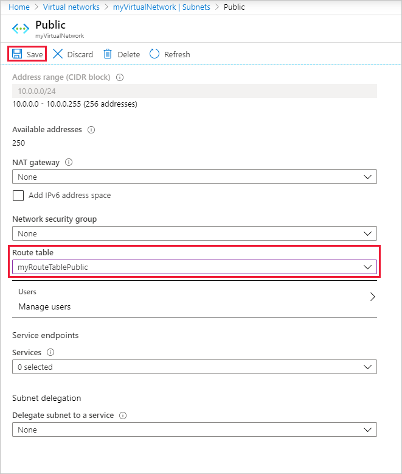
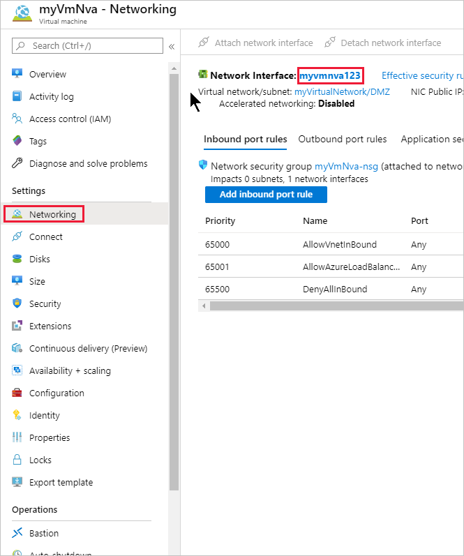
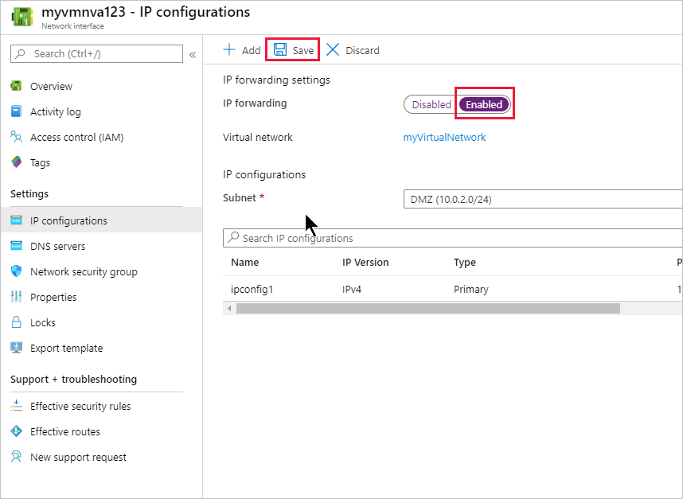

# Tutorial: Route network traffic with a route table using the Azure portal

Azure automatically routes traffic between all subnets within a virtual network, by default. You can create your own routes to override Azure's default routing. The ability to create custom routes is helpful if, for example, you want to route traffic between subnets through a network virtual appliance (NVA). In this tutorial, you learn how to:

> [!div class="checklist"]
> * Create a route table
> * Create a route
> * Create a virtual network with multiple subnets
> * Associate a route table to a subnet
> * Create an NVA that routes traffic
> * Deploy virtual machines (VM) into different subnets
> * Route traffic from one subnet to another through an NVA

If you prefer, you can complete this tutorial using the [Azure CLI](tutorial-create-route-table-cli.md) or [Azure PowerShell](tutorial-create-route-table-powershell.md).

If you don't have an Azure subscription, create a [free account](https://azure.microsoft.com/free/?WT.mc_id=A261C142F) before you begin.

## Sign in to Azure

Sign in to the [Azure portal](https://portal.azure.com).

## Create a route table

1. On the upper-left side of the screen, select **Create a resource** > **Networking** > **Route table**.

1. In **Create route table**, enter or select this information:

    | Setting | Value |
    | ------- | ----- |
    | Name | Enter *myRouteTablePublic*. |
    | Subscription | Select your subscription. |
    | Resource group | Select **Create new**, enter *myResourceGroup*, and select *OK*. |
    | Location | Leave the default **East US**.
    | BGP route propagation | Leave the default **Enabled**. |

1. Select **Create**.

## Create a route

1. In the portal's search bar, enter *myRouteTablePublic*.

1. When **myRouteTablePublic** appears in the search results, select it.

1. In **myRouteTablePublic** under **Settings**, select **Routes** > **+ Add**.

    

1. In **Add route**, enter or select this information:

    | Setting | Value |
    | ------- | ----- |
    | Route name | Enter *ToPrivateSubnet*. |
    | Address prefix | Enter *10.0.1.0/24*. |
    | Next hop type | Select **Virtual appliance**. |
    | Next hop address | Enter *10.0.2.4*. |

1. Select **OK**.

## Associate a route table to a subnet

Before you can associate a route table to a subnet, you have to create a virtual network and subnet. Then you can associate the route table to a subnet.

### Create a virtual network

1. On the upper-left side of the screen, select **Create a resource** > **Networking** > **Virtual network**.

1. In **Create virtual network**, enter or select this information:

    | Setting | Value |
    | ------- | ----- |
    | Name | Enter *myVirtualNetwork*. |
    | Address space | Enter *10.0.0.0/16*. |
    | Subscription | Select your subscription. |
    | Resource group | Select ***Select existing*** > **myResourceGroup**. |
    | Location | Leave the default **East US** |
    | Subnet - Name | Enter *Public*. |
    | Subnet - Address range | Enter *10.0.0.0/24*. |

1. Leave the rest of the defaults and select **Create**.

### Add subnets to the virtual network

1. In the portal's search bar, enter *myVirtualNetwork*.

1. When **myVirtualNetwork** appears in the search results, select it.

1. In **myVirtualNetwork**, under **Settings**, select **Subnets** > **+ Subnet**.

    

1. In **Add subnet**, enter this information:

    | Setting | Value |
    | ------- | ----- |
    | Name | Enter *Private*. |
    | Address space | Enter *10.0.1.0/24*. |

1. Leave the rest of the defaults and select **OK**.

1. Select **+ Subnet** again. This time, enter this information:

    | Setting | Value |
    | ------- | ----- |
    | Name | Enter *DMZ*. |
    | Address space | Enter *10.0.2.0/24*. |

1. Just like the last time, leave the rest of the defaults and select **OK**.

    Three subnets are displayed: **Public**, **Private**, and **DMZ**.

### Associate myRouteTablePublic to your Public subnet

1. Select **Public**.

1. In **Public**, select **Route table** > **MyRouteTablePublic** > **Save**.

    

## Create an NVA

An NVA is a VM that performs a network function, such as routing and firewall or WAN optimization.

1. On the upper-left side of the screen, select **Create a resource** > **Compute** > **Windows Server 2016 Datacenter**.

    > [!NOTE]
    > You can select a different operating system if you want. The remaining steps assume you've selected **Windows Server 2016 Datacenter**.

1. In **Create a virtual machine - Basics**, enter or select this information:

    | Setting | Value |
    | ------- | ----- |
    | **PROJECT DETAILS** | |
    | Subscription | Select your subscription. |
    | Resource group | Select **myResourceGroup**. |
    | **INSTANCE DETAILS** |  |
    | Virtual machine name | Enter *myVmNva*. |
    | Region | Select **East US**. |
    | Availability options | Leave the default **No infrastructure redundancy required**. |
    | Image | Leave the default **Windows Server 2016 Datacenter**. |
    | Size | Leave the default **Standard DS1 v2**. |
    | **ADMINISTRATOR ACCOUNT** |  |
    | Username | Enter a user name of your choosing. |
    | Password | Enter a password of your choosing. The password must be at least 12 characters long and meet the [defined complexity requirements](../virtual-machines/windows/faq.md?toc=%2fazure%2fvirtual-network%2ftoc.json#what-are-the-password-requirements-when-creating-a-vm).|
    | Confirm Password | Reenter password. |
    | **INBOUND PORT RULES** |  |
    | Public inbound ports | Leave the default **None**.
    | **SAVE MONEY** |  |
    | Already have a Windows license? | Leave the default **No**. |

1. Select **Next : Disks**.

1. In **Create a virtual machine - Disks**, select the settings that are right for your needs.

1. Select **Next : Networking**.

1. In **Create a virtual machine - Networking**, select this information::

    | Setting | Value |
    | ------- | ----- |
    | Virtual network | Leave the default **myVirtualNetwork**. |
    | Subnet | Select **DMZ (10.0.2.0/24)**. |
    | Public IP | Select **None**. No public IP address is needed since the VM won't be connected to from the internet.|

1. Leave the rest of the defaults and select **Next : Management**.

1. In **Create a virtual machine - Management**, for **Diagnostics storage account**, select **Create New**.

1. In **Create storage account**, enter or select this information:

    | Setting | Value |
    | ------- | ----- |
    | Name | Enter *mynvastorageaccount*. |
    | Account kind | Leave the default **Storage (general purpose v1)**. |
    | Performance | Leave the default **Standard**. |
    | Replication | Leave the default **Locally-redundant storage (LRS)**.

1. Select **OK**

1. Select **Review + create**. You're taken to the **Review + create** page and Azure validates your configuration.

1. When you see that **Validation passed**, select **Create**.

    The VM takes a few minutes to create. Do not continue to the next step until Azure finishes creating the VM. The **Your deployment is underway** page will show you deployment details.

1. When your VM is ready, select **Go to resource**.

## Turn on IP forwarding

For a network interface to be able to forward network traffic sent to it, that is not destined for its own IP address IP forwarding must be enabled for the network interface.

1. On **myVmNva**, under **Settings**, select **Networking**.

1. Select **myvmnva123**.

    > [!NOTE]
    > That's the network interface Azure created for your VM. It will have a string of numbers to make it unique for you.

    

1. Under **Settings**, select **IP configurations**.

1. On **myvmnva123 - IP configurations**, for **IP forwarding**, select **Enabled** and then select **Save**.

    

## Create public and private virtual machines

Create two VMs in the virtual network, so you can validate that traffic from the *Public* subnet is routed to the *Private* subnet through the NVA in a later step.

Complete steps 1-12  of [Create an NVA](#create-an-nva). Use most of the same settings. These are the ones that have to be different:

| Setting | Value |
| ------- | ----- |
| **PUBLIC VM** | |
| BASICS |  |
| Virtual machine name | Enter *myVmPublic*. |
| NETWORKING | |
| Subnet | Select **Public (10.0.0.0/24)** |
| Public IP address | Accept the default. |
| Network security ports | Select **Allow selected ports**. |
| Select inbound ports | Select **HTTP** and **RDP**. |
| MANAGEMENT | |
| Diagnostics storage account | Leave the default **mynvastorageaccount**. |
| **PRIVATE VM** | |
| BASICS |  |
| Virtual machine name | Enter *myVmPrivate*. |
| NETWORKING | |
| Subnet | Select **Private (10.0.1.0/24)**|
| Public IP address | Accept the default. |
| Network security ports | Select **Allow selected ports**. |
| Select inbound ports | Select **HTTP** and **RDP**. |
| MANAGEMENT | |
| Diagnostics storage account | Leave the default **mynvastorageaccount**. |

> [!TIP]
> You can create the *myVmPrivate* VM while Azure creates the *myVmPublic* VM. Do not continue with the following steps until Azure finishes creating both VMs.

## Route traffic through an NVA

### Sign in to myVmPrivate over remote desktop

1. In the *Search* box at the top of the portal, enter *myVmPrivate*. When the **myVmPrivate** VM appears in the search results, select it.

1. Select **Connect** to create a remote desktop connection to the *myVmPrivate* VM.

1. In **Connect to virtual machine**, select **Download RDP File**. Azure creates a Remote Desktop Protocol (*.rdp*) file and downloads it to your computer.

1. Open the downloaded *.rdp* file.

    1. If prompted, select **Connect**.

    1. Enter the user name and password you specified when creating the Private VM.

        > [!NOTE]
        > You may need to select **More choices** > **Use a different account**, to use the Private VM credentials.

1. Select **OK**.

1. You may receive a certificate warning during the sign-in process. Select **Yes** to proceed with the connection.

### Enable ICPM through the Windows firewall

In a later step, the trace route tool is used to test routing. Trace route uses the Internet Control Message Protocol (ICMP), which is denied through the Windows Firewall. Enable ICMP through the Windows firewall.

1. In the Remote Desktop of *myVmPrivate*, open PowerShell.

1. Enter this command:

    ```powershell
    New-NetFirewallRule –DisplayName “Allow ICMPv4-In” –Protocol ICMPv4
    ```

    > [!CAUTION]
    > Though trace route is used to test routing in this tutorial, allowing ICMP through the Windows Firewall for production deployments is not recommended.

### Turn on IP forwarding within myVmNva

You turned on IP forwarding within Azure for the VM's network interface in [Turn on IP forwarding](#turn-on-ip-forwarding). Within the VM, the operating system, or an application running within the VM, must also be able to forward network traffic. Enable IP forwarding within the operating system of the *myVmNva* VM:

1. From a command prompt on the *myVmPrivate* VM, open a remote desktop to the *myVmNva* VM:

    ```cmd
    mstsc /v:myvmnva
    ```

1. To enable IP forwarding within the operating system, enter the following command in PowerShell from the *myVmNva* VM:

    ```powershell
    Set-ItemProperty -Path HKLM:\SYSTEM\CurrentControlSet\Services\Tcpip\Parameters -Name IpEnableRouter -Value 1
    ```

1. Restart the *myVmNva* VM. From the taskbar, eelect **Start button** > **Power button**, **Other (Planned)** > **Continue**.

    That also disconnects the remote desktop session.

1. After the *myVmNva* VM restarts, create a remote desktop session to the *myVmPublic* VM. While still connected to the *myVmPrivate* VM, open a command prompt and run this command:

    ```cmd
    mstsc /v:myVmPublic
    ```
1. In the Remote Desktop of *myVmPublic*, open PowerShell.

1. Enable ICMP through the Windows firewall by entering this command:

    ```powershell
    New-NetFirewallRule –DisplayName “Allow ICMPv4-In” –Protocol ICMPv4
    ```

1. To test routing of network traffic to the *myVmPrivate* VM  from the *myVmPublic* VM, enter the following command from PowerShell on the *myVmPublic* VM:

    ```powershell
    tracert myVmPrivate
    ```

    The response is similar to the following example:

    ```powershell
    Tracing route to myVmPrivate.vpgub4nqnocezhjgurw44dnxrc.bx.internal.cloudapp.net [10.0.1.4]
    over a maximum of 30 hops:

    1    <1 ms     *        1 ms  10.0.2.4
    2     1 ms     1 ms     1 ms  10.0.1.4

    Trace complete.
    ```

    You can see that the first hop is 10.0.2.4, which is the NVA's private IP address. The second hop is 10.0.1.4, the private IP address of the *myVmPrivate* VM. The route added to the *myRouteTablePublic* route table and associated to the *Public* subnet caused Azure to route the traffic through the NVA, rather than directly to the *Private* subnet.

1. Close the remote desktop session to the *myVmPublic* VM, which leaves you still connected to the *myVmPrivate* VM.

1. To test routing of network traffic to the *myVmPublic* VM from the *myVmPrivate* VM, enter the following command from a command prompt on the *myVmPrivate* VM:

    ```cmd
    tracert myVmPublic
    ```

    The response is similar to the following example:

    ```cmd
    Tracing route to myVmPublic.vpgub4nqnocezhjgurw44dnxrc.bx.internal.cloudapp.net [10.0.0.4]
    over a maximum of 30 hops:

    1     1 ms     1 ms     1 ms  10.0.0.4

    Trace complete.
    ```

    You can see that traffic is routed directly from the *myVmPrivate* VM to the *myVmPublic* VM. By default, Azure routes traffic directly between subnets.

1. Close the remote desktop session to the *myVmPrivate* VM.

## Clean up resources

When no longer needed, delete the resource group and all resources it contains:

1. Enter *myResourceGroup* in the **Search** box at the top of the portal. When you see **myResourceGroup** in the search results, select it.

1. Select **Delete resource group**.

1. Enter *myResourceGroup* for **TYPE THE RESOURCE GROUP NAME:** and select **Delete**.

## Next steps

In this tutorial, you created a route table and associated it to a subnet. You created a simple NVA that routed traffic from a public subnet to a private subnet. Deploy a variety of pre-configured NVAs that perform network functions such as firewall and WAN optimization from the [Azure Marketplace](https://azuremarketplace.microsoft.com/marketplace/apps/category/networking). To learn more about routing, see [Routing overview](virtual-networks-udr-overview.md) and [Manage a route table](manage-route-table.md).

While you can deploy many Azure resources within a virtual network, resources for some Azure PaaS services cannot be deployed into a virtual network. You can still restrict access to the resources of some Azure PaaS services to traffic only from a virtual network subnet though. To learn how to restrict network access to Azure PaaS resources, advance to the next tutorial.

> [!div class="nextstepaction"]
> [Restrict network access to PaaS resources](tutorial-restrict-network-access-to-resources.md)
