# Tutorial: Restrict network access to PaaS resources with virtual network service endpoints using the Azure portal

Virtual network service endpoints enable you to limit network access to some Azure service resources to a virtual network subnet. You can also remove internet access to the resources. Service endpoints provide direct connection from your virtual network to supported Azure services, allowing you to use your virtual network's private address space to access the Azure services. Traffic destined to Azure resources through service endpoints always stays on the Microsoft Azure backbone network. In this tutorial, you learn how to:

> [!div class="checklist"]
> * Create a virtual network with one subnet
> * Add a subnet and enable a service endpoint
> * Create an Azure resource and allow network access to it from only a subnet
> * Deploy a virtual machine (VM) to each subnet
> * Confirm access to a resource from a subnet
> * Confirm access is denied to a resource from a subnet and the internet

If you prefer, you can complete this tutorial using the [Azure CLI](tutorial-restrict-network-access-to-resources-cli.md) or [Azure PowerShell](tutorial-restrict-network-access-to-resources-powershell.md).

If you don't have an Azure subscription, create a [free account](https://azure.microsoft.com/free/?WT.mc_id=A261C142F) before you begin.

## Log in to Azure

Log in to the Azure portal at https://portal.azure.com.

## Create a virtual network

1. Select **+ Create a resource** on the upper, left corner of the Azure portal.
2. Select **Networking**, and then select **Virtual networks**.
3. Click **+ Add** and enter the following information: 

   |Setting|Value|
   |----|----|
   |Subscription| Select your subscription|
   |Resource group | Select **Create new** and enter *myResourceGroup*.|
   |Name| Enter *myVirtualNetwork* |
   |Region| Select **(US) East US** |

   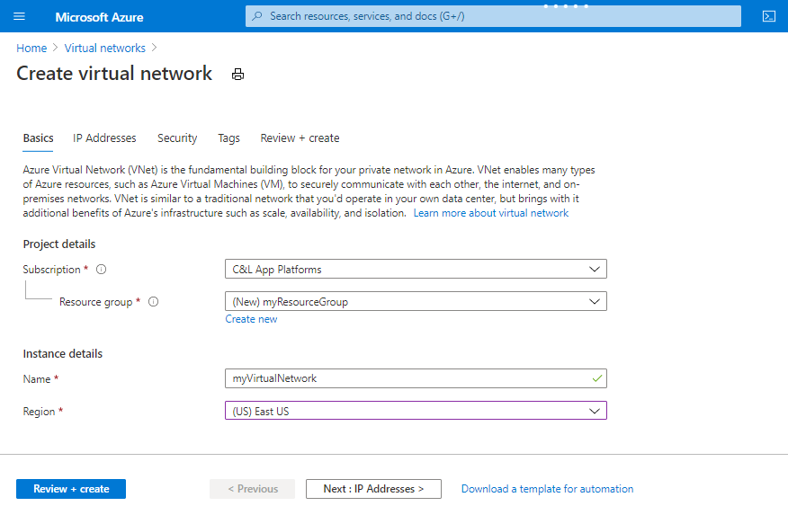

4. Click **Next: IP addresses >**
   
   |Setting|Value|
   |----|----|
   |IPv4Address space| Leave as default |
   |Subnet name| Click **default** and change the name from "default" to "Public"|
   |Subnet Address Range| Leave as default|

5. Click **Next: Security >** 
   
   |Setting|Value|
   |----|----|   
   |BastionHost| Disable|
   |DDoS protection| Disable|
   |Firewall| Disable|

6. When complete, click **Review and create**.
7. If the validation checks pass, click **Create**.
8. Wait for the deployment to finish, then click **Go to resource** or move on to the next section. 

## Enable a service endpoint

Service endpoints are enabled per service, per subnet. To create a subnet and enable a service endpoint for the subnet:

1. If you are not already on the virtual network resource page, you can search for the newly created network in the **Search resources, services, and docs** box at the top of the portal, enter *myVirtualNetwork*, and select it from the list.
2. In the **Settings** menu (left), select **Subnets**, and then select **+ Subnet**, as shown:

    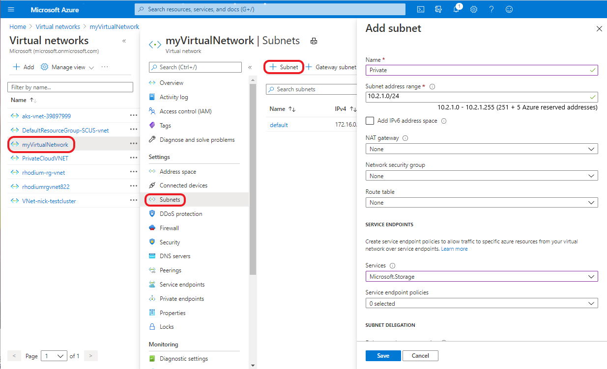 

3. Under **Add subnet**, select or enter the following information, and then select **OK**:

    |Setting|Value|
    |----|----|
    |Name| Private |
    |Address range| Leave as default|
    |Service endpoints| Select **Microsoft.Storage**|
    |Service endpoint policies | Leave default as 0 |

> [!CAUTION]
> Before enabling a service endpoint for an existing subnet that has resources in it, see [Change subnet settings](virtual-network-manage-subnet.md#change-subnet-settings).

4. Click **Save**, then close the Subnet window on the right. The newly created subnet should appear the list.

## Restrict network access for a subnet

By default, all virtual machine instances in a subnet can communicate with all resources. You can limit communication to and from all resources in a subnet by creating a network security group, and associating it to the subnet:

1. Select **All services** in the upper left corner of the Azure portal.
2. Select **Networking**, and then select (or search for) **Network security groups**.
3. From the **Network security groups** page, click **+ Add**.
4. Enter the following information 

    |Setting|Value|
    |----|----|
    |Subscription| Select your subscription|
    |Resource group | Select *myResourceGroup* from the list|
    |Name| Enter **myNsgPrivate** |
    |Location| Select **East US** |

5. Click **Review + create**, and when the validation check is passed, click **Create**.
6. After the network security group is created, click **Go to resource** or search for *myNsgPrivate*.
7. Under **Settings** on the left, select **Outbound security rules**.
8. Select **+ Add**.
9. Create a rule that allows outbound communication to the Azure Storage service. Enter, or select, the following information, and then select **Add**:

    |Setting|Value|
    |----|----|
    |Source| Select **VirtualNetwork** |
    |Source port ranges| * |
    |Destination | Select **Service Tag**|
    |Destination service tag | Select **Storage**|
    |Destination port ranges| Leave default as *8080* |
    |Protocol|Any|
    |Action|Allow|
    |Priority|100|
    |Name|Rename to **Allow-Storage-All**|

10. Create another outbound security rule that denies communication to the internet. This rule overrides a default rule in all network security groups that allows outbound internet communication. Complete steps 6-9 from above using the following values:

    |Setting|Value|
    |----|----|
    |Source| Select **VirtualNetwork** |
    |Source port ranges| * |
    |Destination | Select **Service Tag**|
    |Destination service tag| Select **Internet**|
    |Destination port ranges| * |
    |Protocol|Any|
    |Action|**Change default to *Deny*** |
    |Priority|110|
    |Name|Change to *Deny-Internet-All*|

11. Create an *inbound security rule* that allows Remote Desktop Protocol (RDP) traffic to the subnet from anywhere. The rule overrides a default security rule that denies all inbound traffic from the internet. Remote desktop connections are allowed to the subnet so that connectivity can be tested in a later step. 
12. Under **Settings**, select **Inbound security rules**.
13. Select **+ Add** and use the following values:

    |Setting|Value|
    |----|----|
    |Source| Any |
    |Source port ranges| * |
    |Destination | Select **VirtualNetwork**|
    |Destination port ranges| Change to *3389* |
    |Protocol|Any|
    |Action|Allow|
    |Priority|120|
    |Name|Change to *Allow-RDP-All*|

      >[!WARNING] RDP port 3389 is exposed to the Internet. This is only recommended for testing. For *Production environments*, we recommend using a VPN or private connection.

1.  Under **Settings**, select **Subnets**.
2.  Click **+ Associate**.
3.  Under **Virtual network**, select **myVirtualNetwork**.
4.  Under **Subnet**, select **Private**, and then select **Ok**.

## Restrict network access to a resource

The steps required to restrict network access to resources created through Azure services, which are enabled for service endpoints will vary across services. See the documentation for individual services for specific steps for each service. The remainder of this tutorial includes steps to restrict network access for an Azure Storage account, as an example.

### Create a storage account

1. Select **+ Create a resource** on the upper, left corner of the Azure portal.
2. Enter "Storage account" in the search bar, and select it from the drop-down menu.
3. Click **+ Add**.
4. Enter the following information:

    |Setting|Value|
    |----|----|
    |Subscription| Select your subscription|
    |Resource group| Select *myResourceGroup*|
    |Storage Account Name| Enter a name that is unique across all Azure locations, between 3-24 characters in length, using only numbers and lower-case letters.|
    |Location| Select **(US) East US** |
    |Performance|Standard|
    |Account kind| StorageV2 (general purpose v2)|
    |Replication| Locally-redundant storage (LRS)|

5. Select **Create + review**, and when validation checks have passed, click **Create**. 

>[!NOTE] 
> The deployment may take a couple of minutes to complete.

6. After the storage account is created, click **Go to resource**

### Create a file share in the storage account

1. Go to your storage account overview page.
2. Select the **File Shares** app icon, then click **+ File share**.

    |Setting|Value|
    |----|----|
    |Name| my-file-share|
    |Quota| 'Set to maximum' |

   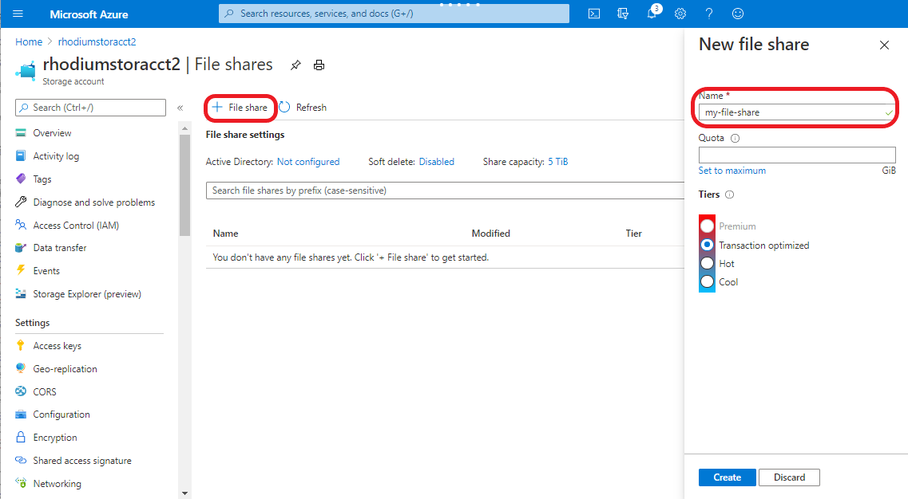 

3. Click **Create**.
4. The file share should be shown in the Azure window, if not click **Refresh**

### Restrict network access to a subnet

By default, storage accounts accept network connections from clients in any network, including the internet. You can restrict network access from the internet, and all other subnets in all virtual networks (except the *Private* subnet in the *myVirtualNetwork* virtual network.) To restrict network access to a subnet:

1. Under **Settings** for your (uniquely named) storage account, select **Networking**.
2. Select **Selected networks**.
3. Select **+ Add existing virtual network**.
4. Under **Add networks**, select the following values, and then select **Add**:

    |Setting|Value|
    |----|----|
    |Subscription| Select your subscription|
    |Virtual networks| **myVirtualNetwork**|
    |Subnets| **Private**|

    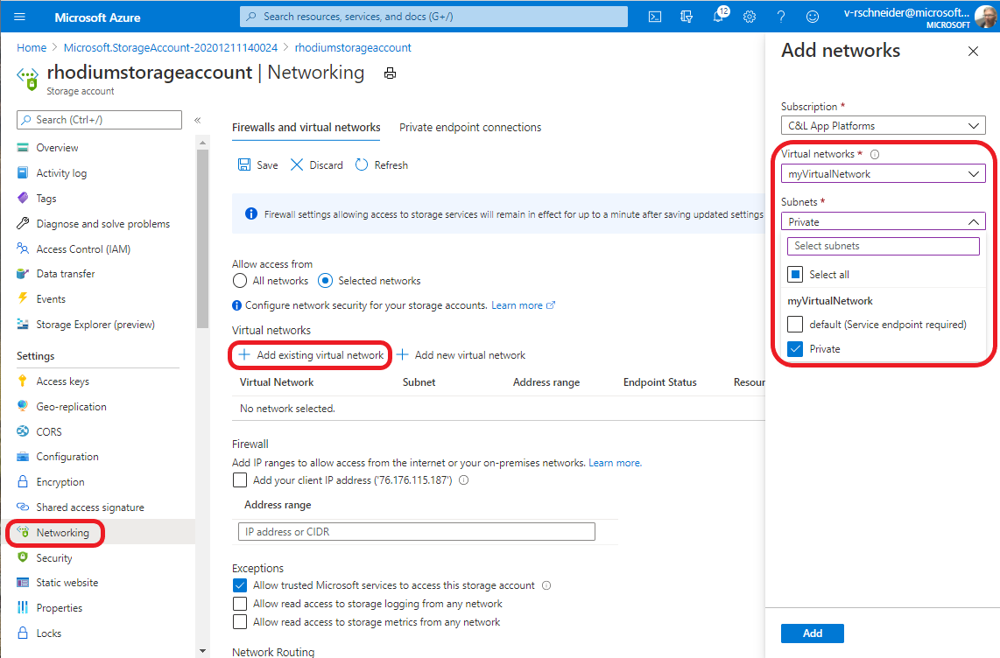

5. Click **Add** and, then immediately click the **Save** icon to save the changes.
6. Under **Settings** for the storage account, select **Access keys**, as shown in the following image:

      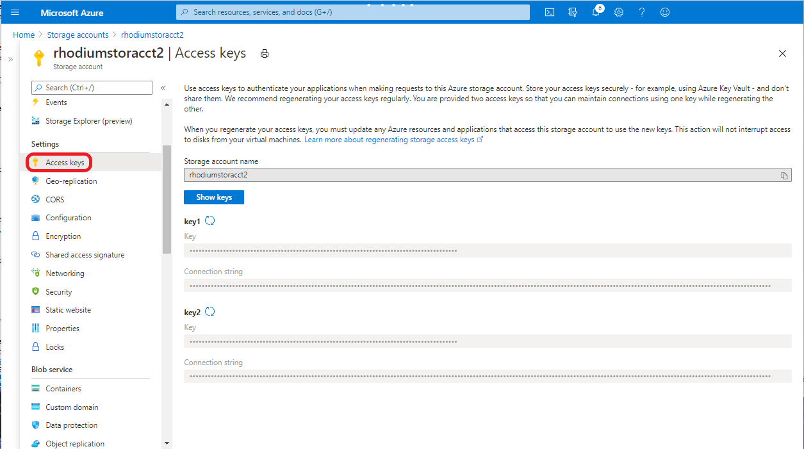

7. Click **Show keys** and note the **Key** values, as you'll have to manually enter key1 in a later step when mapping the file share to a drive letter in a VM.

## Create virtual machines

To test network access to a storage account, deploy a VM to each subnet.

### Create the first virtual machine

1. From the "Search resources . . ." bar, search for **Virtual machines**.
2. Select **+ Add > Virtual machine**. 
3. Enter, the following information:

   |Setting|Value|
   |----|----|
   |Subscription| Select your subscription|
   |Resource group| Select **myResourceGroup, which was created earlier.|
   |Virtual machine name| Enter *myVmPublic*|
   |Region | (US) East US
   |Availability options| Availability zone|
   |Availability zone | 1 |
   |Image | Windows Server 2019 Datacenter - Gen1 |
   |Size | Select the VM Instance size you want to use |
   |Username|Enter a user name of your choosing.|
   |Password| Enter a password of your choosing. The password must be at least 12 characters long and meet the [defined complexity requirements](../virtual-machines/windows/faq.md?toc=%2fazure%2fvirtual-network%2ftoc.json#what-are-the-password-requirements-when-creating-a-vm).|
   |Public inbound ports | Allow selected ports |
   |Select inbound ports | Leave default set to *RDP (3389)* |

   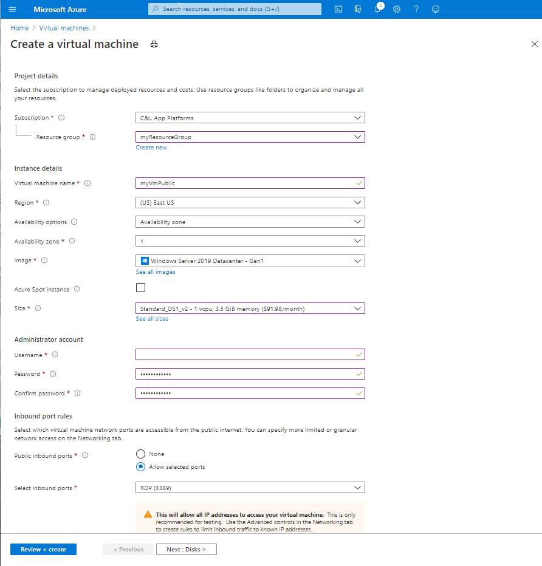
  
4. Select the **Networking** tab and then select **myVirtualNetwork**. 
5. Select the *Public* subnet.
6. Under **NIC Network Security Group**, select **Advanced**. The portal automatically creates a network security group for you that allows port 3389, which you'll need open to connect to the virtual machine in a later step. 

   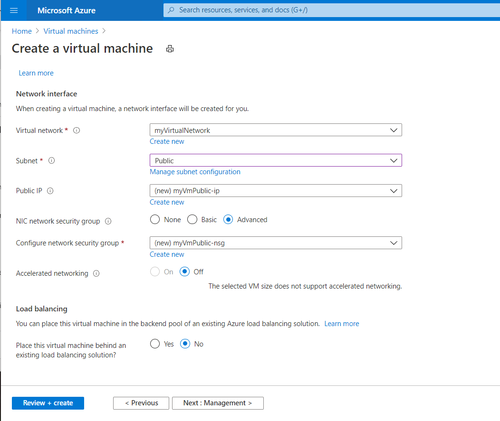

7. Select **Review and create**, then **Create** and wait for the deployment to finish.
8. Click **Go to resource**, or open the **Home > Virtual machines** page, and select the VM you just created *myVmPublic*, which should be started.

### Create the second virtual machine

1. Complete steps 1-8 again, but in step 3, name the virtual machine *myVmPrivate* and set **Public inbound port** to "None". 
2. In step 4-5, select the **Private** subnet.

>[!NOTE]
> The **NIC network security group** and **Public inbound ports** settings should mirror the image shown below, including the blue confirmation window stating: "all public internet traffic will be blocked by default".

   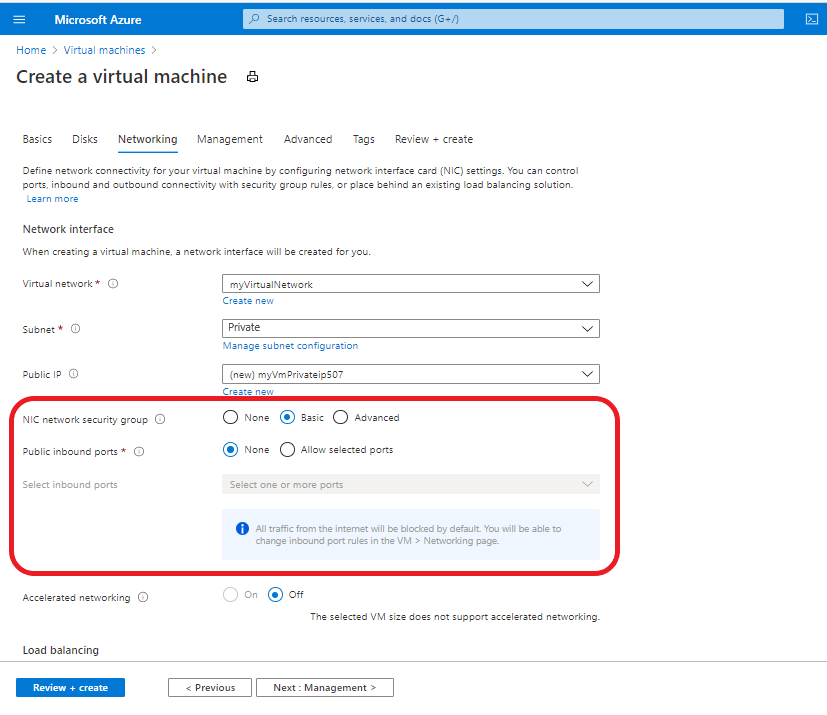

3. Select **Review and create**, then **Create** and wait for the deployment to finish. 

>[!WARNING]
> Please do not continue to the next step until the deployment is complete.

4. Wait for the confirmation window shown below and click **Go to resource**.

   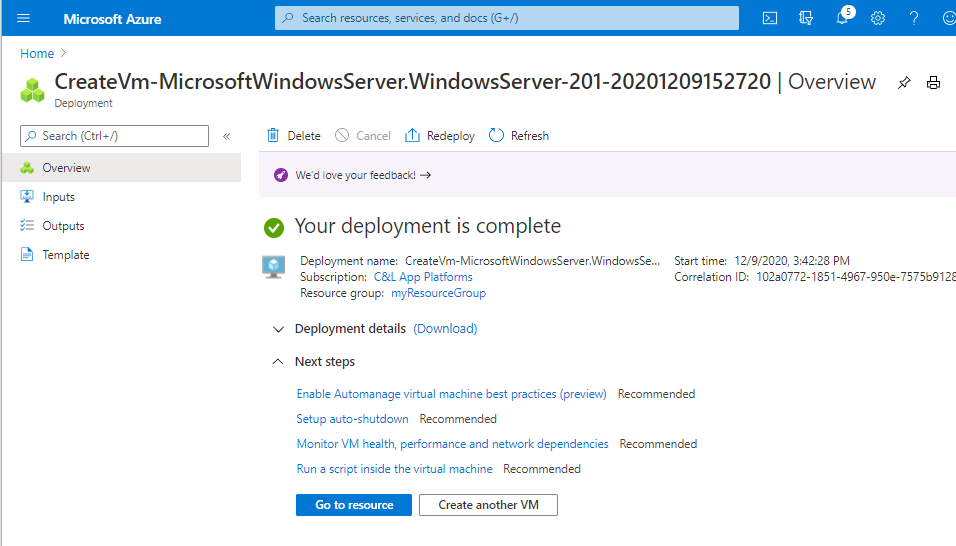

## Confirm access to storage account

1. Once the *myVmPrivate* VM has been created, click **Go to resource**. 
2. Connect to the VM by selecting the **Connect > RDP**.
3. After selecting the **Connect** button, a Remote Desktop Protocol (.rdp) file is created. Click **Download RDP File** to download to your computer.  
4. Open the downloaded rdp file. If prompted, select **Connect**. Enter the user name and password you specified when creating the VM. You may need to select **More choices**, then **Use a different account** to specify the credentials you entered when you created the VM. For the email field, enter the "Administrator account: username" credentials you specified earlier. 
5. Select **OK**.
6. You may receive a certificate warning during the sign-in process. If you receive the warning, select **Yes** or **Continue**, to proceed with the connection. You should see the VM start as shown:

   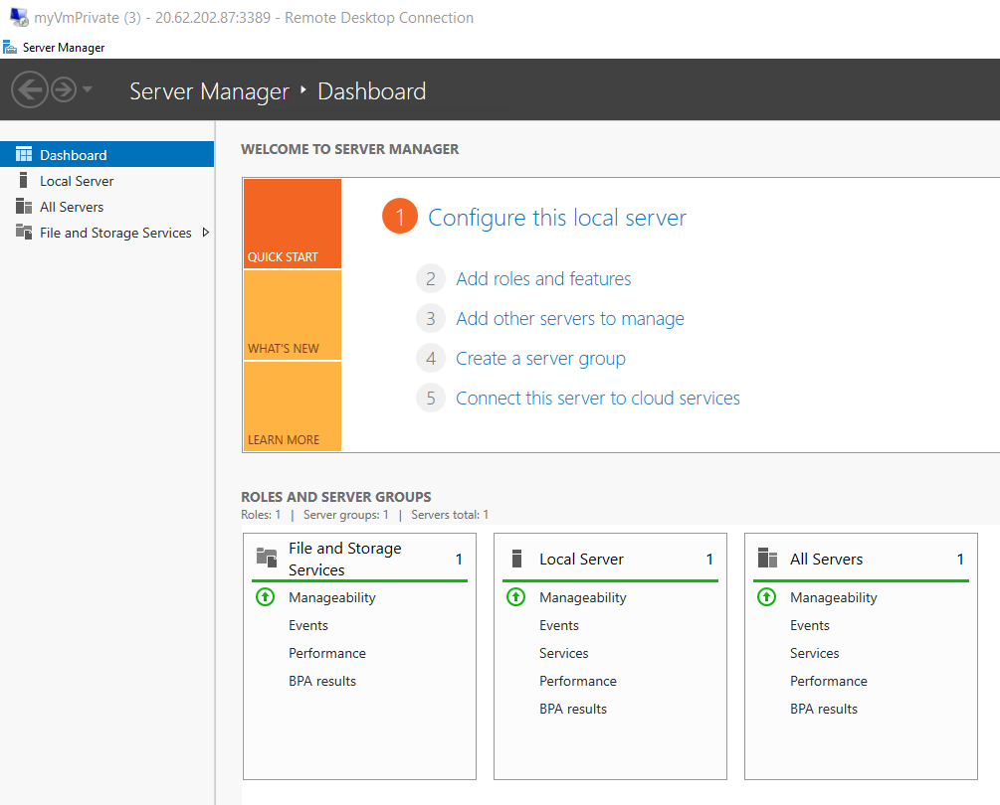

7. In the VM window, open a PowerShell CLI instance.
8. Using the script below, map the Azure file share to drive Z using PowerShell. Before running the commands that follow, replace `<storage-account-key>` and both `<storage-account-name>` fields with values you supplied and "d earlier in [Create a storage account](#create-a-storage-account).

   ```powershell
   $acctKey = ConvertTo-SecureString -String "<storage-account-key>" -AsPlainText -Force
   $credential = New-Object System.Management.Automation.PSCredential -ArgumentList "Azure\<storage-account-name>", $acctKey
   New-PSDrive -Name Z -PSProvider FileSystem -Root "\\<storage-account-name>.file.core.windows.net\my-file-share" -Credential $credential
   ```

   PowerShell returns output similar to the following example output:

   ```powershell
   Name           Used (GB)     Free (GB) Provider      Root
   ----           ---------     --------- --------      ----
   Z                                      FileSystem    \\vnt.file.core.windows.net\my-f...
   ```

   The Azure file share successfully mapped to the Z drive.

9.   Close the remote desktop session to the *myVmPrivate* VM.

## Confirm access is denied to storage account

1. Enter *myVmPublic* In the **Search resources, services, and docs** box at the top of the portal.
2. When **myVmPublic** appears in the search results, select it.
3. Complete steps 1-8 above in [Confirm access to storage account](#confirm-access-to-storage-account) for the *myVmPublic* VM.

   After a short wait, you receive a `New-PSDrive : Access is denied` error. Access is denied because the *myVmPublic* VM is deployed in the *Public* subnet. The *Public* subnet does not have a service endpoint enabled for Azure Storage. The storage account only allows network access from the *Private* subnet, not the *Public* subnet.

4. Close the remote desktop session to the *myVmPublic* VM.
5. Back in the Azure portal, go to the uniquely named storage account you created earlier.
6. Under File Service, select **File shares**, the *my-file-share*, created earlier.
7. You should receive the following error message:

   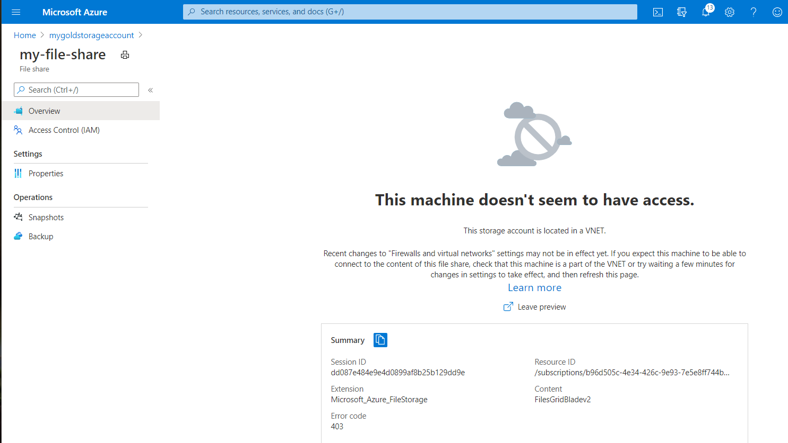
   
>[!NOTE] 
> Access is denied, because your computer is not in the *Private* subnet of the *MyVirtualNetwork* virtual network.

## Clean up resources

When no longer needed, delete the resource group and all resources it contains:

1. Enter *myResourceGroup* in the **Search** box at the top of the portal. When you see **myResourceGroup** in the search results, select it.
2. Select **Delete resource group**.
3. Enter *myResourceGroup* for **TYPE THE RESOURCE GROUP NAME:** and select **Delete**.

## Next steps

In this tutorial, you enabled a service endpoint for a virtual network subnet. You learned that you can enable service endpoints for resources deployed from multiple Azure services. You created an Azure Storage account and restricted network access to the storage account to only resources within a virtual network subnet. To learn more about service endpoints, see [Service endpoints overview](virtual-network-service-endpoints-overview.md) and [Manage subnets](virtual-network-manage-subnet.md).

If you have multiple virtual networks in your account, you may want to connect two virtual networks together so the resources within each virtual network can communicate with each other. To learn how to connect virtual networks, advance to the next tutorial.

> [!div class="nextstepaction"]
> [Connect virtual networks](./tutorial-connect-virtual-networks-portal.md)
