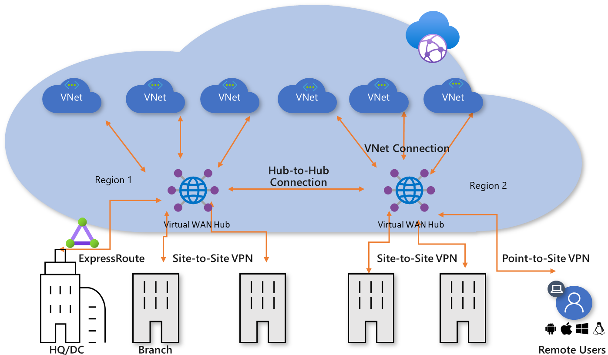
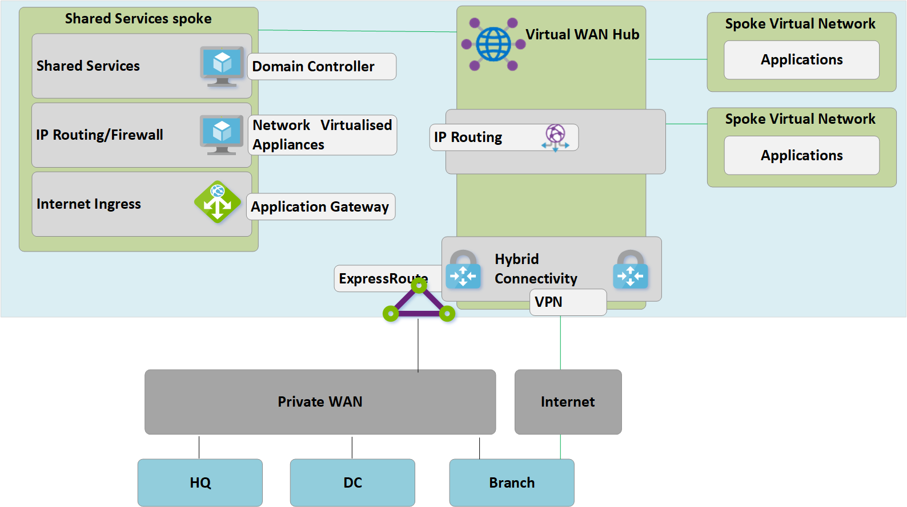
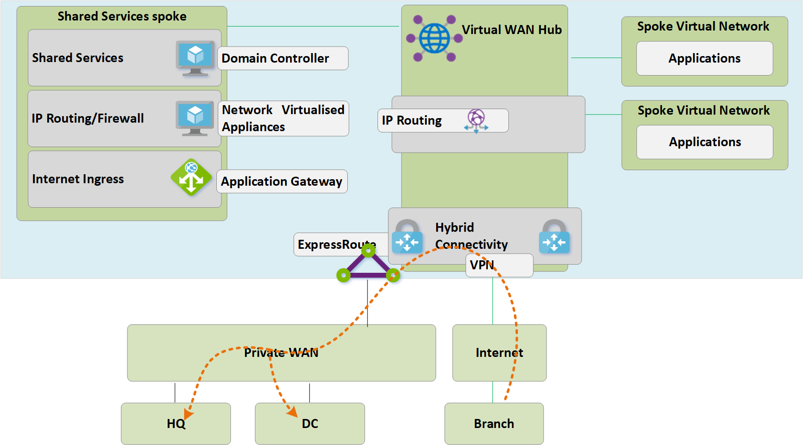
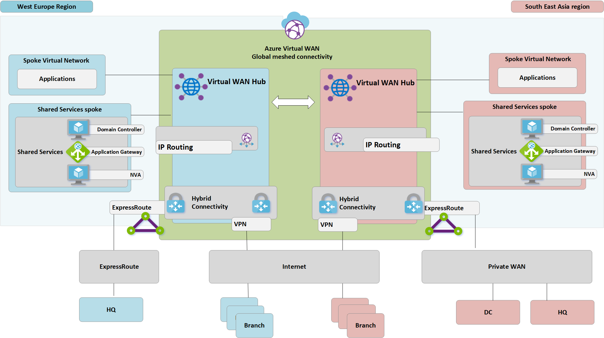
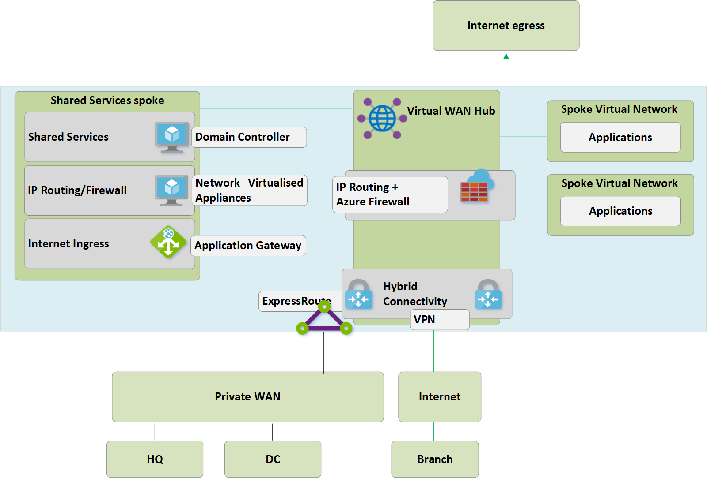

# Migrate to Azure Virtual WAN
Azure Virtual WAN allows companies to simplify their global connectivity and benefit from the scale of the Microsoft global network. This white paper provides technical details for companies wishing to migrate from an existing customer-managed hub-and-spoke topology to a design leveraging Microsoft-managed Virtual WAN hubs.

The [Global transit network architecture and Virtual WAN](virtual-wan-global-transit-network-architecture.md) article highlights the benefits that Azure Virtual WAN enables for enterprises adopting a cloud-centric modern enterprise global network.

**Figure 1: Azure Virtual WAN**

The Azure Virtual Datacenter (VDC) hub-and-spoke connectivity model has been adopted by 1000s of our customers to leverage the default transitive routing behavior  of Azure Networking to build simple and scalable cloud networks. Azure Virtual WAN builds on these concepts and introduces new capabilities that allow global connectivity topologies, not only between on-premises locations and Azure but also allowing customers to leverage the scale of the Microsoft network to augment their existing global networks.

This article describes how to migrate an existing hybrid environment to virtual WAN.

## Scenario

Contoso are a global financial organization with offices in both Europe and Asia. They are planning to move their existing applications from their on-premises domain controller in to Azure and have built out a foundation design based on the VDC architecture, including regional customer-managed hub virtual networks for hybrid connectivity. As part of the move to cloud- based technologies the network team have been tasked with ensuring their connectivity is optimized for the business moving forward.

Figure 2 shows a high-level view of the existing global network including connectivity to multiple Azure regions.

**Figure 2: Contoso existing network topology**

The following points can be understood from the existing network topology:
 
- Hub-and-spoke model used in multiple regions. Utilizing ExpressRoute Premium circuits for connectivity back to a common private WAN.
- Some of these sites also have VPN tunnels directly in to Azure to reach applications hosted within the Microsoft cloud.

## Requirements
The networking team have been tasked with delivering a global network model that can support the Contoso migration to the cloud and must optimize in the areas of cost, scale, and performance. In summary, the following requirements are to be met:
- Provide both head quarter (HQ) and branch offices with optimized path to cloud hosted applications. 
- Remove the reliance on existing on-premises domain controllers (DC) for VPN termination whilst retaining the following connectivity paths:
    - **Branch -to- VNet**: VPN connected offices must be able to access applications migrated to the cloud in the local Azure region.
    - **Branch -to- Hub -to- Hub -to- VNet**: VPN connected offices must be able to access applications migrated to the cloud in the remote Azure region. 
    - **Branch -to- branch**: Regional VPN connected offices must be able to communicate with each other and ExpressRoute connected HQ/DC sites. 
    - **Branch -to- Hub -to- Hub -to- branch**: Globally separated VPN connected offices must be able to communicate with each other and any ExpressRoute connected HQ/DC sites.
    - **Branch -to- Internet**: Connected sites must be able to communicate with the Internet, and this traffic must be filtered and logged.
    - **VNet -to- VNet**: Spoke virtual networks in the same region must be able to communicate with each other.
    - **VNet -to- Hub -to- Hub -to- VNet**: Spoke virtual networks in the different regions must be able to communicate with each other.
- Provide the ability for Contoso roaming users (laptop and phone) to access company resources whilst not on the corporate network.

## Azure Virtual WAN architecture

Figure 3 shows a high-level view of the updated target topology using Azure Virtual WAN to meet the requirements detailed in the previous section.

** Figure 3: Azure Virtual WAN architecture**

In summary: 
- HQ in Europe remains ExpressRoute connected, Europe on-premises DC are fully migrated to Azure and now decommissioned.
- Asia DC and HQ remain connected to Private WAN. Azure Virtual WAN now used to augment the local carrier network and provide global connectivity 
- Azure Virtual WAN Hubs deployed in both West Europe and South East Asia Azure regions to provide connectivity hub for ExpressRoute and VPN connected devices. 
- Hubs also provide VPN headed for roaming users across multiple client types using OpenVPN connectivity to the global mesh network, allowing access to not only applications migrated to Azure, but also any resources remaining on-premises. 
- Internet connectivity for resources within a virtual network provided by Azure Virtual WAN. 
Internet connectivity for remote sites provided by Azure Virtual WAN. Local internet breakout supported via partner integration for optimized access to SaaS services such as Office 365. 

## Migrate to Azure Virtual WAN

This section describes the various steps to migrating to Azure virtual WAN.
 
### VDC Hub-and-spoke single region

The following figure shows a single region topology for Contoso prior to the rollout of Azure Virtual WAN.

 **Figure 4: VDC Hub-and-spoke single region – Step 1**

In line with the Virtual Data Center (VDC) approach, the customer-managed hub virtual network contains several function blocks:
- Shared services (any common function required by multiple spokes) an example of which Contoso uses is IaaS Windows Server domain controllers on Infrastructure-as-a-service (IaaS) virtual machines.
- IP/Routing firewall services are provided by a third-party network virtual appliance, enabling spoke-to-spoke layer-3 IP routing. 
- Internet ingress/egress services including Azure Application Gateway for inbound HTTPS requests and third-party proxy services running on virtual machines for filtered outbound access to internet resources.
- ExpressRoute and VPN Virtual Network Gateway for connectivity to on-premises networks.

### Deploy virtual WAN hubs

The first step involves deploying a Virtual WAN hub in each region. Deploy the Virtual WAN hub with VPN Gateway and Express Route Gateway as described in the following articles: 
- [Tutorial: Create a Site-to-Site connection using Azure Virtual WAN](virtual-wan-site-to-site-portal.md)
- [Tutorial: Create an ExpressRoute association using Azure Virtual WAN](virtual-wan-expressroute-portal.md) 

> [!NOTE]
> Azure Virtual WAN must be using the Standard SKU to enable some of the traffic paths described in this article.

**Figure 5: VDC hub-and-spoke to virtual WAN migration – Step 2**

### Connect remote sites (ExpressRoute and VPN) to virtual WAN

Now we connect the Virtual WAN hub to the companies ExpressRoute circuits and setup Site-to-site VPNs over the Internet to any remote branches.

> [!NOTE]
> Express Routes Circuits must be upgraded to Premium SKU type to connect to Virtual WAN hub.

**Figure 6: VDC hub-and-spoke to virtual WAN migration – Step 3**

At this point on-premises network equipment will begin to receive routes reflecting the IP address space assigned to the virtual WAN-managed hub VNet. Remote VPN-connected branches at this stage will see two paths to any existing applications in the spoke virtual networks. These devices should be configured to continue to use the tunnel to the VDC hub to ensure symmetrical routing during the transition phase.

### Test hybrid connectivity via virtual WAN

Prior to utilizing the managed Virtual WAN hub for production connectivity, it is recommended to set up a test spoke virtual network and Virtual WAN VNet connection. Validate that connections to this test environment work via ExpressRoute and Site to Site VPN before continuing with the next steps.

**Figure 7: VDC Hub-and-spoke to virtual WAN migration – Step 4**

### Transition connectivity to virtual WAN hub

**Figure 8: VDC hub-and-spoke to virtual WAN migration – Step 5**

1. Delete the existing peering connections from Spoke virtual networks to the old VDC Hub. Access to applications in spoke virtual networks is unavailable until steps 1-3 are complete.  
2. Connect the spoke virtual networks to the virtual WAN Hub via VNet connections.
3. Remove any user-defined routes (UDR) previously used within spoke virtual networks for spoke-to-spoke communications. This path is now enabled by dynamic routing available within the virtual WAN hub.
4. Existing ExpressRoute and VPN Gateways in the VDC hub are now decommissioned to permit step 5.
5. Connect the old VDC hub (hub virtual network) to the virtual WAN hub via a new VNet connection. 

### Old hub becomes Shared Services spoke

We have now redesigned our Azure network to make the virtual WAN hub the central point in our new topology.

**Figure 9: VDC hub-and-spoke to virtual WAN migration – Step 6**

As the virtual WAN hub is a managed entity and does not allow deployment of custom resources such as virtual machines, the Shared Services block now exists as a spoke virtual network, hosting functions such as internet ingress via Azure Application Gateway or network virtualized appliance. Traffic between the shared services environment and backend virtual machines now transits the virtual WAN-managed hub.

### Optimize on-premises connectivity to fully utilize virtual WAN

At this stage, Contoso has mostly completed their migrations of business applications in into the Microsoft Cloud, with only a few legacy applications remaining within the on-premises DC.

****Figure 8: VDC hub-and-spoke to virtual WAN migration – Step 7**

 To leverage the full functionality of Azure virtual WAN, Contoso decides to decommission their legacy on-premises VPN connection. Any branches continuing to access HQ or DC networks are able to transit the Microsoft global network using the built-in transit routing of Azure virtual WAN. ExpressRoute Global Reach is an alternative choice for customers wishing to leverage the Microsoft backbone to complement their existing private WANs.

## End state architecture and traffic paths

**Figure 11: Dual region virtual WAN**

The following table provides a summary of how this topology meets the original requirements by looking at some example traffic flows. 

|Path |Description  |Routing details  |Flow diagram  |
|---------|---------|---------|---------|
|1  |   Asia S2S VPN Branch to Azure VNet in South East Asia region       | <ul>- Asia branch is connected via resilient S2S BGP enabled tunnels into South East Asia Virtual WAN Hub.</ul> <ul>- Asia Virtual WAN hub routes traffic locally to connected VNet </ul>        |         |
|2    |  ExpressRoute connected European HQ to Azure VNet in South East Asia region        |   <ul>- European HQ is connected via standard ExpressRoute circuit into West Europe Virtual WAN Hub.</ul><ul> - Virtual WAN Hub-to-hub global connectivity enables seamless transit of traffic to VNet connected in remote region.</ul>      |         |
|3  |   Asia on-premises DC connected to Private WAN to European S2S connected Branch        | <ul>- Asia DC is connected to local Private WAN carrier.</ul><ul>ExpressRoute circuit locally terminates in Private WAN connects to South East Asia Virtual WAN Hub.</ul><ul>- Virtual WAN Hub-to-hub global connectivity enables seamless transit of traffic branch connected to remote Hub in Europe.</ul>      |       |
|4    |  Azure VNet in South East Asia region to Azure VNet in West Europe region        |  <ul>- Virtual WAN Hub-to-hub global connectivity enables native transit of all connected Azure VNets without further user config.</ul>        |         |
|5    |   Roaming VPN (P2S) user to Azure VNet in West Europe region       | <ul>- Laptop and Phone users utilise OpenVPN client for transparent connectivity in to P2S VPN gateway in West Europe.</ul> <ul>- West Europe Virtual WAN hub routes traffic locally to connected VNet.</ul>  |         |

## Security and policy control via Azure Firewall

Contoso has now validated connectivity between all branches and VNets in line with the requirements discussed earlier in this document. To meet their requirements for security control and network isolation, they need to continue to separate and log traffic via the Hub network, previously this function was performed by an NVA. Contoso also wants to decommission their existing proxy services and utilise native Azure services for outbound Internet filtering. 

**Figure 12: Azure Firewall in Virtual WAN (Secured Virtual Hub)**

The following high-level steps are required to introduce Azure Firewall into the Virtual WAN Hubs to enable a unified point of policy control. This process and the concept of Secure Virtual Hubs are explained in full detail here<add link>. 
- Create Azure Firewall policy <add link>.
- Link firewall policy to Azure virtual WAN hub <add link>.
The above step allows the existing virtual WAN hub to function as a secured virtual hub, and deploys the required Azure Firewall resources.

The following table describes the connectivity paths enabled by utilizing Azure secured virtual hubs.

|Path  |Description |Routing details  |Flow diagram |
|---------|---------|---------|---------|
|6    |    VNet-to-VNet secure transit within the same region      |<ul> - Virtual Networks connected to the same Secured Virtual Hub now route traffic to via the Azure Firewall.</ul><ul>- Azure Firewall can apply policy to these flows.</ul>         | |
|7     |    Vnet-to-Internet or third-party Security Service    |  <ul>  - Virtual Networks connected to the Secure Virtual Hub can send traffic to public, destinations on the Internet, using the Secure Hub as a central point of Internet access</ul> <ul>- This traffic can be filtered locally using Azure Firewall FQDN rules or sent to a third-party security service for inspection.</ul>         |          |
|8     |    Branch-to-Internet or third-party Security Service     |   <ul>- Branches connected to the Secure Virtual Hub can send traffic to public destinations on the Internet, using the Secure Hub as a central point of Internet access.</ul><ul>- This traffic can be filtered locally using Azure Firewall FQDN rules or sent to a third-party security service for inspection.</ul>      |          |
## Next steps
Learn more about [Azure Virtual WAN](virtual-wan-about.md)
