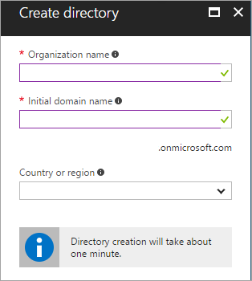
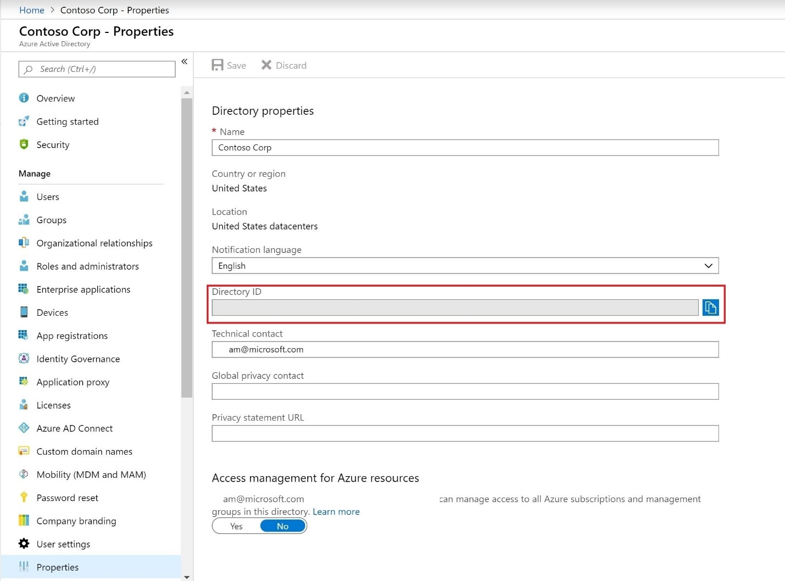
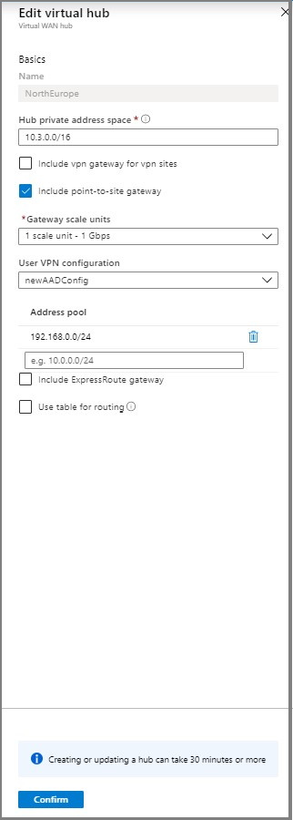
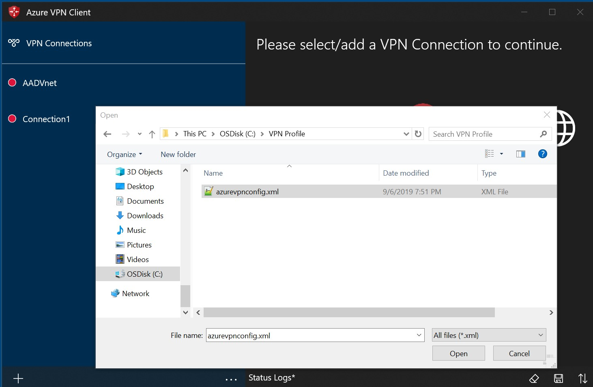
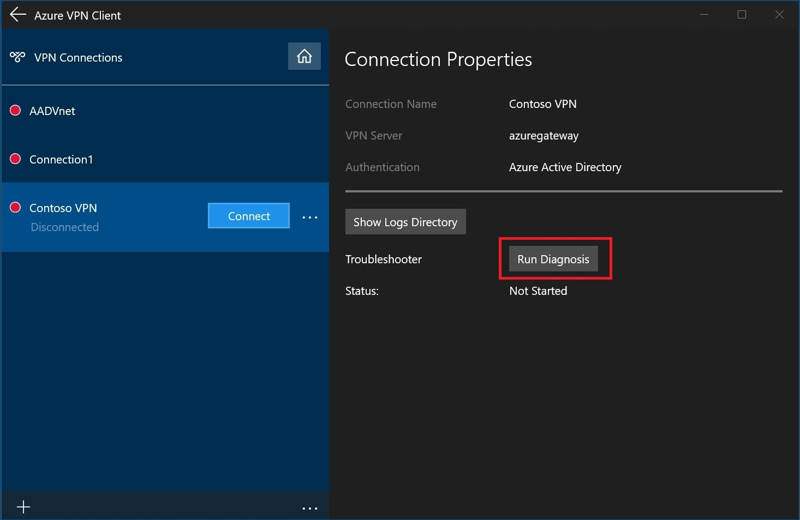
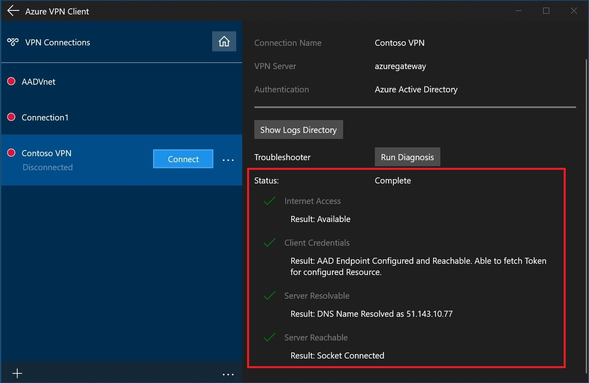

# Create an Azure Active Directory tenant for P2S OpenVPN protocol connections

When connecting to your VNet, you can use certificate-based authentication or RADIUS authentication. However, when you use the Open VPN protocol, you can also use Azure Active Directory authentication. If you want different set of users to be able to connect to different VPN gateways, you can register multiple apps in AD and link them to different VPN gateways. This article helps you set up an Azure AD tenant for P2S OpenVPN authentication and create and register multiple apps in Azure AD for allowing different access for different users and groups.

> [!NOTE]
> Azure AD authentication is supported only for OpenVPN® protocol connections.
>

## <a name="tenant"></a>1. Create the Azure AD tenant

Create an Azure AD tenant using the steps in the [Create a new tenant](../active-directory/fundamentals/active-directory-access-create-new-tenant.md) article:

* Organizational name
* Initial domain name

Example:

   

## <a name="users"></a>2. Create Azure AD tenant users

Next, create two user accounts. Create one Global Admin account and one master user account. The master user account is used as your master embedding account (service account). When you create an Azure AD tenant user account, you adjust the Directory role for the type of user that you want to create.

Use the steps in [this article](../active-directory/fundamentals/add-users-azure-active-directory.md) to create at least two users for your Azure AD tenant. Be sure to change the **Directory Role** to create the account types:

* Global Admin
* User

## <a name="enable-authentication"></a>3. Register Azure VPN Client in Azure AD tenant

1. Locate the Directory ID of the directory that you want to use for authentication. It is listed in the properties section of the Active Directory page.

    

2. Copy the Directory ID.

3. Sign in to the Azure portal as a user that is assigned the **Global administrator** role.

4. Next, give admin consent. Copy and paste the URL that pertains to your deployment location in the address bar of your browser:

    Public

    ```
    https://login.microsoftonline.com/common/oauth2/authorize?client_id=41b23e61-6c1e-4545-b367-cd054e0ed4b4&response_type=code&redirect_uri=https://portal.azure.com&nonce=1234&prompt=admin_consent
    ````

    Azure Government

    ```
    https://login-us.microsoftonline.com/common/oauth2/authorize?client_id=51bb15d4-3a4f-4ebf-9dca-40096fe32426&response_type=code&redirect_uri=https://portal.azure.us&nonce=1234&prompt=admin_consent
    ````

    Microsoft Cloud Germany

    ```
    https://login-us.microsoftonline.de/common/oauth2/authorize?client_id=538ee9e6-310a-468d-afef-ea97365856a9&response_type=code&redirect_uri=https://portal.microsoftazure.de&nonce=1234&prompt=admin_consent
    ````

    Azure China 21Vianet

    ```
    https://https://login.chinacloudapi.cn/common/oauth2/authorize?client_id=49f817b6-84ae-4cc0-928c-73f27289b3aa&response_type=code&redirect_uri=https://portal.azure.cn&nonce=1234&prompt=admin_consent
    ```

5. Select the **Global Admin** account if prompted.

    

6. Select **Accept** when prompted.

    

7. Under your Azure AD, in **Enterprise applications**, you will see **Azure VPN** listed.

    

## <a name="enable-authentication"></a>4. Register additional applications for various users/groups

1. Under your Azure Active Directory, click on **App registrations** and then **+ New registration**

    

2. In the **Register an application** blade enter the **Name** and select the desired **Supported account types** and click **Register**

    

3. Once the new app has been registered, click on **Expose an API** under the app blade

4. Click on **+ Add a scope**
5. Leave the default **Application ID URI** and click **Save and continue**

    
6. Fill in the required fields and ensure that **State** is **Enabled**. Click **Add scope**

    
7. Click on **Expose an API** then **+ Add a client application**.  For **Client ID**, enter the following values depending on the cloud:
	- 	Enter **41b23e61-6c1e-4545-b367-cd054e0ed4b4** for Azure **Public**
	- 	Enter **51bb15d4-3a4f-4ebf-9dca-40096fe32426** for Azure **Government**
	- 	Enter **538ee9e6-310a-468d-afef-ea97365856a9** for Azure **Germany**
	- 	Enter **49f817b6-84ae-4cc0-928c-73f27289b3aa** for Azure **China 21Vianet**


8. Click **Add application**

    
9. Copy the **Application (client) ID** from the **Overview** page. You will need it to configure your VPN gateway(s)

    

10. Repeat the steps in this section (4) to create as many applications that are needed for your security requirement. Each application will be associated to a VPN gateway and can have a different set of users. Only one application can be associated to a gateway.

## <a name="enable-authentication"></a>5. Assign users to your applications

1. Under Azure AD, **Enterprise applications**, select the newly registered application and click on **Properties**. Ensure that **User assignment required?** is set to **yes**. Click **Save**

    

2. On the app page, click on **Users and groups** and then **Add user**

    
3. Under **Add Assignment**, click **Users and groups**. Select the users that you want to be able to access this VPN application. Click **Select**

    

## <a name="site"></a>6. Create a new P2S configuration

A P2S configuration defines the parameters for connecting remote clients.

1. Set the following variables, replacing values as needed for your environment.

   ```powershell
   $aadAudience = "00000000-abcd-abcd-abcd-999999999999"
   $aadIssuer = "https://sts.windows.net/00000000-abcd-abcd-abcd-999999999999/"
   $aadTenant = "https://login.microsoftonline.com/00000000-abcd-abcd-abcd-999999999999"    
   ```

2. Run the following commands to create the configuration:

   ```powershell
   $aadConfig = New-AzVpnServerConfiguration -ResourceGroupName <ResourceGroup> -Name newAADConfig -VpnProtocol OpenVPN -VpnAuthenticationType AAD -AadTenant $aadTenant -AadIssuer $aadIssuer -AadAudience $aadAudience -Location westcentralus
> [!NOTE]
> Do not use the Azure VPN client's application ID in the commands above as it will grant all users access to the VPN gateway. Use the ID of the application(s) you registered.

## <a name="hub"></a>7. Edit hub assignment

1. Navigate to the **Hubs** blade under the virtual WAN.
2. Select the hub that you want to associate the vpn server configuration to and click the ellipsis (...).

   
3. Click **Edit virtual hub**.
4. Check the **Include point-to-site gateway** check box and pick the **Gateway scale unit** that you want.

   
5. Enter the **Address pool** from which the VPN clients will be assigned IP addresses.
6. Click **Confirm**.
7. The operation will can take up to 30 minutes to complete.

## <a name="device"></a>8. Download VPN profile

Use the VPN profile to configure your clients.

1. On the page for your virtual WAN, click **User VPN configurations**.
2. At the top of the  page, click **Download user VPN config**.
3. Once the file has finished creating, you can click the link to download it.
4. Use the profile file to configure the VPN clients.

4. Extract the downloaded zip file.

5. Browse to the unzipped “AzureVPN” folder.

6. Make a note of the location of the “azurevpnconfig.xml” file. The azurevpnconfig.xml contains the setting for the VPN connection and can be imported directly into the Azure VPN Client application. You can also distribute this file to all the users that need to connect via e-mail or other means. The user will need valid Azure AD credentials to connect successfully.
## Configure user VPN clients

To connect, you need to download the Azure VPN Client (Preview) and import the VPN client profile that was downloaded in the previous steps on every computer that wants to connect to the VNet.

> [!NOTE]
> Azure AD authentication is supported only for OpenVPN® protocol connections.
>

#### To download the Azure VPN client

Use this [link](https://www.microsoft.com/p/azure-vpn-client-preview/9np355qt2sqb?rtc=1&activetab=pivot:overviewtab) to download the Azure VPN Client (Preview).

#### <a name="import"></a>To import a client profile

1. On the page, select **Import**.

    

2. Browse to the profile xml file and select it. With the file selected, select **Open**.

    

3. Specify the name of the profile and select **Save**.

    

4. Select **Connect** to connect to the VPN.

    

5. Once connected, the icon will turn green and say **Connected**.

    

#### <a name="delete"></a>To delete a client profile

1. Select the ellipsis (...) next to the client profile that you want to delete. Then, select **Remove**.

    

2. Select **Remove** to delete.

    

#### <a name="diagnose"></a>Diagnose connection issues

1. To diagnose connection issues, you can use the **Diagnose** tool. Select the ellipsis (...) next to the VPN connection that you want to diagnose to reveal the menu. Then select **Diagnose**.

    

2. On the **Connection Properties** page, select **Run Diagnosis**.

    

3. Sign in with your credentials.

    

4. View the diagnosis results.

    

## <a name="viewwan"></a>View your virtual WAN

1. Navigate to the virtual WAN.
2. On the Overview page, each point on the map represents a hub. Hover over any point to view the hub health summary.
3. In the Hubs and connections section, you can view hub status, site, region, VPN connection status, and bytes in and out.

## <a name="viewhealth"></a>View your resource health

1. Navigate to your WAN.
2. On your WAN page, in the **SUPPORT + Troubleshooting** section, click **Health** and view your resource.


## <a name="cleanup"></a>Clean up resources

When you no longer need these resources, you can use [Remove-AzureRmResourceGroup](/powershell/module/azurerm.resources/remove-azurermresourcegroup) to remove the resource group and all of the resources it contains. Replace "myResourceGroup" with the name of your resource group and run the following PowerShell command:

```azurepowershell-interactive
Remove-AzureRmResourceGroup -Name myResourceGroup -Force
```

## Next steps

To learn more about Virtual WAN, see the [Virtual WAN Overview](virtual-wan-about.md) page.