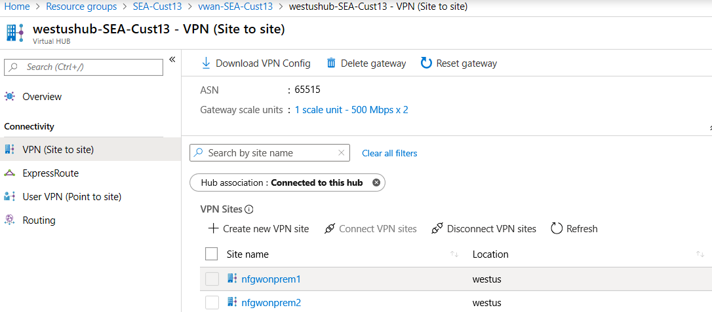

# Configure a custom IPsec policy for Virtual WAN

You can configure custom IPsec policy for virtual want in the Azure portal.

[!INCLUDE [IPsec](../../includes/virtual-wan-ipsec-custom-include.md)]

## 1. Locate the virtual hub

From a browser, navigate to the [Azure portal](https://aka.ms/azurevirtualwanpreviewfeatures) and sign in with your Azure account. Locate the virtual hub for your site.
## 2. Select the VPN site

From the hub page, select the VPN Site that you want to set up the Custom policy for.

## 3. Edit the VPN connection

From the context menu **...**, select **Edit VPN Connection**.

## 4. Configure the settings

On the **Edit VPN connection** page the settings you want to configure. Select **Save** to save your settings.

## Next steps

To learn more about Virtual WAN, see the [Virtual WAN Overview](virtual-wan-about.md) page.
