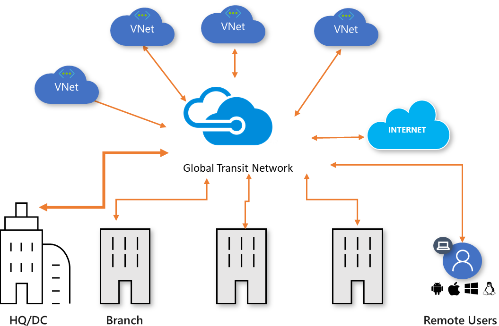
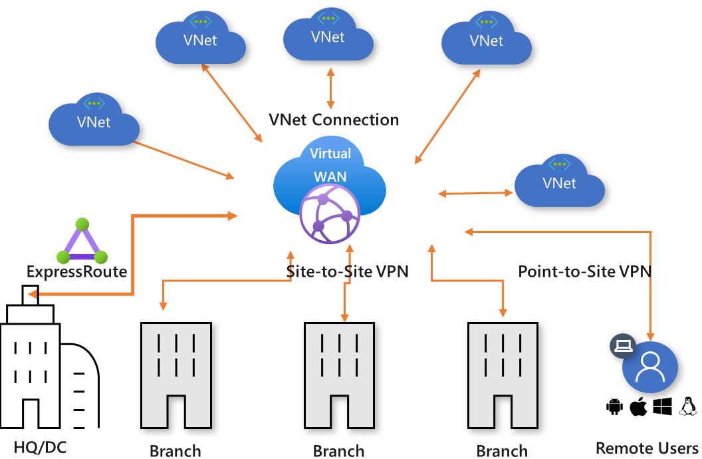
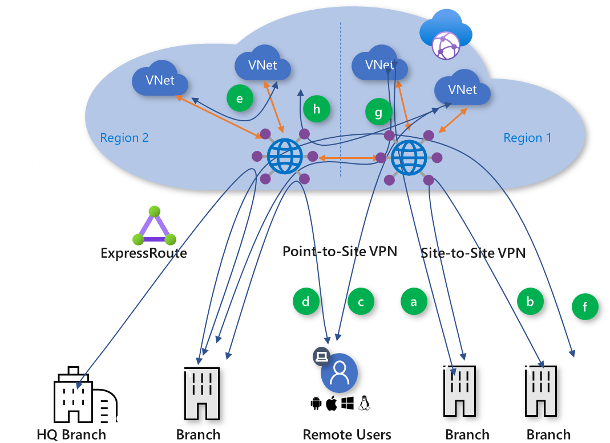
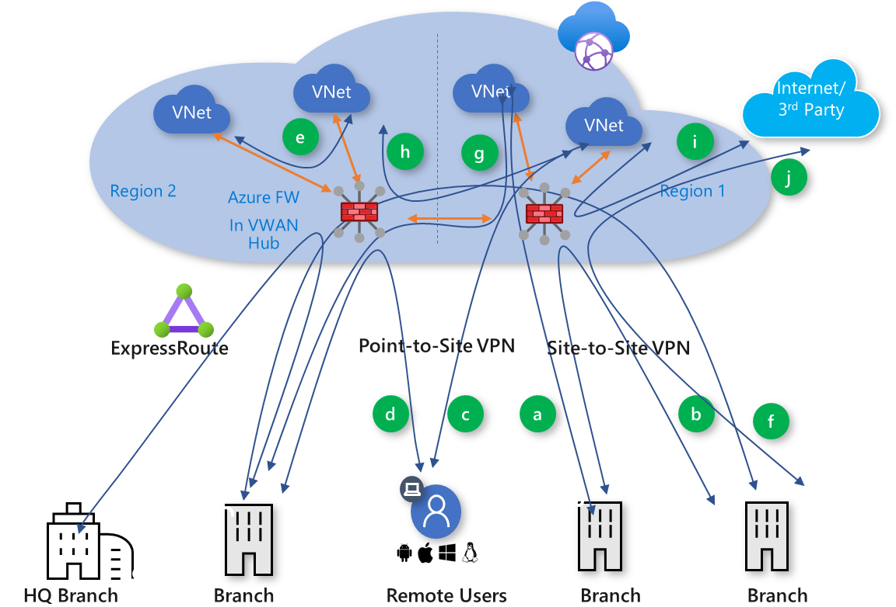

# Global transit network architecture and Virtual WAN

Modern enterprises require ubiquitous connectivity between hyper-distributed applications, data, and users across the cloud and on-premises. Global transit network architecture is being adopted by enterprises to consolidate, connect, and control the cloud-centric modern, global enterprise IT footprint.

The global transit network architecture is based on a classic hub-and-spoke connectivity model where the cloud hosted network 'hub' enables transitive connectivity between endpoints that may be distributed across different types of 'spokes'.

In this model, a spoke can be:
* Virtual network (VNets)
* Physical branch site
* Remote user
* Internet

**Figure 1: Global transit hub-and-spoke network**

Figure 1 shows the logical view of the global transit network where geographically distributed users, physical sites, and VNets are interconnected via a networking hub hosted in the cloud. This architecture enables logical one-hop transit connectivity between the networking endpoints.

## Global transit network with Virtual WAN

Azure Virtual WAN is a Microsoft-managed cloud networking service. All the networking components that this service is composed of are hosted and managed by Microsoft. For more information about Virtual WAN, see the [Virtual WAN Overview](virtual-wan-about.md) article.

Azure Virtual WAN allows a global transit network architecture by enabling ubiquitous, any-to-any connectivity between globally distributed sets of cloud workloads in VNets, branch sites, SaaS and PaaS applications, and users.

**Figure 2: Global transit network and Virtual WAN**

In the Azure Virtual WAN architecture, virtual WAN hubs are provisioned in Azure regions, to which you can choose to connect your branches, VNets, and remote users. The physical branch sites are connected to the hub by Premium ExpressRoute or site-to site-VPNs, VNets are connected to the hub by VNet connections, and remote users can directly connect to the hub using User VPN (point-to-site VPNs). Virtual WAN also supports cross-region VNet connection where a VNet in one region can be connected to a virtual WAN hub in a different region.

You can establish a virtual WAN by creating a single virtual WAN hub in the region that has the largest number of spokes (branches, VNets, users), and then connecting the spokes that are in other regions to the hub. This is a good option when an enterprise footprint is mostly in one region with a few remote spokes.  
  
## Hub-to-hub connectivity

An Enterprise cloud footprint can span multiple cloud regions and it is optimal (latency-wise) to access the cloud from a region closest to their physical site and users. One of the key principles of global transit network architecture is to enable cross-region connectivity between all cloud and on-premises network endpoints. This means that traffic from a branch that is connected to the cloud in one region can reach another branch or a VNet in a different region using hub-to-hub connectivity enabled by [Azure Global Network](https://azure.microsoft.com/global-infrastructure/global-network/).

**Figure 3: Virtual WAN cross-region connectivity**

When multiple hubs are enabled in a single virtual WAN, the hubs are automatically interconnected via hub-to-hub links.

Additionally, hubs that are all part of the same virtual WAN, can be associated with different regional access and security policies. For more information, see [Security and policy control](#security) later in this article.

## Any-to-any connectivity

Global transit network architecture enables any-to-any connectivity via virtual WAN hubs. This architecture eliminates or reduces the need for full mesh or partial mesh connectivity between spokes, that are more complex to build and maintain. In addition, routing control in hub-and-spoke vs. mesh networks is easier to configure and maintain.

Any-to-any connectivity (in the context of a global architecture) allows an enterprise with globally distributed users, branches, datacenters, VNets, and applications to connect to each other through the “transit” hub. Azure Virtual WAN acts as the global transit system.

**Figure 4: Virtual WAN traffic paths**

Azure Virtual WAN supports the following global transit connectivity paths. The letters in parentheses map to Figure 4.

* Branch-to-VNet (a)
* Branch-to-branch (b)
  * ExpressRoute Global Reach and Virtual WAN
* Remote User-to-VNet (c)
* Remote User-to-branch (d)
* VNet-to-VNet (e)
* Branch-to-hub-hub-to-Branch (f)
* Branch-to-hub-hub-to-VNet (g)
* VNet-to-hub-hub-to-VNet (h)

### Branch-to-VNet (a) and Branch-to-VNet Cross-region (g)

Branch-to-VNet is the primary path supported by Azure Virtual WAN. This path allows you to connect branches to Azure IAAS enterprise workloads that are deployed in Azure VNets. Branches can be connected to the virtual WAN via ExpressRoute or site-to-site VPN. The traffic transits to VNets that are connected to the virtual WAN hubs via VNet Connections. Explicit [gateway transit](../virtual-network/virtual-network-peering-overview.md#gateways-and-on-premises-connectivity) is not required for Virtual WAN because Virtual WAN automatically enables gateway transit to branch site. See [Virtual WAN Partners](virtual-wan-configure-automation-providers.md) article on how to connect an SD-WAN CPE to Virtual WAN.

### ExpressRoute Global Reach and Virtual WAN

ExpressRoute is a private and resilient way to connect your on-premises networks to the Microsoft Cloud. Virtual WAN supports Express Route circuit connections. Connecting a branch site to Virtual WAN with Express Route requires 1) Premium Circuit 2) Circuit to be in a Global Reach enabled location.

ExpressRoute Global Reach is an add-on feature for ExpressRoute. With Global Reach, you can link ExpressRoute circuits together to make a private network between your on-premises networks. Branches that are connected to Azure Virtual WAN using ExpressRoute require the ExpressRoute Global Reach to communicate with each other.

In this model, each branch that is connected to the virtual WAN hub using ExpressRoute can connect to VNets using the branch-to-VNet path. Branch-to-branch traffic won't transit the hub because ExpressRoute Global Reach enables a more optimal path over Azure WAN.

### Branch-to-branch (b) and Branch-to-Branch cross-region (f)

Branches can be connected to an Azure virtual WAN hub using ExpressRoute circuits and/or site-to-site VPN connections. You can connect the branches to the virtual WAN hub that is in the region closest to the branch.

This option lets enterprises leverage the Azure backbone to connect branches. However, even though this capability is available, you should weigh the benefits of connecting branches over Azure Virtual WAN vs. using a private WAN.  

### Remote User-to-VNet (c)

You can enable direct, secure remote access to Azure using point-to-site connection from a remote user client to a virtual WAN. Enterprise remote users no longer have to hairpin to the cloud using a corporate VPN.

### Remote User-to-branch (d)

The Remote User-to-branch path lets remote users who are using a point-to-site connection to Azure access on-premises workloads and applications by transiting through the cloud. This path gives remote users the flexibility to access workloads that are both deployed in Azure and on-premises. Enterprises can enable central cloud-based secure remote access service in Azure Virtual WAN.

### VNet-to-VNet transit (e) and VNet-to-VNet cross-region (h)

The VNet-to-VNet transit enables VNets to connect to each other in order to interconnect multi-tier applications that are implemented across multiple VNets. Optionally, you can connect VNets to each other through VNet Peering and this may be suitable for some scenarios where transit via the VWAN hub is not necessary.

## Security and policy control

The Azure Virtual WAN hubs interconnect all the networking end points across the hybrid network and potentially see all transit network traffic. Virtual WAN hubs can be converted to Secured Virtual Hubs by deploying the Azure Firewall inside VWAN hubs to enable cloud-based security, access, and policy control. Orchestration of Azure Firewalls in virtual WAN hubs can be performed by Azure Firewall Manager.

Azure Firewall Manager provides the capabilities to manage and scale security for global transit networks. Azure Firewall Manager provides ability to centrally manage routing, global policy management, advanced Internet security services via third-party along with the Azure Firewall.

**Figure 5: Secured virtual hub with Azure Firewall**

Azure Firewall to the virtual WAN supports the following global secured transit connectivity paths. The letters in parentheses map to Figure 5.

* VNet-to-VNet secure transit (e)
* VNet-to-Internet or third-party Security Service (i)
* Branch-to-Internet or third-party Security Service (j)

### VNet-to-VNet secured transit (e)

The VNet-to-VNet secured transit enables VNets to connect to each other via the Azure Firewall in the virtual WAN hub.

### VNet-to-Internet or third-party Security Service (i)

The VNet-to-Internet or third-party secured transit enables VNets to connect to the internet or a supported third-party security services via the Azure Firewall in the virtual WAN hub.

### Branch-to-Internet or third-party Security Service (j)
The branch-to-Internet or third-party Secure transit enables branches to connect to the internet or a supported third-party security services via the Azure Firewall in the virtual WAN hub.

## Next steps

Create a connection using Virtual WAN.

* [Site-to-site connections using Virtual WAN](virtual-wan-site-to-site-portal.md)
* [ExpressRoute connections using Virtual WAN](virtual-wan-expressroute-portal.md)
