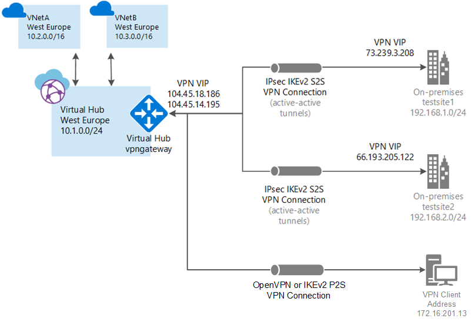
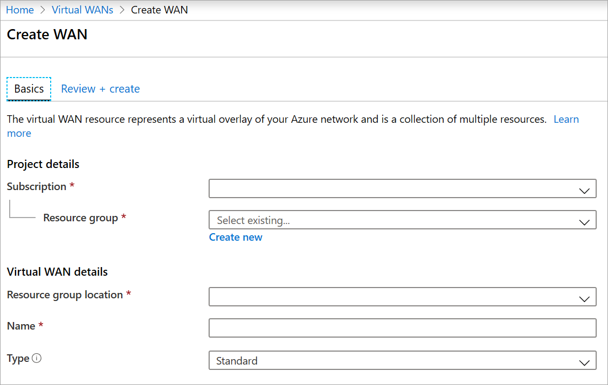
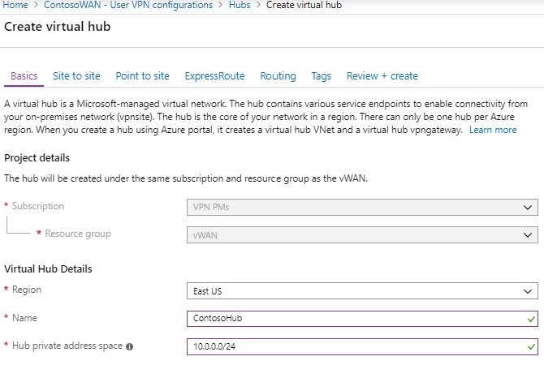
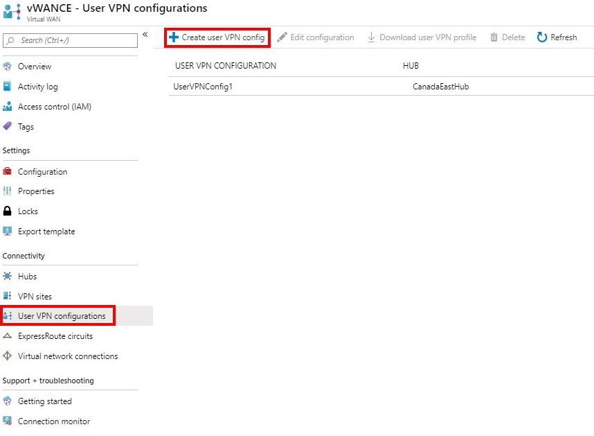

# Tutorial: Create a User VPN connection using Azure Virtual WAN

This tutorial shows you how to use Virtual WAN to connect to your resources in Azure over an IPsec/IKE (IKEv2) or OpenVPN VPN connection. This type of connection requires a client to be configured on the client computer. For more information about Virtual WAN, see the [Virtual WAN Overview](virtual-wan-about.md)

In this tutorial, you learn how to:

> [!div class="checklist"]
> * Create a WAN
> * Create a hub
> * Create a P2S configuration
> * Download a VPN client profile
> * Apply P2S configuration to a hub
> * Connect a VNet to a hub
> * Download and apply the VPN client configuration
> * View your virtual WAN



## Before you begin

Verify that you have met the following criteria before beginning your configuration:

* You have a virtual network that you want to connect to. Verify that none of the subnets of your on-premises networks overlap with the virtual networks that you want to connect to. To create a virtual network in the Azure portal, see the [quickstart](../virtual-network/quick-create-portal.md).

* Your virtual network does not have any virtual network gateways. If your virtual network has a gateway (either VPN or ExpressRoute), you must remove all gateways. This configuration requires that virtual networks are connected instead, to the Virtual WAN hub gateway.

* Obtain an IP address range for your hub region. The hub is a virtual network that is created and used by Virtual WAN. The address range that you specify for the hub cannot overlap with any of your existing virtual networks that you connect to. It also cannot overlap with your address ranges that you connect to on premises. If you are unfamiliar with the IP address ranges located in your on-premises network configuration, coordinate with someone who can provide those details for you.

* If you don't have an Azure subscription, create a [free account](https://azure.microsoft.com/free/?WT.mc_id=A261C142F).

## <a name="wan"></a>Create a virtual WAN

From a browser, navigate to the [Azure portal](https://portal.azure.com) and sign in with your Azure account.

1. Navigate to the Virtual WAN page. In the portal, click **+Create a resource**. Type **Virtual WAN** into the search box and select Enter.
2. Select **Virtual WAN** from the results. On the Virtual WAN page, click **Create** to open the Create WAN page.
3. On the **Create WAN** page, on the **Basics** tab, fill in the following fields:

   

   * **Subscription** - Select the subscription that you want to use.
   * **Resource group** - Create new or use existing.
   * **Resource group location** - Choose a resource location from the dropdown. A WAN is a global resource and does not live in a particular region. However, you must select a region in order to more easily manage and locate the WAN resource that you create.
   * **Name** - Type the Name that you want to call your WAN.
   * **Type:** Standard. If you create a Basic WAN, you can create only a Basic hub. Basic hubs are capable of VPN site-to-site connectivity only.
4. After you finish filling out the fields, select **Review +Create**.
5. Once validation passes, select **Create** to create the virtual WAN.

## <a name="hub"></a>Create an empty virtual hub

1. Under your virtual WAN, select Hubs and click **+New Hub**

   
2. On the create virtual hub page, fill in the following fields.

   **Region** - Select the region that you want to deploy the virtual hub in.

   **Name** - Enter the name that you want to call your virtual hub.

   **Hub private address space** - The hub's address range in CIDR notation.

     
3. Click **Review + create**
4. On the **validation passed** page, click **create**

## <a name="p2sconfig"></a>Create a P2S configuration

A P2S configuration defines the parameters for connecting remote clients.

1. Navigate to **All resources**.
2. Click the virtual WAN that you created.
3. Click **+Create user VPN config** at the top of the page to open the **Create new User VPN configuration** page.

   
4. On the **Create new user VPN configuration** page, fill in the following fields:

   **Configuration name** - This is the name by which you want to refer to your configuration.

   **Tunnel type** - The protocol to use for the tunnel.

   **Root Certificate Name** - A descriptive name for the certificate.

   **Public Certificate Data** - Base-64 encoded X.509 certificate data.
  
5. Click **Create** to create the configuration.

## <a name="edit"></a>Edit hub assignment

1. Navigate to the **Hubs** blade under the virtual WAN
2. Select the hub that you want to associate the vpn server configuration to and click **...**

   
3. Click **Edit virtual hub**.
4. Check the **Include point-to-site gateway** check box and pick the **Gateway scale unit** that you want.

| **Scale Unit** | **Throughput** | **P2S Connections** |
| --- | --- | --- |
| 1| 500 Mbps | 500 |
| 2| 1 Gbps | 500 |
| 3| 1.5 Gbps | 500 |
| 4| 2 Gbps | 1000 |
| 5| 2.5 Gbps | 1000 |
| 6| 3 Gbps | 1000 |
| 7| 3.5 Gbps | 5000 |
| 8| 4 Gbps | 5000 |
| 9| 4.5 Gbps | 5000 |
| 10| 5 Gbps | 5000 |
| 11| 5.5 Gbps | 5000 |
| 12| 6 Gbps | 5000 |
| 13| 6.5 Gbps | 10000 |
| 14| 7 Gbps | 10000 |
| 15| 7.5 Gbps | 10000 |
| 16| 8 Gbps | 10000 |
| 17| 8.5 Gbps | 10000 |
| 18| 9 Gbps | 10000 |
| 19| 9.5 Gbps | 10000 |
| 20| 10 Gbps | 10000 |


   
5. Enter the **Address pool** from which the VPN clients will be assigned IP addresses.
6. Click **Confirm**
7. The operation will can take up to 30 minutes to complete.

## <a name="download"></a>Download VPN profile

Use the VPN profile to configure your clients.

1. On the page for your virtual WAN, click **User VPN configurations**.
2. At the top of the  page, click **Download user VPN config**.
3. Once the file has finished creating, you can click the link to download it.
4. Use the profile file to configure the VPN clients.

### Configure user VPN clients
Use the downloaded profile to configure the remote access clients. The procedure for each operating system is different, please follow the correct instructions below:

#### Microsoft Windows
##### OpenVPN

1. Download and install the OpenVPN client from the official website.
2. Download the VPN profile for the gateway. This can be done from the User VPN configurations tab in Azure portal, or New-AzureRmVpnClientConfiguration in PowerShell.
3. Unzip the profile. Open the vpnconfig.ovpn configuration file from the OpenVPN folder in notepad.
4. Fill in the P2S client certificate section with the P2S client certificate public key in base64. In a PEM formatted certificate, you can simply open the .cer file and copy over the base64 key between the certificate headers. For steps, see [How to export a certificate to get the encoded public key.](certificates-point-to-site.md)
5. Fill in the private key section with the P2S client certificate private key in base64. For steps, see [How to extract private key.](howto-openvpn-clients.md#windows).
6. Do not change any other fields. Use the filled in configuration in client input to connect to the VPN.
7. Copy the vpnconfig.ovpn file to C:\Program Files\OpenVPN\config folder.
8. Right-click the OpenVPN icon in the system tray and click connect.

##### IKEv2

1. Select the VPN client configuration files that correspond to the architecture of the Windows computer. For a 64-bit processor architecture, choose the 'VpnClientSetupAmd64' installer package. For a 32-bit processor architecture, choose the 'VpnClientSetupX86' installer package.
2. Double-click the package to install it. If you see a SmartScreen popup, click More info, then Run anyway.
3. On the client computer, navigate to Network Settings and click VPN. The VPN connection shows the name of the virtual network that it connects to.
4. Before you attempt to connect, verify that you have installed a client certificate on the client computer. A client certificate is required for authentication when using the native Azure certificate authentication type. For more information about generating certificates, see [Generate Certificates](certificates-point-to-site.md). For information about how to install a client certificate, see [Install a client certificate](../vpn-gateway/point-to-site-how-to-vpn-client-install-azure-cert.md).

## <a name="viewwan"></a>View your virtual WAN

1. Navigate to the virtual WAN.
2. On the Overview page, each point on the map represents a hub.
3. In the Hubs and connections section, you can view hub status, site, region, VPN connection status, and bytes in and out.


## <a name="cleanup"></a>Clean up resources

When you no longer need these resources, you can use [Remove-AzureRmResourceGroup](/powershell/module/azurerm.resources/remove-azurermresourcegroup) to remove the resource group and all of the resources it contains. Replace "myResourceGroup" with the name of your resource group and run the following PowerShell command:

```azurepowershell-interactive
Remove-AzResourceGroup -Name myResourceGroup -Force
```

## Next steps

To learn more about Virtual WAN, see the [Virtual WAN Overview](virtual-wan-about.md) page.
