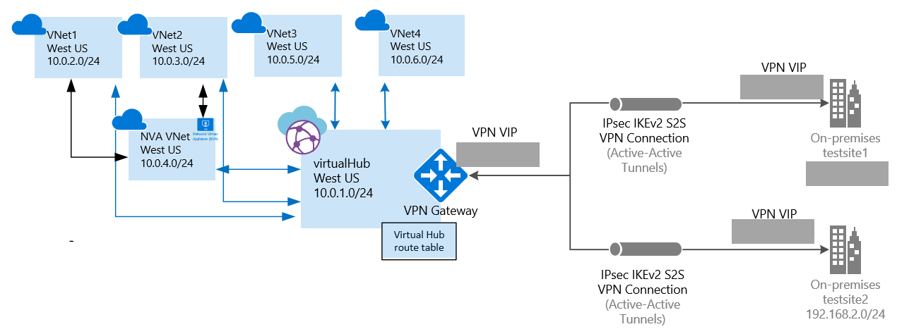

# Create a Virtual WAN hub route table for NVAs: Azure portal

This article shows you how to steer traffic from a branch (on-premises site) connected to the Virtual WAN hub to a Spoke virtual network (VNet) via a Network Virtual Appliance (NVA).

## Before you begin

Verify that you have met the following criteria:

*  You have a Network Virtual Appliance (NVA). A Network Virtual Appliance is a third-party software of your choice that is typically provisioned from Azure Marketplace in a virtual network.

    * A private IP address must be assigned to the NVA network interface.

    * The NVA is not deployed in the virtual hub. It must be deployed in a separate virtual network.

    *  The NVA virtual network may have one or many virtual networks connected to it. In this article, we refer to the NVA virtual network as an 'indirect spoke VNet'. These virtual networks can be connected to the NVA VNet by using VNet peering. The VNet Peering links are depicted by black arrows in the above figure between VNet 1, VNet 2, and NVA VNet.
*  You have created two virtual networks. They will be used as spoke VNets.

    * The VNet spoke address spaces are: VNet1: 10.0.2.0/24 and VNet2: 10.0.3.0/24. If you need information on how to create a virtual network, see [Create a virtual network](../virtual-network/quick-create-portal.md).

    * Ensure there are no virtual network gateways in any of the VNets.

    * The VNets do not require a gateway subnet.

## 1. Sign in

From a browser, navigate to the [Azure portal](https://portal.azure.com) and sign in with your Azure account.

## 2. Create a virtual WAN

Create a virtual WAN. Use the following example values:

* **Virtual WAN name:** myVirtualWAN
* **Resource group:** testRG
* **Location:** West US

[!INCLUDE [Create a virtual WAN](../../includes/virtual-wan-tutorial-vwan-include.md)]

## 3. Create a hub

Create the hub. Use the following example values:

* **Location:** West US
* **Name:** westushub
* **Hub private address space:** 10.0.1.0/24

[!INCLUDE [Create a hub](../../includes/virtual-wan-tutorial-hub-include.md)]

## 4. Create and apply a hub route table

Update the hub with a hub route table. Use the following example values:

* **Spoke VNet address spaces:** (VNet1 and VNet2) 10.0.2.0/24 and 10.0.3.0/24
* **DMZ NVA network interface private IP address:** 10.0.4.5

1. Navigate to your virtual WAN.
2. Click the hub for which you want to create a route table.
3. Click the **...**, and then click **Edit virtual hub**.
4. On the **Edit virtual hub** page, scroll down and select the checkbox **Use table for routing**.
5. In the **If destination prefix is** column, add the address spaces. In the **Send to next hop** column, add the DMZ NVA network interface private IP address.
>[!NOTE]
>The DMZ NVA network is applicable to the local hub.
>
6. Click **Confirm** to update the hub resource with the route table settings.

## 5. Create the VNet connections

Create a virtual network connection from each indirect spoke VNet (VNet1 and VNet2) to the hub. These virtual network connections are depicted by the blue arrows in the above figure. Then, create a VNet connection from the NVA VNet to the hub (black arrow in the figure).

 For this step, you can use the following values:

| Virtual network name| Connection name|
| --- | --- |
| VNet1 | testconnection1 |
| VNet2 | testconnection2 |
| NVAVNet | testconnection3 |

Repeat the following procedure for each virtual network that you want to connect.

1. On the page for your virtual WAN, click **Virtual network connections**.
2. On the virtual network connection page, click **+Add connection**.
3. On the **Add connection** page, fill in the following fields:

    * **Connection name** - Name your connection.
    * **Hubs** - Select the hub you want to associate with this connection.
    * **Subscription** - Verify the subscription.
    * **Virtual network** - Select the virtual network you want to connect to this hub. The virtual network cannot have an already existing virtual network gateway.
4. Click **OK** to create the connection.

## Next steps

To learn more about Virtual WAN, see the [Virtual WAN Overview](virtual-wan-about.md) page.
