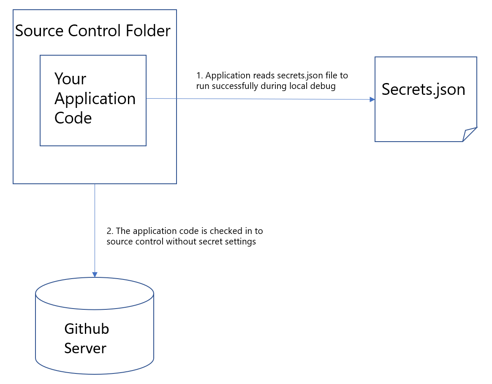
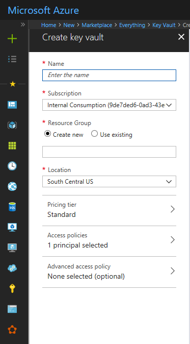

# Securely saving secret application settings for a web application

## Overview
This article describes how to securely save secret application configuration settings for Azure applications.

Traditionally all web application configuration settings are saved in configuration files such as Web.config. This practice leads to checking in secret settings such as Cloud credentials to public source control systems like Github. Meanwhile, it could be hard to follow security best practice because of the overhead required to change source code and reconfigure development settings.

To make sure development process is secure, tooling and framework libraries are created to save application secret settings securely with minimal or no source code change.

## ASP.NET and .NET core applications

### Save secret settings in User Secret store that is outside of source control folder
If you are doing a quick prototype or you don't have internet access, start with moving your secret settings outside of source control folder to User Secret store. User Secret store is a file saved under user profiler folder, so secrets are not checked in to source control. The following diagram demonstrates how [User Secret](https://docs.microsoft.com/en-us/aspnet/core/security/app-secrets?tabs=visual-studio#SecretManager) works.



If you are running .NET core console application, use Key Vault to save your secret securely.

### Save secret settings in Azure Key Vault
If you are developing a team project and need to share source code securely, use [Azure Key Vault](https://azure.microsoft.com/en-us/services/key-vault/).

1. Create a Key Vault in your Azure subscription. Fill out all required fields on the UI and click *Create* on the bottom of the blade



2. Grant you and your team members access to the Key Vault. If you have a large team, you can create an [Azure Active Directory group](https://docs.microsoft.com/en-us/azure/active-directory/active-directory-groups-create-azure-portal) and add that security group access to the Key Vault. In the *Secret Permissions* dropdown, check *Get* and *List* under *Secret Management Operations*.


3. Add your secret to Key Vault on Azure portal. For nested configuration settings, replace ':' with '--' so the Key Vault secret name is valid. ':' is not allowed to be in the name of a Key Vault secret.


4. Install the [Azure Services Authentication extension for Visual Studio](https://go.microsoft.com/fwlink/?linkid=862354). Through this extension, app can access Key Vault using the Visual Studio sign-in identity.

5. Add the following NuGet packages to your project:

```
Microsoft.Azure.Services.AppAuthentication
```
6. Add the following code to Program.cs file:

```csharp
public static IWebHost BuildWebHost(string[] args) =>
    WebHost.CreateDefaultBuilder(args)
        .ConfigureAppConfiguration((ctx, builder) =>
        {
            var keyVaultEndpoint = GetKeyVaultEndpoint();
            if (!string.IsNullOrEmpty(keyVaultEndpoint))
            {
                var azureServiceTokenProvider = new AzureServiceTokenProvider();
                var keyVaultClient = new KeyVaultClient(
                    new KeyVaultClient.AuthenticationCallback(
                        azureServiceTokenProvider.KeyVaultTokenCallback));
                builder.AddAzureKeyVault(
                    keyVaultEndpoint, keyVaultClient, new DefaultKeyVaultSecretManager());
            }
        })
        .UseStartup<Startup>()
        .Build();

private static string GetKeyVaultEndpoint() => Environment.GetEnvironmentVariable("KEYVAULT_ENDPOINT");
```
7. Add your Key Vault URL to launchsettings.json file. The environment variable name *KEYVAULT_ENDPOINT* is defined in the code you added in step 6.


8. Start debugging the project. It should run successfully.

## ASP.NET and .NET applications

.NET 4.7.1 supports Key Vault and Secret configuration builders, which ensures secrets can be moved outside of source control folder without code changes.
To proceed, [download .NET 4.7.1](https://www.microsoft.com/en-us/download/details.aspx?id=56115) and migrate your application if it's using an older version of .NET framework.

### Save secret settings in a secret file that is outside of source control folder
If you are writing a quick prototype and don't want to provision Azure resources, go with this option.

1. Install the following NuGet package to your project
```
Microsoft.Configuration.ConfigurationBuilders.Basic.1.0.0-alpha1.nupkg
```

2. Create a file that's similar to the follow. Save it under a location outside of your project folder.

```xml

	<root>
	    <secrets ver="1.0">
	        <secret name="secret1" value="foo_one" />
	        <secret name="secret2" value="foo_two" />
	    </secrets>
	</root>
```

3. Define the secret file to be a configuration builder in your Web.config file. Put this section before *appSettings* section.

```xml
<configSections>
  <section name="configBuilders" type="System.Configuration.ConfigurationBuildersSection, System.Configuration, Version=4.0.0.0, Culture=neutral, PublicKeyToken=b03f5f7f11d50a3a" restartOnExternalChanges="false" requirePermission="false" />
</configSections>
<configBuilders>
    <builders>

	<!-- All Key/Value builders in these packages:

		Optional attributes:
			mode="Strict|Greedy|Expand" - Strict is the default.
				Strict - replace values in appSettings and/or connectionStrings (depending on which sections you tag) ONLY IF the key/name matches a key in the config source.
				Greedy - add all values to appSettings/connectionstrings from the config source, even if the key wasn't originally in the web.config.
				Expand - Look at the raw xml for any tagged section and replace ${TOKENS} with values if they exist in the config source.

			keyPrefix="string" - Only look at values from the source if they start with the keyPrefix. (Case-insensitive)
			stripPrefix="true|false" - If in greedy mode, the key will be inserted as the name/key in the resulting config. True will strip the prefix off before inserting.
	-->

	<!-- Secrets

		secretsFile="string" - This is required at the moment. ~ will resolve as expected in desktop and web apps.
	 -->
      <add name="Secrets" secretsFile="C:\Users\AppData\secrets.xml" type="Microsoft.Configuration.ConfigurationBuilders.UserSecretsConfigBuilder, ConfigurationBuilders, Version=1.0.0.0, Culture=neutral" />


    </builders>
```
4. Specify appSettings section is using the secret configuration builder. Make sure there is any entry for the secret setting with a dummy value.

```xml
<appSettings configBuilders="Secrets">
   <add key="webpages:Version" value="3.0.0.0" />
   <add key="webpages:Enabled" value="false" />
   <add key="ClientValidationEnabled" value="true" />
   <add key="UnobtrusiveJavaScriptEnabled" value="true" />
   <add key="secret" value="" />
 </appSettings>
```

5. Debug your app. It should run successfully.

### Save secret settings in a secret file that is outside of source control folder
Follow instructions from ASP.NET core section to configure a Key Vault for your project.

1. Install the following NuGet package to your project
```
Microsoft.Configuration.ConfigurationBuilders.Azure.1.0.0-alpha1.nupkg
```

2. Define Key Vault configuration builder in Web.config. Put this section before *appSettings* section. Replace *vaultName* to be the Key Vault name if your Key Vault is in public Azure, or full URI if you are using Sovereign cloud.

```xml
<configSections>
  <section name="configBuilders" type="System.Configuration.ConfigurationBuildersSection, System.Configuration, Version=4.0.0.0, Culture=neutral, PublicKeyToken=b03f5f7f11d50a3a" restartOnExternalChanges="false" requirePermission="false" />
</configSections>
  <configBuilders>
    <builders>

	<!-- All Key/Value builders in these packages:

		Optional attributes:
			mode="Strict|Greedy|Expand" - Strict is the default.
				Strict - replace values in appSettings and/or connectionStrings (depending on which sections you tag) ONLY IF the key/name matches a key in the config source.
				Greedy - add all values to appSettings/connectionstrings from the config source, even if the key wasn't originally in the web.config.
				Expand - Look at the raw xml for any tagged section and replace ${TOKENS} with values if they exist in the config source.

			keyPrefix="string" - Only look at values from the source if they start with the keyPrefix. (Case-insensitive)
			stripPrefix="true|false" - If in greedy mode, the key will be inserted as the name/key in the resulting config. True will strip the prefix off before inserting.
	-->


	<!-- Environment -->
      <add name="Environment" type="Microsoft.Configuration.ConfigurationBuilders.EnvironmentConfigBuilder, Microsoft.Configuration.ConfigurationBuilders, Version=1.0.0.0, Culture=neutral" />


	<!-- Secrets

		secretsFile="string" - This is required at the moment. ~ will resolve as expected in desktop and web apps.
	 -->
      <add name="Secrets" secretsFile="~/secrets.xml" type="Microsoft.Configuration.ConfigurationBuilders.UserSecretsConfigBuilder, ConfigurationBuilders, Version=1.0.0.0, Culture=neutral" />


	<!-- keyvault
		vaultName="string" - Required. Should be self explanatory.

		This builder should just work with ASAL just fine... but I didn't have an ASAL environment handy to test. Alternatively, you can supply clientId and clientSecret to connect.
	-->
      <add name="KeyVault" vaultName="Test911" clientId="13c7e116-eb8d-4c12-920a-0093e5f6e33e" clientSecret="8EnMWiciE0wNinNGW7mbylZ3BnaNu7ZeafaC3x+wdCc=" type="Microsoft.Configuration.ConfigurationBuilders.AzureKeyVaultConfigBuilder, ConfigurationBuilders, Version=1.0.0.0, Culture=neutral" />

    </builders>
  </configBuilders>

```
3.  Specify appSettings section is using the Key Vault configuration builder. Make sure there is any entry for the secret setting with a dummy value.

```xml
<appSettings configBuilders="AzureKeyVault">
   <add key="webpages:Version" value="3.0.0.0" />
   <add key="webpages:Enabled" value="false" />
   <add key="ClientValidationEnabled" value="true" />
   <add key="UnobtrusiveJavaScriptEnabled" value="true" />
   <add key="secret" value="" />
 </appSettings>
```

4. Start debugging the project. It should run successfully.
