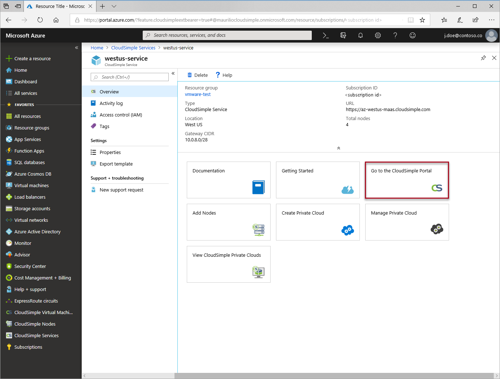
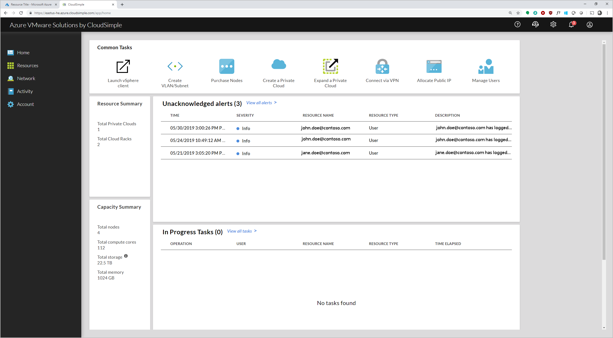
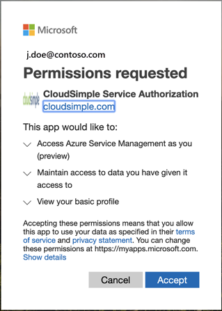
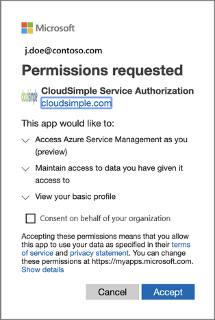
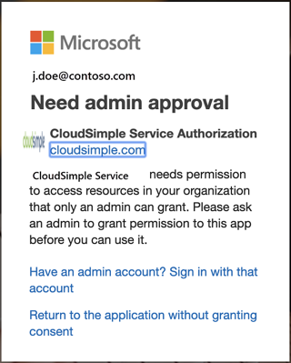

--- 
title: Access Azure VMware Solutions (AVS) - Portal
description: Describes how to access Azure VMware Solutions (AVS) from the Azure portal
author: sharaths-cs 
ms.author: b-shsury 
ms.date: 06/04/2019 
ms.topic: article 
ms.service: azure-vmware-cloudsimple 
ms.reviewer: cynthn 
manager: dikamath 
---

# Access Azure VMware Solutions (AVS) from the Azure portal

Single sign-on is supported for access to the AVS portal. After you sign in to the Azure portal, you can access the AVS portal without signing in again. The first time you access the AVS portal you're prompted to authorize the [AVS Service Authorization](#consent-to-AVS-service-authorization-application) application. Authorization is a one-time action.

## Before you begin

Users with builtin **Owner** and **Contributor** roles can access the AVS portal. The roles must be configured on the resource group where the AVS service is deployed. The roles can also be configured on the AVS service object. For more information on checking your role, see the [View role assignments](https://docs.microsoft.com/azure/role-based-access-control/check-access) article. Only users with built-in **Owner** and **Contributor** roles can access the AVS portal. The roles must be configured on the subscription. For more information on checking your role, see the [View role assignments](https://docs.microsoft.com/azure/role-based-access-control/check-access) article.

If you are using custom roles, the role should have any of the following operations under ```Actions```.  For more information on custom roles, see [Custom roles for Azure resources](https://docs.microsoft.com/azure/role-based-access-control/custom-roles). If any of the operations are a part of ```NotActions```, the user cannot access the AVS portal. 

```
Microsoft.VMwareCloudSimple/*
Microsoft.VMwareCloudSimple/*/write
Microsoft.VMwareCloudSimple/dedicatedCloudServices/*
Microsoft.VMwareCloudSimple/dedicatedCloudServices/*/write
```

## Sign in to Azure

Sign in to the Azure portal at [https://portal.azure.com](https://portal.azure.com).

## Access the AVS portal

1. Select **All services**.

2. Search for **AVS Services**.

3. Select the AVS service on which you want to create your Private Cloud.

4. On the **Overview** page, click **Go to the AVS portal**. If you're accessing the AVS portal from the Azure portal for the first time, you'll be prompted to authorize the [AVS Service Authorization](#consent-to-AVS-service-authorization-application) application. 

    

> [!NOTE]
> If you select a Private Cloud operation (such as creating or expanding a Private Cloud) directly from the Azure portal, the AVS portal opens to the indicated page.

In the AVS portal, select **Home** on the side menu to display summary information about your AVS Private Cloud. The resources and capacity of your AVS Private Cloud are shown, along with alerts and tasks that require attention. For common tasks, click the named icons at the top of the page.



## Consent to AVS Service Authorization application

Launching the AVS portal from the Azure portal for the first time requires your consent for the AVS Service Authorization application. Select **Accept** to grant requested permissions and access the AVS portal.



If you have global administrator privilege, you can consent for your organization. Select **Consent on behalf of your organization**.



If your permissions don't permit access to the AVS portal, contact the global administrator of your tenant to grant the required permissions. A global administrator can consent on behalf of your organization.



## Next steps

* Learn how to [Create a private cloud](https://docs.azure.cloudsimple.com/create-private-cloud/)
* Learn how to [Configure a private cloud environment](quickstart-create-private-cloud.md)
