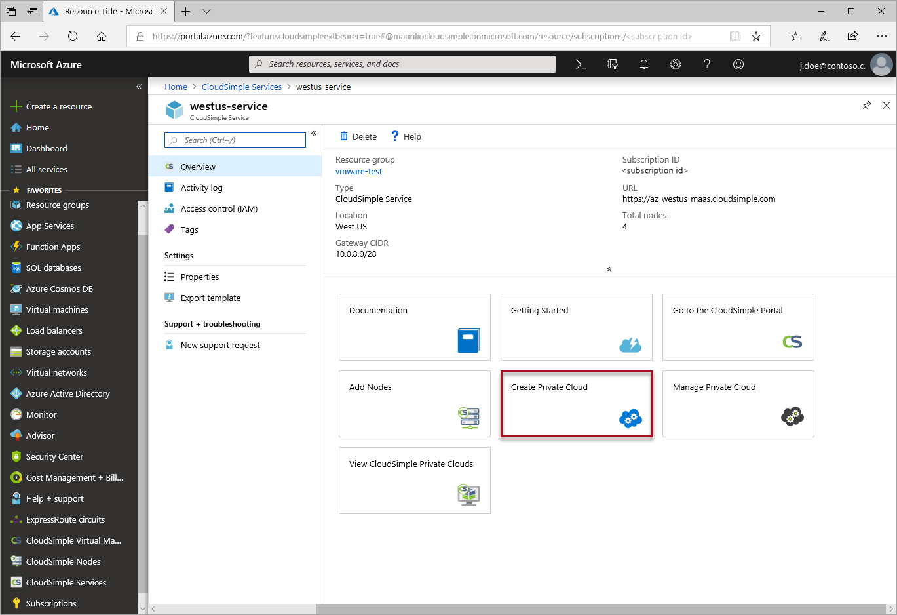
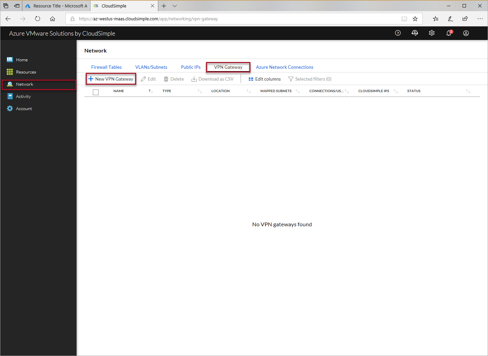
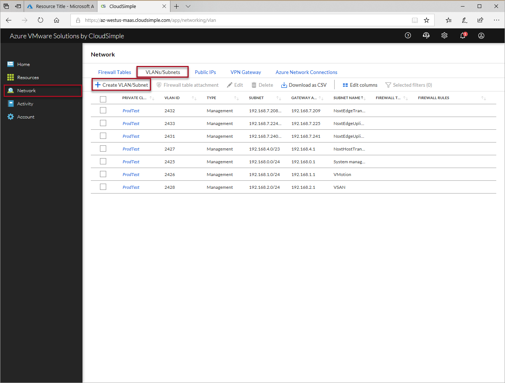
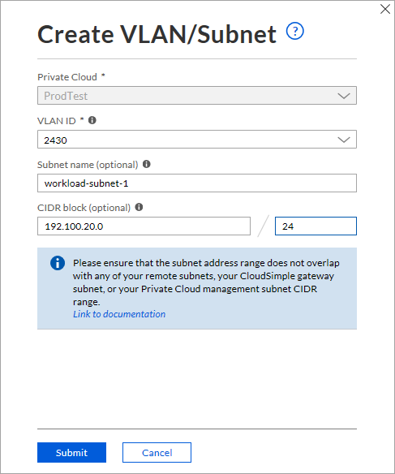
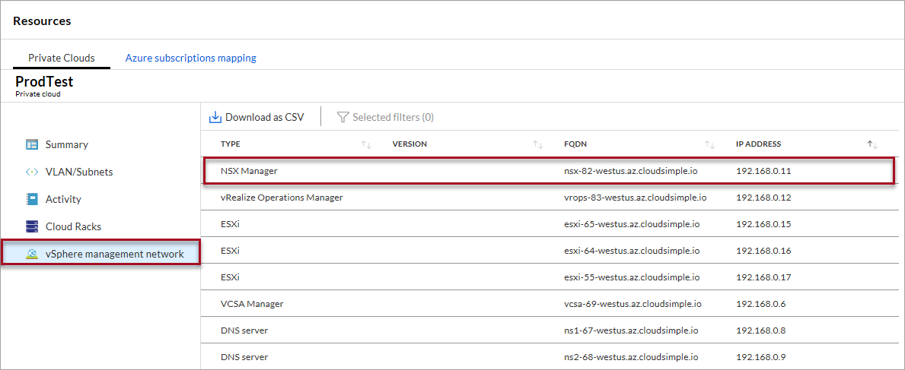

# Quickstart - Configure an AVS Private Cloud environment

In this article, learn how to create an AVS Private Cloud and set up your AVS Private Cloud environment.

## Before you begin

Review [Networking Prerequisites](cloudsimple-network-checklist.md).

## Sign in to Azure

Sign in to the Azure portal at [https://portal.azure.com](https://portal.azure.com).

## Create an AVS Private Cloud

An AVS Private Cloud is an isolated VMware stack that supports ESXi hosts, vCenter, vSAN, and NSX.

AVS Private Clouds are managed through the AVS portal. They have their own vCenter server in its own management domain. The stack runs on dedicated nodes and isolated bare metal hardware nodes.

1. Select **All services**.
2. Search for **AVS Services**.
3. Select the AVS service on which you want to create your AVS Private Cloud.
4. From **Overview**, click **Create AVS Private Cloud** to open a new browser tab for AVS portal. If prompted, sign in with your Azure sign in credentials. 

    

5. In the AVS portal, provide a name for your AVS Private Cloud.
6. Select the **Location** of your AVS Private Cloud.
7. Select **Node type**, consistent with what you purchased on Azure.
8. Specify **Node count**. At least three nodes are required to create an AVS Private Cloud.

    

9. Click **Next: Advanced options**.
10. Enter the CIDR range for vSphere/vSAN subnets. Make sure that the CIDR range doesn't overlap with any of your on-premises or other Azure subnets (virtual networks) or with the gateway subnet.

    **CIDR range options:** /24, /23, /22, or /21. A /24 CIDR range supports up to 26 nodes, a /23 CIDR range supports up to 58 nodes, and a /22 and /21 CIDR range supports 64 nodes (the maximum number of nodes in an AVS Private Cloud). To learn more and VLANs and subnets, see [VLANs and subnets overview](cloudsimple-vlans-subnets.md).

      > [!IMPORTANT]
      > IP addresses in the vSphere/vSAN CIDR range are reserved for use by the AVS Private Cloud infrastructure. Don't use the IP address in this range on any virtual machine.

11. Click **Next: Review and create**.
12. Review the settings. If you need to change any settings, click **Previous**.
13. Click **Create**.

AVS Private Cloud provisioning process starts. It can take up to two hours for the AVS Private Cloud to be provisioned.

## Launch AVS portal

You can access the AVS portal from Azure portal. The AVS portal will be launched with your Azure sign in credentials using Single Sign-On (SSO). Accessing the AVS portal requires you to authorize the **AVS Service Authorization** application. For more information on granting permissions, see [Consent to AVS Service Authorization application](access-cloudsimple-portal.md#consent-to-AVS-service-authorization-application).

1. Select **All services**.
2. Search for **AVS Services**.
3. Select the AVS service on which you want to create your AVS Private Cloud.
4. From overview, click **Go to the AVS portal** to open a new browser tab for AVS portal. If prompted, sign in with your Azure sign in credentials. 

    

## Create Point-to-Site VPN

A Point-to-Site VPN connection is the simplest way to connect to your AVS Private Cloud from your computer. Use Point-to-Site VPN connection if you're connecting to the AVS Private Cloud remotely. For quick access to your AVS Private Cloud, follow the steps below. Access to the AVS region from your on-premises network can be done using [Site-to-Site VPN](vpn-gateway.md) or [Azure ExpressRoute](on-premises-connection.md).

### Create gateway

1. Launch AVS portal and select **Network**.
2. Select **VPN Gateway**.
3. Click **New VPN Gateway**.

    

4. For **Gateway configuration**, specify the following settings and click **Next**.

    * Select **Point-to-Site VPN** as the gateway type.
    * Enter a name to identify the gateway.
    * Select the Azure location where your AVS service is deployed.
    * Specify the client subnet for the Point-to-Site gateway. DHCP addresses will be given from this subnet when you connect.

5. For **Connection/User**, specify the following settings and click **Next**.

    * To automatically allow all current and future users to access the AVS Private Cloud through this Point-to-Site gateway, select **Automatically add all users**. When you select this option, all users in the User list are automatically selected. You can override the automatic option by deselecting individual users in the list.
    * To select only individual users, click the check boxes in the User list.

6. The VLANs/Subnets section allows you to specify management and user VLANs/subnets for the gateway and connections.

    * The **Automatically add** options set the global policy for this gateway. The settings apply to the current gateway. The settings can be overridden in the **Select** area.
    * Select **Add management VLANs/Subnets of AVS Private Clouds**.
    * To add all user-defined VLANs/subnets, click  **Add user-defined VLANs/Subnets**.
    * The **Select** settings override the global settings under **Automatically add**.

7. Click **Next** to review the settings. Click the Edit icons to make any changes.
8. Click **Create** to create the VPN gateway.

### Connect to AVS using Point-to-Site VPN

VPN client is needed for connecting to AVS from your computer. Download [OpenVPN client](https://openvpn.net/community-downloads/) for Windows or [Viscosity](https://www.sparklabs.com/viscosity/download/) for macOS and OS X.

1. Launch AVS portal and select **Network**.
2. Select **VPN Gateway**.
3. From the list of VPN gateways, click the Point-to-Site VPN gateway.
4. Select **Users**.
5. Click **Download my VPN configuration**.

    

6. Import the configuration on your VPN client.

    * Instructions for [importing configuration on Windows client](https://openvpn.net/vpn-server-resources/connecting-to-access-server-with-windows/#openvpn-open-source-openvpn-gui-program)
    * Instructions for [importing configuration on macOS or OS X](https://www.sparklabs.com/support/kb/article/getting-started-with-viscosity-mac/#creating-your-first-connection)

7. Connect to AVS.

## Create a VLAN for your workload VMs

After creating an AVS Private Cloud, create a VLAN where you'll deploy your workload/application VMs.

1. In the AVS portal, select **Network**.
2. Click **VLAN/Subnets**.
3. Click **Create VLAN/Subnet**.

    

4. Select the **AVS Private Cloud** for the new VLAN/subnet.
5. Select a VLAN ID from the list. 
6. Enter a subnet name to identify the subnet.
7. Specify the subnet CIDR range and mask. This range must not overlap with any existing subnets.
8. Click **Submit**.

    

The VLAN/subnet will be created. You can now use this VLAN ID to create a distributed port group on your AVS Private Cloud vCenter.

## Connect your environment to an Azure virtual network

AVS provides you with an ExpressRoute circuit for your AVS Private Cloud. You can connect your virtual network on Azure to the ExpressRoute circuit. For full details on setting up the connection, follow the steps in [Azure Virtual Network Connection using ExpressRoute](https://docs.azure.cloudsimple.com/cloudsimple-azure-network-connection/).

## Sign in to vCenter

You can now sign in to vCenter to set up virtual machines and policies.

1. To access vCenter, start from the AVS portal. On the Home page, under **Common Tasks**, click **Launch vSphere Client**. Select the AVS Private Cloud and then click **Launch vSphere Client** on the AVS Private Cloud.

    

2. Select your preferred vSphere client to access vCenter and sign in with your username and password. The defaults are:
    * User name: **CloudOwner@AVS.local**
    * Password: **AVS123!**  

The vCenter screens in the next procedures are from the vSphere (HTML5) client.

## Change your vCenter password

AVS recommends that you change your password the first time you sign in to vCenter. 
The password you set must meet the following requirements:

* Maximum lifetime: Password must be changed every 365 days
* Restrict reuse: Users can't reuse any of the previous five passwords
* Length: 8 - 20 characters
* Special character: At least one special character
* Alphabetic characters: At least one uppercase character, A-Z, and at least one lowercase character, a-z
* Numbers: At least one numeric character, 0-9
* Maximum identical adjacent characters: Three

    Example: CC or CCC is acceptable as a part of the password, but CCCC isn't.

If you set a password that doesn't meet the requirements:

* if you use the vSphere Flash Client, it reports an error
* If you use the HTML5 client, it doesn't report an error. The client doesn't accept the change and the old password continues to work.

## Access NSX manager

NSX manager is deployed with a default password. 

* User name: **admin**
* Password: **AVS123!**

You can find the fully qualified domain name (FQDN) and IP address of NSX manager on AVS portal.

1. Launch AVS portal and select **Resources**.
2. Click on the AVS Private Cloud, which you want to use.
3. Select **vSphere management network**
4. Use the FQDN or IP address of **NSX Manager** and connect using a web browser.

    

## Create a port group

To create a distributed port group in vSphere:

1. Follow the instructions in "Add a distributed port group" in [vSphere Networking Guide](https://docs.vmware.com/en/VMware-vSphere/6.5/vsphere-esxi-vcenter-server-65-networking-guide.pdf).
2. When setting up the distributed port group, provide the VLAN ID created in [Create a VLAN for your Workload VMs](#create-a-vlan-for-your-workload-vms).

## Next steps

* [Consume VMware VMs on Azure](quickstart-create-vmware-virtual-machine.md)
* [Connect to on-premises network using Azure ExpressRoute](on-premises-connection.md)
* [Set up Site-to-Site VPN from on-premises](vpn-gateway.md)
