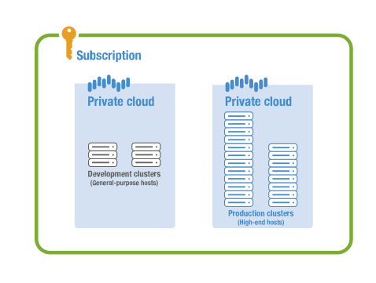

# VMware Solution on Azure by Virtustream private cloud and vSphere cluster concepts

The Azure VMware Solution (AVS) by Virtustream delivers VMware-based private clouds in Azure. The private clouds are built from clusters of dedicated bare-metal hosts and are deployed and managed through the Azure portal. Clusters in private clouds are provisioned with VMware vSphere, vCenter, vSAN, and NSX software. AVS by Virtustream private cloud hardware and software deployments are fully integrated and automated in Azure.

There's a logical relationship between Azure subscriptions, AVS by Virtustream private clouds, vSAN clusters, and hosts. In the diagram, two private clouds in a single Azure subscription are shown. The private clouds represent a development and a production environment, each with their own private cloud. In each of those private clouds there are two clusters. To show the lower potential needs of a development environment, smaller clusters with lower capacity hosts are used in that environment. All of these concepts are described in the sections below.

## Private clouds

Private clouds contain vSAN clusters that are built with dedicated, bare-metal Azrure hosts. Each private cloud can have multiple clusters, all managed by the same vCenter server, and NSX-T manager. You can deploy and manage private clouds in the portal, from the CLI, or with PowerShell. As with other resources, private clouds are installed and managed from within an Azure subscription.

The number of private clouds within a subscription is scalable. Initially, there's a limit of one private cloud per subscription.

## Clusters

You'll create at least one vSAN cluster in each private cloud. When you create a private cloud, there's one cluster by default. You can add additional clusters to a private cloud using the Azure portal or through the API. All clusters have a default size of three hosts and can be scaled from 3 to 16 hosts. The type of hosts used in a cluster must be the same type. The hosts types are described in the next section.

Trial clusters are available for evaluation and they're limited to three hosts and a single trial cluster per private cloud. You can scale a trial cluster by a single host during the evaluation period.

You create, delete, and scale clusters through the portal or API. You still use vSphere and NSX-T Manager to manage most other aspects of cluster configuration or operation. All local storage of each host in a cluster is under control of vSAN.

## Hosts

Hyper-converged, bare-metal infrastructure nodes are used AVS by Virtustream private cloud clusters. There are two types of hosts, and clusters are built using only one type of host. The RAM, CPU, and disk capacities of both types the host types is provided in the table below. 

| Host Type              |             CPU             |   RAM (GB)   |  vSAN NVMe cache Tier (TB, raw)  |  vSAN SSD capacity tier (TB, raw)  |
| :---                   |            :---:            |    :---:     |               :---:              |                :---:               |
| High-End (HE)          |  dual Intel 18 core 2.3 GHz  |     576      |                3.2               |                15.20               |
| General-Purpose (GP)   |  dual Intel 10 core 2.2 GHz  |     192      |                1.6               |                 7.68               |

Multiple types of hosts provide you with the flexibility to match hosts and cluster specifications to workload and business requirements.

Hosts that are used to build or scale clusters are allocated from an isolated pool of hosts. Those hosts have passed hardware tests and have had all data securely deleted from the flash disks. When you remove a host from a cluster, the internal disks are securely wiped and the hosts are placed into the isolated pool of hosts. When you add a host to a cluster, a sanitized host from the isolated pool is used.

## VMware software versions

The current software versions of the VMware software used in AVS by Virtustream private cloud clusters are:

| Software              |    Version   |
| :---                  |     :---:    |
| VCSA / vSphere / ESXi |    6.7 U2    | 
| ESXi                  |    6.7 U2    | 
| vSAN                  |    6.7 U2    |
| NSX-T                 |      2.3     |

For any new cluster in a private cloud, the version of software will match what is currently running in the private cloud. For any new private cloud in a customer subscription, the latest version of the software stack is installed.

The general upgrade policies and processes for the AVS by Virtustream platform software is described in the Upgrades Concepts document.

## Host maintenance and lifecycle management

Host maintenance and lifecycle management are done without impact on the capacity or performance of private cloud clusters. Examples of automated host maintenance include firmware upgrades and hardware repair or replacement.

## Backup and restoration

Private cloud vCenter and NSX-T configurations are backed up hourly. Backups are kept for three days. Restoration from a backup is requested through a Service Request in the Azure portal.

## Next steps

The next step is to learn networking and interconnectivity concepts.

<!-- LINKS - internal -->

<!-- LINKS - external-->
[VCSA versions]: https://kb.vmware.com/s/article/2143838
[ESXi versions]: https://kb.vmware.com/s/article/2143832
[vSAN versions]: https://kb.vmware.com/s/article/2150753

