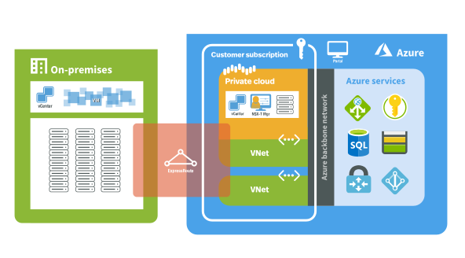

# What is Azure VMware Solution by Virtustream?

Azure VMware Solution by Virtustream (AVS by Virtustream) provides you with private clouds in Azure. The private clouds contain vSphere clusters, built from dedicated bare-metal infrastructure in Azure. You can scale private cloud clusters from 3 to 16 hosts, with the capability to have multiple clusters in a single private cloud. All private clouds are provisioned with vCenter Server, VSAN, vSphere, and NSX-T. You can migrate workloads from your on-premises environments, create or deploy new virtual machines, and consume  Azure services from your private clouds.

AVS by Virtustream is a VMware validated solution with on-going validation and testing of enhancements and upgrades. The private cloud infrastructure and software are managed and maintained through Azure, allowing you to focus on developing and running workloads in your private clouds.

Figure 1 shows the adjacency of private clouds to VNets in Azure, Azure services, and on-premises environments. Network access from private clouds to Azure services or VNets in Azure occurs over the secure Azure backbone network and provides SLA-driven integration of Azure service endpoints. Private cloud access from on-premises environments uses ExpressRoute Global Reach for a private and secure connection.

## Hosts, clusters, and private clouds

AVS by Virtustream private clouds and clusters are built from two types of bare-metal, hyper-converged Azure infrastructure hosts. A general-purpose (GP) host configuration is available for evaluation clusters, and a high-end (HE) host configuration for any use case. The high-end hosts have 576-GB RAM and dual Intel 18 core, 2.3-GHz processors. The HE hosts have two vSAN diskgroups with a total 15.36 TB (SSD) raw vSAN capacity tier, and 3.2 TB (NVMe) vSAN cache tier. General-purpose hosts have 192-GB RAM and dual Intel 12 core, 2.2-GHz processors. The GP hosts have a single vSAN diskgroup with a total 7.68 TB (SSD) raw vSAN capacity tier, and 1.6 TB (NVMe) vSAN cache tier.

New private clouds are deployed through the Azure portal. Other deployment options include the Azure CLI, PowerShell, or Azure Resource Manager templates. For more information on AVS by Virtustream private clouds, clusters, and Azure hosts, see the Networking Concepts article.

## Networking

Private management, provisioning, and vMotion networks are created when a private cloud is deployed. These networks are used for access to vCenter and NSX-T Manager and for virtual machine vMotion or deployment. All of the private networks are accessible from a VNet in Azure or from on-premises environments. ExpressRoute Global Reach is used to connect private clouds to on-premises environments, and this connection requires a VNet with an ExpressRoute circuit in your subscription.

Access to the internet and Azure services are provisioned when a private cloud is deployed. The access is provided so that VMs on production workload networks can consume Azure or internet-based services. Internet access is disabled by default for new private clouds, and it can be enabled or disabled at any time.

For more information on networking and interconnectivity, see the Networking Concepts article.

## Access and security

For enhanced security, AVS by Virtustream private clouds use vSphere role-based access control. vSphere SSO LDAP capabilities can be integrated with Azure Active Directory. For more information on identity and privileges, see the Access and Identity Concepts article.

vSAN data-at-rest encryption is enabled by default and is used to provide vSAN datastore security. It's described in more detail in the Storage Concepts article.

## Host and software lifecycle maintenance

Regular upgrades of the AVS by Virtustream private cloud and VMware software ensures the latest security, stability, and feature sets are running in your private clouds. More details about platform maintenance and upgrades are available in the Upgrade Concepts article.

## Next steps

The next step is to learn key [private cloud and cluster concepts][concepts-private-clouds-clusters].

<!-- LINKS - external -->

<!-- LINKS - internal -->
[concepts-private-clouds-clusters]: ./concepts-private-clouds-clusters.md