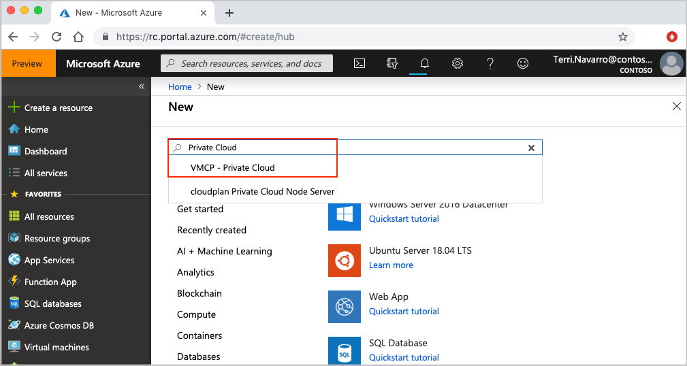
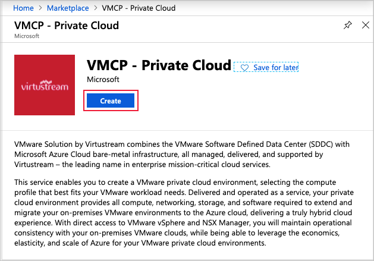
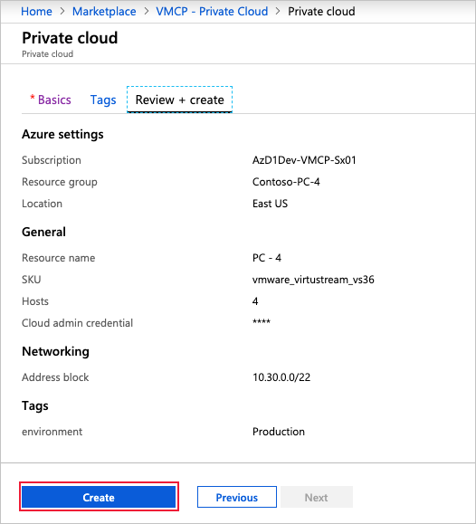
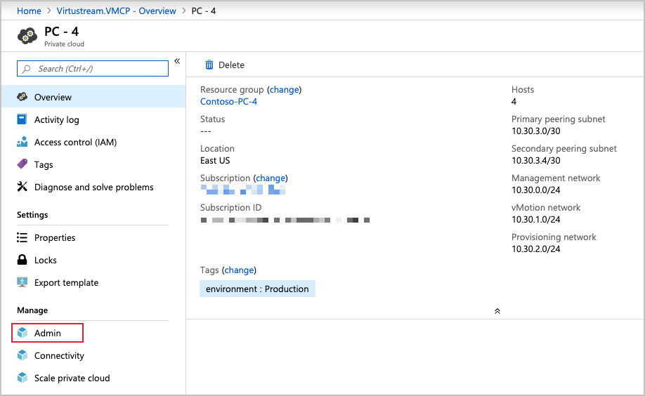

# Tutorial: Create an Azure VMware Solution by Virtustream private cloud

AVS by Virtustream private clouds provide Azure-based environments to run VMware virtual machines (VMs). You can quickly and repeatably create private clouds in Azure and in this tutorial you plan and then create a private cloud. Using the Azure portal, you learn how to:

> [!div class="checklist"]
> * Prepare for a deployment
> * Create a private cloud
> * Request ExpressRoute authorization keys
> * Enable internet and Azure connectivity

The next tutorial provides the instructions for deploying resources to a VNet in your subscription. An ExpressRoute gateway in that VNet will be used to peer with an ExpressRoute circuit that is created as part of a private cloud deployment described in this tutorial. Most of the procedures in the second tutorial can be performed before this tutorial.

## Prerequisites

In order complete this tutorial, it's recommended that you first plan the private network address space that you will use for management access and vMotion in your private cloud. The private  network address space should be unique across the VNets in your Azure subscription and, if you are planning to connect to on-premises environments, it's also recommended that it is unique across your on-premises networks.

You need to plan for the type and number of hosts that you will use in your private cloud clusters. Resource and resource group names are also required, and you will be required to know or create those to complete this tutorial.

This tutorial also requires that you have an Azure subscription, access to the Portal, and that the Microsoft.VMwareVirtustream resource provider is registered in your subscription. Following the instructions in [resource provider][Azure resource providers and types] documentation, search for Virtustream. This screenshot shows what will appear if the resource provider is registered in your subscription.

If it is not registered, continue with instructions in that documentation.

Prerquisites:

- A /22 network address space
- The host types to be used in private cloud clusters (see this link for a description)
- the number of hosts to be used in each cluster
- an existing VNet with an ExpressRoute gateway in your subscription (see this link for instructions)
- optionally, and if you intend to enable ExpressRoute Gloabl Reach, an authorization key and resource ID of an ExpressRoute circuit that connects your on-premises environments to an Azure VNet. Use these instructions to [generate auth key][generate an authorization key]. This can be done after creating a private cloud.

## Create a private Cloud 

In the Azure portal, navigate to the "New" resource, select "Compute" and then search the marketplace for "private cloud".

In the results, select "VMCP - Private Cloud".

Select "Create".

In the "Basics" tab, enter the required information and then select "Next".

In the "Tags" tab, create or select tags that will be associated with the new private cloud and then select "Next". In this example, the "environment" tag with value "Production" is used.

If the configuration passes validation, review and then select "Create" in the "Review + create" tab.

Once the deployment has succeeded, navigate to the new private cloud in your resources and review the overview information. Confirm the configuration, and then select "Admin" to retrieve the credentials to access vCenter and NSX-T manager. Establishing that access is covered in the [access a private cloud tutorial][tutorials-access-private-cloud].

## Request an ExpressRoute authorization key and resource ID

Select the ExpressRoute tab and "Request an authorization key". An authorization key and resource ID will be provided and you will use them to establish private peering from a VNet in your subscription to the ER circuit for this private cloud. 

The procedures for using the authorization key and resource ID to establish peering are provided in the [create VNet resources tutorial][tutorial-create-vnet-resources.md]. Once the VNet resources and the peering have been established, you will be able to connect to the private cloud.

## Establish Global Reach on ExpressRoute Circuit to on-premises environment

If you are connecting from on-premises to the new private cloud with an existing ExpressRoute connection, select "Add global reach key" and provide an authorization key and ID obtained following the documentation to [enable Global Reach on ExpressRoute circuits in two different subscriptions][enable global reach].

## Enable internet connectivity of a private cloud

Select "Connectivity" for the new private cloud resource. To enable the connection from your private cloud to the internet, select "Internet enabled" > "Save".

By enabling private cloud access to the internet, production workload VMs will be able to access the internet and Azure services. The procedures for creating NSX-T T1 routers and logical switches that enable the access is covered in the [create an NSX-T T1 router and logical switch tutorial][tutorials-create-t1-ls].

## Next steps

<!-- [In your subscription, create a VNet and resources to connect to a private cloud.][tutorials-create-vnet-resources] -->

<!-- LINKS - external-->
[resource provider]: https://docs.microsoft.com/en-us/azure/azure-resource-manager/resource-manager-supported-services
[enable Global Reach]: https://docs.microsoft.com/en-us/azure/expressroute/expressroute-howto-set-global-reach-cli#enable-connectivity-between-expressroute-circuits-in-different-azure-subscriptions

<!-- LINKS - internal -->
<!--[tutorials-create-vnet-resources]: ./t utorials-create-vnet-resources.md-->
<!-- [tutorials-access-private-cloud]: ./tutorials-access-private-cloud.md-->
<!-- [tutorials-create-t1-ls]: ./tutorials-create-t1-ls.md-->
