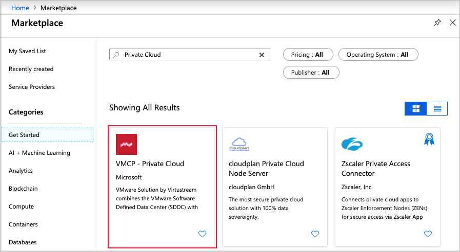
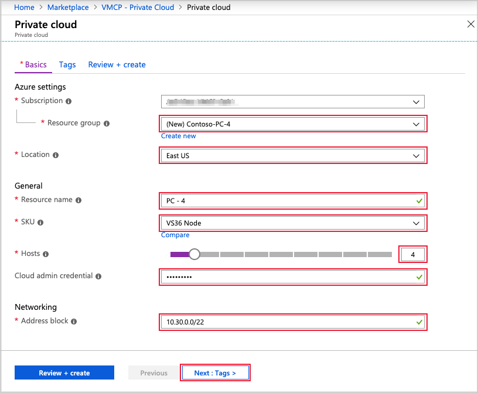
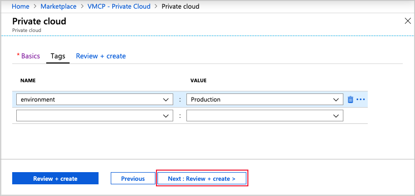
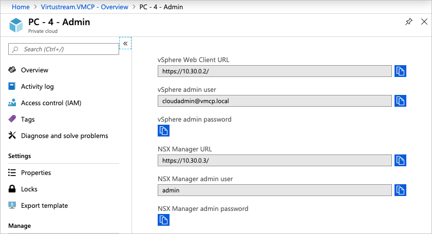

# Tutorial: Create an Azure VMware Solution by Virtustream private cloud

AVS by Virtustream private clouds provide Azure-based environments to run VMware virtual machines (VMs). In this tutorial, you plan and then create a private cloud. Using the Azure portal, you learn how to:

> [!div class="checklist"]
> * Prepare for a deployment
> * Create a private cloud
> * Request ExpressRoute authorization keys
> * Enable internet and Azure connectivity

The next tutorial provides the instructions for deploying resources to a VNet in your subscription. An ExpressRoute gateway in that VNet will be used to peer with an ExpressRoute circuit in your private cloud. Most of the procedures in the second tutorial can be done before this tutorial is started.

## Prerequisites

It's recommended you first plan the private network address space for your private cloud. This network address space for the management access and vMotion networks in your private cloud. The private network address space should be unique across the VNets in your Azure subscription and, if you plan to connect from on-premises environments, it's also recommended that it's unique across your on-premises networks.

You also plan for the type and number of hosts that you'll use in your private cloud clusters. Resource and resource group names are also required, and you're required to know or create those in order to complete this tutorial.

This tutorial also requires that you have an Azure subscription, access to the Portal, and that the Microsoft.VMwareVirtustream resource provider is registered in your subscription. Following the instructions in [resource provider][Azure resource providers and types] documentation, search for Virtustream. This screenshot shows what will appear if the resource provider is registered in your subscription.

If it's not registered, continue with instructions in that documentation.

Prerequisites:

- A /22 network address space
- The host types to be used in private cloud clusters (see this link for a description)
- the number of hosts to be used in each cluster

## Create a private Cloud 

In the Azure portal, navigate to the "New" resource, select "Compute" and then search the marketplace for "private cloud".

In the results, select "VMCP - Private Cloud".

Select "Create".

In the "Basics" tab, enter the required information and then select "Next".

In the "Tags" context blade, create or select tags that will be associated with the new private cloud. Once tags are created, * and then select **Next**. In this example, the "environment" tag with value "Production" is used.

If the configuration passes validation, review and then select "Create" in the "Review + create" tab.

Once the deployment has succeeded, navigate to the new private cloud in your resources and review the overview information. Confirm the configuration and then select "Admin" to retrieve the credentials to access vCenter and NSX-T manager. You will establish the access and connect to private cloud in another tutorial.

## Next steps

In the next tutorial you will create a VNet and resources to connect to a private cloud.

<!-- LINKS - external-->
[resource provider]: https://docs.microsoft.com/en-us/azure/azure-resource-manager/resource-manager-supported-services
[enable Global Reach]: https://docs.microsoft.com/en-us/azure/expressroute/expressroute-howto-set-global-reach-cli#enable-connectivity-between-expressroute-circuits-in-different-azure-subscriptions

<!-- LINKS - internal -->
[tutorials-create-t1-ls]: ./tutorials-create-t1-ls.md
