# Tutorial: Create an NSX-T network on an Azure VMware Solution by Virtustream private cloud

AVS by Virtustream private clouds provide Azure-based environments to run VMware workload virtual machines (VMs). You can quickly create networks in a private cloud and then deploy or migrate VMs on those networks. In this tutorial you create an NSX-T T1 router and a logical switch with DHCP services. Using NSX-T Manager, you learn how to create:

> [!div class="checklist"]
> * T1 router
> * Logical switch
> * Port on a router
> * DHCP services

## Prerequisites

In previous tutorials, you created a private cloud in Azure and received the credentials to access vCenter and NSX-T manager. If you haven't created a private cloud and want to follow along step-by-step with this tutorial, start at Tutorial 1 – Create a private cloud<!-- [[tutorials-create-private-cloud] -->.

This tutorial requires that you have access to vCenter and NSX-T Manager in your private cloud. If you need to establish access, see Tutorial 3 - Access private cloud<!-- [][tutorial-access-private-cloud] -->.

Ensure that you have the IP address and admin credentials for the NSX-T Manager. These items were provided when the private cloud was deployed and are available in the Azure portal.

Using a browser, navigate to the IP address of the NSX-T Manager and sign in as the **admin** user.

On first sign in to the NSX-T manager, the details on the home page should have match the following initial configuration.

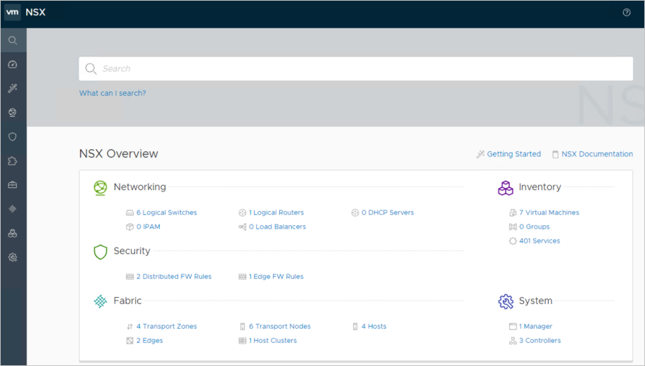

## Create a logical switch

Select **Networking > Switching**.

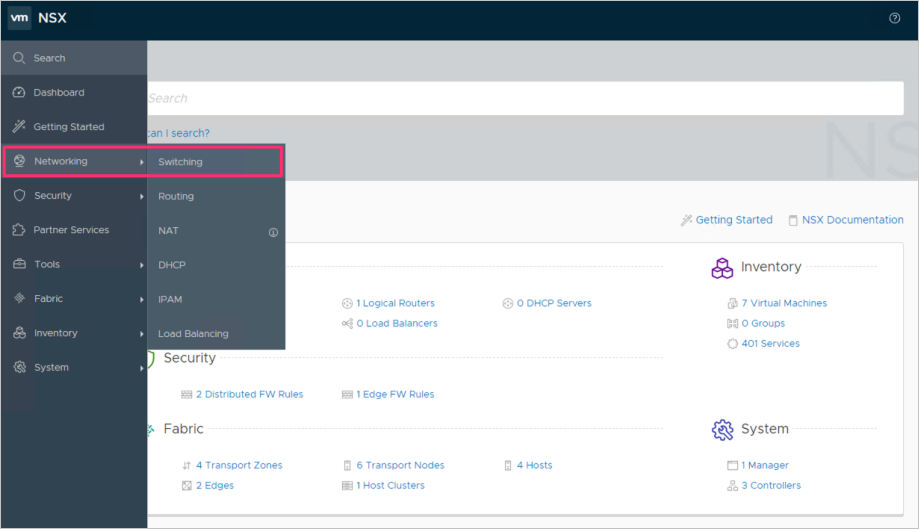

Select **+ ADD** and in the form enter a name for the logical switch.
Select the **TNTXX-OVRLAY-TZ** Transport Zone.
Select **Use Default**.
Enter an Uplink Teaming Policy Name.
Select Admin Status of **Up**.
Select **Hierarchical Two-Tier replication**.

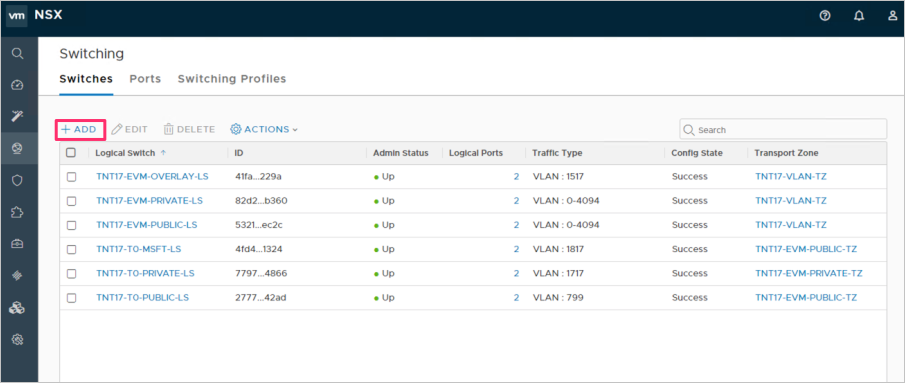

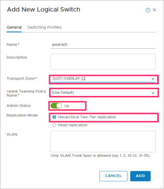

Select the **ADD** button to show results.

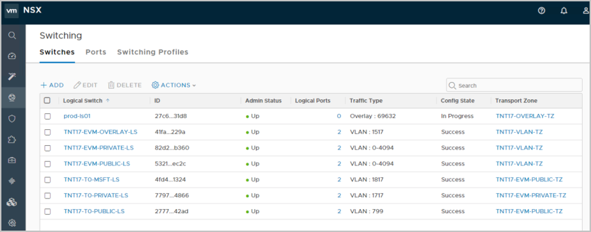

## Create a T1 router

Select **Networking > Routers**.

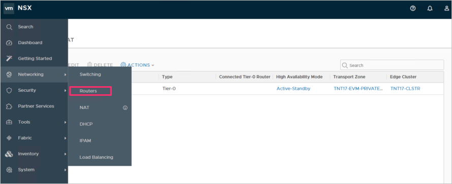

Select **+ ADD**, and then select **Tier-1 Router**.
Enter a **Name** and select **Non-preemptive** Failover Mode.

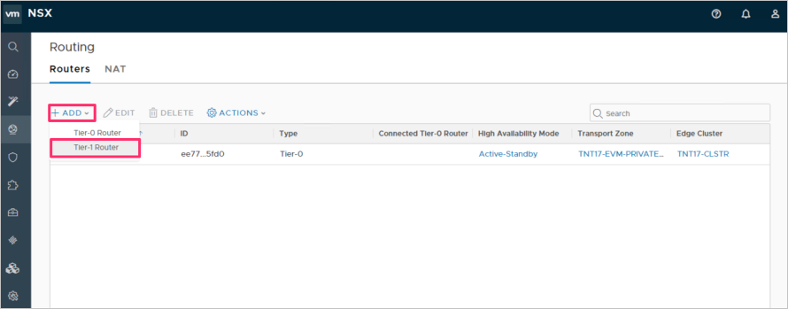

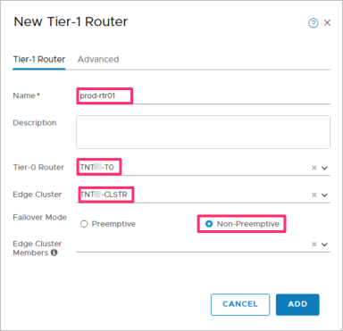

> [!NOTE]
> There is only a single Tier-0 Router and a single NSX-T Edge Node cluster to select.

Select **ADD**.

## Add the logical switch to a port on the T1 router

Select **Networking > Routers** and then choose the T1 router that was just created.

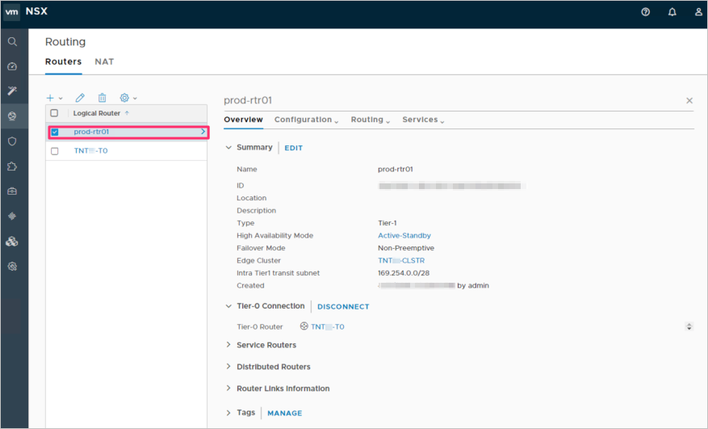

> [!WARNING]
> Never select or edit the T0 router.

Select **Configuration > Router Ports**"**.
Select **+ ADD**.

Complete the form with a new name for the router port, the **Logical Switch** name created in a previous section, an **IP address/mask** in CIDR notation, and the following selections for **Type**, **URPF Mode**, and **Logical Switch Port**.

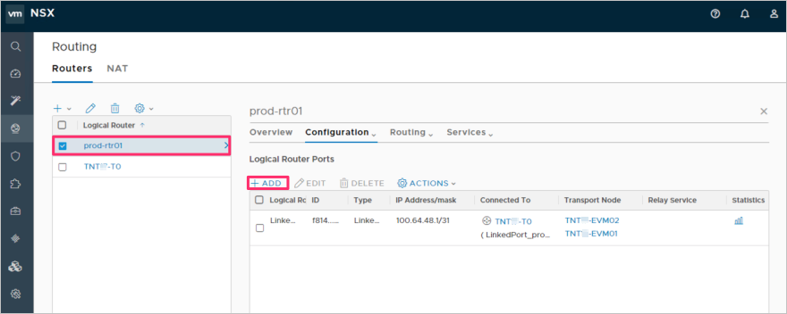

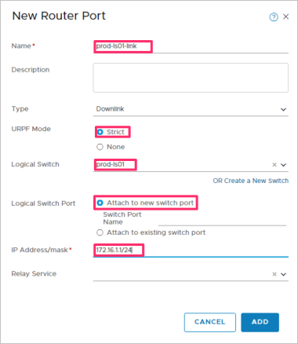

Select **ADD**.

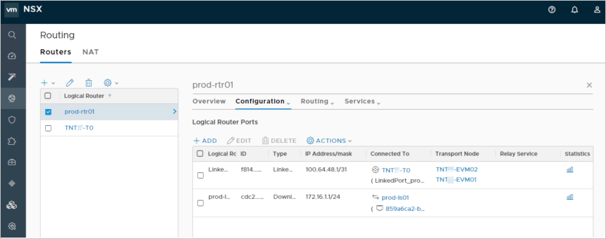

## Add DHCP service to the logical switch

Select **Networking > DHCP > Server Profiles**.
Select **+ ADD**.
Enter a **Name** and select the **Edge Cluster** on the form.

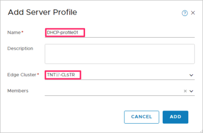

Select **ADD**.

Use this profile to create a DHCP server for the logical switch.

Select **Networking > DHCP > Servers**.
Select **+ ADD** to add a DHCP server. Enter a name and other details on the form.

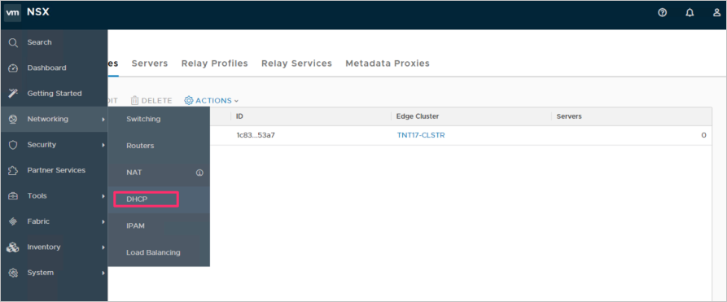

Select "+ ADD", choose Tier-1 Router, and then enter a name and other details in the form (what's shown are examples):

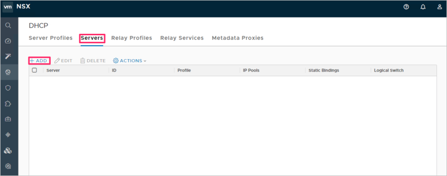

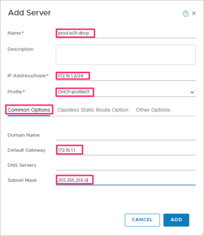

Select **ADD**.

Select the new DHCP server in **DHCP > Servers**.
Select **IP Pools > + ADD**.
Enter the required information in the form.

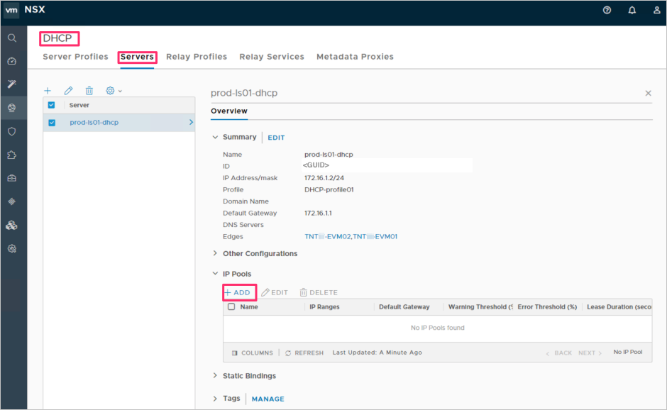

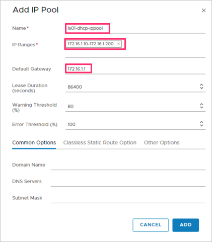

Select **ADD**.

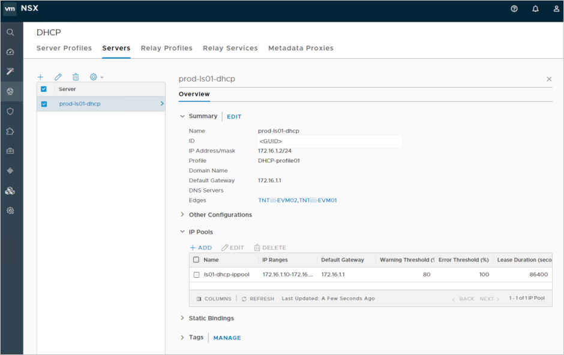

Select **Actions (the gear icon) > Attach to Logical Switch**.

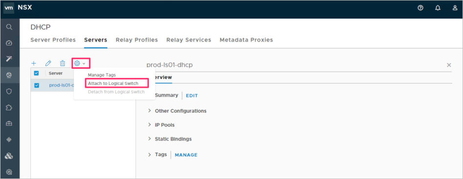

Select the new **Logical Switch** from the pulldown list.
Select **ATTACH**.

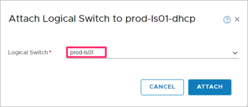

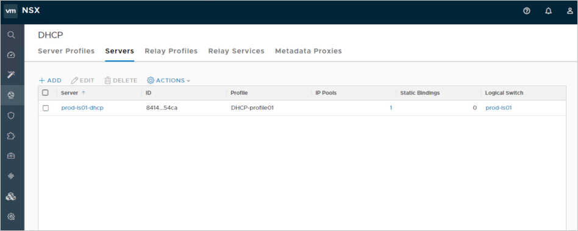

With DHCP services enabled on the NSX-T logical switch, virtual machines deployed on the network can now receive a default gateway and an IP address.

## Next steps

The next step is to [deploy a VM][tutorials-deploy-vm].

<!-- [Deploy a virtual machine on the NSX-T logical switch network.][tutorials-deploy-vm] -->

<!-- LINKS - external-->

<!-- LINKS - internal -->
[tutorials-deploy-vm]: ./tutorials-deploy-vm.md
