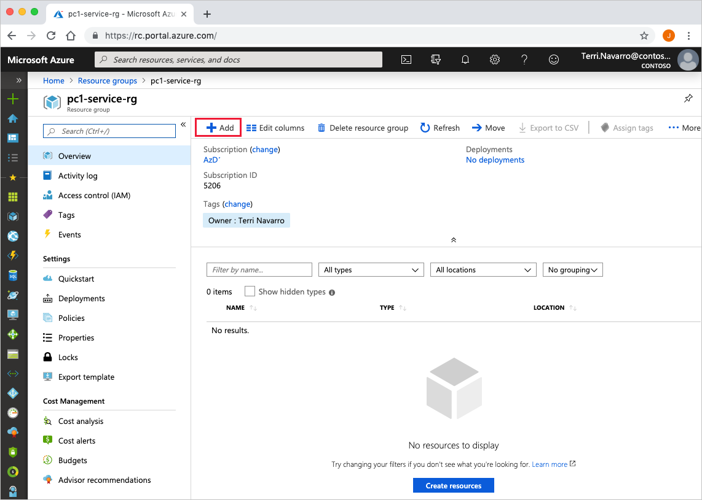
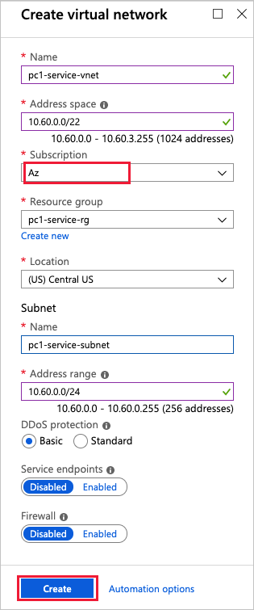
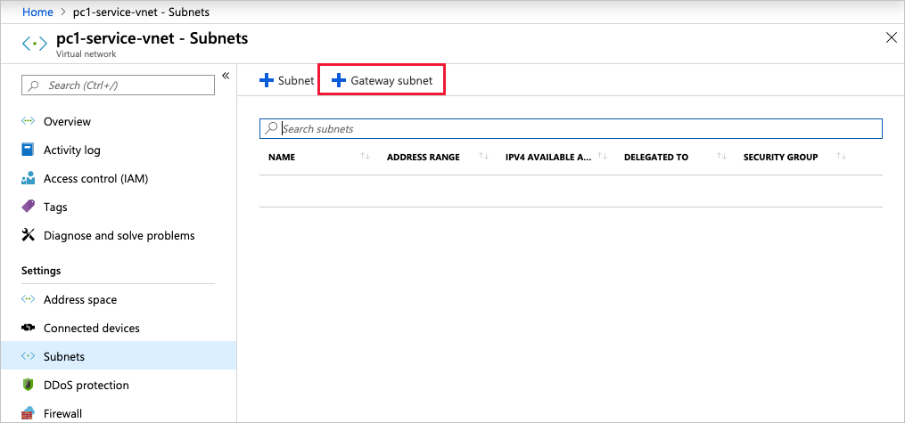
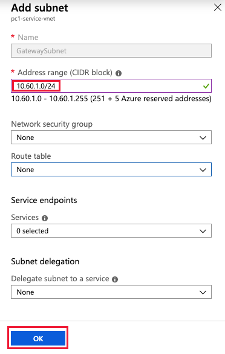
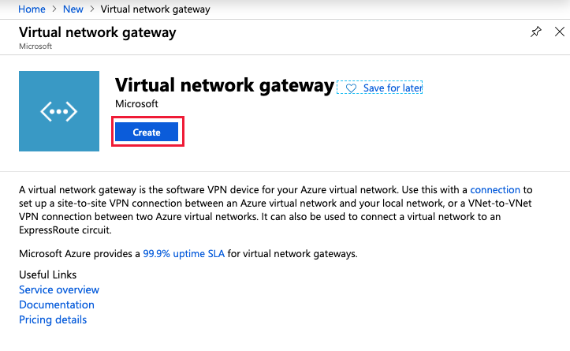
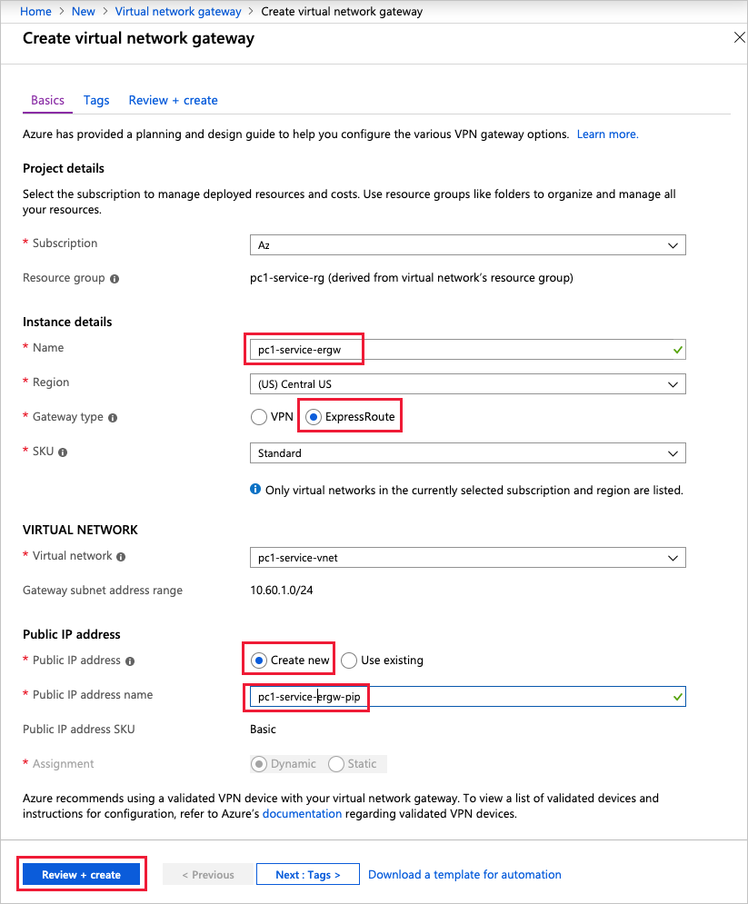
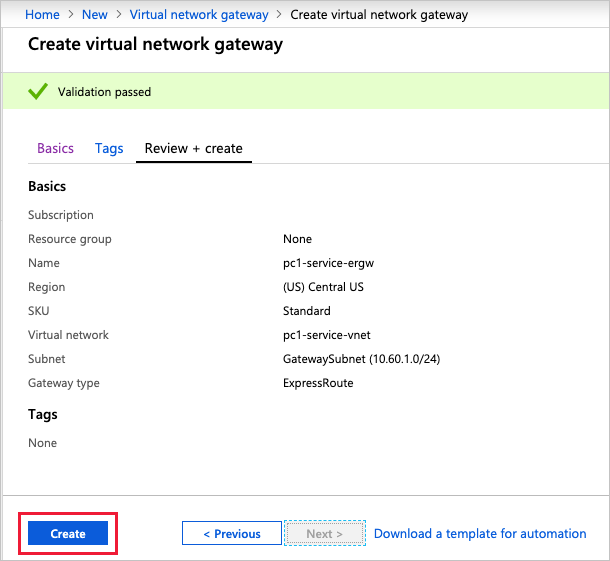
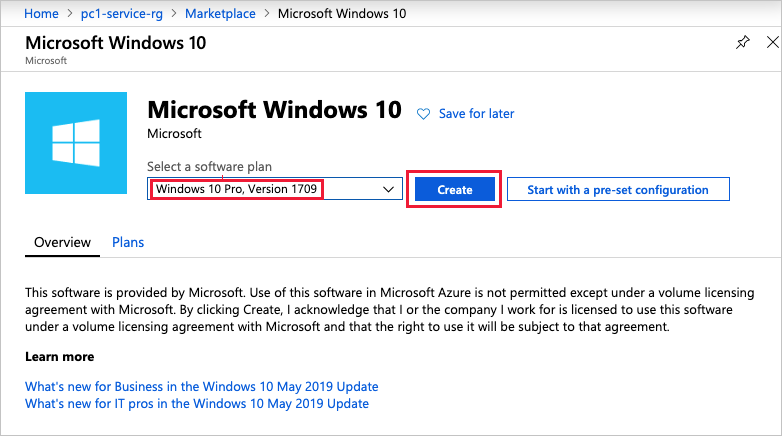
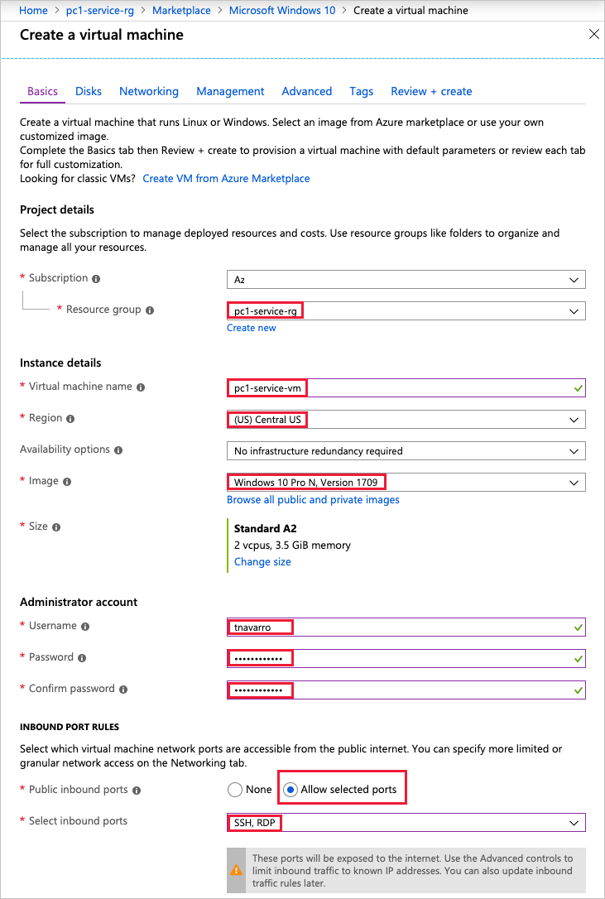
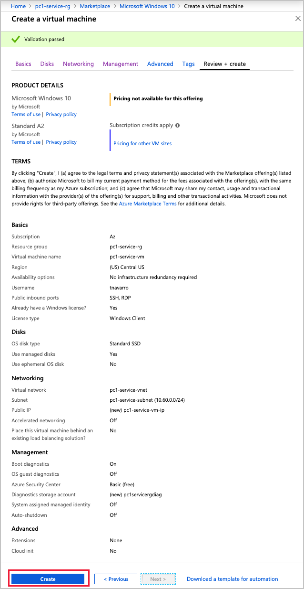

# Tutorial: Create VNet resources to peer with an AVS by Virtustream private cloud

In this tutorial, you create a service VNet and other required resources in your Azure subscription. The resources include a Windows virtual machine, a gateway subnet, and an ExpressRoute gateway. The gateway is peered with the ExpressRoute circuit of your new private cloud.

Using this tutorial, you learn how to:

> [!div class="checklist"]
> * Create a VNet and required resources
> * Request an ExpressRoute authorization key and Resource ID
> * Use the authorization key and ID to peer an ExpressRoute gateway and an ExpressRoute circuit

The previous tutorial provided the instructions for creating an Azure VMware Solution (AVS) by Virtustream private cloud. It's recommended to use the tutorials in order, but most of this tutorial can be done first.

## Prerequisites

It's recommended that you first plan the private network address spaces that you will use for the VNet you create in this tutorial. The network address space of the new VNet must not overlap with the network address space of the private cloud you will peer with. The details of this planning are provided in the [fist tutorial][./media/create-private-cloud](tutorials-create-private-cloud.md).

Prerequisites:
- Access to the Azure portal
- A non-overlapping network address space for the gateway subnet

## Create a VNet

In the Azure portal, select a resource group in the Azure portal and then select **+ Add**.

Select **+ Add > virtual network**. In the **Create virtual network** form, enter the configuration for the new VNet and then select **Create**.

## Create a gateway subnet and an ExpressRoute gateway

In the blade for the new VNet, select **Subnets > + Gateway subnet**.

In the blade for the new subnet, select **OK**.

Once the gateway subnet is created, search for and select **Virtual network gateway > Create**.

Enter the required information and then select **Review + create**.
 

When validation passes, select **Create**.

## Add a new Windows virtual machine

In the resource group, select **+ Add** then search and select **Microsoft Windows 10 > Create**.

Enter the required information and then select **Review + create**.

When the new VM is configured to your specifications, select **Review + create**. Once validation passes, select **Create**.

## Next steps

The next step is to [access your private cloud](tutorials-access-private-cloud.md) using the Windows VM and ExpressRoute gateway you created in this tutorial.

<!-- LINKS - external-->
[resource provider]: https://docs.microsoft.com/en-us/azure/azure-resource-manager/resource-manager-supported-services
[enable Global Reach]: https://docs.microsoft.com/en-us/azure/expressroute/expressroute-howto-set-global-reach-cli#enable-connectivity-between-expressroute-circuits-in-different-azure-subscriptions

<!-- LINKS - internal -->
