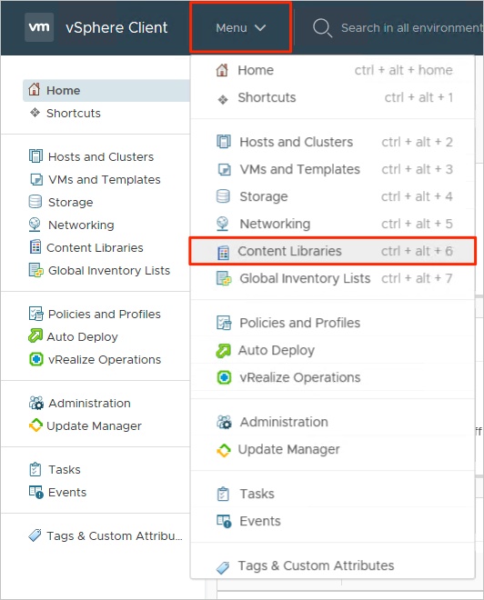
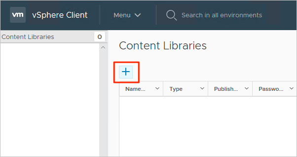
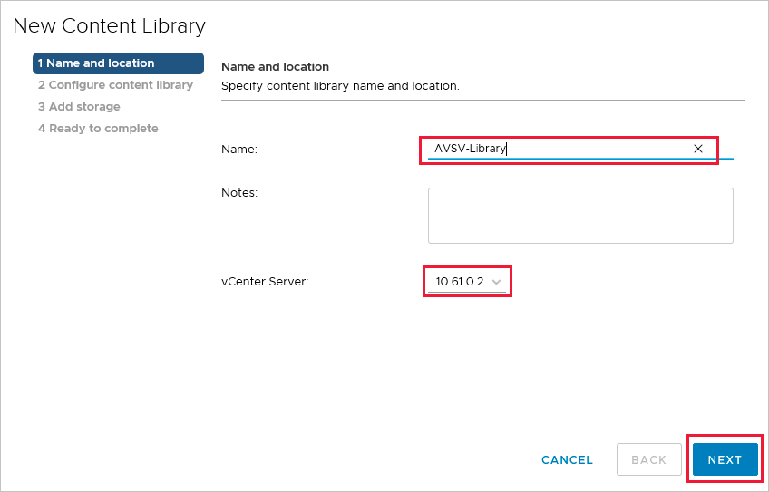

# Tutorial: Deploy a VM in an Azure VMware Solution by Virtustream (AVSV) private cloud

In this tutorial, you create a virtual machine (VM) and attach it to an NSX-T logical switch network segment.

You learn how to:
> [!div class="checklist"]
> * Create a content library
> * Upload an ISO to the content library
> * Build a VM using an ISO the Content Library

## Prerequisties

An NSX-T logical switch segment created in a [previous tutorial](tutorials-nsx-t1-ls.md) is required to complete this tutorial.

## Create Content Library

1. Using the HTML5 interface, sign on to your private cloud vCenter instance. (HTML5 Interface)
    1. https://IPAddressofyourVCSA/ui
1. Select **Menu > Content Libraries**
    *  
1. Select **+** to create a new content library.
    *  
1. Specify a name and confirm the IP address of the vCenter server. Select **NEXT**.
    *  
1. Select **Local content library > NEXT**.
    *  
1. Select the datastore that will store your content library, then select **NEXT**.
    *   
1. Review and verify the content library settings, select **FINISH**.
    *   

## Upload an ISO image to the content library

1. Sign on to your AVSV vCenter Instance. (HTML5 Interface)
1. Select Menu -> Content Libraries
1. Select the Content library you'd like to upload your ISO to.
1. Select "Actions..." --> "Import Item"
1. Define a URL you'd like to download an ISO from or select "Local File" to upload from your local system.
    1. Optional, define a custom item name and notes.
1. Click Import.
1. To verify your ISO uploaded check recent tasks or the "Other Types" tab.
    1. Successfully uploaded ISO should show up under "Other Types"

## Deploy VM
1. Login your AVSV vCenter Instance. (HTML5 Interface)
1. Select Menu -> "Hosts and Clusters"
1. Expand tree in left panel to show your cluster(s) and select cluster you'd like to deploy your VM to.
1. Select "Actions" --> "New Virtual Machine..."
1. Follow the wizard to step 7 modifying settings as desired.
1. In step 7, select "New CD/DVD Drive" --> "Client Device" dropdown and select "Content Library ISO File"
1. Select the ISO to mount, click OK
1. Check the "Connect..." box so the ISO is mounted at power on time.
1. Select "New Network" --> Select dropdown --> "Browse..."
1. Select the logical switch (segment) you'd like this VM attached to at deployment.  Click OK
1. Modify any other hardware settings as desired.
1. Click Next.
1. Verify Settings in step 8 and click Finish.

## Clean up resources

<This secion is required if resources are created that are required to perform the actions in the tutorial but are not required after the tutorial is complete Finding example>

## Next steps

> [!div class="nextstepaction"]
> [Follow this link to consume an Azure service from a VM in a private cloud][tutorials-consume-azure-service]

<!-- LINKS - external-->

<!-- LINKS - internal -->
[tutorials-consume-azure-service]: ./tutorials-consume-azure-service.md