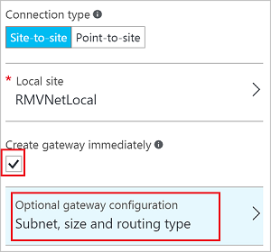
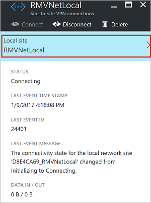
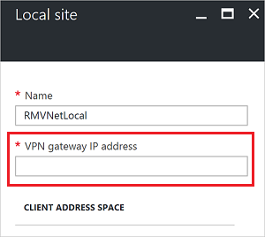

# Connect virtual networks from different deployment models using the portal

This article shows you how to connect classic VNets to Resource Manager VNets to allow the resources located in the separate deployment models to communicate with each other. The steps in this article primarily use the Azure portal, but you can also create this configuration using the PowerShell by selecting the article from this list.

> [!div class="op_single_selector"]
> * [Portal](vpn-gateway-connect-different-deployment-models-portal.md)
> * [PowerShell](vpn-gateway-connect-different-deployment-models-powershell.md)
> 
> 

Connecting a classic VNet to a Resource Manager VNet is similar to connecting a VNet to an on-premises site location. Both connectivity types use a VPN gateway to provide a secure tunnel using IPsec/IKE. You can create a connection between VNets that are in different subscriptions and in different regions. You can also connect VNets that already have connections to on-premises networks, as long as the gateway that they have been configured with is dynamic or route-based. For more information about VNet-to-VNet connections, see the [VNet-to-VNet FAQ](#faq) at the end of this article. 

If your VNets are in the same region, you may want to instead consider connecting them using VNet Peering. VNet peering does not use a VPN gateway. For more information, see [VNet peering](../virtual-network/virtual-network-peering-overview.md). 

### Prerequisites

* These steps assume that both VNets have already been created. If you are using this article as an exercise and don't have VNets, there are links in the steps to help you create them.
* Verify that the address ranges for the VNets do not overlap with each other, or overlap with any of the ranges for other connections that the gateways may be connected to.
* Install the latest PowerShell cmdlets for both Resource Manager and Service Management (classic). In this article, we use both the Azure portal and PowerShell. PowerShell is required to create the connection from the classic VNet to the Resource Manager VNet. For more information, see [How to install and configure Azure PowerShell](/powershell/azure/overview). 

### <a name="values"></a>Example settings

You can use these values to create a test environment, or refer to them to better understand the examples in this article.

**Classic VNet**

VNet name = ClassicVNet <br>
Address space = 10.0.0.0/24 <br>
Subnet-1 = 10.0.0.0/27 <br>
Resource Group = ClassicRG <br>
Location = West US <br>
GatewaySubnet = 10.0.0.32/28 <br>
Local site = RMVNetLocal <br>

**Resource Manager VNet**

VNet name = RMVNet <br>
Address space = 192.168.0.0/16 <br>
Subnet-1 = 192.168.1.0/24 <br>
GatewaySubnet = 192.168.0.0/26 <br>
Resource Group = RG1 <br>
Location = East US <br>
Virtual network gateway name = RMGateway <br>
Gateway type = VPN <br>
VPN type = Route-based <br>
Gateway Public IP address name = rmgwpip <br>
Local network gateway = ClassicVNetLocal <br>
Connection name = RMtoClassic

### Connection overview

For this configuration, you create a VPN gateway connection over an IPsec/IKE VPN tunnel between the virtual networks. Make sure that none of your VNet ranges overlap with each other, or with any of the local networks that they connect to.

The following table shows an example of how the example VNets and local sites are defined:

| Virtual Network | Address Space | Region | Connects to local network site |
|:--- |:--- |:--- |:--- |
| ClassicVNet |(10.0.0.0/24) |West US | RMVNetLocal (192.168.0.0/16) |
| RMVNet | (192.168.0.0/16) |East US |ClassicVNetLocal (10.0.0.0/24) |

## <a name="classicvnet"></a>1. Configure the classic VNet settings

In this section, you create the local network (local site) and the virtual network gateway for your classic VNet. If you don't have a classic VNet and are running these steps as an exercise, you can create a VNet by using [this article](../virtual-network/virtual-networks-create-vnet-classic-pportal.md) and the [Example](#values) settings values from above.

When using the portal to create a classic virtual network, you must navigate to the virtual network blade by using the following steps, otherwise the option to create a classic virtual network does not appear:

1. Click the '+' to open the 'New' blade.
2. In the 'Search the marketplace' field, type 'Virtual Network'. If you instead, select Networking -> Virtual Network, you will not get the option to create a classic VNet.
3. Locate 'Virtual Network' from the returned list and click it to open the Virtual Network blade. 
4. On the virtual network blade, select 'Classic' to create a classic VNet. 

If you already have a VNet with a VPN gateway, verify that the gateway is Dynamic. If it's Static, you must first delete the VPN gateway, then proceed.

Screenshots are provided as examples. Be sure to replace the values with your own, or use the [Example](#values) values.

### Part 1 - Configure the local site

Open the [Azure portal](https://ms.portal.azure.com) and sign in with your Azure account.

1. Navigate to **All resources** and locate the **ClassicVNet** in the list.
2. On the **Overview** blade, in the **VPN connections** section, click the **Gateway** graphic to create a gateway.

	
3. On the **New VPN Connection** blade, for **Connection type**, select **Site-to-site**.
4. For **Local site**, click **Configure required settings**. This opens the **Local site** blade.
5. On the **Local site** blade, create a name to refer to the Resource Manager VNet. For example, 'RMVNetLocal'.
6. If the VPN gateway for the Resource Manager VNet already has a Public IP address, use the value for the **VPN gateway IP address** field. If you are doing these steps as an exercise, or don't yet have a virtual network gateway for your Resource Manager VNet, you can make up a placeholder IP address. Make sure that the placeholder IP address uses a valid format. Later, you replace the placeholder IP address with the Public IP address of the Resource Manager virtual network gateway.
7. For **Client Address Space**, use the values for the virtual network IP address spaces for the Resource Manager VNet. This setting is used to specify the address spaces to route to the Resource Manager virtual network.
8. Click **OK** to save the values and return to the **New VPN Connection** blade.

### Part 2 - Create the virtual network gateway

1. On the **New VPN Connection** blade, select the **Create gateway immediately** checkbox and click **Optional gateway configuration** to open the **Gateway configuration** blade. 

	
2. Click **Subnet - Configure required settings** to open the **Add subnet** blade. The **Name** is already configured with the required value **GatewaySubnet**.
3. The **Address range** refers to the range for the gateway subnet. Although you can create a gateway subnet with a /29 address range (3 addresses), we recommend creating a gateway subnet that contains more IP addresses. This will accommodate future configurations that may require more available IP addresses. If possible, use /27 or /28. If you are using these steps as an exercise, you can refer to the [Example](#values) values. Click **OK** to create the gateway subnet.
4. On the **Gateway configuration** blade, **Size** refers to the gateway SKU. Select the gateway SKU for your VPN gateway.
5. Verify the **Routing Type** is **Dynamic**, then click **OK** to return to the **New VPN Connection** blade.
6. On the **New VPN Connection** blade, click **OK** to begin creating your VPN gateway. Creating a VPN gateway can take up to 45 minutes to complete.

### <a name="ip"></a>Part 3 - Copy the virtual network gateway Public IP address

After the virtual network gateway has been created, you can view the gateway IP address. 

1. Navigate to your classic VNet, and click **Overview**.
2. Click **VPN connections** to open the VPN connections blade. On the VPN connections blade, you can view the Public IP address. This is the Public IP address assigned to your virtual network gateway. 
3. Write down or copy the IP address. You use it in later steps when you work with your Resource Manager local network gateway configuration settings. You can also view the status of your gateway connections. Notice the local network site you created is listed as 'Connecting'. The status will change after you have created your connections.
4. Close the blade after copying the gateway IP address.

## <a name="rmvnet"></a>2. Configure the Resource Manager VNet settings

In this section, you create the virtual network gateway and the local network gateway for your Resource Manager VNet. If you don't have a Resource Manager VNet and are running these steps as an exercise, you can create a VNet by using [this article](../virtual-network/virtual-networks-create-vnet-arm-pportal.md) and the [Example](#values) settings values from above.

Screenshots are provided as examples. Be sure to replace the values with your own, or use the [Example](#values) values.

### Part 1 - Create a gateway subnet

Before creating a virtual network gateway, you first need to create the gateway subnet. Create a gateway subnet with CIDR count of /28 or larger. (/27, /26, etc.)

[!INCLUDE [vpn-gateway-no-nsg-include](../../includes/vpn-gateway-no-nsg-include.md)]

[!INCLUDE [vpn-gateway-add-gwsubnet-rm-portal](../../includes/vpn-gateway-add-gwsubnet-rm-portal-include.md)]

### Part 2 - Create a virtual network gateway

[!INCLUDE [vpn-gateway-add-gw-rm-portal](../../includes/vpn-gateway-add-gw-rm-portal-include.md)]

### <a name="createlng"></a>Part 3 - Create a local network gateway

The local network gateway specifies the address range and the Public IP address associated with your classic VNet and its virtual network gateway.

If you are doing these steps as an exercise, refer to these settings:

| Virtual Network | Address Space | Region | Connects to local network site |Gateway Public IP address|
|:--- |:--- |:--- |:--- |:--- |
| ClassicVNet |(10.0.0.0/24) |West US | RMVNetLocal (192.168.0.0/16) |The Public IP address that is assigned to the ClassicVNet gateway|
| RMVNet | (192.168.0.0/16) |East US |ClassicVNetLocal (10.0.0.0/24) |The Public IP address that is assigned to the RMVNet gateway.|

[!INCLUDE [vpn-gateway-add-lng-rm-portal](../../includes/vpn-gateway-add-lng-rm-portal-include.md)]

## <a name="modifylng"></a>3. Modify the classic VNet local site settings

In this section, you replace the placeholder IP address that you used when specifying the local site settings, with the Resource Manager VPN gateway IP address. This section uses the classic (SM) PowerShell cmdlets.

1. In the Azure portal, navigate to the classic virtual network.
2. On the blade for your virtual network, click **Overview**.
3. In the **VPN connections** section, click the name of your local site in the graphic.

	
4. On the **Site-to-site VPN connections** blade, click the name of the site.

	
5. On the connection blade for your local site, click the name of the local site to open the **Local site** blade.

	
6. On the **Local site** blade, replace the **VPN gateway IP address** with the IP address of the Resource Manager gateway.

	
7. Click **OK** to update the IP address.

## <a name="RMtoclassic"></a>4. Create Resource Manager to classic connection

In these steps, you configure the connection from the Resource Manager VNet to the classic VNet using the Azure portal.

1. In **All resources**, locate the local network gateway. In our example, the local network gateway is **ClassicVNetLocal**.
2. Click **Configuration** and verify that the IP address value is the VPN gateway for the classic VNet. Update, if needed, then click **Save**. Close the blade.
3. In **All resources**, click the local network gateway.
4. Click **Connections** to open the Connections blade.
5. On the **Connections** blade, click **+** to add a connection.
6. On the **Add connection** blade, name the connection. For example, 'RMtoClassic'.
7. **Site-to-Site** is already selected on this blade.
8. Select the virtual network gateway that you want to associate with this site.
9. Create a **shared key**. This key is also used in the connection that you create from the classic VNet to the Resource Manager VNet. You can generate the key or make one up. In our example, we use 'abc123', but you can (and should) use something more complex.
10. Click **OK** to create the connection.

##<a name="classictoRM"></a>5. Create classic to Resource Manager connection

In these steps, you configure the connection from the classic VNet to the Resource Manager VNet. These steps require PowerShell. You can't create this connection in the portal. Make sure you have downloaded and installed both the classic (SM) and Resource Manager (RM) PowerShell cmdlets.

### 1. Connect to your Azure account

Open the PowerShell console with elevated rights and log in to your Azure account. The following cmdlet prompts you for the login credentials for your Azure Account. After logging in, your account settings are downloaded so that they are available to Azure PowerShell.

```powershell
Login-AzureRmAccount
```
   
Get a list of your Azure subscriptions if you have more than one subscription.

```powershell
Get-AzureRmSubscription
```

Specify the subscription that you want to use. 

```powershell
Select-AzureRmSubscription -SubscriptionName "Name of subscription"
```

Add your Azure Account to use the classic PowerShell cmdlets (SM). To do so, you can use the following command:

```powershell
Add-AzureAccount
```

### 2. View the network configuration file values

When you create a VNet in the Azure portal, the full name that Azure uses is not visible in the Azure portal. For example, a VNet that appears to be named 'ClassicVNet' in the Azure portal may have a much longer name in the network configuration file. The name might look something like: 'Group ClassicRG ClassicVNet'. In these steps, you download the network configuration file and view the values.

Create a directory on your computer and then export the network configuration file to the directory. 
In this example, the network configuration file is exported to C:\AzureNet.

```powershell
Get-AzureVNetConfig -ExportToFile C:\AzureNet\NetworkConfig.xml
```

Open the file with a text editor and view the name for your classic VNet. Use the names in the network configuration file when running your PowerShell cmdlets.

- VNet names are listed as **VirtualNetworkSite name =**
- Site names are listed as **LocalNetworkSite name=**

### 3. Create the connection

Set the shared key and create the connection from the classic VNet to the Resource Manager VNet. You cannot set the shared key using the portal. Make sure you run these steps while logged in using the classic version of the PowerShell cmdlets. To do so, use **Add-AzureAccount**. Otherwise, you will not be able to set the '-AzureVNetGatewayKey'.

- In this example, **-VNetName** is the name of the classic VNet as found in your network configuration file. 
- The **-LocalNetworkSiteName** is the name you specified for the local site, as found in your network configuration file.
- The **-SharedKey** is a value that you generate and specify. For this example, we used *abc123*, but you can generate something more complex. The important thing is that the value you specify here must be the same value that you specified when creating your Resource Manager to classic connection.

```powershell
Set-AzureVNetGatewayKey -VNetName "Group ClassicRG ClassicVNet" `
-LocalNetworkSiteName "172B9E16_RMVNetLocal" -SharedKey abc123
```

##<a name="verify"></a>6. Verify your connections

You can verify your connections by using the Azure portal or PowerShell. When verifying, you may need to wait a minute or two as the connection is being created. When a connection is successful, the connectivity state changes from 'Connecting' to 'Connected'.

### To verify the connection from your classic VNet to your Resource Manager VNet

[!INCLUDE [vpn-gateway-verify-connection-azureportal-classic](../../includes/vpn-gateway-verify-connection-azureportal-classic-include.md)]

###To verify the connection from your Resource Manager VNet to your classic VNet

[!INCLUDE [vpn-gateway-verify-connection-portal-rm](../../includes/vpn-gateway-verify-connection-portal-rm-include.md)]

## <a name="faq"></a>VNet-to-VNet FAQ

[!INCLUDE [vpn-gateway-vnet-vnet-faq](../../includes/vpn-gateway-faq-vnet-vnet-include.md)]
