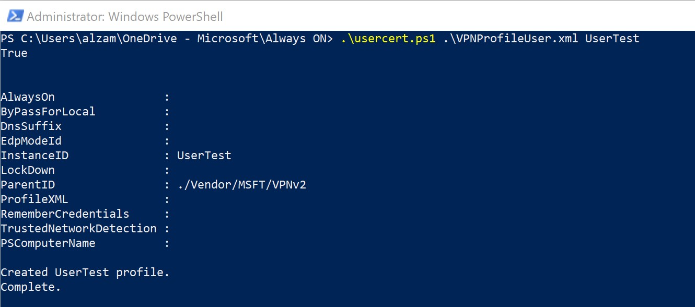

# Configure an Always On VPN user tunnel

A new feature of the Windows 10 VPN client is the ability to maintain a VPN connection. Always On is a Windows 10 feature that enables the active VPN profile to connect automatically and remain connected based on triggers. Such triggers include user sign-in, network state change, or device screen active.

You can use Azure virtual network gateways with Windows 10 Always On to establish persistent user tunnels and device tunnels to Azure. This article helps you configure an Always On VPN user tunnel.

Always On VPN connections include two types of tunnels:

* **Device tunnel**: Connects to specified VPN servers before users sign in to the device. Pre-sign-in connectivity scenarios and device management use a device tunnel.

* **User tunnel**: Connects only after users sign in to the device. By using user tunnels, you can access organization resources through VPN servers.

Device tunnels and user tunnels operate independent of their VPN profiles. They can be connected at the same time, and they can use different authentication methods and other VPN configuration settings, as appropriate.

In the following sections, you configure the VPN gateway and the user tunnel.

## Step 1: Configure the gateway

Configure the VPN gateway to use IKEv2 and certificate-based authentication using this [point-to-site article](vpn-gateway-howto-point-to-site-resource-manager-portal.md).

## Step 2: Configure the user tunnel

1. Install client certificates on the Windows 10 client, as shown in this [point-to-site VPN client](point-to-site-how-to-vpn-client-install-azure-cert.md) article. The certificate needs to be in the Current User Store

1. Configure the Always On VPN client through PowerShell, SCCM, or Intune by following the instructions in [Configure Windows 10 client Always On VPN connections](https://docs.microsoft.com/windows-server/remote/remote-access/vpn/always-on-vpn/deploy/vpn-deploy-client-vpn-connections).

### Example configuration for user tunnel

After you've configured the virtual network gateway and installed the client certificate in the local machine store on the Windows 10 client, configure a client device tunnel by using the following examples:

1. Copy the following text, and save it as *usercert.ps1*:

   ```
   Param(
   [string]$xmlFilePath,
   [string]$ProfileName
   )

   $a = Test-Path $xmlFilePath
   echo $a

   $ProfileXML = Get-Content $xmlFilePath

   echo $XML

   $ProfileNameEscaped = $ProfileName -replace ' ', '%20'

   $Version = 201606090004

   $ProfileXML = $ProfileXML -replace '<', '&lt;'
   $ProfileXML = $ProfileXML -replace '>', '&gt;'
   $ProfileXML = $ProfileXML -replace '"', '&quot;'

   $nodeCSPURI = './Vendor/MSFT/VPNv2'
   $namespaceName = "root\cimv2\mdm\dmmap"
   $className = "MDM_VPNv2_01"

   $session = New-CimSession

   try
   {
   $newInstance = New-Object Microsoft.Management.Infrastructure.CimInstance $className, $namespaceName
   $property = [Microsoft.Management.Infrastructure.CimProperty]::Create("ParentID", "$nodeCSPURI", 'String', 'Key')
   $newInstance.CimInstanceProperties.Add($property)
   $property = [Microsoft.Management.Infrastructure.CimProperty]::Create("InstanceID", "$ProfileNameEscaped", 'String', 'Key')
   $newInstance.CimInstanceProperties.Add($property)
   $property = [Microsoft.Management.Infrastructure.CimProperty]::Create("ProfileXML", "$ProfileXML", 'String', 'Property')
   $newInstance.CimInstanceProperties.Add($property)

   $session.CreateInstance($namespaceName, $newInstance)
   $Message = "Created $ProfileName profile."
   Write-Host "$Message"
   }
   catch [Exception]
   {
   $Message = "Unable to create $ProfileName profile: $_"
   Write-Host "$Message"
   exit
   }
   $Message = "Complete."
   Write-Host "$Message"
   ```
1. Copy the following text, and save it as *VPNProfile.xml* in the same folder as *usercert.ps1*. Edit the following text to match your environment:

   * `<Servers>azuregateway-1234-56-78dc.cloudapp.net</Servers>`
   * `<Address>192.168.3.5</Address>`
   * `<Address>192.168.3.4</Address>`

   ```
	<VPNProfile>  
	  <NativeProfile>  
	<Servers>azuregateway-b115055e-0882-49bc-a9b9-7de45cba12c0-8e6946892333.vpn.azure.com</Servers>  
	<NativeProtocolType>IKEv2</NativeProtocolType>  
	<Authentication>  
	<UserMethod>Eap</UserMethod>
	<Eap>
	<Configuration>
	<EapHostConfig xmlns="http://www.microsoft.com/provisioning/EapHostConfig"><EapMethod><Type xmlns="http://www.microsoft.com/provisioning/EapCommon">13</Type><VendorId xmlns="http://www.microsoft.com/provisioning/EapCommon">0</VendorId><VendorType xmlns="http://www.microsoft.com/provisioning/EapCommon">0</VendorType><AuthorId xmlns="http://www.microsoft.com/provisioning/EapCommon">0</AuthorId></EapMethod><Config xmlns="http://www.microsoft.com/provisioning/EapHostConfig"><Eap xmlns="http://www.microsoft.com/provisioning/BaseEapConnectionPropertiesV1"><Type>13</Type><EapType xmlns="http://www.microsoft.com/provisioning/EapTlsConnectionPropertiesV1"><CredentialsSource><CertificateStore><SimpleCertSelection>true</SimpleCertSelection></CertificateStore></CredentialsSource><ServerValidation><DisableUserPromptForServerValidation>false</DisableUserPromptForServerValidation><ServerNames></ServerNames></ServerValidation><DifferentUsername>false</DifferentUsername><PerformServerValidation xmlns="http://www.microsoft.com/provisioning/EapTlsConnectionPropertiesV2">false</PerformServerValidation><AcceptServerName xmlns="http://www.microsoft.com/provisioning/EapTlsConnectionPropertiesV2">false</AcceptServerName></EapType></Eap></Config></EapHostConfig>
	</Configuration>
	</Eap>
	</Authentication>  
	<RoutingPolicyType>SplitTunnel</RoutingPolicyType>  
	 <!-- disable the addition of a class based route for the assigned IP address on the VPN interface -->
	<DisableClassBasedDefaultRoute>true</DisableClassBasedDefaultRoute>  
	  </NativeProfile> 
	  <!-- use host routes(/32) to prevent routing conflicts -->  
	  <Route>  
	<Address>192.168.3.5</Address>  
	<PrefixSize>32</PrefixSize>  
	  </Route>  
	  <Route>  
	<Address>192.168.3.4</Address>  
	<PrefixSize>32</PrefixSize>  
	  </Route>  
	<!-- traffic filters for the routes specified above so that only this traffic can go over the device tunnel --> 
	  <TrafficFilter>  
	<RemoteAddressRanges>192.168.3.4, 192.168.3.5</RemoteAddressRanges>  
	  </TrafficFilter>
	<!-- need to specify always on = true --> 
	<AlwaysOn>true</AlwaysOn>
	<RememberCredentials>true</RememberCredentials>
	<!--new node to register client IP address in DNS to enable manage out -->
	<RegisterDNS>true</RegisterDNS>
	</VPNProfile>
   ```
1. Run PowerShell as an administrator.

1. In PowerShell, switch to the folder where *usercert.ps1* and *VPNProfile.xml* are located, and run the following command:

   ```powershell
   C:\> .\usercert.ps1 .\VPNProfile.xml UserTest
   ```
   
   
1. Under **VPN Settings**, look for the **UserTest** entry, and then select **Connect**.

1. If the connection succeeds, you've successfully configured an Always On user tunnel.

## Clean up your resources

To remove the profile, do the following:

1. Run the following command:

   ```powershell
   C:\> Remove-VpnConnection UserTest  
   ```

1. Disconnect the connection, and clear the **Connect automatically** check box.


## Next steps

To troubleshoot any connection issues that might occur, see [Azure point-to-site connection problems](vpn-gateway-troubleshoot-vpn-point-to-site-connection-problems.md).