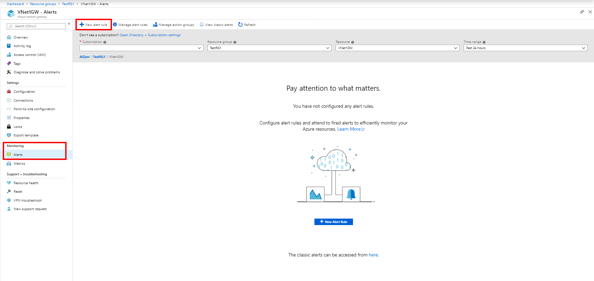
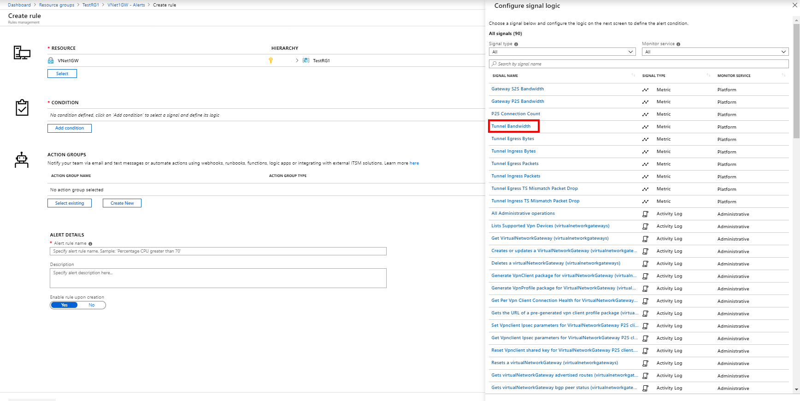
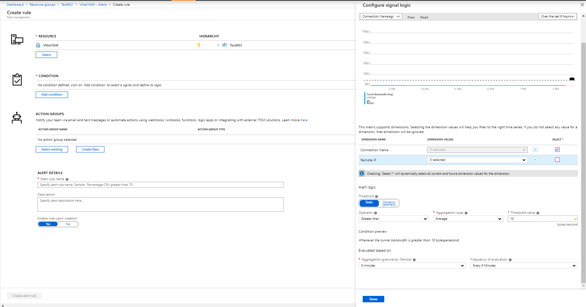
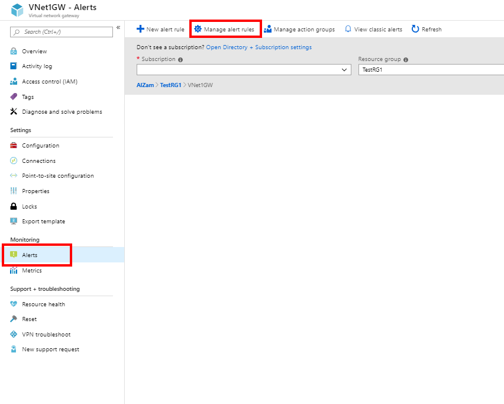

# Setting up alerts on VPN Gateway metrics

This article helps you set up alerts for VPN Gateway metrics. Azure monitor provides the ability to set up alerts for Azure resources. Alerts can be set up for virtual network gateways of "VPN" type.

|**Metric**   | **Unit** | **Granularity** | **Description** | 
|---       | ---        | ---       | ---            | ---       |
|**AverageBandwidth**| Bytes/s  | 5 minutes| Average combined bandwidth utilization of all site-to-site connections on gateway.     |
|**P2SBandwidth**| Bytes/s  | 1 minute  | Average combined bandwidth utilization of all point-to-site connections on gateway.    |
|**P2SConnectionCount**| Count  | 1 minute  | Count of P2S connections on gateway.   |
|**TunnelAverageBandwidth** | Bytes/s    | 5 minutes  | Average bandwidth utilization of tunnels created on the gateway. |
|**TunnelEgressBytes** | Bytes | 5 minutes | Outgoing traffic on tunnels created on the gateway.   |
|**TunnelEgressPackets** | Count | 5 minutes | Count of outgoing packets on tunnels created on the gateway.   |
|**TunnelEgressPacketDropTSMismatch** | Count | 5 minutes | Count of outgoing packets dropped on tunnels caused by TS mismatch. |
|**TunnelIngressBytes** | Bytes | 5 minutes | Incoming traffic on tunnels created on the gateway.   |
|**TunnelIngressPackets** | Count | 5 minutes | Count of incoming packets on tunnels created on the gateway.   |
|**TunnelIngressPacketDropTSMismatch** | Count | 5 minutes | Count of incoming packets dropped on tunnels caused by TS mismatch. |

## Setup Azure Monitor alerts based on metrics using the portal

The example steps below will create an alert on a gateway for:  

**Metric:** Tunnel Average Bandwidth  
**Condition:** bandwidth > 10 Bytes/second  
**Window:** 5 minutes  
**Alert action:** Email  

1. Navigate to the virtual network gateway resource and select "Alerts" from the Monitoring tab, then create a new alert rule or edit an existing alert rule.

2. Select your VPN gateway as the resource.

3. Select a metric to configure for the alert

4. Configure the signal logic. There are three components to signal logic:

    a. Dimensions: If the metric has dimensions, specific dimension values can be selected so that the alert only evaluates data of that dimension. These are optional. 
    b. Condition: The operation to evaluate the metric value. 
    c. Time: Specify the granularity of metric data, and the period of time to evaluate the alert on. 

5. To view the configured rules, click on "Manage alert rules"

## Next steps

To configure alerts on tunnel diagnostics logs, see [How to setup alerts on VPN Gateway diagnostic logs](vpn-gateway-howto-setup-alerts-for-virtual-network-gateway-log.md).
