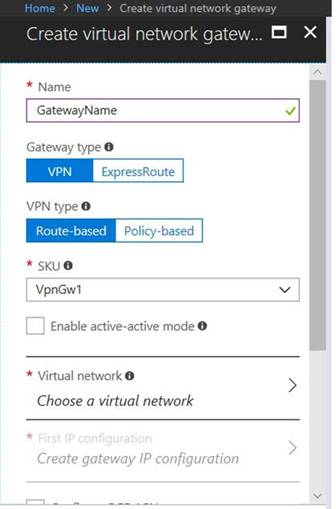
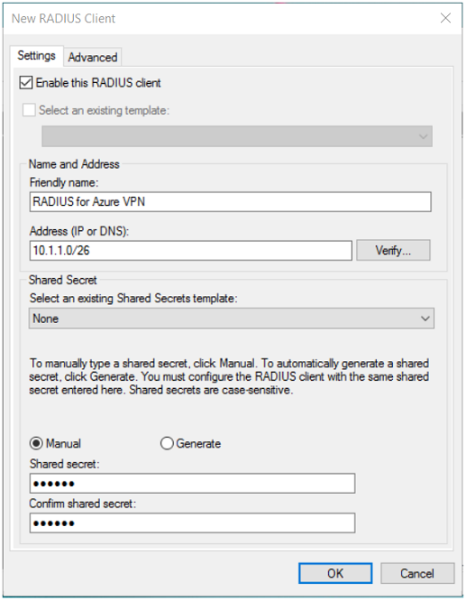
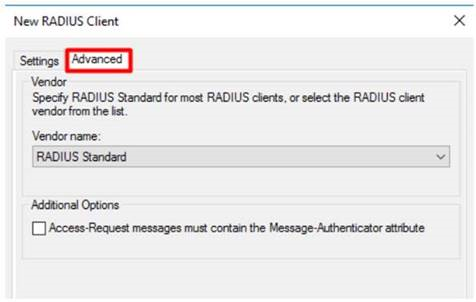
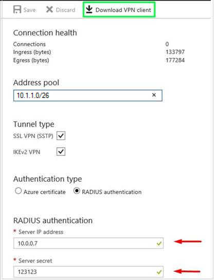

# Integrate Azure VPN gateway RADIUS authentication with NPS server for Multi-Factor Authentication 

The article describes how to integrate Network Policy Server (NPS) server with Azure VPN gateway RADIUS authentication to deliver Multi-Factor Authentication (MFA) for Point-to-site VPN connections. 

## Prerequisite

To enable MFA, the users must be in Azure Active Directory (Synced from on-premises or cloud only), and the user must already complete the proof up process for MFA.  Users can complete the proof up process by using https://myapps.microsoft.com.

## Detailed steps

### Step 1 Create virtual network gateway

1. Log in to the [Azure portal](https://portal.azure.com).
2. In the virtual network that will host the virtual network gateway, select **Subnets**, and then select **Gateway subnet** to create a subnet. 

    
3. Create a virtual network gateway with the following settings:

    - **Gateway type**: select **VPN**.
    - **VPN type**: select **Route-based**.
    - **SKU**: select a SKU type based on your requirements.
    - **Virtual network**: select the virtual network that you created the gateway subnet.

        

 
### Step 2 Configure the NPS for Azure MFA

1. On the NPS server, [install the NPS extension for Azure MFA](../multi-factor-authentication/multi-factor-authentication-nps-extension.md#install-the-nps-extension).
2. Open NSP console, right-click **RADUIS Clients**, select **New**. Create a RADUIS client with the following settings:

    - **Friendly Name**: type any name.
    - **Address (IP or DNS)**: type the gateway subnet you created in the step 1.
    - **Shared secret**: type any secret and remember it. We will use it later.

    

 
3.  In the **Advanced** tab, set the vendor name to **RADIUS Standard** and make sure that the **additional options** are not selected.

    

4. Go to **Policies** > **Network Policies**, double-click **Connections to Microsoft Routing and Remote Access server** policy, select **Grant access**, and then click **OK**.

### Step 3 Configure the virtual network gateway

1. Log in to [Azure portal](https://portal.azure.com).
2. Open the virtual network gateway you created, make sure that the gateway type is **VPN** and the VPN type is **route-based**.
3. Click **Point to site configuration** > **Configure now**, and then add the following settings:

    - **Address pool**: type the gateway subnet you created in the step 1.
    - **Authentication type**: select **RADIUS authentication**.
    - **Server IP address**: type the IP address of the NPS server.

    

## Next steps

- [Azure Multi-Factor Authentication](../multi-factor-authentication/multi-factor-authentication.md)
- [Integrate your existing NPS infrastructure with Azure Multi-Factor Authentication](../multi-factor-authentication/multi-factor-authentication-nps-extension.md)
