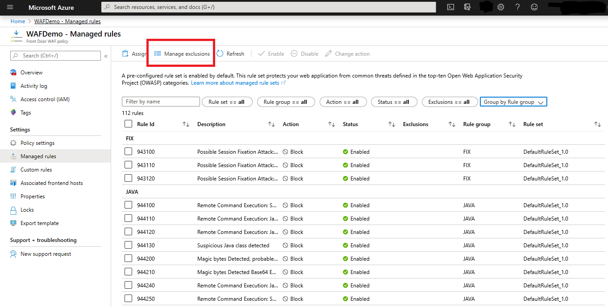
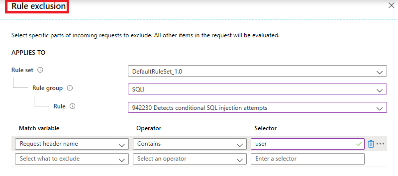

## WAF exclusion lists

WAF exclusion lists allow you to omit certain request attributes from a WAF evaluation. A common example is Active Directory inserted tokens that are used for authentication. Such attributes are prone to contain special characters that may trigger a false positive from the WAF rules.

The following attributes can be added to exclusion lists by name. The values of the chosen field aren't evaluated against WAF rules, but their names still are (see Example 1 below, the value of "user" header is excluded from WAF evaluation). The exclusion lists remove inspection of the field's value.

* Request header name
* Request cookies name
* Query string name
* Request body PostArg name

You can specify an exact request header, body, cookie, or query string attribute match.  Or, you can optionally specify partial matches. The following are the supported match criteria operators:

- **Equals**:  This operator is used for an exact match. As an example, for selecting a header named **bearerToken**, use the equals operator with the selector set as **bearerToken**.
- **Starts with**: This operator matches all fields that start with the specified selector value.
- **Ends with**:  This operator matches all request fields that end with the specified selector value.
- **Contains**: This operator matches all request fields that contain the specified selector value.
- **Equals any**: This operator matches all request fields. * will be the selector value.

In all cases matching is case insensitive and regular expression aren't allowed as selectors.

Exclusion list can be applied to all rules within the managed rule set, to rules for a specific rule group, or just to one single rule as shown in the below example.

This example excludes the value in the *user* header that is passed in the request via the URL. For example,say it’s common in your environment for the user field to contain a string that triggers a SQL injection rule, cause the request to be blocked by WAF. You can exclude the user parameter in this case so that the WAF rule doesn't evaluate anything in the field.

## Next steps

After you configure your WAF settings, you can learn how to view your WAF logs. For more information, see [Front Door diagnostics](../afds/waf-front-door-monitor.md).
