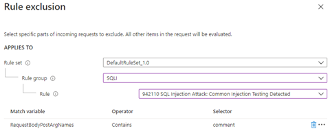
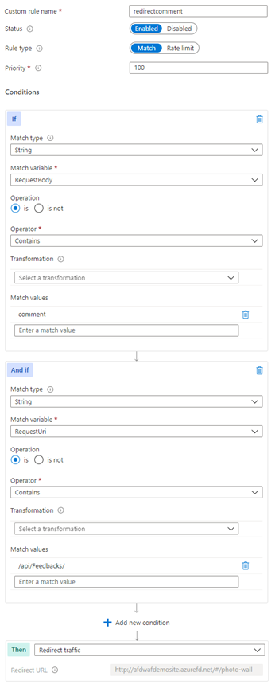
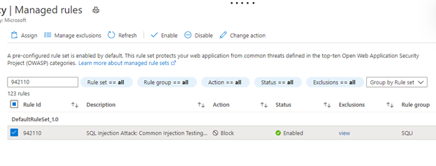
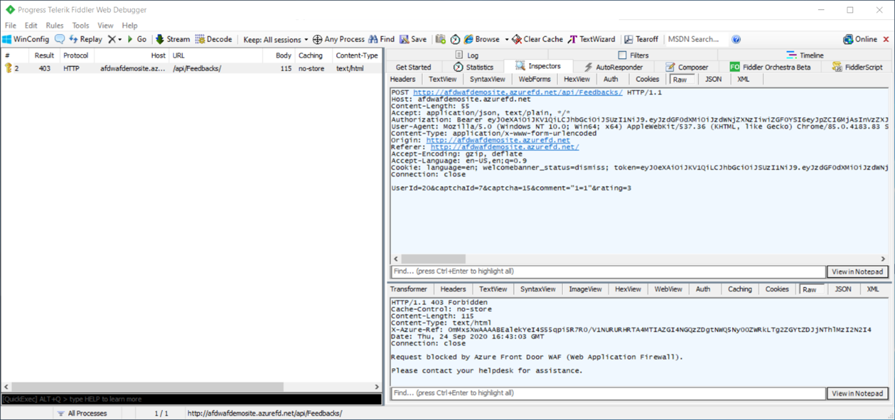
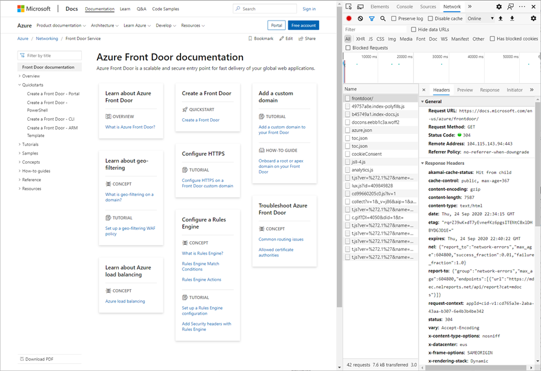

# Tuning Web Application Firewall (WAF) for Azure Front Door
 
The Azure-managed Default Rule Set is based on the [OWASP Core Rule Set (CRS)](https://github.com/SpiderLabs/owasp-modsecurity-crs/tree/v3.1/dev) and is designed to be strict out of the box. It is often expected that WAF rules need to be tuned to suit the specific needs of the application or organization using the WAF. This is commonly achieved by defining rule exclusions, creating custom rules, and even disabling rules that may be causing issues or false positives. There are a few things you can do if requests that should pass through your Web Application Firewall (WAF) are blocked.

First, ensure you’ve read the [Front Door WAF overview](afds-overview.md) and the [WAF Policy for Front Door](waf-front-door-create-portal.md) documents. Also, make sure you’ve enabled [WAF monitoring and logging](waf-front-door-monitor.md). These articles explain how the WAF functions, how the WAF rule sets work, and how to access WAF logs.
 
## Understanding WAF logs
 
The purpose of WAF logs is to show every request that is matched or blocked by the WAF. It is a collection of all evaluated requests that are matched or blocked. If you notice that the WAF blocks a request that it shouldn't (a false positive), you can do a few things. First, narrow down, and find the specific request. If desired, you can [configure a custom response message](./waf-front-door-configure-custom-response-code.md) to include the `trackingReference` field to easily identify the event and perform a log query on that specific value. Look through the logs to find the specific URI, timestamp, or client IP of the request. When you find the related log entries, you can begin to act on false positives. 
 
For example, say you have a legitimate traffic containing the string `1=1` that you want to pass through your WAF. Here's what the request looks like:

```
POST http://afdwafdemosite.azurefd.net/api/Feedbacks HTTP/1.1
Host: afdwafdemosite.azurefd.net
Content-Type: application/x-www-form-urlencoded
Content-Length: 55
UserId=20&captchaId=7&captchaId=15&comment="1=1"&rating=3
```

If you try the request, the WAF blocks traffic that contains your *1=1* string in any parameter or field. This is a string often associated with a SQL injection attack. You can look through the logs and see the timestamp of the request and the rules that blocked/matched.
 
In the following example, we explore a "FrontdoorWebApplicationFirewallLog" log generated due to a rule match.
 
In the "requestUri" field, you can see the request was made to "/api/Feedbacks/" specifically. Going further, we find the rule ID "942110" in the "ruleName" field. Knowing the rule ID, you could go to the [OWASP ModSecurity Core Rule Set Official Repository](https://github.com/coreruleset/coreruleset) and search by that [rule ID](https://github.com/coreruleset/coreruleset/blob/v3.1/dev/rules/REQUEST-942-APPLICATION-ATTACK-SQLI.conf) to review its code and understand exactly what this rule matches on. 
 
Then, by checking the "action" field, we see that this rule is set to block requests upon matching, and we confirm that the request was in fact blocked by the WAF because the "policyMode" is set to "prevention". 
 
Now, let's check the information in the "details" field. This is where you can see the "matchVariableName" and the "matchVariableValue" information. We learn that this rule was triggered because someone input *1=1* in the "comment" field of the web app.
 
```json
{
    "time": "2020-09-24T16:43:04.5422943Z",
    "resourceId": "/SUBSCRIPTIONS/<Subscription ID>/RESOURCEGROUPS/<Resource Group Name>/PROVIDERS/MICROSOFT.NETWORK/FRONTDOORS/AFDWAFDEMOSITE",
    "category": "FrontdoorWebApplicationFirewallLog",
    "operationName": "Microsoft.Network/FrontDoor/WebApplicationFirewallLog/Write",
    "properties": {
        "clientIP": "1.1.1.1",
        "clientPort": "53566",
        "socketIP": "1.1.1.1",
        "requestUri": "http://afdwafdemosite.azurefd.net:80/api/Feedbacks/",
        "ruleName": "DefaultRuleSet-1.0-SQLI-942110",
        "policy": "AFDWAFDemoPolicy",
        "action": "Block",
        "host": "afdwafdemosite.azurefd.net",
        "trackingReference": "0mMxsXwAAAABEalekYeI4S55qpi5R7R0/V1NURURHRTA4MTIAZGI4NGQzZDgtNWQ5Ny00ZWRkLTg2ZGYtZDJjNThlMzI2N2I4",
        "policyMode": "prevention",
        "details": {
            "matches": [
                {
                    "matchVariableName": "PostParamValue:comment",
                    "matchVariableValue": "\"1=1\""
                }
            ],
            "msg": "SQL Injection Attack: Common Injection Testing Detected",
            "data": "Matched Data: \"1=1\" found within PostParamValue:comment: \"1=1\""
        }
    }
}
```
 
There is also value in checking the access logs to expand your knowledge about a given WAF event. Below we review the `FrontdoorAccessLog` log that was generated as a response to the event above.
 
You can see these are related logs based on the "trackingReference" value being the same. Amongst various fields that provide general insight, such as "userAgent" and "clientIP", we call attention to the "httpStatusCode" and "httpStatusDetails" fields. Here, we can confirm that the client has received an HTTP 403 response, which absolutely confirms this request was denied and blocked. 
 
```json
{
    "time": "2020-09-24T16:43:04.5430764Z",
    "resourceId": "/SUBSCRIPTIONS/<Subscription ID>/RESOURCEGROUPS/<Resource Group Name>/PROVIDERS/MICROSOFT.NETWORK/FRONTDOORS/AFDWAFDEMOSITE",
    "category": "FrontdoorAccessLog",
    "operationName": "Microsoft.Network/FrontDoor/AccessLog/Write",
    "properties": {
        "trackingReference": "0mMxsXwAAAABEalekYeI4S55qpi5R7R0/V1NURURHRTA4MTIAZGI4NGQzZDgtNWQ5Ny00ZWRkLTg2ZGYtZDJjNThlMzI2N2I4",
        "httpMethod": "POST",
        "httpVersion": "1.1",
        "requestUri": "http://afdwafdemosite.azurefd.net:80/api/Feedbacks/",
        "requestBytes": "2160",
        "responseBytes": "324",
        "userAgent": "Mozilla/5.0 (Windows NT 10.0; Win64; x64) AppleWebKit/537.36 (KHTML, like Gecko) Chrome/85.0.4183.83 Safari/537.36",
        "clientIp": "1.1.1.1",
        "socketIp": "1.1.1.1",
        "clientPort": "53566",
        "timeToFirstByte": "0.01",
        "timeTaken": "0.011",
        "securityProtocol": "",
        "routingRuleName": "DemoBERoutingRule",
        "rulesEngineMatchNames": [],
        "backendHostname": "13.88.65.130:3000",
        "isReceivedFromClient": true,
        "httpStatusCode": "403",
        "httpStatusDetails": "403",
        "pop": "WST",
        "cacheStatus": "CONFIG_NOCACHE"
    }
}
```

## Resolving false positives
 
To make an informed decision about handling a false positive, it’s important to familiarize yourself with the technologies your application uses. For example, say there isn't a SQL server in your technology stack, and you are getting false positives related to those rules. Disabling those rules doesn't necessarily weaken your security. 

With this information, and the knowledge that rule 942110 is the one that matched the `1=1` string in our example, we can do a few things to stop this legitimate request from being blocked:
 
* Use exclusion lists
  * See [Web Application Firewall (WAF) with Front Door Service exclusion lists](waf-front-door-exclusion.md) for more information about exclusion lists. 
* Change WAF actions
  * See [WAF Actions](afds/afds-overview.md#waf-actions) for more information about what actions can be taken when a request matches a rule’s conditions.
* Use custom rules
  * See [Custom rules for Web Application Firewall with Azure Front Door](waf-front-door-custom-rules.md) for more information about custom rules.
* Disable rules 

> [!CAUTION]
> When selecting an approach to allow legitimate requests through the WAF, try to make this as narrow as you can. For example, it's better to use an exclusion list than disabling a rule entirely.

### Using exclusion lists

One benefit of using an exclusion list is that only the match variable you select to exclude will no longer be inspected for that given request. That is, you can choose between specific request headers, request cookie, query string arguments, or request body post arguments to be excluded if a certain condition is met, as opposed to excluding the whole request from being inspected. The other non-specified variables of the request will still be inspected normally.
 
It’s important to consider that exclusions are a global setting. This means that the configured exclusion will apply to all traffic passing through your WAF, not just a specific web app or URI. For example, this could be a concern if *1=1* is a valid request in the body for a certain web app, but not for others under the same WAF policy.
 
When configuring exclusion lists for managed rules, you can choose to exclude all rules within a rule set, all rules within a rule group, or an individual rule. An exclusion list can be configured using [PowerShell](https://docs.microsoft.com/powershell/module/az.frontdoor/New-AzFrontDoorWafManagedRuleExclusionObject), [Azure CLI](https://docs.microsoft.com/cli/azure/ext/front-door/network/front-door/waf-policy/managed-rules/exclusion?view=azure-cli-latest#ext_front_door_az_network_front_door_waf_policy_managed_rules_exclusion_add), [Rest API](https://docs.microsoft.com/rest/api/frontdoorservice/webapplicationfirewall/policies/createorupdate), or the Azure portal.

* Exclusions at a rule level
  * Applying exclusions at a rule level means that the specified exclusions will not be analyzed against that individual rule only, while it will still be analyzed by all other rules in the rule set. This is the most granular level for exclusions, and it can be used to fine-tune the managed rule set based on the information you find in the WAF logs when troubleshooting an event.
* Exclusions at rule group level
  * Applying exclusions at a rule group level means that the specified exclusions will not be analyzed against that specific set of rule types. For example, selecting *SQLI* as an excluded rule group indicates the defined request exclusions would not be inspected by any of the SQLI-specific rules, but it would still be inspected by rules in other groups, such as *PHP*, *RFI*, or *XSS*. This type of exclusion can be useful when we are sure the application is not susceptible to specific types of attacks. For example, an application that doesn't have any SQL databases could have all *SQLI* rules excluded without it being detrimental to its security level.
* Exclusions at rule set level 
  * Applying exclusions at a rule set level means that the specified exclusions will not be analyzed against any of the security rules available in that rule set. This is a comprehensive exclusion, so it should be used carefully.

In this example, we will be performing an exclusion at the most granular level (applying exclusion to a single rule) and we are looking to exclude the match variable **Request body post args name** that contains `comment`. This is apparent because you can see the match variable details in the firewall log: `"matchVariableName": "PostParamValue:comment"`. The attribute is `comment`. You can also find this attribute name a few other ways, see [Finding request attribute names](#finding-request-attribute-names).




Occasionally, there are cases where specific parameters get passed into the WAF in a manner that may not be intuitive. For example, there is a token that gets passed when authenticating using Azure Active Directory. This token, `__RequestVerificationToken`, usually gets  passed in as a request cookie. However, in some cases where cookies are disabled, this token is also passed in as a request post argument. For this reason, to address Azure AD token false positives, you need to ensure that `__RequestVerificationToken` is added to the exclusion list for both `RequestCookieNames` and `RequestBodyPostArgsNames`.

Exclusions on a field name (*selector*) means that the value will no longer be evaluated by the WAF. However, the field name itself continues to be evaluated and in rare cases it may match a WAF rule and trigger an action.


### Changing WAF actions

Another way of handling the behavior of WAF rules is by choosing the action it will take when a request matches a rule’s conditions. The available actions are: [Allow, Block, Log, and Redirect](afds/afds-overview.md#waf-actions).

In this example, we changed the default action *Block* to the *Log* action on rule 942110. This will cause the WAF to log the request and continue evaluating the same request against the remaining lower priority rules.


After performing the same request, we can refer back to the logs and we will see that this request was a match on rule ID 942110, and that the `action_s` field now indicates *Log* instead of *Block*. We then expanded the log query to include the `trackingReference_s` information and see what else has happened with this request.


Interestingly, we see a different SQLI rule match occurs milliseconds after rule ID 942110 was processed. The same request matched on rule ID 942310, and this time the default action *Block* was triggered.

Another advantage of using the *Log* action during WAF tuning or troubleshooting is that you can identify if multiple rules within a specific rule group are matching and blocking a given request. You can then create your exclusions at the appropriate level, i.e. at the rule or rule group level. 

### Using custom rules

Once you have identified what is causing a WAF rule match, you can use custom rules to adjust how the WAF responds to the event. Custom rules are processed before managed rules, they can contain more than one condition, and their actions can be [Allow, Deny, Log or Redirect](afds/afds-overview.md#waf-actions). When there is a rule match, the WAF engine stops processing. This means other custom rules with lower priority and managed rules are no longer executed.

In the example below, we created a custom rule with two conditions. The first condition is looking for the `comment` value in the request body. The second condition is looking for the `/api/Feedbacks/` value in the request URI.

Using a custom rule allows you to be the most granular when fine-tuning your WAF rules and for dealing with false positives. In this case, we’re not taking action only based on the `comment` request body value, which could exist across multiple sites or apps under the same WAF policy. By including another condition to also match on a particular request URI `/api/Feedbacks/`, we ensure this custom rule truly applies to this explicit use case that we vetted out. This ensures that the same attack, if performed against different conditions, would still be inspected and prevented by the WAF engine.



When exploring the log, you can see that the `ruleName_s` field contains the name given to the custom rule we created: `redirectcomment`. In the `action_s` field, you can see that the *Redirect* action was taken for this event. In the `details_matches_s` field, we can see the details for both conditions were matched.

TODO PLACEHOLDER-LOG-IN-JSON

### Disabling rules

Another way to get around a false positive is to disable the rule that matched on the input the WAF thought was malicious. Since you've parsed the WAF logs and have narrowed the rule down to 942110, you can disable it in the Azure portal. See [Customize Web Application Firewall rules using the Azure portal](../ag/application-gateway-customize-waf-rules-portal.md#disable-rule-groups-and-rules.md).
 
Disabling a rule is a benefit when you are sure that all requests meeting that specific condition are in fact legitimate requests, or when you are sure the rule simply does not apply to your environment (such as, disabling a SQL injection rule because you have non-SQL backends). 
 
However, disabling a rule is a global setting that applies to all frontend hosts associated to the WAF policy. When you choose to disable a rule, you may be leaving vulnerabilities exposed without protection or detection for any other frontend hosts associated to the WAF policy.
 
If you want to use Azure PowerShell to disable a managed rule, see the [PSAzureManagedRuleOverride](https://docs.microsoft.com/en-us/powershell/module/az.frontdoor/new-azfrontdoorwafmanagedruleoverrideobject?view=azps-4.7.0) object documentation. If you want to use Azure CLI, see the [az network front-door waf-policy managed-rules override](https://docs.microsoft.com/en-us/cli/azure/ext/front-door/network/front-door/waf-policy/managed-rules/override?view=azure-cli-latest) documentation.



## Finding request fields

Using a browser proxy like [Fiddler](https://www.telerik.com/fiddler), you can inspect individual requests and determine what specific fields of a web page are called. This is helpful when we need to exclude certain fields from inspection using exclusion lists in WAF.

### Finding request attribute names
 
In this example, you can see the field where the `1=1` string was entered is called `comment`. This data was passed in the body of a POST request.


This is a field you can exclude. To learn more about exclusion lists, See [Web application firewall exclusion lists](./waf-front-door-exclusion.md). You can exclude the evaluation in this case by configuring the following exclusion:


You can also examine the firewall logs to get the information to see what you need to add to the exclusion list. To enable logging, see [Monitoring metrics and logs in Azure Front Door](./waf-front-door-monitor.md).

Examine the firewall log in the `PT1H.json` file for the hour that the request you want to inspect occurred. `PT1H.json` files are available in the storage account containers where the `FrontDoorWebApplicationFirewallLog` and the `FrontDoorAccessLog` diagnostic logs are stored.

In this example, you can see the rule that blocked the request (with the same Transaction Reference) and occurred at the exact same time:

```json
{
    "time": "2020-09-24T16:43:04.5422943Z",
    "resourceId": "/SUBSCRIPTIONS/<Subscription ID>/RESOURCEGROUPS/<Resource Group Name>/PROVIDERS/MICROSOFT.NETWORK/FRONTDOORS/AFDWAFDEMOSITE",
    "category": "FrontdoorWebApplicationFirewallLog",
    "operationName": "Microsoft.Network/FrontDoor/WebApplicationFirewallLog/Write",
    "properties": {
        "clientIP": "1.1.1.1",
        "clientPort": "53566",
        "socketIP": "1.1.1.1",
        "requestUri": "http://afdwafdemosite.azurefd.net:80/api/Feedbacks/",
        "ruleName": "DefaultRuleSet-1.0-SQLI-942110",
        "policy": "AFDWAFDemoPolicy",
        "action": "Block",
        "host": "afdwafdemosite.azurefd.net",
        "trackingReference": "0mMxsXwAAAABEalekYeI4S55qpi5R7R0/V1NURURHRTA4MTIAZGI4NGQzZDgtNWQ5Ny00ZWRkLTg2ZGYtZDJjNThlMzI2N2I4",
        "policyMode": "prevention",
        "details": {
            "matches": [
                {
                    "matchVariableName": "PostParamValue:comment",
                    "matchVariableValue": "\"1=1\""
                }
            ],
            "msg": "SQL Injection Attack: Common Injection Testing Detected",
            "data": "Matched Data: \"1=1\" found within PostParamValue:comment: \"1=1\""
        }
    }
}
```

With your knowledge of how the Azure-managed rule sets work (see [Web Application Firewall on Azure Front Door](./afds-firewall.md)) you know that the rule with the *action: Block* property is blocking based on the data matched in the request body. You can see in the details that it matched a pattern (`1=1`), and the field is named `comment`. Follow the same previous steps to exclude the request body post args name that contains `comment`.

### Finding request header names

Fiddler is a useful tool once again to find request header names. In the following screenshot, you can see the headers for this GET request, which include Content-Type, User-Agent, and so on. You can also use request headers to create exclusions and custom rules in WAF.



Another way to view request and response headers is to look inside the developer tools of your browser, such as Edge or Chrome. You can press F12 or right-click -> **Inspect** -> **Developer Tools**, and select the **Network** tab. Load a web page, and click the request you want to inspect.



### Finding request cookie names

If the request contains cookies, the Cookies tab can be selected to view them in Fiddler.  Cookie information can also be used to create exclusions or custom rules in WAF.

## Next steps

- Learn about [Azure web application firewall](../overview.md).
- Learn how to [create a Front Door](../../frontdoor/quickstart-create-front-door.md).
