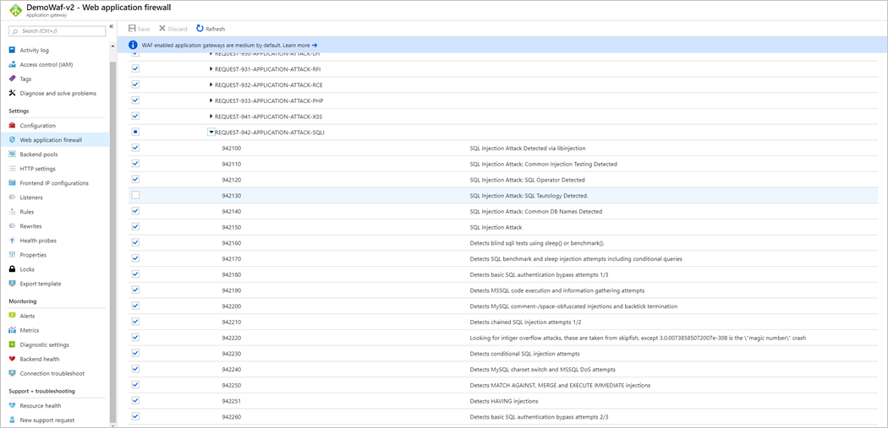
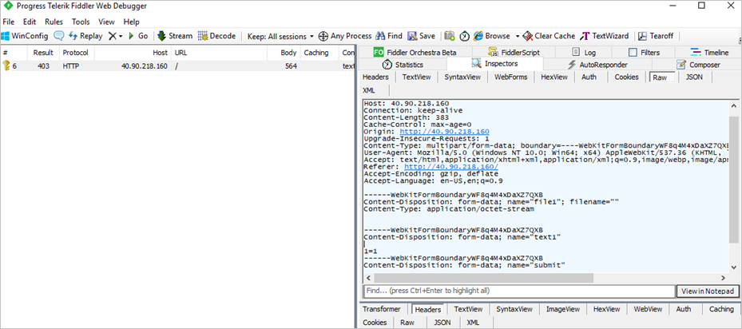
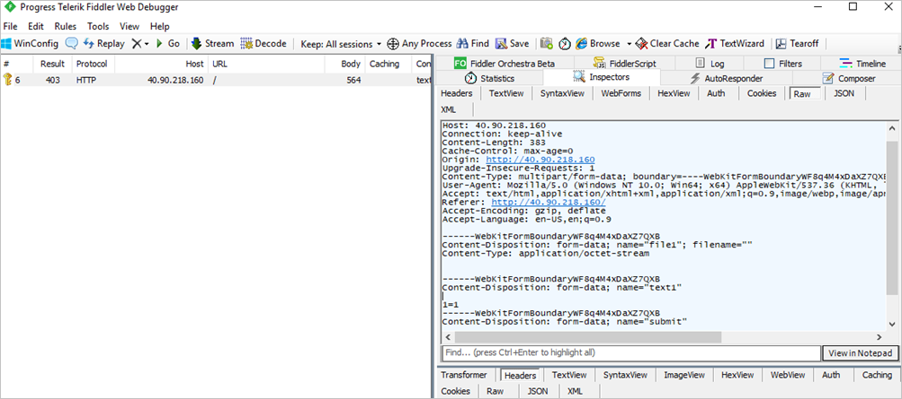
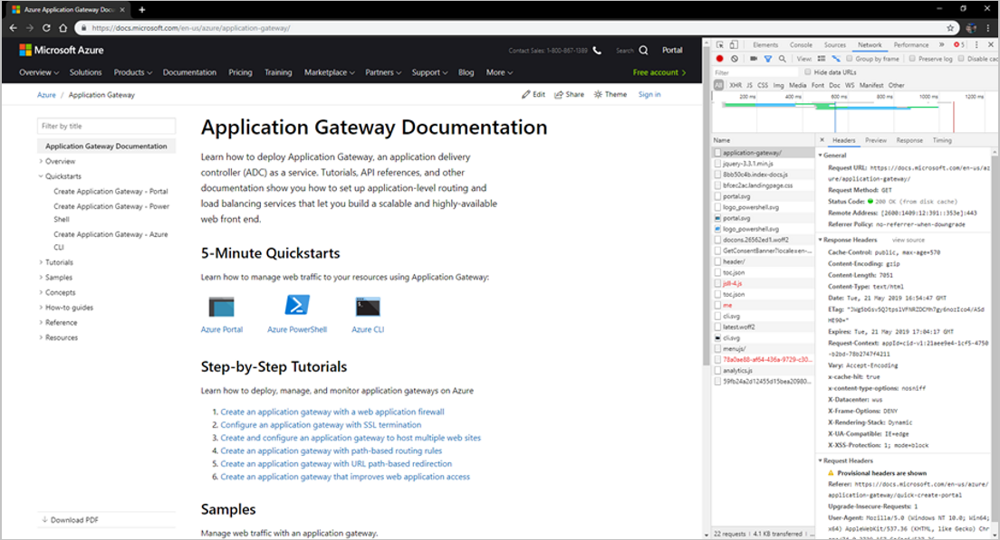

# Troubleshoot Web Application Firewall (WAF) for Azure Application Gateway

There are a few things you can do if requests that should pass through your Web Application Firewall (WAF) are blocked.

First, ensure you’ve read the [WAF overview](ag-overview.md) and the [WAF configuration](application-gateway-waf-configuration.md) documents. Also, make sure you’ve enabled [WAF monitoring](../../application-gateway/application-gateway-diagnostics.md) These articles explain how the WAF functions, how the WAF rule sets work, and how to access WAF logs.

## Understanding WAF logs

The purpose of WAF logs is to show every request that is matched or blocked by the WAF. It is a ledger of all evaluated requests that are matched or blocked. If you notice that the WAF blocks a request that it shouldn't (a false positive), you can do a few things. First, narrow down, and find the specific request. Look through the logs to find the specific URI, timestamp, or transaction ID of the request. When you find the  associated log entries, you can begin to act on the false positives.

For example, say you have a legitimate traffic containing the string *1=1* that you want to pass through your WAF. If you try the request, the WAF blocks traffic that contains your *1=1* string in any parameter or field. This is a string often associated with a SQL injection attack. You can look through the logs and see the timestamp of the request and the rules that blocked/matched.

In the following example, you can see that four rules are triggered during the same request (using the TransactionId field). The first one says it matched because the user used a numeric/IP URL for the request, which increases the anomaly score by three since it's a warning. The next rule that matched is 942130, which is the one you’re looking for. You can see the *1=1* in the `details.data` field. This further increases the anomaly score by three again, as it's also a warning. Generally, every rule that has the action **Matched** increases the anomaly score, and at this point the anomaly score would be six. For more information, see [Anomaly scoring mode](ag-overview.md#anomaly-scoring-mode).

The final two log entries show the request was blocked because the anomaly score was high enough. These entries have a different action than the other two. They show they actually *blocked* the request. These rules are mandatory and can’t be disabled. They shouldn’t be thought of as rules, but more as core infrastructure of the WAF internals.

```json
{ 
    "resourceId": "/SUBSCRIPTIONS/A6F44B25-259E-4AF5-888A-386FED92C11B/RESOURCEGROUPS/DEMOWAF_V2/PROVIDERS/MICROSOFT.NETWORK/APPLICATIONGATEWAYS/DEMOWAF-V2", 
    "operationName": "ApplicationGatewayFirewall", 
    "category": "ApplicationGatewayFirewallLog", 
    "properties": { 
        "instanceId": "appgw_3", 
        "clientIp": "167.220.2.139", 
        "clientPort": "", 
        "requestUri": "\/", 
        "ruleSetType": "OWASP_CRS", 
        "ruleSetVersion": "3.0.0", 
        "ruleId": "920350", 
        "message": "Host header is a numeric IP address", 
        "action": "Matched", 
        "site": "Global", 
        "details": { 
            "message": "Warning. Pattern match \\\"^[\\\\\\\\d.:]+$\\\" at REQUEST_HEADERS:Host. ", 
            "data": "40.90.218.160", 
            "file": "rules\/REQUEST-920-PROTOCOL-ENFORCEMENT.conf\\\"", 
            "line": "791" 
        }, 
        "hostname": "vm000003", 
        "transactionId": "AcAcAcAcAKH@AcAcAcAcAyAt" 
    } 
} 
{ 
    "resourceId": "/SUBSCRIPTIONS/A6F44B25-259E-4AF5-888A-386FED92C11B/RESOURCEGROUPS/DEMOWAF_V2/PROVIDERS/MICROSOFT.NETWORK/APPLICATIONGATEWAYS/DEMOWAF-V2", 
    "operationName": "ApplicationGatewayFirewall", 
    "category": "ApplicationGatewayFirewallLog", 
    "properties": { 
        "instanceId": "appgw_3", 
        "clientIp": "167.220.2.139", 
        "clientPort": "", 
        "requestUri": "\/", 
        "ruleSetType": "OWASP_CRS", 
        "ruleSetVersion": "3.0.0", 
        "ruleId": "942130", 
        "message": "SQL Injection Attack: SQL Tautology Detected.", 
        "action": "Matched", 
        "site": "Global", 
        "details": { 
            "message": "Warning. Pattern match \\\"(?i:([\\\\\\\\s'\\\\\\\"`\\\\\\\\(\\\\\\\\)]*?)([\\\\\\\\d\\\\\\\\w]++)([\\\\\\\\s'\\\\\\\"`\\\\\\\\(\\\\\\\\)]*?)(?:(?:=|\\u003c=\\u003e|r?like|sounds\\\\\\\\s+like|regexp)([\\\\\\\\s'\\\\\\\"`\\\\\\\\(\\\\\\\\)]*?)\\\\\\\\2|(?:!=|\\u003c=|\\u003e=|\\u003c\\u003e|\\u003c|\\u003e|\\\\\\\\^|is\\\\\\\\s+not|not\\\\\\\\s+like|not\\\\\\\\s+regexp)([\\\\\\\\s'\\\\\\\"`\\\\\\\\(\\\\\\\\)]*?)(?!\\\\\\\\2)([\\\\\\\\d\\\\\\\\w]+)))\\\" at ARGS:text1. ", 
            "data": "Matched Data: 1=1 found within ARGS:text1: 1=1", 
            "file": "rules\/REQUEST-942-APPLICATION-ATTACK-SQLI.conf\\\"", 
            "line": "554" 
        }, 
        "hostname": "vm000003", 
        "transactionId": "AcAcAcAcAKH@AcAcAcAcAyAt" 
    } 
} 
{ 
    "resourceId": "/SUBSCRIPTIONS/A6F44B25-259E-4AF5-888A-386FED92C11B/RESOURCEGROUPS/DEMOWAF_V2/PROVIDERS/MICROSOFT.NETWORK/APPLICATIONGATEWAYS/DEMOWAF-V2", 
    "operationName": "ApplicationGatewayFirewall", 
    "category": "ApplicationGatewayFirewallLog", 
    "properties": { 
        "instanceId": "appgw_3", 
        "clientIp": "167.220.2.139", 
        "clientPort": "", 
        "requestUri": "\/", 
        "ruleSetType": "", 
        "ruleSetVersion": "", 
        "ruleId": "0", 
        "message": "Mandatory rule. Cannot be disabled. Inbound Anomaly Score Exceeded (Total Score: 8)", 
        "action": "Blocked", 
        "site": "Global", 
        "details": { 
            "message": "Access denied with code 403 (phase 2). Operator GE matched 5 at TX:anomaly_score. ", 
            "data": "", 
            "file": "rules\/REQUEST-949-BLOCKING-EVALUATION.conf\\\"", 
            "line": "57" 
        }, 
        "hostname": "vm000003", 
        "transactionId": "AcAcAcAcAKH@AcAcAcAcAyAt" 
    } 
} 
{ 
    "resourceId": "/SUBSCRIPTIONS/A6F44B25-259E-4AF5-888A-386FED92C11B/RESOURCEGROUPS/DEMOWAF_V2/PROVIDERS/MICROSOFT.NETWORK/APPLICATIONGATEWAYS/DEMOWAF-V2", 
    "operationName": "ApplicationGatewayFirewall", 
    "category": "ApplicationGatewayFirewallLog", 
    "properties": { 
        "instanceId": "appgw_3", 
        "clientIp": "167.220.2.139", 
        "clientPort": "", 
        "requestUri": "\/", 
        "ruleSetType": "", 
        "ruleSetVersion": "", 
        "ruleId": "0", 
        "message": "Mandatory rule. Cannot be disabled. Inbound Anomaly Score Exceeded (Total Inbound Score: 8 - SQLI=5,XSS=0,RFI=0,LFI=0,RCE=0,PHPI=0,HTTP=0,SESS=0): SQL Injection Attack: SQL Tautology Detected.", 
        "action": "Blocked", 
        "site": "Global", 
        "details": { 
            "message": "Warning. Operator GE matched 5 at TX:inbound_anomaly_score. ", 
            "data": "", 
            "file": "rules\/RESPONSE-980-CORRELATION.conf\\\"", 
            "line": "73" 
        }, 
        "hostname": "vm000003", 
        "transactionId": "AcAcAcAcAKH@AcAcAcAcAyAt" 
    }
}
```

## Fixing false positives

With this information, and the knowledge that rule 942130 is the one that matched the *1=1* string, you can do a few things to stop this from blocking your traffic:

- Use an Exclusion List

   See [WAF configuration](application-gateway-waf-configuration.md#waf-exclusion-lists) for more information about exclusion lists.
- Disable the rule.

### Using an exclusion list

To make an informed decision about handling a false positive, it’s important to familiarize yourself with the technologies your application uses. For example, say there isn't a SQL server in your technology stack, and you are getting false positives related to those rules. Disabling those rules doesn't necessarily weaken your security.

One benefit of using an exclusion list is that only a specific part of a request is being disabled. However, this means that a specific exclusion is applicable to all traffic passing through your WAF because it is a global setting. For example, this could lead to an issue if *1=1* is a valid request in the body for a certain app, but not for others. Another benefit is that you can choose between body, headers, and cookies to be excluded if a certain condition is met, as opposed to excluding the whole request.

Occasionally, there are cases where specific parameters get passed into the WAF in a manner that may not be intuitive. For example, there is a token that gets passed when authenticating using Azure Active Directory. This token, *__RequestVerificationToken*, usually get passed in as a Request Cookie. However, in some cases where cookies are disabled, this token is also passed as a request attribute or "arg". If this happens, you need to ensure that *__RequestVerificationToken* is added to the exclusion list as a **Request attribute name** as well.


In this example, you want to exclude the **Request attribute name** that equals *text1*. This is apparent because you can see the attribute name in the firewall logs: **data: Matched Data: 1=1 found within ARGS:text1: 1=1**. The attribute is **text1**. You can also find this attribute name a few other ways, see [Finding request attribute names](#finding-request-attribute-names).


### Disabling rules

Another way to get around a false positive is to disable the rule that matched on the input the WAF thought was malicious. Since you've parsed the WAF logs and have narrowed the rule down to 942130, you can disable it in the Azure portal. See [Customize web application firewall rules through the Azure portal](application-gateway-customize-waf-rules-portal.md).

One benefit of disabling a rule is that if you know all traffic that contains a certain condition that will normally be blocked is valid traffic, you can disable that rule for the entire WAF. However, if it’s only valid traffic in a specific use case, you open up a vulnerability by disabling that rule for the entire WAF since it is a global setting.

If you want to use Azure PowerShell, see [Customize web application firewall rules through PowerShell](application-gateway-customize-waf-rules-powershell.md). If you want to use Azure CLI, see [Customize web application firewall rules through the Azure CLI](application-gateway-customize-waf-rules-cli.md).



## Finding request attribute names

With the help of [Fiddler](https://www.telerik.com/fiddler), you inspect individual requests and determine what specific fields of a web page are called. This can help to exclude certain fields from inspection using Exclusion Lists.

In this example, you can see that the field where the *1=1* string was entered is called **text1**.



This is a field you can exclude. To learn more about exclusion lists, See [Web application firewall request size limits and exclusion lists](application-gateway-waf-configuration.md#waf-exclusion-lists). You can exclude the evaluation in this case by configuring the following exclusion:


You can also examine the firewall logs to get the information to see what you need to add to the exclusion list. To enable logging, see [Back-end health, diagnostic logs, and metrics for Application Gateway](application-gateway-diagnostics.md).

Examine the firewall log and view the PT1H.json file for the hour that the request you want to inspect occurred.

In this example, you can see that you have four rules with the same TransactionID, and that they all occurred at the exact same time:

```json
-	{
-	    "resourceId": "/SUBSCRIPTIONS/A6F44B25-259E-4AF5-888A-386FED92C11B/RESOURCEGROUPS/DEMOWAF_V2/PROVIDERS/MICROSOFT.NETWORK/APPLICATIONGATEWAYS/DEMOWAF-V2",
-	    "operationName": "ApplicationGatewayFirewall",
-	    "category": "ApplicationGatewayFirewallLog",
-	    "properties": {
-	        "instanceId": "appgw_3",
-	        "clientIp": "167.220.2.139",
-	        "clientPort": "",
-	        "requestUri": "\/",
-	        "ruleSetType": "OWASP_CRS",
-	        "ruleSetVersion": "3.0.0",
-	        "ruleId": "920350",
-	        "message": "Host header is a numeric IP address",
-	        "action": "Matched",
-	        "site": "Global",
-	        "details": {
-	            "message": "Warning. Pattern match \\\"^[\\\\\\\\d.:]+$\\\" at REQUEST_HEADERS:Host. ",
-	            "data": "40.90.218.160",
-	            "file": "rules\/REQUEST-920-PROTOCOL-ENFORCEMENT.conf\\\"",
-	            "line": "791"
-	        },
-	        "hostname": "vm000003",
-	        "transactionId": "AcAcAcAcAKH@AcAcAcAcAyAt"
-	    }
-	}
-	{
-	    "resourceId": "/SUBSCRIPTIONS/A6F44B25-259E-4AF5-888A-386FED92C11B/RESOURCEGROUPS/DEMOWAF_V2/PROVIDERS/MICROSOFT.NETWORK/APPLICATIONGATEWAYS/DEMOWAF-V2",
-	    "operationName": "ApplicationGatewayFirewall",
-	    "category": "ApplicationGatewayFirewallLog",
-	    "properties": {
-	        "instanceId": "appgw_3",
-	        "clientIp": "167.220.2.139",
-	        "clientPort": "",
-	        "requestUri": "\/",
-	        "ruleSetType": "OWASP_CRS",
-	        "ruleSetVersion": "3.0.0",
-	        "ruleId": "942130",
-	        "message": "SQL Injection Attack: SQL Tautology Detected.",
-	        "action": "Matched",
-	        "site": "Global",
-	        "details": {
-	            "message": "Warning. Pattern match \\\"(?i:([\\\\\\\\s'\\\\\\\"`\\\\\\\\(\\\\\\\\)]*?)([\\\\\\\\d\\\\\\\\w]++)([\\\\\\\\s'\\\\\\\"`\\\\\\\\(\\\\\\\\)]*?)(?:(?:=|\\u003c=\\u003e|r?like|sounds\\\\\\\\s+like|regexp)([\\\\\\\\s'\\\\\\\"`\\\\\\\\(\\\\\\\\)]*?)\\\\\\\\2|(?:!=|\\u003c=|\\u003e=|\\u003c\\u003e|\\u003c|\\u003e|\\\\\\\\^|is\\\\\\\\s+not|not\\\\\\\\s+like|not\\\\\\\\s+regexp)([\\\\\\\\s'\\\\\\\"`\\\\\\\\(\\\\\\\\)]*?)(?!\\\\\\\\2)([\\\\\\\\d\\\\\\\\w]+)))\\\" at ARGS:text1. ",
-	            "data": "Matched Data: 1=1 found within ARGS:text1: 1=1",
-	            "file": "rules\/REQUEST-942-APPLICATION-ATTACK-SQLI.conf\\\"",
-	            "line": "554"
-	        },
-	        "hostname": "vm000003",
-	        "transactionId": "AcAcAcAcAKH@AcAcAcAcAyAt"
-	    }
-	}
-	{
-	    "resourceId": "/SUBSCRIPTIONS/A6F44B25-259E-4AF5-888A-386FED92C11B/RESOURCEGROUPS/DEMOWAF_V2/PROVIDERS/MICROSOFT.NETWORK/APPLICATIONGATEWAYS/DEMOWAF-V2",
-	    "operationName": "ApplicationGatewayFirewall",
-	    "category": "ApplicationGatewayFirewallLog",
-	    "properties": {
-	        "instanceId": "appgw_3",
-	        "clientIp": "167.220.2.139",
-	        "clientPort": "",
-	        "requestUri": "\/",
-	        "ruleSetType": "",
-	        "ruleSetVersion": "",
-	        "ruleId": "0",
-	        "message": "Mandatory rule. Cannot be disabled. Inbound Anomaly Score Exceeded (Total Score: 8)",
-	        "action": "Blocked",
-	        "site": "Global",
-	        "details": {
-	            "message": "Access denied with code 403 (phase 2). Operator GE matched 5 at TX:anomaly_score. ",
-	            "data": "",
-	            "file": "rules\/REQUEST-949-BLOCKING-EVALUATION.conf\\\"",
-	            "line": "57"
-	        },
-	        "hostname": "vm000003",
-	        "transactionId": "AcAcAcAcAKH@AcAcAcAcAyAt"
-	    }
-	}
-	{
-	    "resourceId": "/SUBSCRIPTIONS/A6F44B25-259E-4AF5-888A-386FED92C11B/RESOURCEGROUPS/DEMOWAF_V2/PROVIDERS/MICROSOFT.NETWORK/APPLICATIONGATEWAYS/DEMOWAF-V2",
-	    "operationName": "ApplicationGatewayFirewall",
-	    "category": "ApplicationGatewayFirewallLog",
-	    "properties": {
-	        "instanceId": "appgw_3",
-	        "clientIp": "167.220.2.139",
-	        "clientPort": "",
-	        "requestUri": "\/",
-	        "ruleSetType": "",
-	        "ruleSetVersion": "",
-	        "ruleId": "0",
-	        "message": "Mandatory rule. Cannot be disabled. Inbound Anomaly Score Exceeded (Total Inbound Score: 8 - SQLI=5,XSS=0,RFI=0,LFI=0,RCE=0,PHPI=0,HTTP=0,SESS=0): SQL Injection Attack: SQL Tautology Detected.",
-	        "action": "Blocked",
-	        "site": "Global",
-	        "details": {
-	            "message": "Warning. Operator GE matched 5 at TX:inbound_anomaly_score. ",
-	            "data": "",
-	            "file": "rules\/RESPONSE-980-CORRELATION.conf\\\"",
-	            "line": "73"
-	        },
-	        "hostname": "vm000003",
-	        "transactionId": "AcAcAcAcAKH@AcAcAcAcAyAt"
-	    }
-	}
```

With your knowledge of how the CRS rule sets work, and that the CRS ruleset 3.0 works with an anomaly scoring system (see [Web application firewall for Azure Application Gateway](waf-overview.md)) you know that the bottom two rules with the **action: Blocked** property are blocking based on the total anomaly score. The rules to focus on are the top two.

The first entry is logged because the user used a numeric IP address to navigate to the Application Gateway, which can be ignored in this case.

The second one (rule 942130) is the interesting one. You can see in the details that it matched a pattern (1=1), and the field is named **text1**. Follow the same previous steps to exclude the **Request Attribute Name** that **equals** **1=1**.

## Finding request header names

Fiddler is a useful tool once again to find request header names. In the following screenshot, you can see the headers for this GET request, which include *Content-Type*, *User-Agent*, and so on.



Another way to view request and response headers is to look inside the developer tools of Chrome. You can press F12 or right-click -> **Inspect** -> **Developer Tools**, and select the **Network** tab. Load a web page, and click the request you want to inspect.



## Finding request cookie names

If the request contains cookies, the **Cookies** tab can be selected to view them in Fiddler.

## Restrict global parameters to eliminate false positives

- Disable request body inspection

   By setting **Inspect request body** to off, the request bodies of all traffic will not be evaluated by your WAF. This may be useful if you know that the request bodies aren’t malicious to your application.

   By disabling this option, only the request body is not inspected. The headers and cookies remain inspected, unless individual ones are excluded using the exclusion list functionality.

- File size limits

   By limiting the file size for your WAF, you’re limiting the possibility of an attack happening to your web servers. By allowing large files to be uploaded, the risk of your backend being overwhelmed increases. Limiting the file size to a normal use case for your application is just another way to prevent attacks.

   > [!NOTE]
   > If you know that your app will never need any file upload above a given size, you can restrict that by setting a limit.

## Next steps

See [How to configure web application firewall on Application Gateway](tutorial-restrict-web-traffic-powershell.md).
