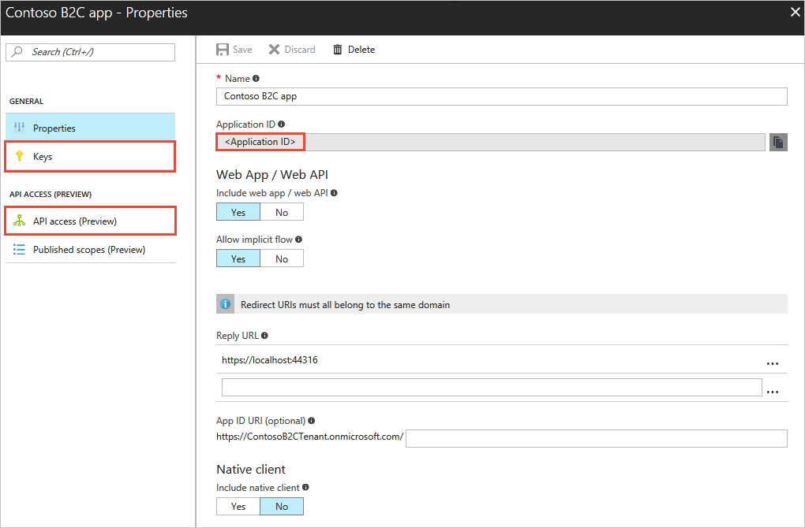

[!INCLUDE [active-directory-b2c-portal-add-application](active-directory-b2c-portal-add-application.md)]

To register your web application, use the settings specified in the table.

| Setting      | Sample value  | Description                                        |
| ------------ | ------- | -------------------------------------------------- |
| **Name** | Contoso B2C app | Enter a **Name** for the application that describes your application to consumers. | 
| **Include web app / web API** | Yes | Select **Yes** for a web application. |
| **Allow implicit flow** | Yes | Select **Yes** if your application uses [OpenID Connect sign-in](../articles/active-directory-b2c/active-directory-b2c-reference-oidc.md) |
| **Reply URL** | `https://localhost:44316` | Reply URLs are endpoints where Azure AD B2C returns any tokens that your application requests. Enter [a proper](../articles/active-directory-b2c/active-directory-b2c-app-registration.md#choosing-a-web-app-or-api-reply-url) **Reply URL**. In this example, your app is local and listening on port 44316. |

Click **Create** to register your application.

Your newly registered application is displayed in the applications list for the B2C tenant. Select your web app from the list. The web application's property pane is displayed.

Make note of the globally unique **Application Client ID**. You use the ID in your application's code.