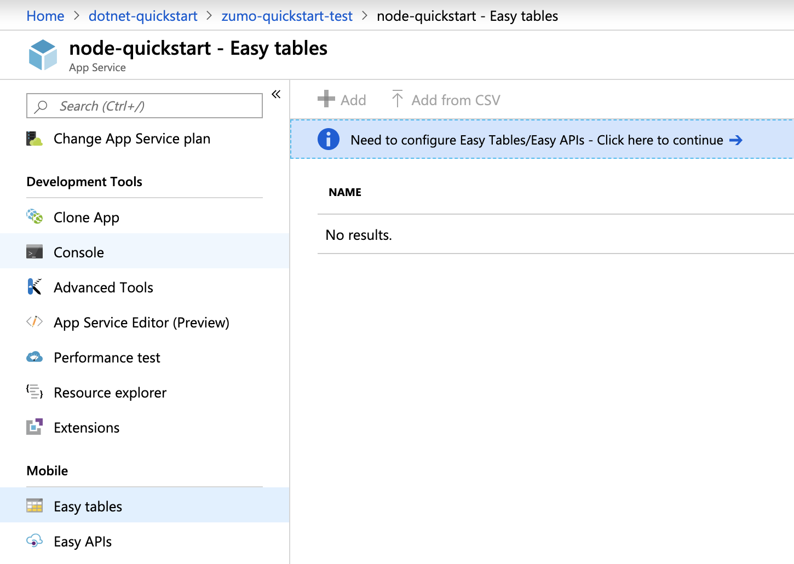
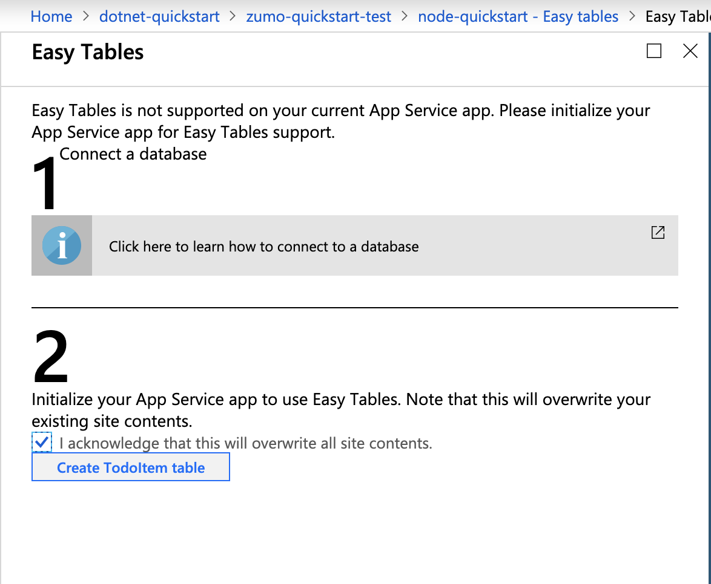
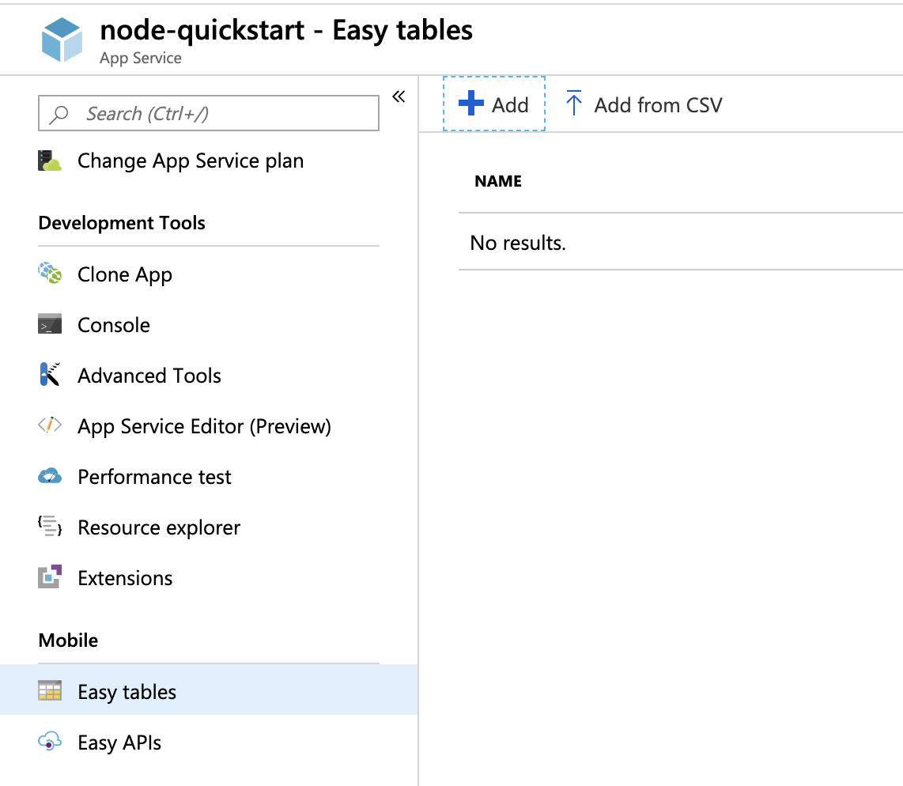
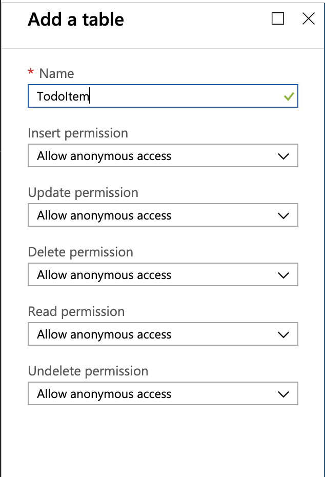
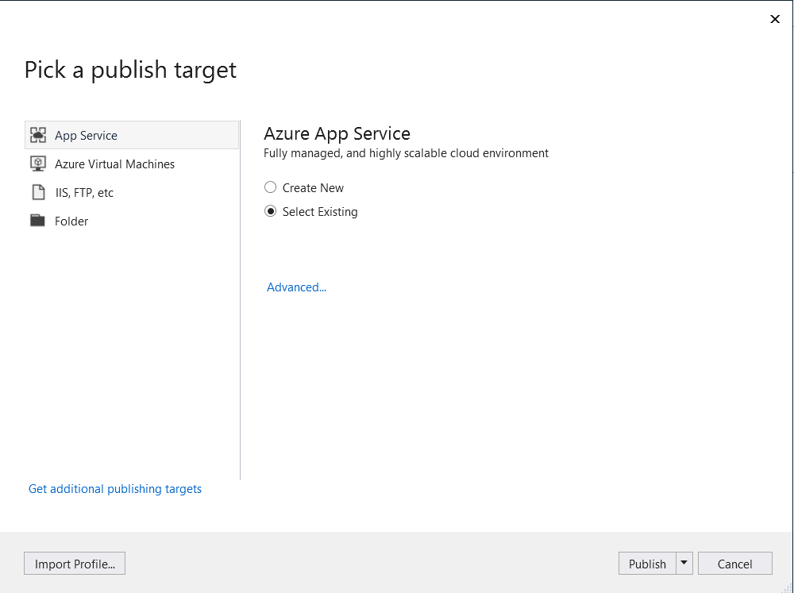

1. Download the client SDK quickstarts for the following platforms:
    
    [iOS (Objective-C)](https://github.com/Azure/azure-mobile-apps-quickstarts/tree/master/client/iOS)
    [iOS (Swift)](https://github.com/Azure/azure-mobile-apps-quickstarts/tree/master/client/iOS-Swift)
    [Android (Java)](https://github.com/Azure/azure-mobile-apps-quickstarts/tree/master/client/android)
    [Xamarin.iOS](https://github.com/Azure/azure-mobile-apps-quickstarts/tree/master/client/xamarin.iOS)
    [Xamarin.Android](https://github.com/Azure/azure-mobile-apps-quickstarts/tree/master/client/xamarin.android)
    [Xamarin.Forms](https://github.com/Azure/azure-mobile-apps-quickstarts/tree/master/client/xamarin.forms)
    [Cordova](https://github.com/Azure/azure-mobile-apps-quickstarts/tree/master/client/cordova)
    [Windows (C#)](https://github.com/Azure/azure-mobile-apps-quickstarts/tree/master/client/windows-uwp-cs)
        
2. You will have to add a database connection or connect to an existing connection. First, determine whether you’ll create a data store or use an existing one.

3. **Create a new data store** : If you’re going to create a data store, use the following quickstart:

    [Quickstart: Getting started with single databases in Azure SQL Database](https://docs.microsoft.com/azure/sql-database/sql-database-single-database-quickstart-guide)

4. **Existing data source** : Follow the instructions below if you want to use an existing database connection
    1. SQL Database Connection String format - 
    `Data Source=tcp:{your_SQLServer},{port};Initial Catalog={your_catalogue};User ID={your_username};Password={your_password}`
      
       **{your_SQLServer}** Name of the server, this can be found in the overview page for your database and is usually in the form of “server_name.database.windows.net”.
        **{port}** usually 1433.
        **{your_catalogue}** Name of the database.
        **{your_username}** User name to access your database.
        **{your_password}** Password to access your database.
        
        [Learn more about SQL Connection String format](https://docs.microsoft.com/dotnet/framework/data/adonet/connection-string-syntax#sqlclient-connection-strings)

    2. Add the connection string to your **mobile app**
        In App Service, you can manage connection strings for your application by using the **Configuration** option in the menu.

        To add a connection string:

        1. Click on the **Application settings** tab.

        2. Click on **[+] New connection string**.

        3. You will need to provide **Name**, **Value** and **Type** for your connection string.

        4. Type **Name** as `MS_TableConnectionString`

        5. Value should be the connecting string you formed in the step before.

        6. If you are adding a connection string to a SQL Azure database choose **SQLAzure** under **type**.

5. Azure Mobile Apps support .NET and Node backend SDK.

    1. **Node.js backend** : If you’re going to use Node.js quickstart app, follow the instructions below:

        1. Download `Zumo` Node.js server project from the [github repository](https://github.com/Azure/azure-mobile-apps-quickstarts/tree/master/backend/node/TodoSample).

        2. On azure portal, go to `Easy Tables`, you will see this screen.
        

        3. Make sure SQL connection string is already added in the `Configuration`. Then check the box and click the **Create TodoItem table** button.
        

        4. In `Easy Tables`, click **+ Add** button.
        

        5. Create a `TodoItem` table with anonymous access.
        

    2. **.NET backend** : If you’re going to use .NET quickstart app, follow the instructions below:

        1. Download `Zumo` .NET server project from the [github repository](https://github.com/Azure/azure-mobile-apps-quickstarts/tree/master/backend/dotnet/Quickstart).

        2. Build the .NET server project locally in Visual Studio.

        3. In Visual Studio, open Solution Explorer, right click on `ZUMOAPPNAMEService` project, click **Publish**, you will see a `Publish to App Service` window. If you are working on Mac computer, please check out other ways to deploy the app [here](https://docs.microsoft.com/en-us/azure/app-service/deploy-local-git).
        

        4. Select `App Service` as publish target, then click **Select Existing**, then click **Publish** button at the bottom of the window.

        5. You will need to log into Visual Studio with your Azure subscription first. Select the `Subscription`, `Resource Group`, and then select the name of your app. When you are ready, click **OK**, this will deploy the .NET server project that you have locally into the App Service backend. When deployment finishes, you will be redirect to `http://{zumoappname}.azurewebsites.net/` in the browser.
        