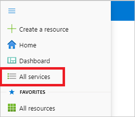
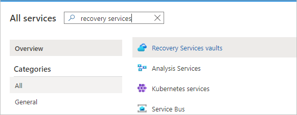

## Create a Recovery Services vault
A Recovery Services vault is an entity that stores the backups and recovery points that have been created over time. The Recovery Services vault also contains the backup policies that are associated with the protected virtual machines.

To create a Recovery Services vault:

1. Sign in to your subscription in the [Azure portal](https://portal.azure.com/).
2. In the left-hand menu, select **All Services**.

      

3. In the All services dialog, type *Recovery Services*. As you begin typing, your input filters the list of resources. Once you see it, select **Recovery Services vaults**.

      

    The list of Recovery Services vaults in the subscription appears.
4. On the **Recovery Services vaults** menu, select **Add**.

    

    The **Recovery Services vaults** menu opens. It prompts you to provide information for **Name**, **Subscription**, **Resource group**, and **Location**.

    
5. For **Name**, enter a friendly name to identify the vault. The name must be unique to the Azure subscription. Type a name that contains at least two, but not more than 50 characters. The name must start with a letter, and it can contain only letters, numbers, and hyphens.
6. For **Subscription**, choose the subscription you want to use. If you are a member of only one subscription, that name will appear. If you're not sure which subscription to use, go with the default (or suggested) subscription. There are multiple choices only if your work or school account is associated with multiple Azure subscriptions.
7. For **Resource group** you can use an existing resource group, or create a new one. To see the available list of resource groups in your subscription, select **Use existing**, and click the drop-down menu. To create a new resource group, select **Create new** and type the name. For complete information on resource groups, see [Azure Resource Manager overview](../articles/azure-resource-manager/resource-group-overview.md).
8. For **Location** select the geographic region for the vault. If you are creating a vault to protect virtual machines, the vault *must* be in the same region as the virtual machines.

   > [!IMPORTANT]
   > If you're unsure of the location in which your VM exists, close the vault creation dialog box and go to the list of virtual machines in the portal. If you have virtual machines in multiple regions, create a Recovery Services vault in each region. Create the vault in the first location before going to the next location. There is no need to specify storage accounts to store the backup data. The Recovery Services vault and the Azure Backup service handle that automatically.
   >
   >

9. When you are ready to create the Recovery Services vault, click **Create**.

    

    It can take a while for the Recovery Services vault to be created. Monitor the status notifications in the Notifications section (the upper-right area of the portal). After your vault is created, it appears in the list of Recovery Services vaults. If you still don't see your vault, click **Refresh**.

     
