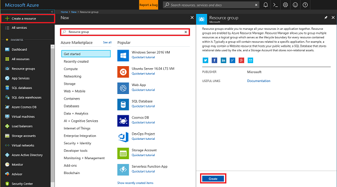

## Prerequisites
Before writing CDN management code, you must do some preparation to enable the code to interact with the Azure Resource Manager. To do this preparation, you need to:

* Create a resource group to contain the CDN profile created in this tutorial
* Configure Azure Active Directory to provide authentication for the application
* Apply permissions to the resource group so that only authorized users from your Azure AD tenant can interact with the CDN profile

### Creating the resource group
1. Sign in to the [Azure Portal](https://portal.azure.com).
2. Click **Create a resource**.
3. Search for **Resource group** and in the Resource group pane, click **Create**.

    
3. Name your resource group *CdnConsoleTutorial*.  Select your subscription and choose a location near you.  If you wish, you can click the **Pin to dashboard** checkbox to pin the resource group to the dashboard in the portal.  Pinning makes it easier to find later.  After you've made your selections, click **Create**.

    
4. After the resource group is created, if you didn't pin it to your dashboard, you can find it by clicking **Browse**, then **Resource Groups**.  To open it, click the resource group.  Make a note of your **Subscription ID**. We need it later.

    

### Creating the Azure AD application and applying permissions
There are two approaches to app authentication with Azure Active Directory: Individual users or a service principal. A service principal is similar to a service account in Windows.  Instead of granting a particular user permissions to interact with the CDN profiles, permissions are instead granted to the service principal.  Service principals are typically used for automated, non-interactive processes.  Even though this tutorial is writing an interactive console app, we'll focus on the service principal approach.

Creating a service principal consists of several steps, including creating an Azure Active Directory application.  To create it, we're going to [follow this tutorial](../articles/active-directory/develop/howto-create-service-principal-portal.md).

> [!IMPORTANT]
> Be sure to follow all the steps in the [linked tutorial](../articles/active-directory/develop/howto-create-service-principal-portal.md).  It is *important* that you complete it exactly as described.  Make sure to note your **tenant ID**, **tenant domain name** (commonly a *.onmicrosoft.com* domain unless you've specified a custom domain), **client ID**, and **client authentication key**, as we need this information later.  Be careful to guard your **client ID** and **client authentication key**, as these credentials can be used by anyone to execute operations as the service principal.
>
> When you get to the step named Configure multi-tenant application, select **No**.
>
> When you get to the step [Assign application to role](../articles/azure-resource-manager/resource-group-create-service-principal-portal.md#assign-application-to-role), use the resource group created earlier,  *CdnConsoleTutorial*, but instead of the **Reader** role, assign the **CDN Profile Contributor** role.  After you assign the application the **CDN Profile Contributor** role on your resource group, return to this tutorial. 
>
>

Once you've created your service principal and assigned the **CDN Profile Contributor** role, the **Users** blade for your resource group should look similar to the following image.

### Interactive user authentication
If, instead of a service principal, you'd rather have interactive individual user authentication, the process is similar to that for a service principal.  In fact, you need to follow the same procedure, but make a few minor changes.

> [!IMPORTANT]
> Only follow these next steps if you are choosing to use individual user authentication instead of a service principal.
>
>

1. When creating your application, instead of **Web Application**, choose **Native application**.

    
2. On the next page, you are prompted for a **redirect URI**.  The URI won't be validated, but remember what you entered. You need it later.
3. There is no need to create a **client authentication key**.
4. Instead of assigning a service principal to the **CDN Profile Contributor** role, we're going to assign individual users or groups.  In this example, you can see that I've assigned  *CDN Demo User* to the **CDN Profile Contributor** role.  

    
