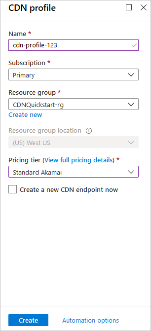

## Create a new CDN profile

A CDN profile is a container for CDN endpoints and specifies a pricing tier.

1. Sign in to the [Azure portal](https://portal.azure.com).

2. In the upper-left corner, select **Create a resource**. 
    
    The **New** pane appears.
   
3. Select **Web + Mobile**, then select **CDN**.
   
    

    The **CDN profile** pane appears.

    

4. For the CDN profile settings, use the values specified in the following table:
   
    | Setting  | Value |
    | -------- | ----- |
    | **Name** | Enter *my-cdn-profile-123* for your profile name. This name must be globally unique; if it is already in use, you may enter a different name. |
    | **Subscription** | Select an Azure subscription from the drop-down list. |
    | **Resource group** | Select **Create new** and enter *my-resource-group-123* for your resource group name. This name must be globally unique. If it is already in use, you may enter a different name or you can select **Use existing** and select **my-resource-group-123** from the drop-down list. | 
    | **Resource group location** | Select **Central US** from the drop-down list. |
    | **Pricing tier** | Select **Standard Verizon** from the drop-down list. |
    | **Create a new CDN endpoint now** | Leave unselected. |  
   
5. Select **Pin to dashboard** to save the profile to your dashboard after it is created.
    
6. Select **Create** to create the profile. 

    For **Azure CDN Standard from Microsoft** profiles only, profile completion usually completes in two hours. 

