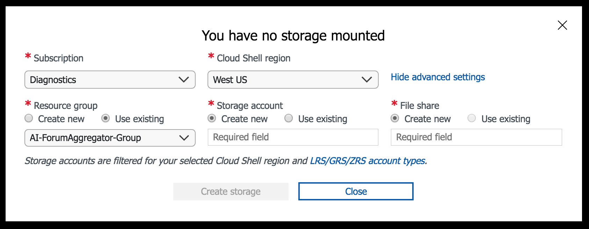

  
# Persist files in Azure Cloud Shell
Cloud Shell utilizes Azure File storage to persist files across sessions. On initial start, Cloud Shell prompts you to associate a new or existing file share to persist files across sessions.

> [!NOTE]
> Bash and PowerShell share the same file share. Only one file share can be associated with automatic mounting in Cloud Shell.

## Create new storage

When you use basic settings and select only a subscription, Cloud Shell creates three resources on your behalf in the supported region that's nearest to you:
* Resource group: `cloud-shell-storage-<region>`
* Storage account: `cs<uniqueGuid>`
* File share: `cs-<user>-<domain>-com-<uniqueGuid>`

The file share mounts as `clouddrive` in your `$Home` directory. This is a one-time action, and the file share mounts automatically in subsequent sessions. 

> [!NOTE]
> For security, each user should provision their own storage account.  For role-based access control (RBAC), users must have contributor access or above at the storage account level.

The file share also contains a 5-GB image that is created for you which automatically persists data in your `$Home` directory. This applies for both Bash and PowerShell.

## Use existing resources

By using the advanced option, you can associate existing resources. When selecting a Cloud Shell region you must select a backing storage account in co-located in the same region.

When the storage setup prompt appears, select **Show advanced settings** to view additional options. The populated storage options filter for locally redundant storage (LRS),  geo-redundant storage (GRS), and zone-redundant storage (ZRS) accounts. 

> [!NOTE]
> Using GRS or ZRS storage accounts are recommended for additional resiliency for your backing file share. Which type of redundancy depends on your goals and price preference. [Learn more about replication options for Azure Storage accounts](https://docs.microsoft.com/azure/storage/common/storage-redundancy#choosing-a-replication-option).

### Supported storage regions
Associated Azure storage accounts must reside in the same region as the Cloud Shell machine that you're mounting them to. To find your current region you may run `env` in Bash and locate the variable `ACC_LOCATION`. File shares receive a 5-GB image created for you to persist your `$Home` directory.

Cloud Shell machines exist in the following regions:
|Area|Region|
|---|---|
|Americas|East US, South Central US, West US|
|Europe|North Europe, West Europe|
|Asia Pacific|India Central, Southeast Asia|

## Restrict resource creation with an Azure resource policy
Storage accounts that you create in Cloud Shell are tagged with `ms-resource-usage:azure-cloud-shell`. If you want to disallow users from creating storage accounts in Cloud Shell, create an [Azure resource policy for tags](../articles/azure-policy/json-samples.md) that are triggered by this specific tag.
